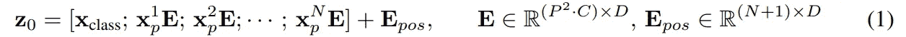

# 了解视觉转换器并计算其参数

> 原文：<https://medium.com/analytics-vidhya/understanding-the-vision-transformer-and-counting-its-parameters-988a4ea2b8f3?source=collection_archive---------0----------------------->


西蒙·米加吉在 [Unsplash](https://unsplash.com?utm_source=medium&utm_medium=referral) 上的照片

在本帖中，我将分享我对 Vision Transformer 架构的理解。本帖中的所有图片都是原创内容，基于论文和其他教程中的知识，在适当的地方会提到这些内容。

**Transformer architectures** 自 2016 年提出以来，一直是自然语言处理(NLP)任务的重大突破。谷歌的[伯特](https://arxiv.org/pdf/1810.04805.pdf)和开放人工智能的 [GPT-2](https://d4mucfpksywv.cloudfront.net/better-language-models/language_models_are_unsupervised_multitask_learners.pdf) / [GPT-3](https://arxiv.org/abs/2005.14165) 架构已经成为各种任务的最先进解决方案，包括语言建模、文本摘要和问题回答。

其目的是证明递归神经网络可以被完全取代，并且可以仅使用注意力机制来开发解决方案——因此在 [Transformer 论文](https://papers.nips.cc/paper/7181-attention-is-all-you-need.pdf)标题中出现双关语。详细描述最初的 Transformer 架构的工作方式超出了本文的范围，但是有大量可靠的教程[和视频](https://lilianweng.github.io/lil-log/2018/06/24/attention-attention.html)解释了它的工作方式。

这篇文章的重点是介绍视觉转换器(ViT)架构的概述，这是在为谷歌提交的新[论文](https://openreview.net/pdf?id=YicbFdNTTy)中提出的，该论文已提交 ICLR 2021 审查。尽管之前有人尝试过使用注意力机制来完成计算机视觉任务([这个](https://papers.nips.cc/paper/2019/file/3416a75f4cea9109507cacd8e2f2aefc-Paper.pdf)、[这个](https://arxiv.org/pdf/1904.10509.pdf)或[这个](https://arxiv.org/pdf/1906.02634.pdf))，但从可扩展性和效率的角度来看，ViT 都是最有前途的架构。


视觉转换建筑

该架构包含 3 个主要组件。

1.  补丁嵌入。
2.  通过堆叠变压器编码器提取特征。
3.  分类头。

每个组件将在接下来的段落中详细介绍，重点是转换和可训练参数。有些张量的第一维是 ***b*** ，代表批量大小，但为了简单起见，在注释中会忽略这个和广播操作。

# 补丁嵌入


补丁嵌入

在第一步中，形状为 ***(高度、宽度、通道)*** 的输入图像被嵌入到形状为 ***(n+1，d)****的特征向量中，随后进行一系列变换。这对应于论文中的等式(1):*

**

1.  *图像被分割成形状为 ***(p，p，c)*** 、的 *n* 个正方形小块，其中 *p* 是预定义的参数，按照光栅顺序(从左到右，从上到下)。*
2.  *面片被展平，产生形状为 ***(1，p *c)*** *的*条线矢量。***
3.  **展平的面片与形状为 **(p *c，d)** 的**可训练**嵌入张量相乘，学习将每个展平的面片线性投影到尺寸 ***d*** 。该尺寸 *d* 在架构中是恒定的，并且在大多数组件中使用。结果是 ***n*** 形状的嵌片 ***(1，d)。*****
4.  **形状的可学习的*【cls】*记号 ***(1，d)*** 被预先加到补丁嵌入的序列上。这个令牌的思想来自于 BERT 论文，其中只有对应于这个令牌的最后一个表示(transformer L 的输出)被馈送通过分类层。直观地说，这代表了补丁表示的集合。**
5.  **将具有相同形状的****【eₚₒₛ】*****(n+1，d)****可训练的位置嵌入张量添加到连接的投影序列中。该张量学习每个补片的 1D 位置信息，以便在序列中添加每个补片的空间表示。*****

*****结果，z₀，是堆叠变压器编码器的第一个输入。L 个堆叠编码器代表该架构的第二个组件。每个变换器将表示为 ***(n+1，d)*** 张量的特征作为输入，并产生相同维数的输出。*****

# ****变压器编码器****

********

****变压器编码器****

****在第二步中，网络使用 L 个 transformer 编码器的堆栈，从嵌入的补丁中学习更多的抽象特征。这对应于论文中的等式(2)和(3)。****

********

****编码器组件包含一个多头注意力(MHA)机制和一个 2 层 MLP，其间有层规范化和残差连接。****

****层规范化有助于稳定隐藏状态动态并减少训练时间。这是通过对每个训练示例的平均值和标准偏差进行缩放来完成的(与批处理规范相反，批处理规范是对每个特征进行缩放)。得到的特征乘以一个比例因子并加到一个移位因子上，两者都可以在训练期间学习。****

****剩余连接提供了梯度替代路径，以解决非常深的架构中梯度消失的问题。****

****该组件中的可训练重量位于 MHA 装置和 MLP 重量内。由于 MLP 有两层(隐藏层和输出层)，因此将有两个权重矩阵:****

*   ****Wₕ之形 ***(维·dₘₗₚ)*******
*   ****Wₒ的形状***【dₘₗₚ的 d】*******

********

****注意机制****

****L 个堆叠变压器的每一个都包括多头注意力(MHA)步骤，对应于论文附录中的等式(5)、(6)、(7)和(8)。****

********

****来自先前编码器的隐藏状态被分成 k 个头，产生形状为 **(n，dₕ)** 的 k 个特征张量。根据多头注意力直觉，多头允许该机制从抽象表示的不同方面进行学习。****

****每个乘以形状为 **(dₕ，dₕ).)的 3 个可训练矩阵 Qi，Ki，Vi**这等同于等式 5，因为在 U= **(d，3dₕ)** 中，对于每个头部正好有 3 个矩阵，每个形状为 **(dₕ，dₕ)** 。****

****Qi、Ki 和 Vi 表示输入在 3 个子空间中的投影。我们可以把 Q 中的每条线看作是我们感兴趣的面片的学习投影，而 K 中的线则是我们与 Q 进行比较的其他面片。学习 V 和 K 来表达 V 中的特征的重要性或权重，以计算最终的“关注度”。****

****接下来，在每个头部上，缩放的点积注意力张量 **(A)** 被计算为 **Ki** 和 **Qi** 矩阵之间的乘积的软最大值，用头部尺寸的平方根归一化。该矩阵中的第 *i-* 行是查询 *i* 关注度的概率分布函数，意为补丁 *i* 的查询与其他哪些补丁的关键字最相似。****

****自我关注是 **A** 和 **v** 之间的乘积，其形状为 ***(n+1，dₕ).*** 行 *i* 列 *j* 的元素是 a 中第 *i* 行 pdf 的特征 j 的加权平均值。****

****自我关注矩阵在第二维度上连接，产生一个 ***(n+1，d)*** 张量，然后通过将它与一个 ***(d，d)*** **可训练的**张量有效地相乘，使其通过单个线性层。这个线性层非常重要，因为它允许从所有头部学习特征作为集合。****

# ****分类头****

********

****分类头****

****如前所述，在分类头中只使用了最后一个表示的***【cls】***标记。对于预训练，使用 2 层 MLP，因此有两个权重矩阵——形状为***【d，dₘₗₚ】***的 Wₕ和形状为***【dₘₗₚ，d】***的 Wₒ。对于微调，使用单个线性层，因此只有单个张量，形状为 ***(d，n_cls)*** *。* 在每种情况下，网络的最终输出是一个形状为***【1，n _ cls】***，的向量，其中包含与每个***【n _ cls】***类相关的概率。****

# ****可训练参数****

********

****视觉转换器参数[1]****

****让我们以 ViT-Base 架构为例，计算参数的数量。建筑中的可训练张量。****

****在补丁嵌入步骤中，两个嵌入矩阵占 786.432 个参数。****

```
****p²*c*d + (n+1)*d = 256*3*768 + 256*768 = 786.432****
```

****在编码器堆栈中，共有 84.943.656 个参数。****

```
****L*(k*d*3*dₕ + d*d + d**dₘₗₚ + dₘₗₚ*d*) 
= 12*(12*768*3*64 + 768*768 + 2*768*3072) 
= 12*(1.769.472 + 589.824 + 4.718.592) 
= 12*589.824(3+1+8)
= 12*589.824*12
= 84.934.656****
```

****对于微调(例如，在 ImageNet 上)，还有其他 768.000 参数。****

```
****d*ncls = 768 * 1000 = 768.000****
```

****加上这些，我们得到大约 8600 万英镑，如论文中所列。****

# ****结果****

****当在 JFT-300M 上进行预训练时，ViT 架构在 ImageNet 上获得了最先进的性能。然而，作者指出，当使用小数据集进行预训练时，性能会急剧下降，并且较大的模型更适合于较大的数据集。这个问题最有可能是因为变压器网络中缺乏电感偏置。他们能够处理任何序列，而不知道它的顺序关系。****

********

****准确度与训练前数据集[1]****

# ****结论****

****对我来说，能够可视化这个架构中的转换和流程非常有帮助。希望你的情况也是如此。干杯！****

# ****参考****

****[1] A. Dostovitskiy 等人。艾尔。、[一幅图像抵得上 16x16 的文字:规模化图像识别的变形金刚](https://arxiv.org/pdf/2010.11929.pdf) (2020) ICLR 2021(在审)
[2] A .瓦斯瓦尼等。艾尔。、[注意力是你所需要的全部](https://papers.nips.cc/paper/7181-attention-is-all-you-need.pdf) (2017)，NIPS2017 年会议录
【3】j .德夫林等。艾尔。， [BERT:用于语言理解的深度双向转换器的预训练](https://arxiv.org/pdf/1810.04805.pdf) (2018)****