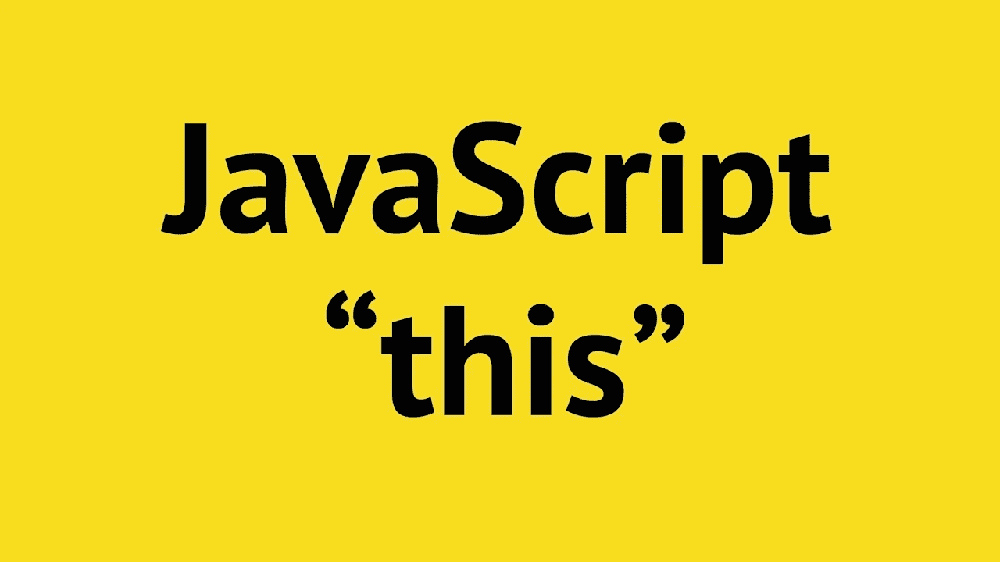

# 用 JavaScript 理解这一点

> 原文：<https://medium.com/analytics-vidhya/understanding-this-in-javascript-5c7ef3f12313?source=collection_archive---------37----------------------->



对于 JavaScript 开发者来说，这是一个重要的话题。那么什么是 ***这个呢😅*** ？？

***这个*** 是为每个执行上下文创建的特殊关键字。我将在以后的文章中介绍执行上下文、调用堆栈和内存堆。

***这个*** 不是静态的，也就是说它会根据使用的地方而变化。大多数情况下， ***和*** 的值是由函数的调用方式决定的

# 全球背景

在全局执行上下文中，即在任何函数之外，这指的是全局对象，在浏览器的情况下是窗口。

```
console.log(this) //Window
this === window //true
```

# 这在一个方法中

在一个方法中， ***这个*** 关键字指的是它所属的对象，也就是说使用这个关键字我们能够在一个对象内部访问它的属性。

```
const profile = {
    name: 'charan',
    favLang: 'js',
    printUser: function(){
        console.log(`${this.name} ${this.favLang}`);
    }
}
profile.printUser();  // charan js
```

# 这是一个简单的函数调用

这个在*函数中是指**窗口中的***全局对象但是在严格模式下这个关键字是指 ***未定义的*** 。

严格模式:为了使用严格模式，我们使用一个表达式:“使用严格”。它有助于编写更干净的代码，比如防止使用未声明的变量

```
function testThis(){
    console.log(this);
}testThis()   // Window “use strict"
function testThis(){
    console.log(this);
}
// undefined
```

# ***事件监听器***

这里指的是处理程序附加到的 DOM 元素。简单地说，它指的是接收事件的 HTML 元素。

# 箭头功能

箭头函数没有自己的这个。它使用词法，即它使用这个的父范围。

```
const ex=()=>{
    console.log(this);
}
ex(); //Window
// refers to parent thisconst profile={
    name:'ch',
    print:function(){
        const fav='js'
        return ()=>{
            console.log(this,this.fav);
        }
    }
}profile.print()();//{
name: "ch",
print:f()
},js
```

**快速注释**

方法——这是指调用方法的对象

简单函数调用-窗口 ***严格模式-未定义***

事件侦听器-处理程序附加到的 DOM 元素

箭头函数-没有自己的这个。它使用词法(此的父范围)

全局上下文窗口对象