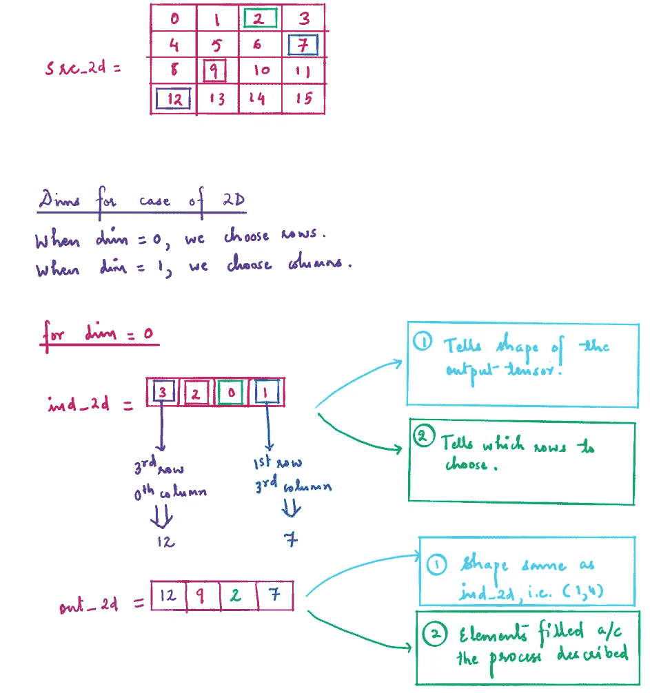
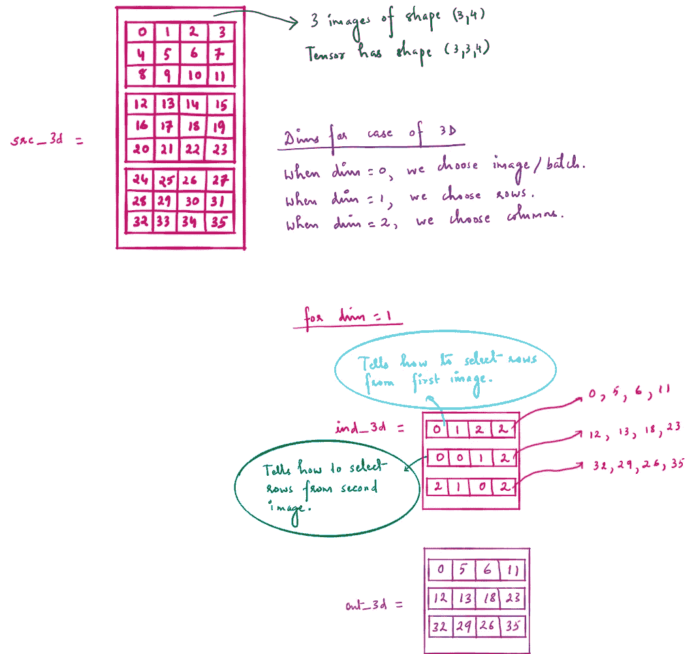

# 了解 Pytorch 中的 torch.gather 函数

> 原文：<https://medium.com/analytics-vidhya/understanding-torch-gather-function-in-pytorch-f90db58b3c51?source=collection_archive---------4----------------------->

这个函数的两个参数， **index** 和 **dim** 是理解函数的关键。

对于 2D 的情况，dim = 0 对应于行，dim = 1 对应于列。

对于 3D 的情况，dim = 0 对应于来自批次的图像，dim = 1 对应于行，dim = 2 对应于列。

# 2D 输入张量的情况

## 1.理解模糊论点:

> a.当 dim = 0 时，我们选择行。
> 
> b.当 dim = 1 时，我们选择列。

## 2.理解索引参数:

> a.索引参数将具有与输入相同的维数(并不意味着形状相同)。
> 
> b.输出张量将与索引张量具有相同的形状。
> 
> c.索引张量的元素告诉选择哪一行(对于 dim = 0，2D 情况),特定元素的位置告诉选择哪一列。
> 
> d.索引张量的元素告诉选择哪一列(对于 dim = 1，2D 情况),特定元素的位置告诉选择哪一行。

# 3D 输入张量的情况

## 1.理解模糊论点:

> a.当 dim = 0 时，我们从批中选择图像。
> 
> b.当 dim = 1 时，我们选择行。
> 
> c.当 dim = 2 时，我们选择列。

## 2.理解索引参数:

> a.从上面的 a 和 b，2D 输入张量的情况适用。
> 
> b.对于 dim = 1 和 dim = 2，索引张量的元素告诉从批(对于 dim = 0，3D 情况)中选择哪个图像，并且特定元素的位置告诉选择哪个行和列，等等。

让我们举两个 2D 的例子。

2D 输入张量的例子

**第一个例子**

当 dim = 0 时，并且

ind_2d = [[3，2，0，1]]

ind_2d 具有 shape (1，4 ),因此输出将具有相同的形状。

ind_2d 的第 0 个元素，即 3 告诉我们选择第 3 行第 0 列(因为 3 是索引张量的第 0 个元素)。

ind_2d 的第一个元素(即 2)告诉我们从 0 开始选择第二行(行，因为 dim = 0)和第一列(因为索引张量的第一个元素)。诸如此类。

**第二个例子**

让我们假设从上面的 src_2d 张量我们想要选择 0，6，10 和 15。(提示:我们从上到下按顺序读取这些数字，因此我们形成了一个类似索引张量的列。当我们从左向右阅读时，我们形成像索引张量一样的行。)

现在 0 属于第 0 列，6 属于第 2 列，10 属于第 2 列，15 属于第 3 列。

所以我们的指数张量是[[0，2，2，3]]，以列的形式，即形状(4，1)。因为我们选择了列，所以 dim = 1。

我们不可能选择行并得到想要的输出张量。

## 3D 的情况非常类似。从下面的信息图中获取想法。

3D 输入张量的例子

以下是 python 笔记本的链接，其中包含 2D 和 3D 输入张量两种情况下的几个示例:

 [## pranavchat 14/火炬

### permalink dissolve GitHub 是超过 5000 万开发人员的家园，他们一起工作来托管和审查代码，管理…

github.com](https://github.com/pranavchat14/torch/blob/main/torch_gather.ipynb) 

链接到 Pytorch 函数:

[https://py torch . org/docs/stable/generated/torch . gather . html？highlight = torch % 20 gather # torch . gather](https://pytorch.org/docs/stable/generated/torch.gather.html?highlight=torch%20gather#torch.gather)