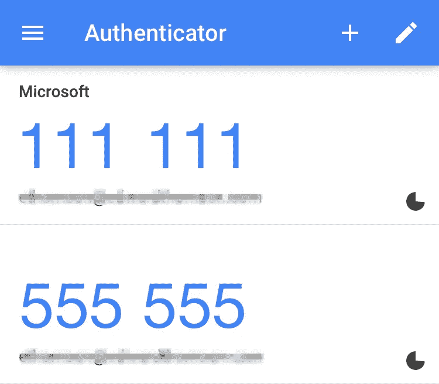

# 理解 TOTP:用 Python

> 原文：<https://medium.com/analytics-vidhya/understanding-totp-in-python-bbe994606087?source=collection_archive---------3----------------------->

## 了解动态口令和基于时间的动态口令，实现以及如何在 Paypal、Whatsapp、脸书、Instagram、Twitter、亚马逊和谷歌等平台上实现。

TOTP 或基于时间的动态口令的使用正在慢慢增加。从*脸书*到 *WazirX* 这样的加密交易平台，所有人都可以选择使用带有*微软/谷歌认证器*等应用的 TOTP。



基于时间的 OTP 依赖于设备，而不是 sim 卡运营商/电子邮件帐户，如果其他人想要的话，他们可以很容易地访问这些帐户。它们不需要活跃的互联网连接。它们每 30 秒自动更新一次。我喜欢它的一点是，它不像传统的动态口令，不需要服务器在每次更新时计算/存储动态口令。那么这个是怎么算出来的呢？OTP 不是应该随机生成吗？

## 让我们尝试使用传统的 OTP:

```
import randomdef OTPgenerator(length) :
 OTP = ""
 for i in range(length) :
                OTP=OTP+str(random.choice(range(0,9)))
 return OTP
```

下面是模式为*秒的程序输出:输出*

```
0  : 287424
15 : 358754
31 : 380135
```

上面的函数将*长度*作为参数，并返回一个定义长度的随机数。当用户请求 OTP 时，该功能在服务器中被触发，OTP 被临时存储并通过电子邮件/SMS 发送给用户。当用户输入动态口令时，它将与生成的动态口令进行匹配以进行验证。

## 基于时间的动态口令

TOTP 顾名思义，考虑时间在它函数中的某个地方，想出一个随机数。分解到最简单的层面，服务器和客户端共享一个密钥，这在谷歌认证器这样的应用程序中是在扫描二维码时完成的。这个密钥和当前时间戳一起被定期处理以生成 OTP。由于客户机和服务器都有密钥，并且是时间同步的，所以服务器和客户机都可以生成 OTP，而无需相互通信。客户端以 30 秒的固定间隔生成 OTP，服务器仅在需要验证输入的 OTP 是否正确时才生成 OTP。这在一定程度上节省了服务器的资源。

**在 Python 中生成 TOTP 的代码**

```
import hmac, base64, struct, hashlib, timedef get_hotp_token(secret, intervals_no):
    key = base64.b32decode(secret, True)
    #decoding our key
    msg = struct.pack(">Q", intervals_no)
    #conversions between Python values and C structs represente
    h = hmac.new(key, msg, hashlib.sha1).digest()
    o = o = h[19] & 15
    #Generate a hash using both of these. Hashing algorithm is HMAC
    h = (struct.unpack(">I", h[o:o+4])[0] & 0x7fffffff) % 1000000
    #unpacking
    return hdef get_totp_token(secret):
    #ensuring to give the same otp for 30 seconds
    x =str(get_hotp_token(secret,intervals_no=int(time.time())//30))
    #adding 0 in the beginning till OTP has 6 digits
    while len(x)!=6:
        x+='0'
    return x#base64 encoded key
secret = 'MNUGC2DBGBZQ===='
print(get_totp_token(secret))
```

**——基于 HMAC 的一次性密码，即每次通话都要更改密码，符合* [*RFC4226*](http://tools.ietf.org/html/rfc4226)*

*现在让我们检查这里的输出:*

```
*0  : 924751
15 : 924751
31 : 975604*
```

*输出在 30 秒的时间间隔内保持不变。*

> *Python 库实现 https://pyotp.readthedocs.io/en/latest[TOTP](https://pyotp.readthedocs.io/en/latest)*

## *结论*

*所以我们看到了托普斯*

*   *不依赖于运营商/电子邮件。*
*   *不需要活跃的互联网连接。*
*   *每隔固定时间更新一次。*
*   *仅在验证时要求在服务器端进行计算。*

*由于 TOTPs 不是随机的，人们总是可以用足够的数据来尝试强力执行这些操作。*

## *在不同平台上启用 2FA*

*以下是你如何在 Paypal、Whatsapp、脸书、Instagram、Twitter、亚马逊和谷歌等常见平台上启用双因素认证。*

*下载谷歌认证器或微软认证器。*

***Instagram***

*档案>点击右上角的汉堡菜单>“设置”>“安全”。您会发现双因素身份验证的菜单项。*

***脸书***

*点击右上角的汉堡图标>继续向下滚动到底部，找到“设置&隐私”>“设置”>“安全和登录”，向下滚动到“使用双因素认证”。*

***推特***

*[在这里](https://twitter.com/settings/account) >选择“安全”>“双因素授权”*

***亚马逊***

*通过[跟随此链接](https://www.amazon.com/a/settings/approval?ots=1&tag=theverge02-20&ascsubtag=[]vg[e]15536183[r]google.com[t]w[d]D)直接导航至页面。*

***谷歌***

*[2FA 登陆页面](https://www.google.com/landing/2step/)并设置。*

***Whatsapp***

*打开 WhatsApp，在右上角的汉堡图标下找到设置菜单。在“帐户”>“两步验证”>“启用”下查找*

***贝宝***

*在主摘要页面上，单击齿轮图标并找到安全选项卡。找到名为“两步验证”的部分，然后单击设置链接。*

**参考文献**

*[https://stack overflow . com/questions/8529265/Google-authenticator-implementation-in-python](https://stackoverflow.com/questions/8529265/google-authenticator-implementation-in-python)*

*[https://www . the verge . com/2017/6/17/15772142/how-to-set-up-two-factor-authentic ation](https://www.theverge.com/2017/6/17/15772142/how-to-set-up-two-factor-authentication)*