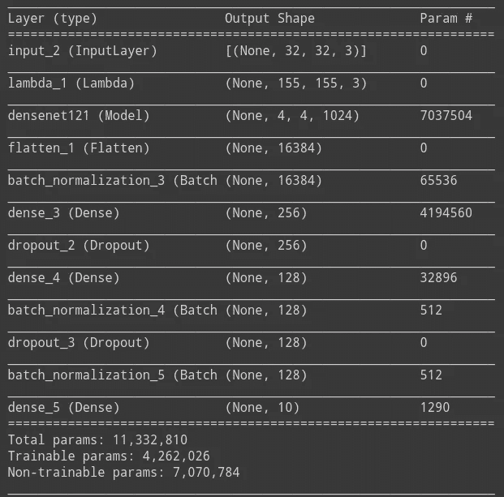

# 理解迁移学习作为 CNN 模型训练效率的方法论

> 原文：<https://medium.com/analytics-vidhya/understanding-transfer-learning-as-an-methodology-for-efficiency-in-training-cnns-models-1322d316173a?source=collection_archive---------21----------------------->

图像分类。图片鸣谢:Gluon-cv.mxnet.io

# 摘要

使用大型数据集训练 ConvNet 模型可能需要几个小时，其性能可能会受到应用训练的方法的影响。对于这种情况，一种称为迁移学习的技术开始在 ConvNets 架构中实施，以提高预训练模型到新模型的实施的时间性能和准确性。迁移学习是一种应用于任何神经网络架构的范式，但在计算机视觉领域，这种技术已经证明了有趣的结果。接下来的论文将通过使用 CFAR-10 数据集探索迁移学习实现的性能，在 DenseNet-121 架构中训练评估。在迁移学习过程中实施的技术是微调，冻结整个 DenseNet-121 架构，以及使用*批量标准化*、*亚当*算法*优化*、*辍学*和*学习率*对该架构的修改。

> 关键词:迁移学习，DenseNet-121，批量标准化，微调，准确性，损失

# 介绍

卷积神经网络是用于机器学习或人工智能的神经网络领域中的一个类别。ConvNets 是用于图像识别和分类的高效架构。因为计算机科学中的神经网络是人脑的功能模式的模拟，并且 ConvNets 架构类似于人眼的图像识别和分类的视觉皮层，所以在机器学习领域中，为了复制这些 ConvNets 架构，使用大数据集(图像)来获得该算法的良好响应。大型数据集的训练可能需要数小时，并且性能可能会受到应用训练的方法的影响。

这些机器学习架构通常需要静态环境下的大量数据。但是，在现实环境中，模式是用户与偏好(权重、参数、偏好)进行交互，使架构成为一个动态模型(Widmer *等人*)。1996).针对这种情况，一种称为迁移学习的技术开始实施，并且实际上经常用于 ConvNets 架构中，以提高预训练模型到新模型的实施的时间性能和准确性(Gulli *等人*)。2017) .

迁移学习是一种范式，通过获取预先训练的模型的知识，一个相关任务的解决方案将与新模型兼容。迁移学习最初被讨论并分为三种不同的设置:归纳迁移学习、直推迁移学习和无监督迁移学习(Pan， *et al.* 2009)。然而，随着时间的推移，迁移学习技术因直观性和增强性而得到了改进

在本文中，我们将利用 CIFAR-10 数据集，探讨迁移学习技术在 DenseNet-121 架构实现中的行为。这种架构保持了一种简单的连接模式，通过将所有层(具有匹配的要素地图大小)直接相互连接来寻求网络中各层之间的最大信息流。为了保持前馈性质，每一层从所有前面的层获得额外的输入，并将它自己的特征映射传递给所有后面的层。(黄*等*。2016)

图一。DenseNet 表示。图片来源:黄、等。2016

目前有不同的方法来实现神经网络中的迁移学习，如数据扩充、微调、冻结、多任务、一次性学习、域适应、域混淆和零次学习。没有准确或理想的技术，但在每一种实施的迁移学习技术中都有行为上的改变。本文将介绍一个在预训练的 densenet-121 架构中使用微调和冻结技术的实施方案，旨在了解 CIFAR-10 数据集中 10000 个样本的有效数据集的准确性和丢失方面的时间响应和性能。

# 技术

## 迁移学习—微调

迁移学习满足了终身机器学习方法的需要，这种方法可以保留和重用以前学到的知识(Pan， *et al.* 2009)。图 2 比较了传统的学习过程和应用迁移学习的过程。

图二。迁移学习表征。左(传统机器学习)，右(迁移学习)。图片来源:(潘，*等* 2009)

基于这一思想，微调补充了迁移学习方法，因为机器学习模型经过一个过程，在该过程中，模型的所有层或一些层被冻结，这是必要的，因此可以在顶层用随机初始化的新分类器初始化训练，但是冻结的层仍然包含参数，并且将支持特征的提取。

实现微调的迁移学习技术调整被重用的模型的更抽象的表示，因此在对新的训练参数的预测中有可重用性和效率。

# 实验

该实验包括将 ConvNet 置于三个独立的训练过程中。第一种是对整个模型进行常规训练，第二种是添加优化和正则化技术，第三种是应用迁移学习，冻结模型中的所有层，并对最后几层进行微调，以对数据集的验证数据进行训练。

图 3。Densenet 121 蓝色(冻结层)，绿色(微调)。图片来源:作者来源

## 资料组

为了观察迁移学习的行为，选择了 CIFAR-10 数据集，其包含 10 个类中的 60000 个 32×32 彩色图像，每个类 6000 个图像。有 50000 个训练图像和 10000 个测试图像。这个复杂的数据集被设置为在 DenseNet-121 架构上进行训练(黄*等人*)。2016).

## 培养

所有的模型都预先进行了预处理，它们的输入以(155，155)的大小进行了整形。用于训练的优化器是使用 128 个批次和 32 个时期的 ADAM。学习率介于 0 和 1 之间，早期停止为 1e-05。两种架构在分类层中的 softmax 层之前还具有两个批量标准化层，并且这两个层分别具有 256 和 128 的输出空间维度。在最后一批标准化后，最后一个激活层中的最终丢弃值为 0.2。ConvNet 的基本模型共有 6，964，106 个可训练参数；在分类器层中具有优化技术的基础模型具有 7，252，746 个可训练参数，而具有微调实现的 ConvNet 模型具有 4，262，026 个可训练参数。

图 4。DenseNet 121 基本型号

图 5。DenseNet 121 基本模型在分类器层中增加了优化删除和批量标准化

对于迁移学习训练，实现的工作流是将模型带到分类层，冻结它们，以避免在未来的训练回合中破坏它们包含的任何信息，然后添加未冻结的和可训练的分类层。这些最后的图层将学习将旧要素转换为新数据集的预测。

图 6。实施 DenseNet 121 微调

# 结果

两个模型表现相似。差异很小，这是由于数据集的大小。而这个数据集包含大量信息。数据集的可训练样本越多，差异就越大。

**准确无误。**应用了优化的基础模型具有 95.35%的准确率，比迁移学习模型表现得好得多。该模型的准确率为 92.72%，有趣的是，如图 4 所示，该模型在学习过程中具有稳定的趋势。基本模型具有不同的行为，其中学习过程在时期内增加了准确率，直到时期 19 达到最高结果。最后，没有优化参数的基础模型执行了 86.59%，可能是因为没有应用优化技术。

图 7。DenseNet 121 基本型号有效精度

图 8。DenseNet 121 基本模型传输学习有效精度

图 9。DenseNet 121 基本型号(未应用优化)有效精度

**时间。**三个模型中的每一个的损失都是要跟踪的重要特征。微调模型花费了 44.10 分钟，带有优化器的基本模型花费了 139.5 分钟。标准模型需要 13.8 分钟才能完全训练好。微调技术比没有标准化的基本模型快 68.38%，比没有优化技术的基本训练模型慢 68.70%。然而，当权衡准确性与时间时，迁移学习模型的表现要好得多。

**损耗和过度拟合。**在所有三个实验中，DenseNet 模型表现有效，不容易过度拟合。至于损失，与基本模型的验证精度相关的样品的损失验证保持在 65%的比率。与具有微调实现的模型相比，损失好 48.2%，验证样本中的损失为 33.67%。然而，没有迁移学习但用批量标准化优化的 DenseNet 模型作为训练的最佳模型损失了 16.29%

图 10。DenseNet 121 基本模型(应用优化)有效损耗

图 11。DenseNet 121 基础模型(应用迁移学习)有效损失

图 12。DenseNet 121 基本型号(未应用优化)有效损耗

# 讨论

正如我们在本文开头提到的，我们希望了解 DenseNet 121 ConvNet 架构的传统学习在传统学习、优化学习和迁移学习环境中的性能。计算机视觉领域的 ConvNets 架构需要出色的性能来解决需要评估图像中捕获的信息的适用模拟。这导致了性能和时间的问题，迁移学习可以在不牺牲准确性或模型损失的情况下提高性能和时间。正如我们所见，训练一个基本的 ConvNet 模型需要一系列步骤来避免过拟合、欠拟合或性能精度方面的问题。批量标准化被证明是一个很好的选择，可以提高 ConvNet 在验证数据中呈现 95%的模型训练准确性。当应用迁移学习时，性能会有轻微的降低，但是时间执行确实为采用迁移学习方法创造了价值。

# 结论

我们知道，通过添加微调进行迁移学习是在 ConvNets 中实施的一个很好的选择，ConvNets 习惯于在目标任务中使用不同标签的方法。由于实验使用的是 CIFAR-10，因此也可以得出结论，迁移学习模型需要模式数据来提高其性能。此外，在基本模型和增强模型之间，显而易见的是，DenseNet 倾向于通过大量的可训练参数来提高其精度性能，但为了避免数据过度拟合的风险，批量标准化是在该模型中实施的一个极好的工具。ConvNets 目前广泛用于仿真，需要训练的过量数据不仅需要良好的精度，还需要时间性能。因此，通过面对对象源与要执行的模拟的概率不同的模拟问题，在复杂性训练中产生了挑战，dine-tuning 方法能够通过冻结 ConvNet 模型的一些层(如果不是所有层的话)来处理该挑战，该 conv net 模型的一些层稍后将被解冻，并将该可训练参数带入新的模型训练中，从而同步两个相似的参数并获得准确的模拟。

# 参考

弗朗索瓦·乔莱。用 Python 进行深度学习。2017

格哈德·威德默和米罗斯拉夫·库巴特。在概念漂移和隐藏环境中学习。机器学习，69–101，1996

安东尼奥·古利和苏吉特·帕尔。用 Keras 进行深度学习。在 Theano 和 TensorFlow 上使用 Keras 实现神经网络，204，2017

黄高，刘庄，劳伦斯·范·德·马滕，基利安·q·温伯格。[密集连接的卷积网络](https://arxiv.org/pdf/1608.06993.pdf)，2016

辛诺佳林潘和杨强。[迁移学习调查](https://www.cse.ust.hk/~qyang/Docs/2009/tkde_transfer_learning.pdf)，2009

常青科技。[利用迁移学习进行犬种图像分类](/@evergreenllc2020/dog-breed-image-classification-using-transfer-learning-6d19699d4351)，2020

塞巴斯蒂安·鲁德。转移学习— [机器学习的下一个前沿，](https://ruder.io/transfer-learning/) 2017

迪帕詹·萨卡尔。[2018 年，深度学习](https://towardsdatascience.com/a-comprehensive-hands-on-guide-to-transfer-learning-with-real-world-applications-in-deep-learning-212bf3b2f27a)中利用真实世界应用转移学习的综合实践指南

# 附录

## 基本 DenseNet 模型(无增强，无迁移学习)

 [## Edward 0 rtiz/holbertonschool-机器学习

### permalink dissolve GitHub 是超过 5000 万开发人员的家园，他们一起工作来托管和审查代码，管理…

github.com](https://github.com/edward0rtiz/holbertonschool-machine_learning/blob/master/supervised_learning/0x09-transfer_learning/0-transfer_basic.ipynb) 

## 最佳 DenseNet 模型(在分类层中添加优化的基础模型)

 [## Edward 0 rtiz/holbertonschool-机器学习

### 在 GitHub 上创建一个帐户，为 Edward 0 rtiz/holbertonschool-machine _ learning 的开发做出贡献。

github.com](https://github.com/edward0rtiz/holbertonschool-machine_learning/blob/master/supervised_learning/0x09-transfer_learning/0-transfer.py) 

## 迁移学习 DenseNet 模型(在分类层中添加优化和微调的基本模型)

 [## Edward 0 rtiz/holbertonschool-机器学习

### 在 GitHub 上创建一个帐户，为 Edward 0 rtiz/holbertonschool-machine _ learning 的开发做出贡献。

github.com](https://github.com/edward0rtiz/holbertonschool-machine_learning/blob/master/supervised_learning/0x09-transfer_learning/0-transfer_fine_tuning.py)