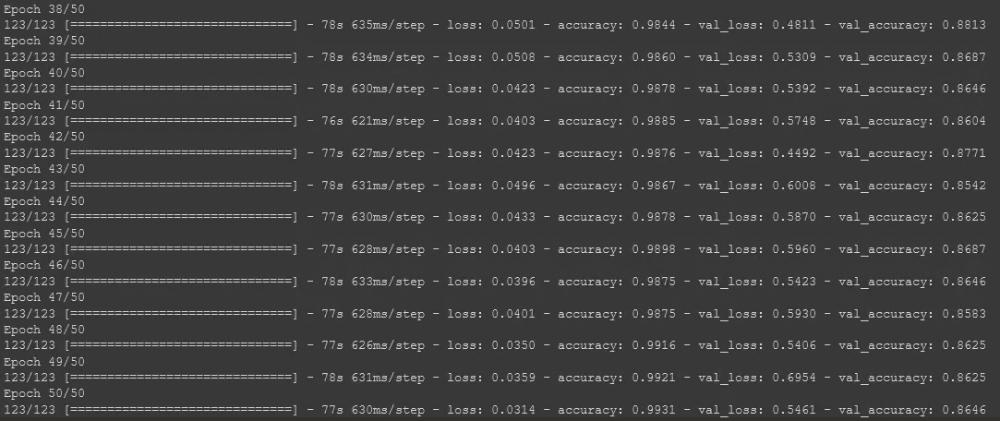
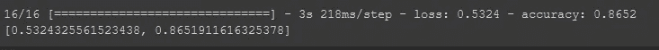

# 理解迁移学习和图像增强

> 原文：<https://medium.com/analytics-vidhya/understanding-transfer-learning-image-augmentation-8456855eccb9?source=collection_archive---------12----------------------->

你有没有参加过图像分类比赛，觉得自己的模型不如上面的人？那我觉得这个博客是给你的。

# 目录

*   什么是迁移学习？
*   预处理
*   图像增强
*   使用 ResNet101 迁移学习
*   估价
*   结束注释

# 什么是迁移学习？

迁移学习是使用预先训练好的模型来解决新问题或创建新模型。

# **预处理**

在这一步中，我们将创建一个图像目录，并将数据解压缩到其中。

```
!mkdir images
!unzip code_warriors_game_of_data_ai_challenge-dataset.zip -d images/
```

现在，我们将导入所有需要的库。

```
import os, shutil
import matplotlib.pyplot as plt
import numpy as np
import pandas as pd
from keras.preprocessing import image
from keras.applications.resnet import ResNet101
from keras.layers import Dense
from keras.models import Model, Sequential
```

在下一步中，我们将把图像分成训练图像和验证图像。

**第一步**:创建一个 val_images 目录来传输图像。

```
if not os.path.isdir("val_images"):
  os.mkdir("val_images")
```

**第二步**:创建数据可以分类的类别列表。

```
classes = ['Bread','Dairy product','Dessert','Egg','Fried food','Meat','Noodles-Pasta','Rice','Seafood','Soup','Vegetable-Fruit']
```

第三步:我们将创建子目录来存储特定类别的图片。下面的代码遍历了列表中的所有元素，如果没有，就为这个类创建一个文件夹。

```
for c in classes:
  if not os.path.isdir("val_images/" + c):
    os.mkdir("val_images/" + c)
```

第四步:这一步可能有点难以理解，请耐心等待。

在下面的代码中，我们将变量 split 赋值为 0.9，因为我们希望以 90:10 的比率拆分数据(train : validate)。在下一行中，我们遍历 train 文件夹中的所有子文件夹，并为其创建一个 path 变量。os.listdir()将返回特定文件夹中的所有文件名。我们可以使用 len()函数获得图像的数量，并通过将其乘以分割变量，我们可以获得分割大小，即我们需要的训练图像的数量。

在下面的步骤中，我们创建一个变量 files_to_move，并提取从 split_size 开始索引到末尾(即 10%的数据)的文件名。最后，我们将使用 join()函数创建源路径和目标路径，并使用 shutil 的 move()函数移动它们。

**建议:**如果你感到困惑，在任何步骤使用 print(variable)可能会帮助你更好地理解。

```
split = 0.9
for dirc in os.listdir("/content/images/train"):
  path = "/content/images/train/" + dirc
  images = os.listdir(path)
  split_size = int(len(images)*split) files_to_move = images[split_size:]
  print(files_to_move)
  print()
  for f in files_to_move:
    src = os.path.join(path,f) #path+file
    dest = os.path.join("val_images/",dirc)
    shutil.move(src,dest)
```

为了检查我们上面的尝试是否已经完成，我们将检查目录的内容。

我们将循环遍历训练目录中的每个项目，并打印每个类别的图像数量。

```
for dirc in os.listdir("/content/images/train"):
  path = "/content/images/train/" + dirc
  img = os.listdir(path)
  print(dirc, len(img))
```

我们将循环遍历 val_images 目录中的每一项，并打印每一类别的图像数量。

```
for dirc in os.listdir("val_images/"):
  path = "val_images/" + dirc\ 
  img = os.listdir(path)
  print(dirc, len(img))
```

# 图像增强

图像增强是一种通过创建修改版本来增加我们已经拥有的数据的方法。在下图中，你可以从一张猫的图片中看到，我们可以通过改变宽度、高度、缩放、剪切等来创建多张图片。


图像增强

因此，为了实现这一点，我们将为训练数据创建一个 ImageDataGenerator 对象，并添加属性，基于这些属性将创建新图像，如 rotation_range、width_shift_range、height_shift_range、shear_range、zoom_range、horizontal flip。

```
train_gen = image.ImageDataGenerator(rotation_range=25,
                                     width_shift_range = 0.3,
                                     height_shift_range = 0.25,
                                     shear_range = 0.2,
                                     zoom_range = 0.3,
                                     horizontal_flip = True
                                     )
```

我们还将为验证数据创建一个 ImageDataGenerator 对象，但我们不会传递任何属性，因为我们不想基于它生成图像，因为它只用于验证。

```
val_datagen = image.ImageDataGenerator()
```

在接下来的步骤中，我们将从刚刚创建的对象创建新的图像。我们正在使用 flow_from_directory，您也可以根据需要使用 flow_from_dataframe。我们将传递包含训练图像的目录。目标大小被指定为(224，224)，因为我们将使用在相同大小的图像上训练的 ResNet 模型。

```
train_generator = train_gen.flow_from_directory(
                                      "/content/images/train",                                                                                      
                                      target_size = (224,224), 
                                      class_mode = "categorical",
                                      shuffle = True,
                                      batch_size = 32
                                      )
```

我们还将使用 val_datagen 对象根据需要处理图像。

```
val_generator = val_datagen.flow_from_directory("val_images/",
                                         target_size = (224,224),
                                         class_mode = 'categorical',
                                         batch_size=32)
```

# 使用 ResNet101 迁移学习

我们现在将创建一个 ResNet101 对象，include_top 为 True，因为我们需要最终的密集层，权重参数设置为 imagenet，以便我们可以获得预训练的权重。

```
resnet = ResNet101(include_top= True, weights= "imagenet")
```

在接下来的步骤中，我们将提取顶部的 n-2 个 resnet 层，并在最后添加一个密集层。激活被设置为 softmax，因为我们想要执行分类，并且参数 11 被指定，因为我们有 11 个类。

```
#get top n-2 layers
x = resnet.layers[-2].output
fun = Dense(11, activation = "softmax")(x)
```

现在，我们将创建我们的模型，它具有 resnet 模型的输入和我们刚刚创建的输出 fun。

```
model = Model(inputs=resnet.input, outputs = fun)
```

在下一步中，我们将冻结除最后 30 层之外的所有层，也就是说，我们将使可训练参数为假，以便学习的权重不会改变。我们正在训练最后 30 层，因为 ResNet101 模型是在一般数据(即 ImageNet)上训练的，而我们有食物数据，因此我们的模型需要相应地学习。

model.compile 方法用于在训练之前编译模型。这里我们使用 sgd，即随机梯度下降，您也可以使用 Adam 优化器或任何其他优化器。我们已经将损失作为分类交叉熵，您可以根据需要采用任何其他损失函数。我们将使用的衡量标准是准确性。

```
# Freeze layers
for l in model.layers[:-30]:
  l.trainable = Falsemodel.compile(optimizer="sgd", loss = "categorical_crossentropy",            
  metrics=["accuracy"])
```

model.summary()方法用于查看所有层。你可以尝试一下，我想能够显示它作为一个图像。

```
model.summary()
```

接下来是训练部分，使用拟合的方法来训练我们的模型。我们将通过 train_generator 进行训练，steps_per_epoch 可以计算为“训练图像的数量/批量大小”, validation_steps 可以计算为“验证图像的数量/批量大小”。我们将通过 validation_data 中的 val_generator 进行验证。

```
hist = model.fit(train_generator,
                 steps_per_epoch=3937//32,
                 epochs=50,
                 validation_data=val_generator,
                 validation_steps=497//32)
```



输出

# 估价

我们将使用。evaluate()方法来获得我们的模型的准确性。我建议你试试超参数，把准确率提高到 90%以上。

```
model.evaluate(val_generator)
```



准确(性)

# 结束注释

在这篇博客中，我们学习了使用 ResNet101 的迁移学习，我建议你尝试不同的模式，如 VGG，DenseNet，Xception，MobileNet，以及许多其他模式。

如果你想了解更多关于机器学习和数据科学的博客，请关注我，并告诉我你想了解的话题。

嘿，读者们，感谢你们的时间。如果你喜欢这个博客，别忘了鼓掌欣赏它👏如果你喜欢❤，你可以给 50 英镑👏

*数据科学爱好者| ML 爱好者| TCS CA |编码块 CA | Blogger |社区成员|公共演讲者*

如果您有任何疑问或建议，请随时联系我

https://twitter.com/shah_naivedh

【https://www.linkedin.com/in/naivedh-shah/ 