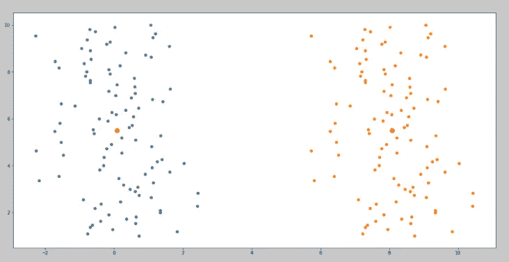
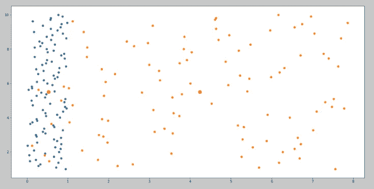
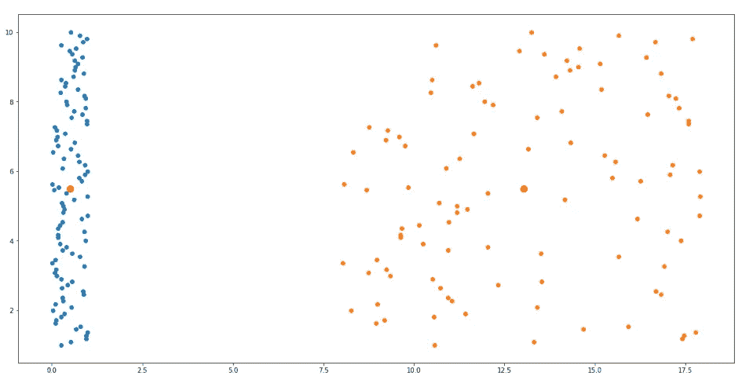

# 使用 Python 理解随机变量的变换

> 原文：<https://medium.com/analytics-vidhya/understanding-transformation-of-random-variables-using-python-98d7bfbd2517?source=collection_archive---------9----------------------->

随机变量是统计实验结果的数字描述。它可以是离散的，也可以是连续的，这取决于实验的结果。

我们将会看到随机变量的两种变换，即“缩放”和“移位”。

**换挡转型**

设‘P’是随机变量，‘Q’是变换后的随机变量，其中 Q= P+ t (t 是任意实数)。让我们看一个特殊的例子，其中 Q= P+ 8。我们在 x 轴上绘制随机变量，在 y 轴上绘制 1 到 10 之间等间距的一组 100 个值。

```
**import numpy as np** # The necessary packages are imported.
**import matplotlib.pyplot as plt****b = list(np.linspace(1,10,100))** # ‘b’ is initialised as 100 numbers equally spaced between 1 and 10.
**P = list(np.random.randn(100))** # ‘P’ random variable is initialised as 100 random numbers.**plt.figure(figsize=(20,10))** # The size of figure is adjusted.**mean_Px = sum(P)/len(P)** # ‘mean_Px’ is the mean value of ‘P’.
**mean_Py = sum(b)/len(b)** # ‘mean_Py’ is the mean value of ‘b’.**plt.plot(mean_Px,mean_Py,’ro’,markersize = 10)** # The mean value (mean_Px,mean_Py) point is plotted.**Q = [num+8 for num in P]** # ‘Q’ random variable is defined as (P+8).
**mean_Qx = sum(Q)/len(Q)** # ‘mean_Qx’ is the mean value of ‘Q’.
**mean_Qy = sum(b)/len(b)** # ‘mean_Qy’ is the mean value of ‘b’.
**plt.plot(mean_Qx,mean_Qy,’ro’,markersize = 10)** # The mean value (mean_Qx,mean_Qy) point is plotted.**plt.scatter(P,b)** # Scatter plot of ‘P’ on x-axis and ‘b’ on y-axis.
**plt.scatter(Q,b)** # Scatter plot of ‘Q’ on x-axis and ‘b’ on y-axis.
```



“x”值用蓝色阴影表示。y '值用黄色阴影表示。两个数据的平均值都用红色阴影表示。

从上面的散点图中，我们观察到在“移位变换”之后,“P”的平均值已经向右移位了 8 个单位。让我们通过计算“P”和“Q”之间的平均差值来验证这一点。

***Mean _ Px—Mean _ Qx***#计算‘P’和‘Q’之间的平均差值。

正如所料,“P”和“Q”之间的平均差值为 8 个单位。因此，将随机变量移动“t”个单位也将随机变量的平均值移动“t”个单位。E[P+t] = E[P] + t 其中 E[P]是 P 的期望值，与“P”的平均值相同。

现在让我们看看移位对随机变量的方差有什么影响。方差给你一个关于平均值的点分布的度量。它是每个点到平均值的距离平方的平均值。高方差值表明这些点远离平均值。较低的方差值表示这些点更接近平均值。如果您观察前面的散点图，我们会看到蓝色和黄色点以类似的方式分布在各自的平均值周围。因此，我们希望方差在“移位变换”后保持不变。让我们通过计算“X”和“Y”之间的方差来验证这一点。

`**Variance_Px = np.var(P)** # Variance of random variable ‘P’ is calculated.`
`**Variance_Qx = np.var(Q)** # Variance of random variable ‘Q’ is calculated.`
`**Variance_Px — Variance_Qx** # Variance difference between ‘P’ and ‘Q’ is calculated.`

正如所料，随机变量‘P’和‘Q’之间的方差差为 0 个单位 ***。因此，将随机变量移动“t”个单位不会影响随机变量的方差。Var[P+t] = Var[P]其中 Var[P]是随机变量“P”的方差。***

**缩放变换**

设‘P’为随机变量，而‘Q’为变换后的随机变量，其中 Q= t*P (t 为任意实数)。让我们来看一个特殊的例子，其中 Q= 8*P。我们在 x 轴上绘制随机变量，在 y 轴上绘制 1 到 10 之间等间距的 100 个值。

```
***i*mport numpy as np** # Import the necessary packages.
**import matplotlib.pyplot as plt****b = list(np.linspace(1,10,100))** # ‘b’ is initialised as 100 numbers equally spaced between 1 and 10.
**P = list(np.random.rand(100))** # ‘P’ random variable is initialised as 100 random numbers.**plt.figure(figsize=(20,10))** # The size of figure is adjusted.**mean_Px = sum(P)/len(P)** # ‘mean_Px’ is the mean value of ‘P’.
**mean_Py = sum(b)/len(b)** # ‘mean_Py’ is the mean value of ‘b’.**plt.plot(mean_Px,mean_Py,’ro’,markersize = 10)** # The mean value (mean_Px,mean_Py) point is plotted.**Q = [num*8 for num in P]** # ‘Q’ random variable is defined as (8*P).**mean_Qx = sum(Q)/len(Q)** # ‘mean_Qx’ is the mean value of ‘Q’.
**mean_Qy = sum(b)/len(b)** # ‘mean_Qy’ is the mean value of ‘b’.**plt.plot(mean_Qx,mean_Qy,’ro’,markersize = 10)** # The mean value (mean_Qx,mean_Qy) point is plotted.**plt.scatter(P,b)** # Scatter plot of ‘P’ on x-axis and ‘b’ on y-axis.
**plt.scatter(Q,b)** # Scatter plot of ‘Q’ on x-axis and ‘b’ on y-axis.
```



“x”值用蓝色阴影表示。y '值用黄色阴影表示。两个数据的平均值都用红色阴影表示。

从上面的散点图中，我们观察到在“缩放变换”后,“P”的平均值变成了之前平均值的 8 倍。让我们通过下面给出的代码来验证这一点。

***Mean _ Qx/Mean _ Px***# Q 的平均值除以 P 的平均值。

不出所料，**‘P’的平均值在‘缩放变换’后变成了之前平均值的 8 倍。**因此，用“t”个单位缩放随机变量也用“t”个单位缩放随机变量的平均值。E[t*P] = E[P]*t .****

**现在让我们看看比例对随机变量的方差有什么影响。如果观察前面的散点图，我们会发现黄色点比红色点更远离平均值，这表明“P”的方差在缩放变换后显著增加。让我们通过下面给出的代码来验证这一点。**

*****方差 _Px = np.var(P)*** #计算随机变量‘P’的方差。
***Variance _ Qx = NP . var(Q)***#计算随机变量' Q '的方差。
***方差 _ Qx/方差 _ Px***# Q 的方差除以 P 的方差。**

**因为‘Q’的预期方差= 64 倍‘P’的方差。**因此，将随机变量缩放‘t’个单位，将随机变量的方差缩放‘t’个单位。Var[t*P] = Var[P]*t 其中 Var[P]是“P”的方差。****

****移位&缩放变换****

**让我们看看当一个随机变量既被缩放又被移位时会发生什么。设‘P’为随机变量，‘Q’为变换后的随机变量，其中 Q= n*P+ t (n 和 t 为实数)。让我们看一个特殊的例子，其中 Q= 10*P+ 8。我们在 x 轴上绘制随机变量，在 y 轴上绘制 1 到 10 之间等间距的一组 100 个值。**

```
**import numpy as np** # The necessary packages are imported.
**import matplotlib.pyplot as plt****b = list(np.linspace(1,10,100))** # ‘b’ is initialised as 100 numbers equally spaced between 1 and 10.
**P = list(np.random.rand(100))** # ‘P’ random variable is initialised as 100 random numbers.
**plt.figure(figsize=(20,10))** # The size of figure is adjusted.
**mean_Px = sum(P)/len(P)** # ‘mean_Px’ is the mean value of ‘P’.
**mean_Py = sum(b)/len(b)** # ‘mean_Py’ is the mean value of ‘b’.
**plt.plot(mean_Px,mean_Py,’ro’,markersize = 10)** # The mean value (mean_Px,mean_Py) point is plotted.**Q = [10*num+8 for num in P]** # ‘Q’ random variable is defined as (10*P+8).
**mean_Qx = sum(Q)/len(Q)** # ‘mean_Qx’ is the mean value of ‘Q’.
**mean_Qy = sum(b)/len(b)** # ‘mean_Qy’ is the mean value of ‘b’.
**plt.plot(mean_Qx,mean_Qy,’ro’,markersize = 10)** # The mean value (mean_Qx,mean_Qy) point is plotted.**plt.scatter(P,b)** # Scatter plot of ‘P’ on x-axis and ‘b’ on y-axis.
**plt.scatter(Q,b)** # Scatter plot of ‘Q’ on x-axis and ‘b’ on y-axis.
```

****

**“x”值用蓝色阴影表示。y '值用黄色阴影表示。两个数据的平均值都用红色阴影表示。**

**从散点图中，我们观察到随机变量‘P’的均值和方差都增加了。**

**首先，我们对随机变量“P”应用“缩放”变换，然后应用“移位”变换。平均值缩放 10 个单位，然后移动 8 个单位。方差按 100 个单位缩放。**