# 用常数理解 Twitter 参与度

> 原文：<https://medium.com/analytics-vidhya/understanding-twitter-engagement-with-a-constant-a440fa76472c?source=collection_archive---------14----------------------->

本文概述了 POLINKS 团队提出的解决方案，该团队在 2020 年 RecSys 挑战赛上排名第六。这项挑战是推荐系统领域最重要的竞赛之一。今年的比赛由 Twitter 主办，它提供了一个非常大的数据集，几乎有*8000 万*条独特的推文。

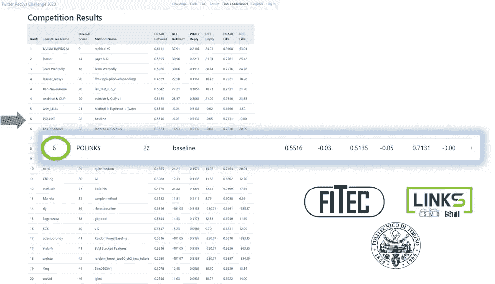

该团队得到了 [FITEC srl](http://www.fitec.it) 、[林克斯基金会](https://linksfoundation.com/)和[都灵理工](https://www.polito.it/)的支持。

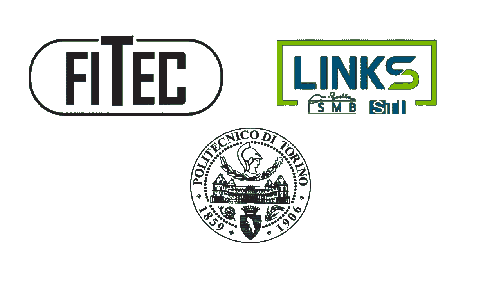

参与挑战的三家公司。

# 挑战的目标:预测参与度

Twitter 的目标是提供始终引人入胜的内容，这些内容是根据用户偏好定制的。要做到这一点，他们必须不断改进他们的推荐引擎，这也是参加挑战赛的团队努力要做的事情。

让我们看一个例子，让事情更清楚。

在 Twitter 上的典型互动中，我们有两种角色:

*   推文作者
*   阅读推文的用户


典型的 Twitter 互动:这是我们必须预测的。p(是/否)表示用户和作者之间积极互动的概率。

作者写了一条推文，根据他的受欢迎程度，可能会被广泛的用户看到。每个参与用户可以执行不同类型的操作:

*   *回复*:写一篇关于推文的评论
*   *转发*:分享推文内容
*   *转发评论*:分享内容并附上个人评论
*   *像*一样:一个非常众所周知的动作

*Recsys 挑战赛 2020* 的目标是为每种行动提供积极参与的可能性。

## 评估指标

公共排行榜上的结果通过两种不同的指标进行评估:

*   PRAUC (精确召回曲线下的区域)
*   **RCE** (相对交叉熵):这是一个与经典*交叉熵*略有不同的度量。它就是交叉熵，除以 CTR(点击率)。

让我们看一个 CTR 的例子来阐明这个指标。

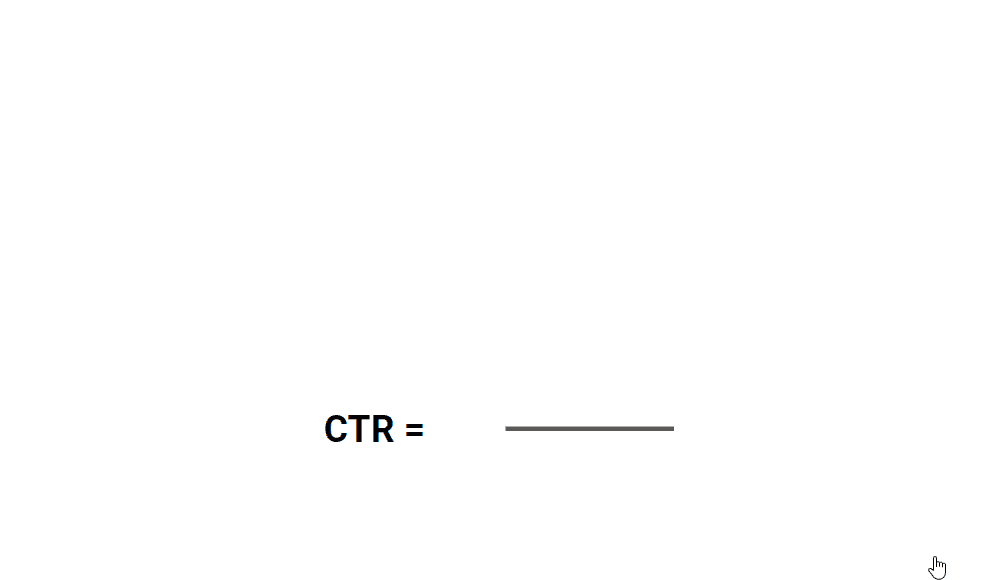

典型用户会话的点击率

它只是代表积极行动的数量，除以互动的总数。

# 第一种方法:梯度推进

在数据科学竞赛中，一个非常常见的解决方案是梯度推进，它通常会获得很大的成功。

由于我们专注于获得一个好的排行榜位置，这是我们的第一次尝试，但如果你认为这是让我们获得第六名的方法，你会失望的。

## 特征工程

大多数情况下，它用于生成大量有用的特征，以便梯度增强算法更容易预测每种交战类型的概率。


特征工程。火车。重复一遍。

我们生成了 **59 个特征**,可以分为六个不同的类别:

1.  **数据集特征(12 个特征)**:由数据集直接给出。它们可以包含在模型中，只需很少或不需要调整。(例如标签数量、推文语言)
2.  **作者特征(18 个特征)**:用于描述训练集的每个作者。它们包括一些预先计算的特征，详细描述了历史上每个作者的特殊行为，由数据集记录。这一类别的两个最重要的特征是:

*作者参与比例*:

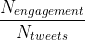

作者参与比率

表示作者的推文收到的特定类型的动作数除以发布的推文总数。

*收到的参与次数:*表示作者收到的每种参与类型(赞、转发、回复、评论)的交互总数。

3.**用户特征(18 个特征)**:类似于应用于作者的特征，但它们是根据与推文交互的用户来计算的。(例如，用户给出的喜欢的总数或动作的总数)

4.**口语(1 个特点)**:这个特点背后的主要直觉是，理解推文的语言在可能的互动中起着关键作用。出于这个原因，我们计算了每个用户所说的所有语言，以确定他是否能够理解推文的文本。

5.**以前的动作(4 个特性)**:我们执行另一个预计算，以了解用户和作者之间以前交互的历史。

6.**时间相关特征(6 个特征)**:一些与推文时间戳相关的附加特征，如一天中的时间、一周中的日期等等。

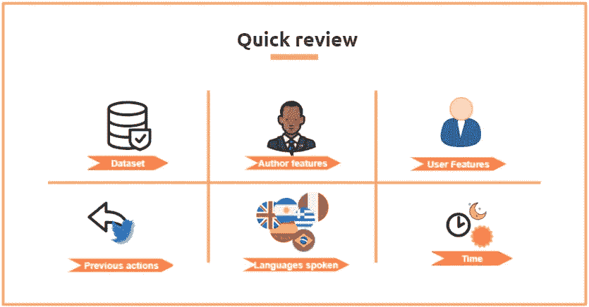

梯度增强的不同类别的特征

## 可扩展性问题

现在，我们已经定义了许多功能，以帮助我们的梯度推进算法做出正确的决定，我们必须面对这一挑战的最大问题:*可扩展性。*

训练集实际上是巨大的 T21(大约 70 GB)，包含 1 . 48 亿行以及我们之前详述的 60 列，代表了这些特性。

很容易理解，将整个数据集放入内存中并不容易，因此梯度增强的经典实现是行不通的。

幸运的是，我们用于实现的 **XGBoost** 库为处理这种情况提供了一个很好的解决方案:[外部存储器版本](https://xgboost.readthedocs.io/en/latest/tutorials/external_memory.html)。

由于这种实现并不广为人知，我们分享一个代码片段来帮助其他面临相同问题的人。

1.  将数据集和生成的要素一起写入 csv。在我们的解决方案中，我们在磁盘上写了三个不同的文件:*训练、测试*和*验证。*
2.  保存列的名称，它们将非常有用，例如，在绘制每个特性的重要性时。否则你只会得到一个号码，而不是名字。
3.  将标签写在 csv 的一列上，记住标签列的索引，因为您将丢失标题。
4.  在 **DMatrix** 数据结构中导入外部存储器 csv:

重要的是要包括:

```
#dtrain.cache
```

这样，我们告诉 XGBoost 不要将整个数据集加载到内存中。

5.训练 XGBoost 模型。为了使模型对庞大的数据更加稳健，我们个人建议使用 gpu_hist 树方法，如果您仍然有一些问题，可以使用参数*子样本*:

## 结果

这个解决方案看起来相当复杂，并且在[公共排行榜](https://recsys-twitter.com/final_leaderboard/results)上没有给我们带来好的结果。特别是，我们得到了一个强烈的负面的 RCE 分数，这表明我们应该寻找其他方向。

# **最佳方案:CTR 优化常数**

在对*梯度提升模型的结果感到失望之后，*我们意识到，我们需要更好地理解这些指标，以便在排行榜上攀升。

具有讽刺意味的是，成为最佳解决方案的起始问题是:

> 可以在两个指标的得分之间提供良好平衡的最佳常数是什么？

为了回答这个问题，我们遵循不同的步骤:

1.  我们随机抽取相同的数字，分配给所有可能的用户推文对
2.  我们计算这两个指标来调整该数字，以便最大化分数

调查结果详见下表:

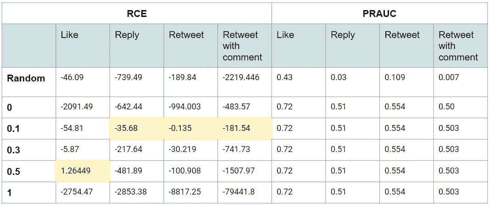

每个常数的 RCE 和普拉克结果。

我们注意到的第一件事是，我们有一个不同的最佳值，取决于参与度。特别是对于像这样的*，我们有一个更高的优化，因为它是目前为止最流行的动作。*

从这项研究中我们得到了两个有用的结果:

*   任何常数都会对分数产生相同的影响
*   **RCE** :根据啮合类型，有不同的最佳值。

很明显，我们必须找到优化 RCE 的价值观。

## 动作分布

RCE 与点击率密切相关，点击率取决于动作在训练集中的不同分布。

例如，动作*的 RCE 与*类似，相对于其他动作，数值越高，结果越好，因为它是最常见的动作。

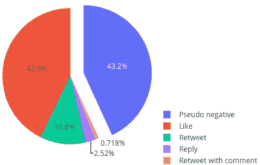

每个动作在训练集中的分布

在这一点上，很明显，每种行动的最佳常数是 CTR 本身。下表显示了每种雇佣类型的 CTR 数值:

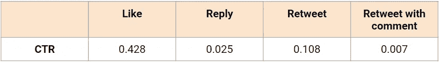

每种啮合类型的优化常数

通过将这些结果与上表进行比较，我们理解了为什么 0.5 对于 like 来说是一个好结果，而对于其他动作来说，最佳常数是 0.1。最佳值就是最接近 CTR 的值。

最终解决方案基于 CTR 常数，遵循以下步骤:

*   计算每种行动的 CTR

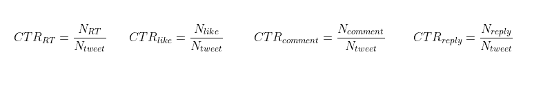

每种合约类型的 CTR

*   每种行为的预测概率将是点击率本身，对所有成对的用户推文进行复制。例如:

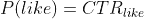

## 结果

尽管这种方法非常简单，只需要几行代码，但它在排行榜上给出了惊人的分数，这可能是因为它利用了排名计算方法的一些弱点。

最终排名分不同步骤计算:

*   四个项目中 PRAUC 得分的平均值
*   四个项目中 RCE 得分的平均值
*   两个指标的排名计算
*   两次排名之和

这种计算倾向于在最不具竞争力的指标上获得高分的解决方案。

我们的团队广泛测试了常数模型，以了解公共排行榜上的好结果是否只是巧合，或者在官方排名上也可能有一些有效性。

为此，我们将训练集划分为不同的块，使用相同大小的官方验证集来定义不同的动作分布如何影响 RCE 分数。

结果如下图所示:

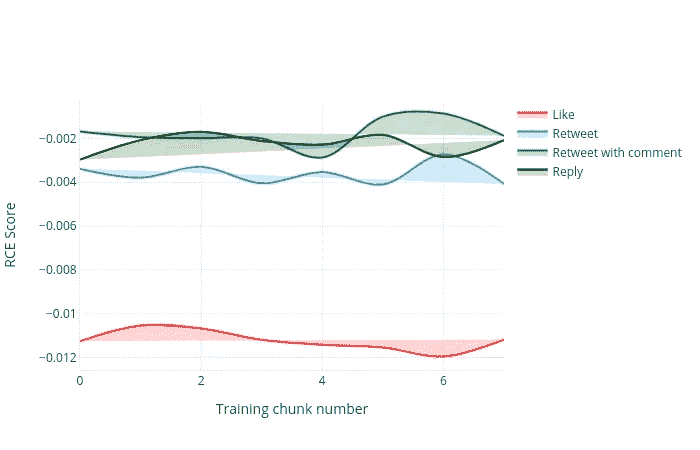

基于 CTR 的常数在不同时间跨度内的行为。

正如我们所看到的，不同训练块之间的分数没有太大差异，因此我们可以非常确定最终的排行榜计算不会对我们的解决方案产生太大影响。

# 最终考虑

我们从这次挑战中得到的教训是，*数据科学竞赛*可能与*现实生活*大相径庭。

提供的数据集结构非常好，Twitter 是研究人员最常见的数据源之一，因此认为这种问题是人为的是不公平的。

真正的区别是，为了提高在排行榜上的位置，你必须做一些技巧，如利用数据泄露或指标弱点，这些在目标是交付产品时都不能应用。

在真实情况下，基于常数的解决方案将完全无用，我们可能会花费更多时间来改进梯度提升解决方案，使其具有更多功能和更好的可扩展性。

如果您感兴趣，可以在我们的 [github 库](https://github.com/andreafiandro/recsys2020)中找到这两种解决方案的代码。