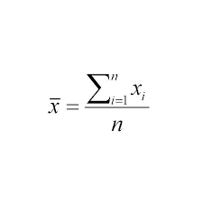
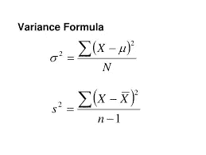
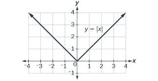
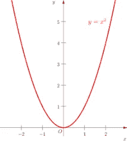

# 理解方差和离差的平方函数

> 原文：<https://medium.com/analytics-vidhya/understanding-variance-deviation-in-data-science-19c8e92a21ba?source=collection_archive---------19----------------------->

方差公式中为什么用平方函数代替 MOD？

作者:unplash.com/@eshwak

因为我们都知道数据科学是关于数据的，而数据是关于多样性的。那么，我们如何标准化格式或任何模式来理解数据的多样性呢？

简单的答案是设置一个基准值，因为我们可以映射数据中其他值的差异性质。

我们应该知道偏离平均值的总和是零

通常，我们将平均值设置为该点，并且可以通过计算所有当前点与平均值的和或平均偏差来进行简单计算。

在中心性的测量中，偏差总是从均值的两侧抵消，但是当方差被考虑在分布中时，我们需要检查整个分布有多远，包括负的点。

它们的符号相遇是抵消传播(负对正)的主要原因，但是如果我们取偏差的绝对值，那么它不会被抵消，我们可以计算整个传播长度。

或者为了将负的点转化为正的点，我们可以取负的点的平方。

这是方差的公式。当然，通过取正方形，

上面的是总体，下面的是样本，最重要的是

现在你一定想知道为什么会有这两个不同的公式？

> 答案是**概率论**我将在下一篇文章中给出这个答案为什么公式中出现 **n** 和( **n-1** )

在此之前，有一个小但非常重要的问题，为什么我们使用平方函数而不是 MOD？

当然，平方函数比绝对函数好，而且需要了解更多。

绝对函数

*   平方函数比绝对值函数光滑
*   **平方函数可微**

为什么我们关心差异化特征？

平方函数

原因是…

微积分在数据科学和机器学习等应用中发挥着非常重要的作用，深度学习可以优化平方函数的值，但不能优化绝对函数的值。

第二个最重要的原因是，在分布中，我们都希望抑制低偏差值，放大高偏差值，平方函数也是如此，也有助于异常值处理。

由[https://www.pexels.com/@olly](https://www.pexels.com/@olly)