# 了解各种类型的分布

> 原文：<https://medium.com/analytics-vidhya/understanding-various-types-of-distributions-34b8db895569?source=collection_archive---------6----------------------->

嗨伙计们！在这个博客中，描述数据科学/ML 中使用的不同类型的发行版。

在开始分配类型之前，我们必须知道

*   为什么需要发行版？
*   给了我们什么好处？

因此，我们需要研究分布，因为它导致通过寻求分布来得到大多数问题的答案。比如在**虹膜数据集**(仅为简单起见)中，花瓣长度的平均值是多少？花瓣长度如何不同于平均值？哪个区间区域密度最大？等。

**的好处是更好的观察技巧。与其编写每个代码去寻找每个问题，可能会导致过度工作。因此，最好是为给定的特性绘制分布图，通过观察图表的观察技巧，您将能够很容易地得出大多数问题的结论。这是非常重要的，因为大多数真实生活场景/实践，它遵循这些分布类型之一。**

那么，让我们开始吧！

# 高斯分布

(其他名称也称为正态分布)

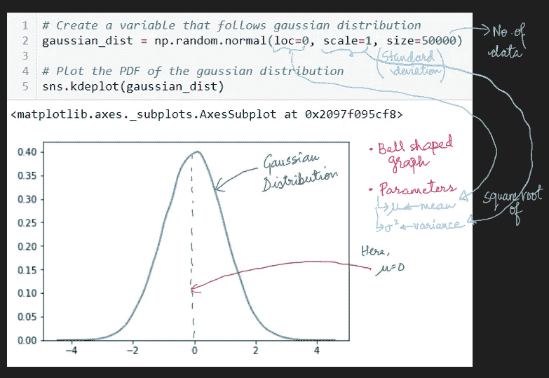

> 注:标准差是指方差的平方根

所以，你只需要给两个参数值:均值和方差，以获得或遵循高斯分布。让我们分析不同参数值对分布的**影响。**

> 观察值 I(不同的平均值，保持标准偏差不变)

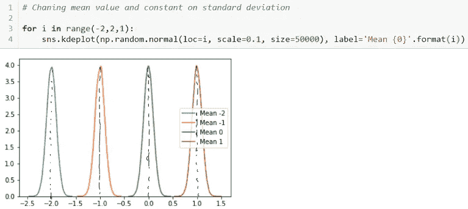

> 观察值 II(保持平均值恒定，不同的标准偏差值)

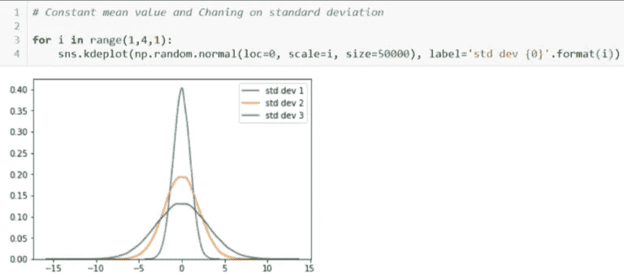

那么，让我们看看它是如何工作的？

对于包含一组可能值( **x** )且服从高斯分布的任意随机变量 **X**

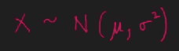

，那么随机变量 **X** 的概率密度等于 **x** 无非是 [**高斯**函数](https://en.wikipedia.org/wiki/Gaussian_function)。

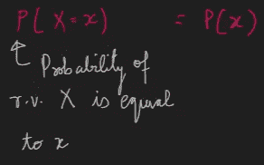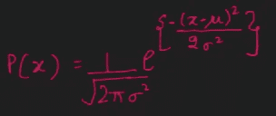

高斯分布的概率密度函数

因此，让我们分析编码，看看输出..

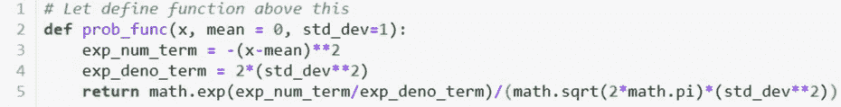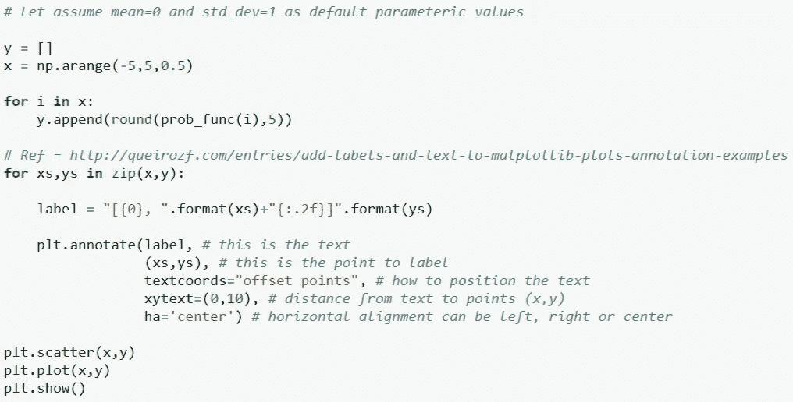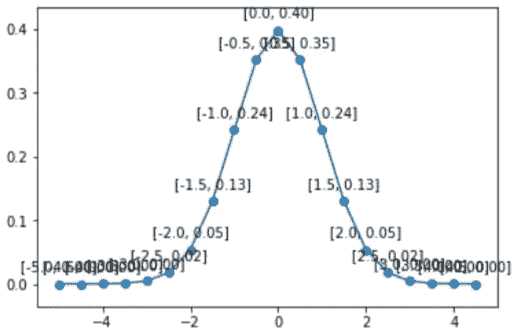

随机变量 **X** 的 PDF，数据集范围从[-5，5]

确切地看起来像高斯分布图**。但是有些点是看不到的。因此，下表是上述地块的坐标。**

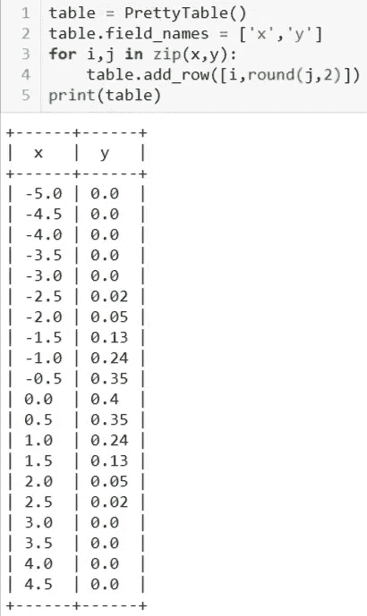

让我们从图表中看到并得出结论，考虑在 x 轴上选择的 3 个点。

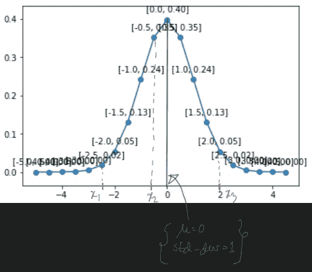

1.  查看 x_1、x_2 和 x_3，我们得出结论，随着 **x** 远离平均位置值，P( **x** )的值减小。
2.  往图形里看，是**对称的。**
3.  从图中从 x_2 到 x_1 看，它们对应的 P( **x** )呈指数下降(因为函数中含有‘指数’项)

[高斯的累积分布函数](https://en.wikipedia.org/wiki/Cumulative_distribution_function) (CDF)(看起来像 S 形图)

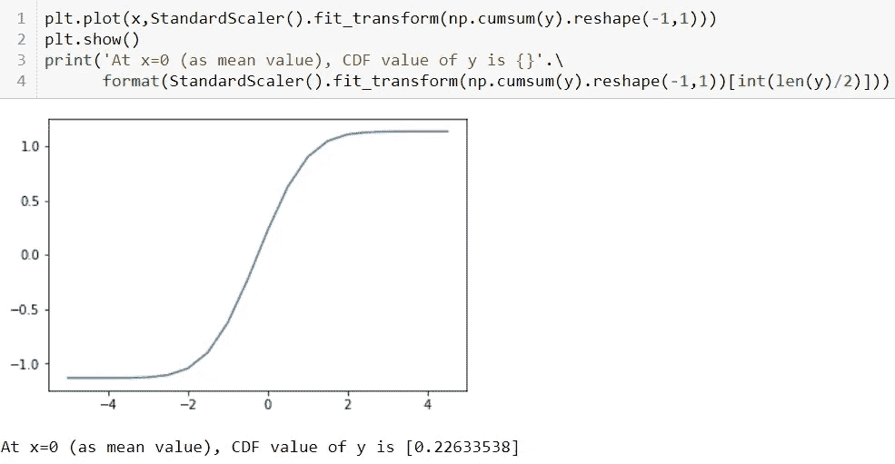

这里，标准缩放函数用于重新缩放到[-1，1]之间的值。上述观察意味着

> 在 x =0(平均值)时，对应于 x 的 y 的 CDF 值是 0.226，这意味着有 22.6%的数据点位于平均位置(= 0)以下或等于平均位置(= 0)

现在，让我们用**观察不同参数值对 CDF 图**的影响。

> 观察值 I(平均值= 0 时标准偏差的不同值)

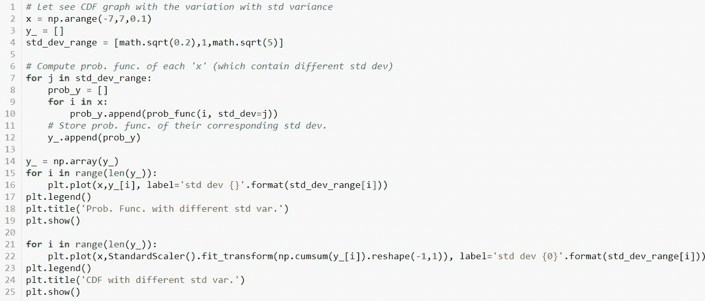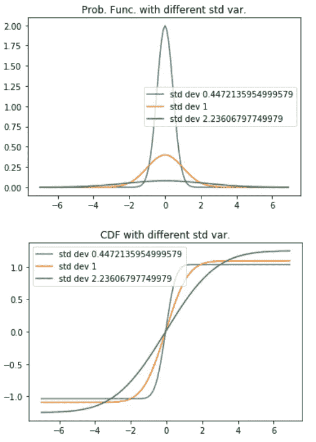

> 观察结果 II(标准偏差= 1 时的不同平均值)

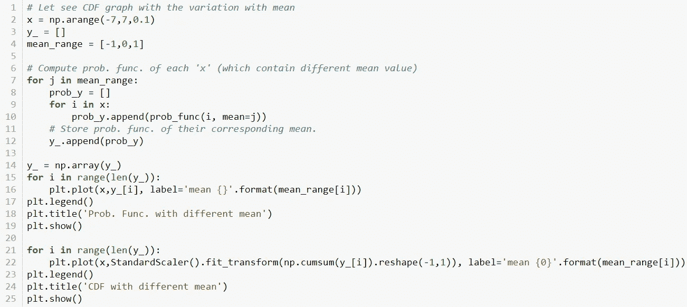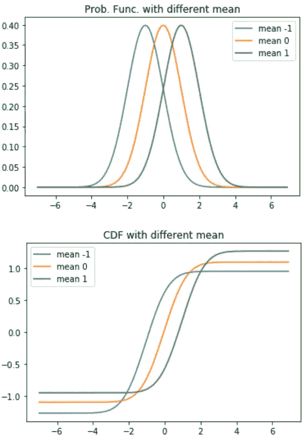

**结论**从上图来看，

1.  随着标准偏差的增加，中间线(从线的低到高部分升高)倾向于具有较小的斜率。
2.  至于不同的平均值，S 形的移动向它们相应的平均值移动。

现在，**这个高斯分布的一个最主要的方面叫做**[**68–95–99.7 规则**](https://towardsdatascience.com/understanding-the-68-95-99-7-rule-for-a-normal-distribution-b7b7cbf760c2) 。请仔细阅读，这非常重要，也将从这个规则中谈到很多，在实际情况中也很有帮助。

# 均匀分布

上面看的并不完全是理想的均匀分布(但在现实生活场景中那种分布我们可以说是均匀分布)。因此，从上面我们可以说，随机变量 **X** 中每个值的概率是相等的。例如，考虑骰子的例子，获得机会的概率{1，2，3，4，5，6}是相等的，即 **1/6** 。

为了能够绘制均匀分布图，我们需要两个参数:下限值和上限值。这个分布的概率密度定义为

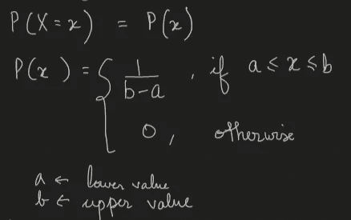

理想情况下应该是这样的。

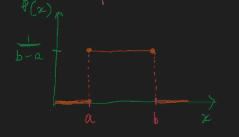

让我们用编码来说明..

定义概率密度函数(下限值= -2，上限值= 2)并绘制结果图

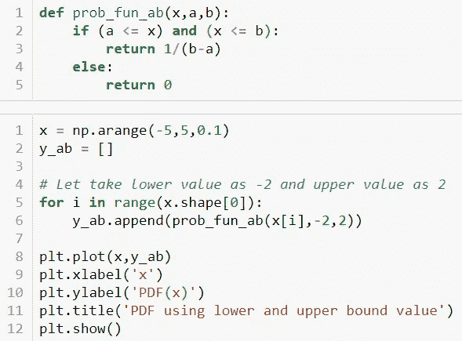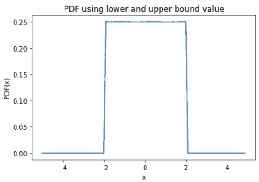

如果您有均值和方差参数值，那么这个分布的概率密度将是

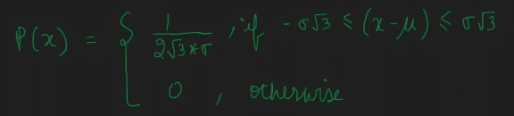

让我们继续前一个。

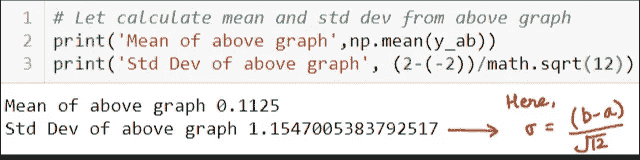

> **请记住！**
> 
> 均匀分布的标准差为 **(b-a)/sqrt(12)** 。
> 
> 此处证明在此链接:[https://www . quora . com/What ' s-the-standard-deviation-of-a-uniform-distribution-How-this-formula-determined](https://www.quora.com/What-is-the-standard-deviation-of-a-uniform-distribution-How-is-this-formula-determined)

用平均值和标准偏差参数定义概率密度函数，并绘制结果图

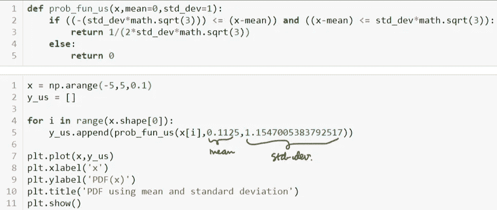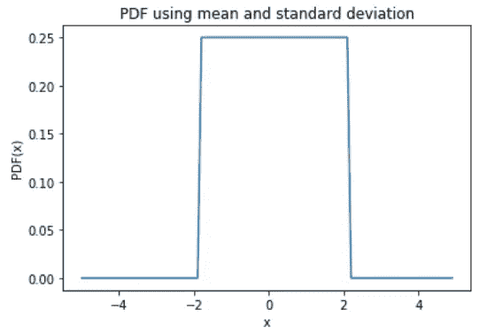

太好了！它得到了和以前一模一样的图表。

[均匀分布的累积分布函数](https://en.wikipedia.org/wiki/Cumulative_distribution_function) (CDF)

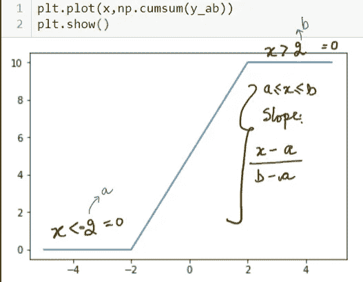

因此，从上图中，我们可以将 CDF 函数定义为:

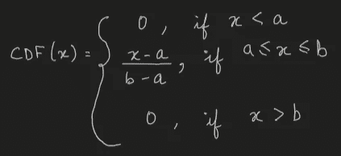

# 二项分布

同样，对于这个分布，它有两个参数:

**n :** 独立实验次数

**p :** 成功的概率

那么，很明显，失败的概率将 **(1-p)** 。

如果 **n=1** ，即独立实验的次数只进行一次，那么这个分布就是**伯努利**分布。

因此，对于任何服从二项式分布**、**的随机变量 **X**

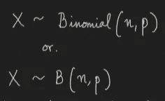

比方说，我们执行' **n** '次独立实验，并计算得到' **k** 次成功的概率，然后

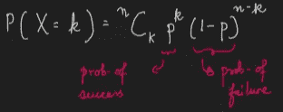

而对于**伯努利**分布，(意味着 **n** =1)

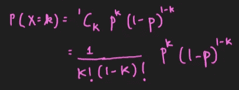

因为我们正在做**一个实验(伯努利的**实验)，所以有两种可能的结果。

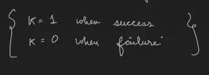

所以，只要把它放在 **P(X=k)** 方程中，我们就得到了概率函数..

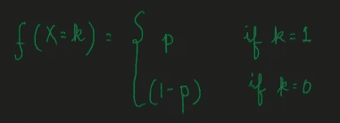

> 来源:维基百科
> 
> 参赛:https://en.wikipedia.org/wiki/Binomial_distribution
> 
> 应用:
> 
> 二项式分布通常用于模拟从数量为 *N* 的总体中抽取替换数量为 *n* 的样本的成功数量。如果抽样是在没有替换的情况下进行的，则抽取不是独立的，因此得到的分布是超几何分布，而不是二项式分布。然而，对于比 *n* 大得多的 *N* ，二项式分布仍然是一个很好的近似，并且被广泛使用。

# 对数常态分布

对于这种分布，只有当随机变量 **X** 服从**高斯分布**时才有效。

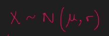

然后是 **X 的指数函数**

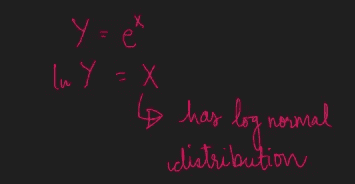

高斯分布和对数正态分布的**区别**在于**对数正态分布只取正值！**。并且在高斯分布中取正值和负值。

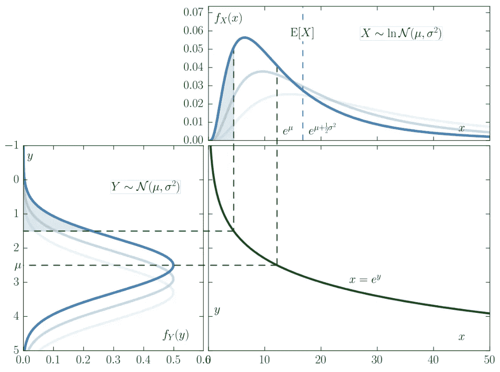

[维基资源](https://en.wikipedia.org/wiki/Log-normal_distribution#/media/File:Lognormal_Distribution.svg)

此图很好地说明了如何将高斯分布转换为对数正态分布。

从[维基百科](https://en.wikipedia.org/wiki/Log-normal_distribution)看它的应用。

# 帕累托分布

如果随机变量 **X** 遵循幂律(或帕累托 I 型)，那么 **X** 大于某一特定数 **x** 的概率定义为:

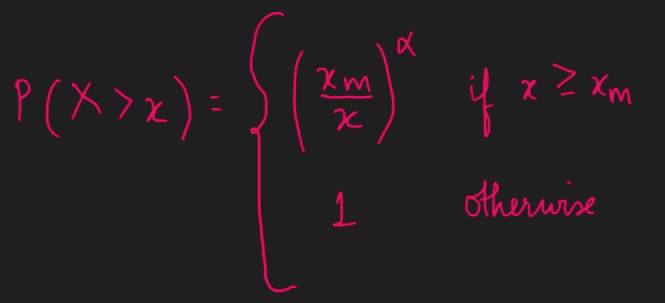

在哪里，

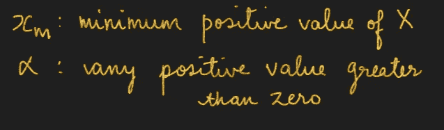

概率密度函数将是:

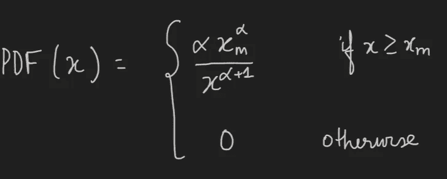

在**图中可以看到:PDF** 对于α的影响。如果α增加，直线的斜率有增加的趋势。

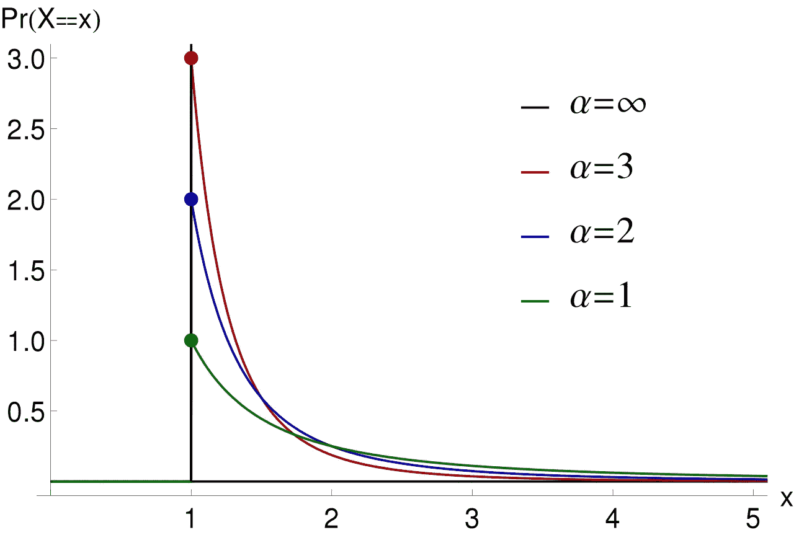

PDF ( [WikiSource](https://en.wikipedia.org/wiki/Pareto_distribution#/media/File:Probability_density_function_of_Pareto_distribution.svg) )

如果你观察到，如果α是无穷大，那么它看起来就像一个给定值“1”将是一个峰值，其余的都是“0”(见 x=1 时的黑线)。这种影响被称为**狄拉克-德尔塔函数**。

[帕累托分布的累积分布函数](https://en.wikipedia.org/wiki/Cumulative_distribution_function) (CDF)

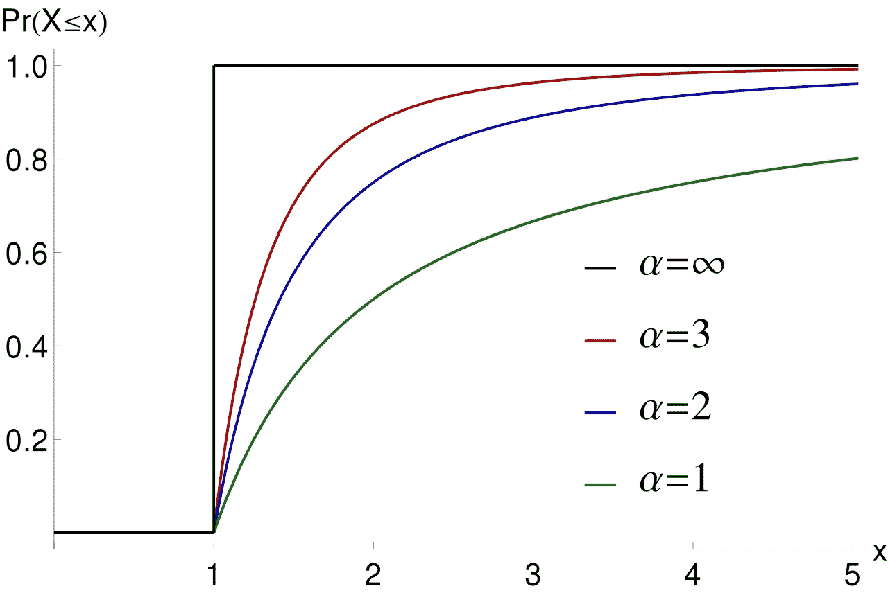

CDF — [维基资源](https://en.wikipedia.org/wiki/Pareto_distribution#/media/File:Cumulative_distribution_function_of_Pareto_distribution.svg)

正如你在上面的**图中看到的:CDF** ，它看起来就像一个逆幂。如果你从 1 中减去 P(X > x) ，你会得到这个 CDF 图。

因为，互联网上有更多类型的发行版本。所以，你不需要学习每一种分布。你所需要的是仔细分析数据，根据数据的特征观察它们遵循什么样的分布，并研究它们的性质和这种分布的特征来捕捉想法。你做的不同类型的项目越多，你就会发现不同类型的分布，然后你就越能很好地理解其他不同类型的分布。

因为如果你阅读他们在任何发行版上的应用程序，他们肯定会遵循；它不像**“在一些其他类型的分布情况下，这种分布并不重要，所以我们让它去吧”**。互联网上的每一个发行版都很重要，这取决于感兴趣的领域(不仅仅是计算机科学，其他领域也包括生物学、内科等)。

希望，你喜欢！

感谢您阅读本文。玩得开心！