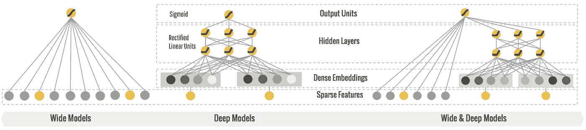
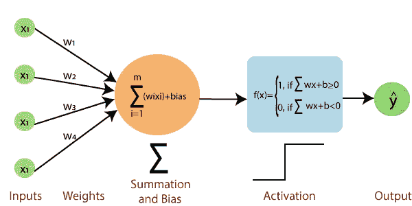
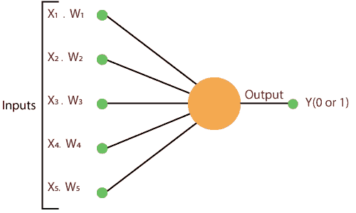
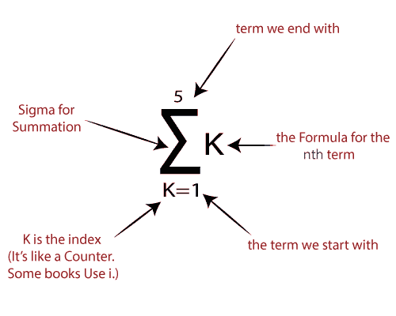
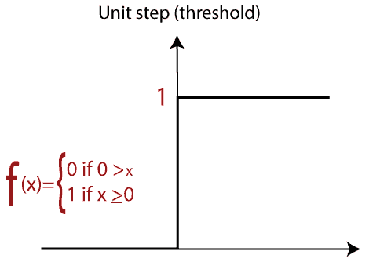
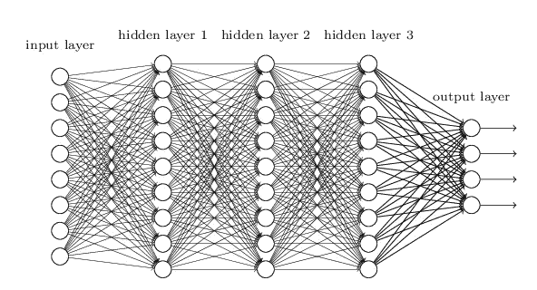
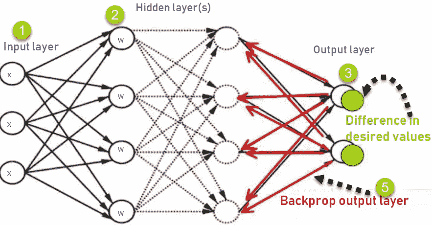
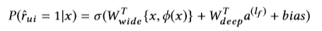

# 理解基于广泛和深度学习的推荐系统

> 原文：<https://medium.com/analytics-vidhya/understanding-wide-and-deep-learning-based-recommendation-system-1aacc61d3bfd?source=collection_archive---------12----------------------->

推荐系统是向用户建议相关项目(视频、图像、文本、产品等)的算法。对于网飞、亚马逊 Prime、Youtube、Google Play、Pinterest 等应用来说，这可能是至关重要的竞争优势。这些应用程序有海量的项目集合，需要提供给每个用户。准确的推荐有助于改善用户体验。

**简介**

宽而深的神经网络结合了最初在 Google play 中为应用推荐引入的概括和记忆的优点。具有非线性特征变换的广义线性模型广泛用于具有稀疏输入的大规模回归和分类问题。通过广泛的跨产品特征转换来记忆特征交互是有效的和可解释的，而泛化需要更多的特征工程工作。使用 MLP 进行要素表示非常简单高效。

宽学习组件是单层感知器，其也可以被视为广义线性模型。深度学习组件是一个 MLP。结合这两种学习技术使得推荐器能够捕获记忆和概括。

**单层感知器**

**感知器由 4 部分组成。**

**输入值或一个输入层:**感知器的输入层由人工输入神经元组成，将初始数据带入系统进行进一步处理。

**权重和偏差:**

**重量:**代表单元之间连接的尺寸或强度。如果节点 1 到节点 2 的权重较大，则神经元 1 对神经元的影响较大。

**偏差:**与线性方程中加入的截距相同。这是一个附加参数，其任务是修改输出以及对另一个神经元的输入的加权和。

**净和:**计算总和。

**激活函数:**一个神经元能否被激活，是由一个激活函数决定的。激活函数计算加权和，并进一步加上偏差以给出结果。

在第一步中，所有输入 x 与它们的权重 **w** 相乘。

在这一步中，将所有增加的值相加，称之为**加权和**。

最后一步，将加权和应用于正确的**激活函数**。

**多层感知器**

多层感知器(MLP)是一种前馈人工神经网络，它从一组输入生成一组输出。MLP 的特征在于若干层输入节点，这些输入节点在输入层和输出层之间以有向图的形式连接。MLP 使用反向传播来训练网络。

**反向传播**

反向传播是神经网络训练的本质。这是一种基于前一个时期(即迭代)获得的错误率微调神经网络权重的方法。通过适当调整权重，您可以降低错误率，并通过提高模型的泛化能力来提高模型的可靠性。

反向传播是“误差反向传播”的简称这是训练人工神经网络的标准方法。这种方法有助于计算损失函数相对于网络中所有权重的梯度。

1.输入 X 通过预连接的路径到达

2.使用真实权重 w 对输入进行建模。权重通常是随机选择的。

3.计算每个神经元从输入层到隐藏层再到输出层的输出。

4.计算输出中的误差

5.从输出层返回到隐藏层以调整权重，从而减少误差。

误差 B=实际输出—期望输出

不断重复该过程，直到获得所需的输出

**广而深的学习模式**

通过将两种模型融合在一起，实现了宽深度学习模型

