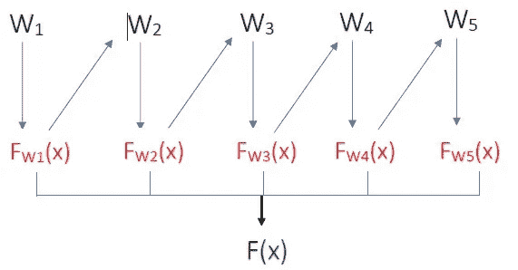

# 了解 XGBoost &它在 ML 社区中越来越受欢迎

> 原文：<https://medium.com/analytics-vidhya/understanding-xgboost-its-growing-popularity-among-the-ml-community-6f12dc25b44b?source=collection_archive---------16----------------------->

# **简介**

梯度推进是最流行的机器学习技术之一，并被广泛撰写。在这个算法的所有实现中，有一个非常突出，并成为了人们谈论的话题，那就是 XGBoost，也就是极端的梯度增强。它是由华盛顿大学的陈天琦创建的，作为一个可扩展的树增强系统。

在本文中，我打算讨论 XGBoost 如何在梯度增强技术的基础上增加特性和改进，使其更具可伸缩性、更高效和更快速。

在我们试图理解 XGBoost 做什么之前，让我们先来理解它的组件，以及它们是如何组合在一起成为 XGBoost 的。

# **助推**

助推遵循了华特·培顿的名言“我们团结起来比单独行动更强大”的原则。Boosting 是一种集成学习技术，用于建立弱学习者的集合，这些弱学习者一起预测比单独使用时好得多。简单来说，这些弱学习者从彼此的错误中学习，并呈现一个组合的结果。

在图中，W1 是弱学习器，它根据复杂的规则预测 FW1(x)。下一个弱学习器试图将第一个模型的误差拟合到新模型 W2 中，新模型 W2 试图校正先前的预测。重复这个过程，直到达到最高精度。

弱学习者有各种方法可以纠正其前一个学习者的预测。当我们通过增加(提升)不正确预测的权重来构建新的学习器时，考虑为所有预测分配相等的权重并调整它们的权重。这种技术被称为 AdaBoosting，它通过操纵权重来最小化误差。

到目前为止，boosting 算法的目标是:

1.建立一个弱学习者并预测

2.最小化损失函数(误差)

3.安装新模型并预测。重复 2

现在让我们用梯度下降法尽量减小误差。这是最有效的方法之一，因此在社区中很受欢迎。通过向梯度移动使损失函数最小化来提升学习器使得梯度提升算法。

微积分警报！让我们看看梯度下降是如何工作的。

对于给定的成本函数，我们需要找到它的最小点。

Ө𝑖 = Ө𝑖 — ρ 𝜕𝐽 / 𝜕Ө𝑖

我们在一个随机点初始化，并向梯度方向移动，这是增长最快的方向。它通过对迭代的参数取函数的一阶导数来计算。梯度的负号是向给定函数的最小值移动。这个过程逐步重复，直到达到最小值。

ρ称为学习率，也是 GradientBoosting 算法中的超参数。此参数表示步长的大小。如果学习率太小，要花很长时间才能找到最小值。如果它太大，它可能会一直绕着曲线移动，并且可能无法找到最佳最小值。

这些是构成 XGBoost 的组件。但是 XGBoost 和 GradientBoosting 有什么不同呢？

# **并行学习**

正如我们看到的 GradientBoosting，按顺序构建树。这需要很长时间来训练模型。XGBoost 通过并行构建树来提高速度。它通过将排序后的数据存储在列已经排序的压缩列(CSC)块中来实现这一点。这允许模型在算法中重用这些块。这些块也可以存储在分布式机器上。这使得它更具可扩展性和时间效率。

**正规化术语**

XGBoost 还在损失函数中增加了一个正则项。

目标函数=损失函数+正则项

正则项控制模型的复杂性，以避免过度拟合。该算法旨在优化该目标函数以提高梯度增强的性能。

**稀疏感知算法**

XGBoost 引入了稀疏感知的分裂查找，用于处理缺失数据或有大量零的数据。它为每个特征 x 添加一个默认方向。它使用非缺失数据对此方向进行分类。与基本算法相比，这种稀疏感知算法工作得更快。

XGBoost 的构建具有可伸缩性和快速性，这也是它在数据科学行业如此受欢迎并被用于寻找商业解决方案的原因。

**高速缓存感知访问**

XGBoost 在内存中分配一个内部缓冲区，以小批量方式提取用于计算的梯度统计数据。这优化了内存分配并加快了进程。

**核外计算**

为了使 XGBoost 成为可伸缩的解决方案，它需要以高效的方式使用所有的硬件资源。为了实现这一点，XGBoost 使用磁盘内存上的块结构，一个线程在这些块上执行计算。它使用两种方法来提高效率，称为块压缩和块分片。

块压缩会根据需要压缩和解压缩列，从而节省内存。块分片交替地将数据分片到磁盘中，由分配给该磁盘的线程读取。

# **结论**

XGBoost 改进了 GradientBoosting 算法，使其在不牺牲性能的情况下更加灵活、高效和快速。这是业界认为它是最佳机器学习算法之一的有力竞争者的关键原因。