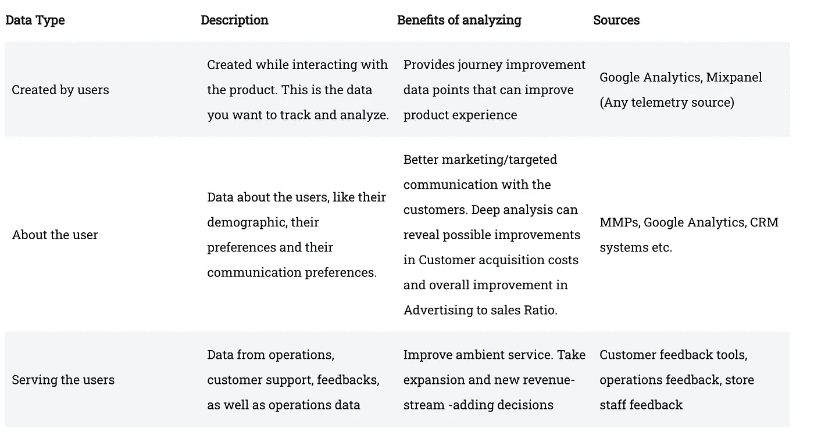
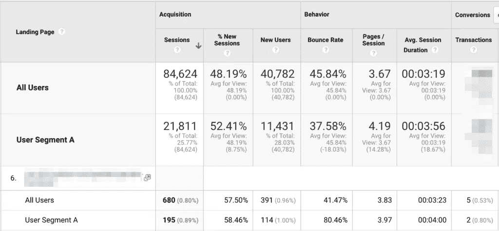

# 了解您组织的数据

> 原文：<https://medium.com/analytics-vidhya/understanding-your-organizations-data-f9bb34f61591?source=collection_archive---------19----------------------->

随着 2019 年的结束，我们生成了超过 40 Zetabytes 的数据([来源](https://www.seagate.com/files/www-content/our-story/trends/files/idc-seagate-dataage-whitepaper.pdf))。所有这些信息都被捕捉、存储和处理，以便做出决策，复杂的& ‌简单。例如，你自己的产品可能每月仅在谷歌分析上就产生数百万行数据。作为一名面向数据的产品经理，您必须了解可能影响您决策的数据源，或者提供有价值的预见。数据无处不在，在这个互联时代，每一个数字接触点都会产生数据。

退一步说，它有助于在您的组织内组织数据源。‌‌:记住，每个数据源都会抛出一个信号&大量的噪声。你应该能够区分信号和噪音。‌此外，分析这些数据源之间的依赖性和相关性以做出更好的决策也是必不可少的。

# 数据来源

数据的主要来源可以分为三个主要范围:

下表简要描述了每种类型及其来源和用途:

了解数据类型

请注意，其中前两个数据类别通常是结构化的，而最后一个数据类别很少是结构化的。大多数时候，它是一个“我想要…”或“我感觉…”或“我们认为…”。

# 组合数据源

对数据源进行分类后，让我们看看分析这些组合是如何做出更好的决策的:

## 已创建&关于用户

通过将用户创建的数据作为用户数据的函数进行分析，我们可以创建产品经理所需的最大决策因素:人物角色。

人物角色基本上是用户是谁，以及他们的行为方式。收集这些信息对您所有的产品决策至关重要。

举例来说，以下是来自用户行为分析的样本数据:

正如我们所看到的，第一页有 41%的高跳出率，而第二页的跳出率较低，为 30%，交易计数较高。

但是，如果我们应用用户细分(来自营销和 CRM 来源):

我们看到高跳出率是由细分市场 A 贡献的(80%)。可以进一步分析用户群的动机——实际情况是，这个特定的用户群是移动用户，他们虽然对登录页面材料很感兴趣，但在移动设备上的体验很差。

## 服务和关于用户

将“服务”和“关于用户”结合起来，可以创建一个运营角色，这对于提供更流畅的运营体验至关重要。例如，在我们的一个零售商业网站中，我们发现启用商店提货选项对于特定地区的用户来说非常方便。通过创建运营角色(定义用户行为模式，即经常光顾我们商店的顾客)，我们能够满足需求、改善客户服务并节约成本。

# 结合一切

将所有信息——所有来源与正确的方法相结合——揭示了来自用户的反馈、行为和收入的更详细的视图。例如，我们知道在特定旅程中提供负面反馈(*由用户*创建)的用户来自高消费人群(*关于用户*)并且是店内提货选项(*为顾客服务*)的高消费人群，我们能够将他们的需求优先于其他人，并向企业证明改变某些交付模式的原因。

> **一刀切的方法已经过时，客户开始期待更多…**

# 警告

数据分析——瘫痪是很多产品经理面临的普遍问题。面对具有多个变量的大型数据集，我们经常会陷入做出对业务有益的完美预测和分类的困境。然而，从经验来看，我坚信“完成”比“完美”更好——因为您有责任确保您有基于至少 60%数据的东西，并准备在不久的将来进行改进。将你的产品野心松散地建立在一个选择性的数据集上是不正确的，但是永远花在击败数据上直到它给你你想要的也是错误的！

感谢您的阅读！