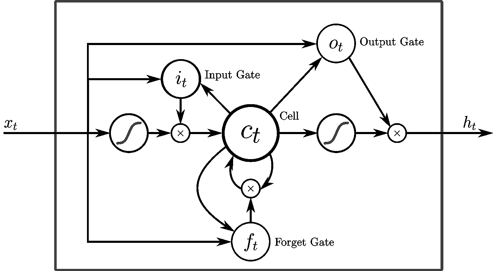

# 理解循环神经网络(RNN)和长短期记忆(LSTM)

> 原文：<https://medium.com/analytics-vidhya/undestanding-recurrent-neural-network-rnn-and-long-short-term-memory-lstm-30bc1221e80d?source=collection_archive---------1----------------------->

在这篇文章中，我们将了解循环神经网络和长短期记忆。我们将介绍基本原理及其工作原理。所以让我们先了解一下。

RNN 代表循环神经网络。它是一种包含记忆的神经网络，最适合于顺序数据。苹果的 Siri 和谷歌的语音搜索都使用 RNN。让我们讨论一下 RNN 的一些基本概念。

在深入了解之前，让我们先了解一下**正向传播**和**反向传播**

# 向前和向后传播

**前向传播**:这是最简单的一种神经网络。数据只在从输入层到隐藏层再到输出层的正向流动。它可能包含一个或多个隐藏层。所有节点都完全连接。我们进行前向传播以获得模型的输出，并检查其准确性并获得误差。

**反向传播**:反向传播法用于训练神经网络。如果有大量的隐藏层，它可以被称为深度神经网络。一旦正向传播完成，我们计算误差。这个误差然后被反向传播到网络以更新权重。

我们通过神经网络反向寻找误差相对于权重的偏导数(损失函数)。这个偏导数现在乘以学习率来计算步长。这个步长被加到原始权重上以计算新的权重。这就是神经网络在训练过程中的学习方式。

# 1.什么是 RNN？

递归神经网络是具有内部存储器的前馈神经网络的推广。RNN 本质上是递归的，因为它对每个数据输入执行相同的功能，而当前输入的输出取决于过去的一次计算。产生输出后，它被复制并发送回循环网络。为了做出决定，它考虑当前的输入和从先前的输入中学习到的输出。

与前馈神经网络不同，rnn 可以使用其内部状态(记忆)来处理输入序列。这使得它们适用于诸如未分段的、连接的手写识别或语音识别之类的任务。在其他神经网络中，所有的输入都是相互独立的。但是在 RNN，所有的输入都是相互关联的。

**最适合顺序数据**

RNN 最适合顺序数据。它可以处理任意的输入/输出长度。RNN 使用它的内存来处理任意的输入序列。

这使得 RNNs 最适合预测单词序列中的下一个单词。就像人类的大脑一样，特别是在对话中，人们更看重信息的新近性来预测句子。

受过翻译文本训练的 RNN 可能会知道，如果“dog”前面有单词“hot ”,则应该有不同的翻译。

**RNN 有内存**

RNN 有记忆能力。它记忆以前的数据。在做出决定时，它会考虑当前的输入，以及它从先前接收的输入中学到了什么。前一步骤的输出被作为输入提供给当前步骤，形成反馈回路。

因此，它使用一组当前输入和先前状态来计算其当前状态。这样，信息循环往复。

简而言之，我们可以说 RNN 有两个输入，现在和最近的过去。这很重要，因为数据序列包含了关于接下来会发生什么的关键信息，这就是为什么 RNN 可以做其他算法不能做的事情。

# 不同类型的 RNN 有:

*   **一对一 RNN**
*   **一对多 RNN**
*   **多对一 RNN**
*   **多对多 RNN**

我们将回顾 RNN 的基本概念，然后，继续探讨不同类型的 RNN，并深入探讨它们。

# RNN 的类型

所以我们建立了递归神经网络，也称为 RNNs，是一类允许以前的输出用作输入，同时具有隐藏状态的神经网络。RNN 模型主要用于自然语言处理和语音识别领域。让我们看看它的类型:

# 一对一 RNN

一对一 RNN (Tx=Ty=1)是最基本和最传统的神经网络类型，为单个输入提供单个输出，如上图所示。它也被称为香草神经网络。它用于解决常规的机器学习问题。

# 一对多

一对多(Tx=1，Ty>1)是一种 RNN 架构，适用于单输入多输出的情况。其应用的一个基本例子是音乐生成。在音乐生成模型中，RNN 模型用于从单个音符(单个输入)生成音乐作品(多个输出)。

# 多对一

多对一 RNN 架构(Tx>1，Ty=1)通常被视为情感分析模型的常见示例。顾名思义，当需要多个输入来给出单个输出时，使用这种模型。

以 Twitter 情感分析模型为例。在那个模型中，一个文本输入(单词作为多个输入)给出它的固定情感(单个输出)。另一个例子可以是电影评级模型，该模型将评论文本作为输入，以提供从 1 到 5 的电影评级。

# 多对多

显而易见，多对多 RNN (Tx>1，Ty>1)体系结构接受多个输入并给出多个输出，但是多对多模型可以有两种，如上所示:

1.Tx=Ty:

这是指输入层和输出层具有相同大小的情况。这也可以理解为每个输入都有一个输出，在命名实体识别中可以找到一个常见的应用。

2.Tx！=Ty:

多对多体系结构也可以用输入和输出层大小不同的模型来表示，这种 RNN 体系结构最常见的应用是在机器翻译中。例如，“我爱你”，英语中的三个神奇单词在西班牙语中只能翻译成两个，“te amo”。因此，机器翻译模型能够返回比输入字符串更多或更少的单词，因为在后台存在不相等的多对多 RNN 体系结构。

**消失和爆炸渐变**

我们先来了解一下什么是梯度？

**梯度**:如上文反向传播部分所述，梯度是相对于其输入的偏导数。梯度衡量的是，如果你稍微改变输入，函数的输出会改变多少。你也可以把梯度想成一个函数的斜率。梯度越高，斜率越陡，模型可以学习得越快。如果斜率几乎为零，模型就停止学习。梯度只是测量所有权重相对于误差变化的变化。

**RNN 的梯度问题**

在训练 RNN 算法时，梯度有时会变得太小或太大。因此，在这种情况下，RNN 算法的训练变得非常困难。因此，会出现以下问题:

1.  性能差

2.低精度

3.训练周期长

**爆炸梯度:**当我们赋予权重高的重要性时，就会出现爆炸梯度问题。在这种情况下，梯度值变得太大，斜率往往呈指数增长。这可以通过以下方法解决:

1.  身份初始化

2.截断反向传播

3.渐变剪辑

**渐变消失:**当渐变的值太小，模型停止学习或因此花费太长时间时，会出现这个问题。这可以通过以下方法解决:

1.  重量初始化

2.选择正确的激活功能

3.LSTM(长短期记忆)解决渐变消失问题的最好方法是使用 LSTM(长短期记忆)。

# 2.什么是 LSTM(长短期记忆)

正如我们所讨论的，RNN 不能长时间记忆数据，并开始忘记以前的输入。为了克服这个问题的消失和爆炸梯度 LSTM 使用。它们被用作短期记忆学习的解决方案。同样在 RNN，当添加新信息时，RNN 完全修改现有信息。RNN 不能够区分重要或不那么重要的信息。而在 LSTM，当添加新信息时，对现有信息的修改很小，因为 LSTM 包含决定信息流的门。

这些门决定哪些数据是重要的并且在将来可能是有用的，哪些数据必须被擦除。这三个门是输入门、输出门和遗忘门。

*   遗忘门:这个门决定哪些信息是重要，哪些信息应该被存储，哪些信息应该被遗忘。它去除了神经元细胞中不重要的信息。这导致了性能的优化。这个门有两个输入，一个是前一个单元产生的输出，另一个是当前单元的输入。将所需的偏差和权重相加并相乘，然后将 sigmoid 函数应用于该值。生成一个介于 0 和 1 之间的值，并基于此决定保留哪些信息。如果值为 0，遗忘门将删除该信息，如果值为 1，则该信息很重要，必须记住。

*   输入门:这个门用来给神经元细胞增加信息。它负责使用类似 sigmoid 的激活函数将什么值添加到单元格中。它创建了一个必须添加的信息数组。这是通过使用另一个名为 tanh 的激活函数来完成的。它生成一个介于-1 和 1 之间的值。sigmoid 函数充当过滤器，并调节哪些信息必须添加到单元格中。

*   输出门:该门负责从当前单元中选择重要信息并显示为输出。它使用范围从-1 到 1 的双曲正切函数创建一个值向量。它使用以前的输出和当前输入作为调节器，其中也包括 sigmoid 函数，并决定哪些值应该显示为输出。

# LSTM 的挤压/激活功能

1.  逻辑(sigmoid):输出范围从 0 到 1。

2.双曲正切(tanh):输出范围从-1 到 1。

# 提高模型性能的技巧:

*   我们可以通过添加更多的层来提高我们的模型性能。与具有较少数量的宽层相比，总是优选具有更多(密集)层。
*   但是，我们必须注意不要过度拟合数据，为此我们可以尝试使用各种正则化方法。
*   批处理规范化:批处理规范化(batchnorm)是一种提高神经网络性能和准确性的技术。每个批次都会发生批次标准化。这就是为什么，它被称为批量规范化。我们在应用激活函数之前对一层的输出进行归一化(均值= 0，标准偏差= 1)，然后将其馈入神经网络中的下一层。因此，我们不是将网络的输入标准化，而是将网络中每个隐藏层的输入标准化。

感谢阅读！将来我也会写更多的**深度学习** **文章**。 [**关注**](/@vijay_choubey) 我来了解一下。我也是一名自由职业者，如果有一些与数据相关的项目的自由职业工作，请随时通过 [**Linkedin**](https://www.linkedin.com/in/vijay-choubey-3bb471148/) 联系。没有什么比做真正的项目更好的了！

# 如果你喜欢这篇文章，请鼓掌！