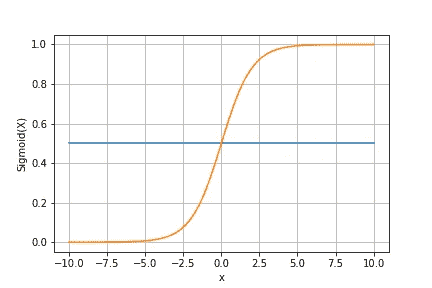
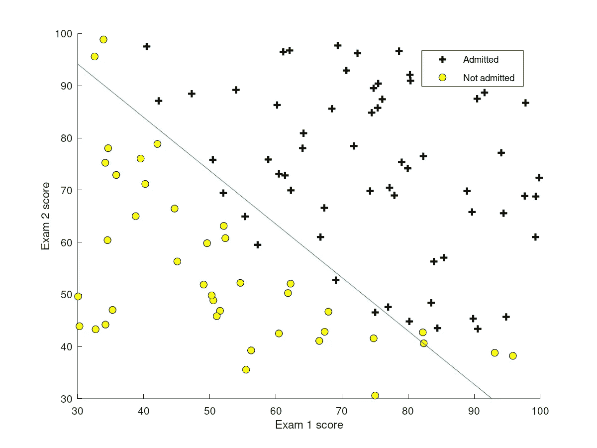
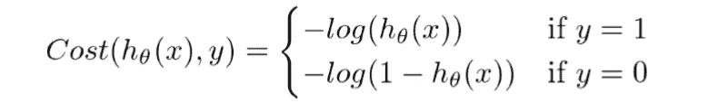
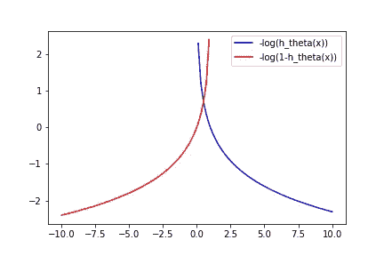
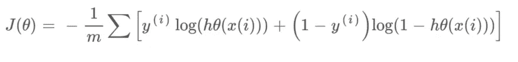

# 展开逻辑回归

> 原文：<https://medium.com/analytics-vidhya/unfolding-logistic-regression-7b2cf1db6623?source=collection_archive---------17----------------------->

读完这篇文章后，你将具备以下条件:

1.  假设函数
2.  Sigmoid 函数
3.  价值函数

不要与名称混淆，因为它表示回归，但逻辑回归是一种监督学习算法，用于执行分类任务。

为了更好地理解分类，让我们举个例子，

> 比方说，一所大学希望利用他们拥有的历史数据，根据他们的考试成绩对学生是否会被录取进行分类。这项任务可以使用逻辑回归来完成。

让我们从逻辑回归中使用的假设函数开始。

> "假设函数近似于目标函数，用于将输入映射到输出."

逻辑回归中使用的假设函数和 Sigmoid 函数如下所示:

1.假设函数和 2。Sigmoid 函数

**sigmoid 函数**的图示为，

注意:在 x=0 时，y=0.5

> " sigmoid 函数也称为逻辑函数."

> theta^T*x(theta 转置 x)作为 z 在 sigmoid 函数中传递

在哪里，

> “θ”是我们分配的随机权重,“x”是特征，在计算假设函数后，它被传递到我们的 sigmoid 函数中。

现在，让我们将**考试 1 的分数视为‘x1’**，将**考试 2 的分数视为‘x2’，**从下图中我们可以看到，我们的判定边界(蓝线)用于区分两个类别，即‘被录取’和‘未被录取’。假设函数用于定义我们的决策边界。

> 我们对于给定决策边界的假设函数可以写成“x1+x2≥93”。

判别边界

> 我们的假设函数说“如果学生在两次考试中的分数都超过 93 分，他将被大学录取。”

当我们走到一半的时候，让我们花点时间来理解这个假设和 sigmoid 函数。

逻辑回归的成本函数如下所示，它代表优化目标。

价值函数

成本函数图

上述两个函数可以压缩成一个函数，即

压缩函数

*如果你已经做到这里，拍拍你的背，因为现在你知道了最重要的机器学习算法背后的数学，如果你觉得这篇文章很有趣，请随时打招呼。*