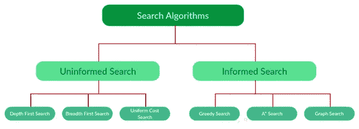
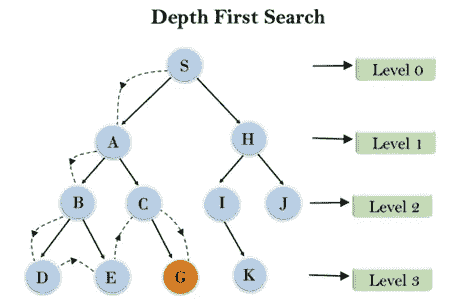
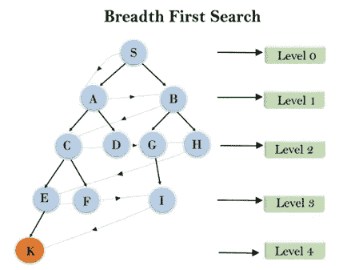
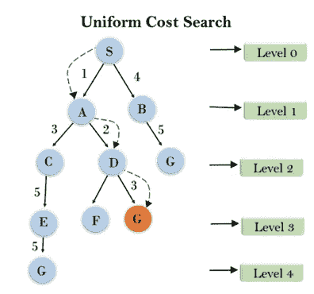

# 不知情的搜索算法

> 原文：<https://medium.com/analytics-vidhya/uninformed-search-algorithms-c87febbd0bb7?source=collection_archive---------8----------------------->

人工智能(AI)是计算机科学的一个广泛分支，涉及到构建能够执行通常需要人类智能的任务的智能机器。现在，为了解决任务，人工智能利用某些问题解决技术在短时间内给出最佳结果，换句话说，人工智能利用搜索技术或搜索算法，其中一些我们今天将讨论，我们将在这里只关注不知情的搜索算法。

**与搜索算法相关的术语**

在我们深入研究搜索算法的类型之前，我们需要了解一些基本术语。

1.搜索空间:它是用户可以拥有的所有可能解决方案的集合

2.开始空间:它是要执行的搜索的起点

3.目标测试:检查当前状态并返回目标是否已经达到的功能

4.动作:给代理所有可用动作的描述。

转换模型:对每个动作做什么的描述，可以表示为一个转换模型。

路径成本:这是一个为每条路径分配一个数字成本的函数。

解决方案:它是一个从起始节点到目标节点的动作序列。

最优解:如果一个解在所有解中成本最低。

**搜索算法类型:**

有太多的搜索算法，但在这篇文章中，我们将看看基本的搜索算法，大致分为两类:不知情和知情的搜索算法。

来源:[https://www.geeksforgeeks.org/search-algorithms-in-ai/](https://www.geeksforgeeks.org/search-algorithms-in-ai/)

请注意，这些并不是所有的搜索算法

**不知情搜索算法:**

顾名思义，除了问题陈述中提供的信息之外，用户不知道任何其他信息，目标是在最佳时间内获得最佳解决方案。它也被称为盲目搜索

1.  **深度优先搜索:**

深度优先搜索是遍历树或图数据结构的递归算法。

*   它被称为深度优先搜索，因为它从根节点开始，在移动到下一个路径之前，沿着每条路径到达其最大深度节点。
*   DFS 使用堆栈数据结构来实现。
*   DFS 算法的过程类似于 BFS 算法。
*   这是一种后进先出技术

来源:[https://www.javatpoint.com/ai-uninformed-search-algorithms](https://www.javatpoint.com/ai-uninformed-search-algorithms)

2.**广度优先搜索:**

*   广度优先搜索是遍历树或图的最常见的搜索策略。该算法在树或图中进行广度搜索，因此被称为广度优先搜索。
*   BFS 算法从树的根节点开始搜索，并在移动到下一层节点之前扩展当前层的所有后继节点。
*   广度优先搜索算法是一般图形搜索算法的一个例子。
*   利用 FIFO 队列数据结构实现广度优先搜索。

来源:https://www.javatpoint.com/ai-uninformed-search-algorithms

3.**统一成本搜索:**

UCS 不同于 BFS 和 DFS，因为在这里成本开始起作用。

穿越不同的边可能不会有相同的成本。

目标是找到一条累积成本最小的路径

来源:https://www.javatpoint.com/ai-uninformed-search-algorithms

**知情搜索算法:**

在这种类型中，求解器有一些关于目标状态的附加信息，这将有助于找到更有效的解决方案。这里我们使用了一种叫做“启发式”的东西——一个*函数*，它估计一个状态离目标状态有多近。例如——曼哈顿距离、欧几里德距离等。(距离越短，目标越近。)

信息搜索算法的一些例子是贪婪搜索、A*搜索(图形和树)等。我们将在下一篇文章中看到这些

**总结一下**

今天，我们学习了搜索算法、相关术语、算法的广泛分类，并仔细研究了无信息搜索算法，其中求解者除了问题陈述中给出的信息外，没有任何其他信息。

-Reshmi Mehta，btech integrated 第四年，MPSTME

来源:https://www.javatpoint.com/ai-uninformed-search-algorithms

[https://www.geeksforgeeks.org/search-algorithms-in-ai/](https://www.geeksforgeeks.org/search-algorithms-in-ai/)