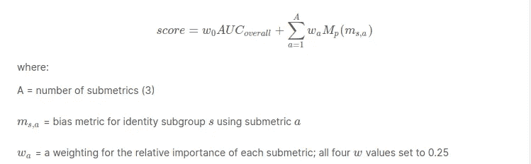
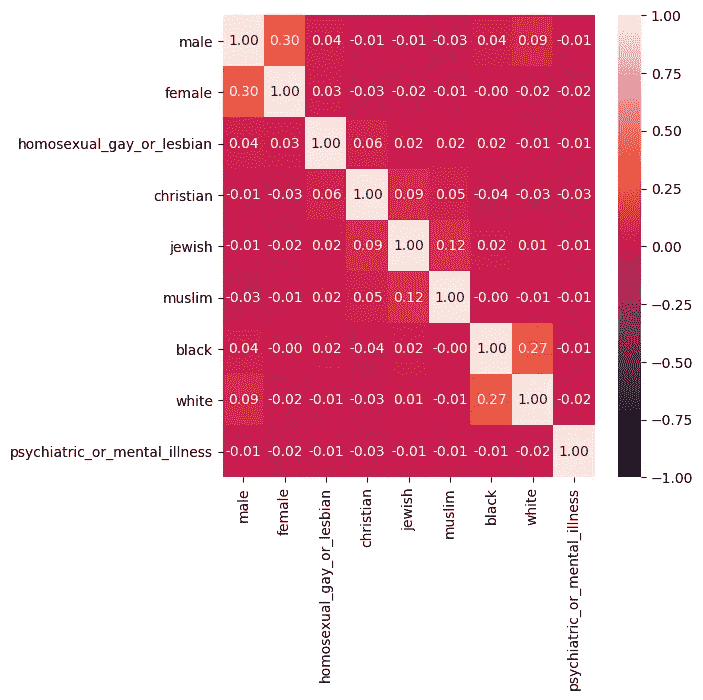

# 评论中毒性分类的意外偏差

> 原文：<https://medium.com/analytics-vidhya/unintended-bias-in-toxicity-classification-of-comments-e7af4b195120?source=collection_archive---------31----------------------->

对毒性说不。让数字平台免受毒害。

[https://www.google.com/url?sa=i&URL = https % 3A % 2F % 2 fwww . engadget . com % 2f 2017% 2f 09% 2f 01% 2f Google-perspective-comment-ranking-system % 2F&psig = aovvaw 1 OQ 6xb 60 F3 migt R2 yce xfh&ust = 1585543007808000&source = images&CD = vfe&ved = 0 caiqjj](https://www.google.com/url?sa=i&url=https%3A%2F%2Fwww.engadget.com%2F2017%2F09%2F01%2Fgoogle-perspective-comment-ranking-system%2F&psig=AOvVaw1oq6xB60F3mIGTr2yCEXFH&ust=1585543007808000&source=images&cd=vfe&ved=0CAIQjRxqFwoTCJCmt5HuvugCFQAAAAAdAAAAABAJ)

目录:

1.  介绍
2.  应用程序
3.  商业问题
4.  名字是什么？
5.  先决条件
6.  使用的度量
7.  数据概述
8.  探索性数据分析
9.  数据清理
10.  列车测试分离
11.  向量化文本
12.  机器学习模型
13.  深度学习模型
14.  结论
15.  未来的工作
16.  参考

# 1.介绍

"以这样一种方式说话，人们会像你一样感觉良好"。但是现在，人们正在滥用网络平台，这些平台本应成为世界的汇聚点。有些人正在利用这些平台来戏弄人，伤害某人的自尊心或通过写一些有毒的评论来羞辱一个人。因此，这个挑战试图通过将给定的评论分类为有毒或无毒来解决有毒评论的问题，以便我们可以从平台上删除有毒评论。

# 2.应用程序

*   删除网络平台上的攻击性评论
*   攻击性巨魔检测和消除他们
*   还有更多……

# 3.商业问题

这项挑战的一个主要关注领域是设计一个可以识别在线对话中毒性的机器学习模型，其中毒性被定义为任何*粗鲁、不尊重或其他可能使某人离开讨论的事情*。

# 4.名字是什么？

这被称为“毒性分类中的意外偏差”，因为有时个人的评论可能不是有毒的，但由于几个关键词，它似乎对机器有毒，因此被分类为有毒。示例:

“我是一个女同性恋者”是没有毒性的，但是由于“同性恋”这个词，它被归类为有毒的。

因此，为了摆脱这种意外的偏差问题，jigsaw 和 conversation AI 团队设计了一种新的度量标准，它结合了整体 AUC 和偏差 AUC 来衡量模型的性能。我们的座右铭是设计这样一个模型，它可以最小化这种类型的非预期偏差。

# 5.使用的概念

*   Numpy
*   熊猫
*   美国有线新闻网；卷积神经网络
*   LSTM
*   伯特
*   注意力模型
*   克拉斯

# 6.使用的度量

*   **整体 AUC**
*   **亚组 AUC**
*   **背景阳性亚群阴性** (BPSN):有同一性且无毒+无同一性且有毒。它描述了(有特性和无毒，无特性和有毒)之间的混淆
*   **背景阴性亚群阳性** (BNSP):有身份且有毒+无身份且无毒。它描述了(有特性和有毒，无特性和无毒)之间的混淆
*   **偏倚的广义平均值 AUC**
*   **Bias_auc_score** =

[https://www . ka ggle . com/c/jigsaw-unintended-bias-in-toxicity-class ification/overview/evaluation](https://www.kaggle.com/c/jigsaw-unintended-bias-in-toxicity-classification/overview/evaluation)

*   **最终指标**

我们将总体 AUC 与偏倚 AUC 的广义平均值结合起来计算最终模型得分:

[https://www . ka ggle . com/c/jigsaw-unintended-bias-in-toxicity-class ification/overview/evaluation](https://www.kaggle.com/c/jigsaw-unintended-bias-in-toxicity-classification/overview/evaluation)

# 7.数据概述

来源:[https://www . ka ggle . com/c/jigsaw-unintended-bias-in-toxicity-class ification/data](https://www.kaggle.com/c/jigsaw-unintended-bias-in-toxicity-classification/data)

在提供的数据中，单个注释的文本位于 comment_text 列中。训练中的每个注释都有一个毒性标签(目标)，模型应该预测测试数据的目标毒性。该属性(以及所有其他属性)是分数值，表示认为该属性适用于给定评论的人类评分者的分数。对于评估，目标> = 0.5 的测试集示例将被视为阳性类别(有毒)。

该数据还有几个附加的毒性子类型属性。模型不需要为竞争预测这些属性，它们作为一个额外的研究途径被包括在内。子类型属性包括:

*   严重毒性
*   猥亵的
*   威胁
*   侮辱
*   身份 _ 攻击
*   性 _ 露骨

此外，评论的一个子集已经被标注了各种身份属性，代表评论中*提到的*身份。下面列出了与身份属性对应的列..需要进行评估的身份以粗体显示。

*   **男**
*   **女**
*   变性人
*   其他 _ 性别
*   异性恋的
*   同性恋者
*   两性的
*   其他性取向
*   **基督教**
*   **犹太人**
*   **穆斯林**
*   印度人
*   佛教的
*   无神论者
*   其他 _ 宗教
*   **黑色**
*   **白色**
*   亚洲的
*   拉丁美洲人
*   其他种族或民族
*   身体残疾
*   智力或学习障碍
*   **精神疾病**
*   其他 _ 残疾

请注意，数据包含不同的注释，这些注释可能具有完全相同的文本。具有相同文本的不同注释可能被标注了不同的目标或子组。

**例题**

以下是一些注释及其相关毒性和身份标签的示例。标签值范围为 0.0–1.0，代表认为标签符合评论的评分者比例。

评论:*我是一个 60 多岁的白人妇女，相信我，他们也不太喜欢我！！*

*   毒性标签:均为 0.0
*   身份提及标签:女性:1.0，白人:1.0(所有其他 0.0)

评论:*为什么你会认为这个故事中的护士是女性？*

*   毒性标签:均为 0.0
*   身份提及标签:女性:0.8(所有其他 0.0

评论:*继续站强 LGBT 群体。是的，的确，你会克服的，你已经克服了。*

*   毒性标签:均为 0.0
*   身份提及标签:同性恋 _ 男同性恋 _ 或女同性恋:0.8，双性恋:0.6，跨性别者:0.3(所有其他 0.0)

# 8.探索性数据分析

## a)目标分布

无二值化的目标分布

二值化后的目标分布

>二值化之前:

*   大约 70%的数据的目标值为< 0.1 i.e non-toxic
*   But there are 30 % of data having target value > 0.1
*   在所有 10 个容器中，最值得注意的是 0.1 到 0.5，因为注释者似乎对这些评论是否有毒感到困惑，因此我们的模型也可能对这些评论感到困惑。

>二值化后:

*   这是一个高度不平衡的数据集，只有 8%的有害数据

## b)评论长度

注释文本长度:字符和单词级别

*   大多数评论的字符长度为 1000。这可能是由于我们在清理评论时删除了一些特殊字符或停用词。
*   清理完评论文字后，评论文字的最大字数在 130 左右。这是一个合理的长度。

## c)毒性注释者的数量与注释长度

毒性注释者 Vs 评论长度:字符级和单词级

*   正如我们在单词级和字符级看到的，随着长度的增加，注释者的数量会减少。

## d)身份分布

身份分布

# 9.数据清理

a)收缩解除

b)停用词移除

**c)词干化**:词干化是产生词根/基本词的形态变体的过程。词干程序通常被称为词干算法或词干分析器。词干算法将单词“chocolate”、“chocolatey”、“choco”简化为词根，“chocolate”和“retrieve”，“retrieved”，“retrieved”简化为词干“retrieve”。

**d)词汇化**:词汇化是将一个单词的不同屈折形式组合在一起的过程，这样它们就可以作为一个单独的项目进行分析。词汇化类似于词干化，但它给单词带来了上下文。所以它把意思相近的单词链接成一个单词。

# 10.训练测试分割(80-20 分割)

使用分层抽样来避免分裂数据时的偏差。并且检查测试数据与训练数据相比是否具有大约相同比例的毒性评论。

# 11.向量化文本

*   一袋单词
*   TF-IDF

注意:具有 15k 特征的 1 克 TF-IDF 矢量化比其他矢量化和尺寸给出了更好的结果

# 12.机器学习模型

**a)朴素贝叶斯**

让我们从简单的模型开始，它易于训练，可以作为实现其他复杂模型的基线模型。所以让我们从朴素贝叶斯开始。

*第一步:*超参数调整:

*第二步:*

*步骤 3:* 最佳超参数训练:

*步骤 4:* 最佳超参数的 AUC 曲线:

*第五步:*验证数据的混淆矩阵:

对于以下所有型号，可采用与上述类似的方法:

**b)逻辑回归**(有“对数”损失的新币)

**c) SVM** (带“铰链”损失的 SGD)

XG-Boost

**e)随机森林分类器**

**f)堆垛分级机**

# 13.深度学习模型

**a)数据准备**

单词嵌入的帮助功能

*步骤 1:* 权重初始化:

*   通过下面的代码，我试图灌输一些关于问题中给出的身份的信息。这些身份也用于定义指标，因此，我想这可能有助于我们提高指标值。

*第二步:*单词本地化:

*   `fit_on_texts` *根据文本列表更新内部词汇。*此方法基于词频创建词汇索引。所以如果你给它这样的话，“猫坐在垫子上。”它将创建一个字典 s.t. `word_index["the"] = 1; word_index["cat"] = 2`它是单词- >索引字典，所以每个单词都有一个唯一的整数值。0 保留用于填充。所以较小的整数意味着更频繁的单词(通常前几个是停用词，因为它们出现得很多)。
*   `texts_to_sequences` *将文本中的每个文本转换为一个整数序列。*所以它基本上获取文本中的每个单词，并用来自`word_index`字典的相应整数值替换它。不多不少，当然不涉及魔法。
*   *为什么不把它们结合起来？*因为你几乎总是一次*，多次*转换成序列*。您只需在训练语料库上安装一次，并在训练/评估/测试/预测时使用完全相同的`word_index`字典，将实际文本转换成序列，然后将它们提供给网络。所以将这些方法分开是有意义的。([参考链接](https://stackoverflow.com/questions/51956000/what-does-keras-tokenizer-method-exactly-do))*

**第三步:*单词嵌入:*

*   *我用的单词嵌入是 *crawl-300d-2M.gensim* 和*glove . 840 b . 300d . gensim .*最后的嵌入矩阵是两个嵌入向量的平均值。*

***b)简单的 CNN***

**第一步:**

****

**第二步:*模型编译*

**第三步:*模型拟合*

**第四步:*模型预测*

***c)单层 LSTM***

**第一步:**

****

**第二步:*模型编译*

**第三步:*模型拟合*

**第四步:*模型预测*

***d)双向 LSTM***

**第一步:**

**

*模型架构的功能*

**

**第二步:*训练*

**

*模特培训*

**第三步:*预测*

***e)注意双向 LSTM***

*注意层的代码可以在这里找到[。](https://www.kaggle.com/takuok/bidirectional-lstm-and-attention-lb-0-043)*

****

*   ***使用 BERT 进行迁移学习***

**伯特是什么？**

*   ***BERT** 代表**B**I 方向**E**n 编码器 **R** 代表 **T** 变压器。它基本上是一堆堆叠在一起的变压器编码器(不是整个**变压器**架构，而只是编码器)。BERT 是双向的，因为它的自我注意层在两个方向上执行自我注意。让我们看一个例子。*
*   *假设我们的输入句子是“我喜欢在 NLP 上工作”。在**中，BERT** 中的‘爱’记号将会和*中的每一个其它记号有自我关注。**

**

*[http://mccormickml . com/2019/11/11/Bert-research-EP-1-key-concepts-and-sources/](http://mccormickml.com/2019/11/11/bert-research-ep-1-key-concepts-and-sources/)*

*什么是迁移学习和微调？*

*   *迁移学习可以看作是教师和学生之间的关系。老师有他随着时间的推移获得的知识，当学生去找他时，他试图转移他所有的知识，学生利用这些知识进行一些调整，并将这些知识用于他在生活中面临的情况。这个知识转移部分是*转移学习*，微调部分是*微调*。如果你想深入了解伯特和伯特微调的代码和技术细节，你可以看看这个[视频系列](https://www.youtube.com/watch?v=FKlPCK1uFrc&list=PLam9sigHPGwOBuH4_4fr-XvDbe5uneaf6)。*

*什么是伯特大和伯特小？*

*   **BERT base* 有:L=12，H=768，A=12 其中 L 是堆叠编码器的数量，H 是隐藏尺寸，A 是多头关注层中的头数。 *BERT large* 基本上更大，计算更密集:L=24，H=1024，A=16。*

*帮助功能:*

*   *因为 BERT 是预训练的模型，因此它有一些为输入格式定义的规则集。该功能用于将输入塑造成 BERT 期望的格式。*

**

*[https://mccormickml.com/2019/07/22/BERT-fine-tuning/](https://mccormickml.com/2019/07/22/BERT-fine-tuning/)*

**

*[https://mccormickml.com/2019/07/22/BERT-fine-tuning/](https://mccormickml.com/2019/07/22/BERT-fine-tuning/)*

**步骤 1:* 定义帮助函数，将数据转换为 BERT 所需的格式。*

**第二步:*用伯特大号预测:*

**第二步:*用 BERT Small 预测:*

**第三步:*最终 BERT 预测:*

# *最佳预测模型*

*   *迁移学习与双向 LSTM 的结合*

# *分数摘要*

*机器学习模型*

**

*深度学习模型*

****

*Kaggle 提交*

# *结论*

*   *我们从伯特·斯莫尔、伯特·拉奇和 LSTM 的组合中得到了最好的结果。*
*   *重量初始化在 LSTM 模型中也帮助了我们，因为我们能够灌输一些关于身份的信息。*
*   *我们在 LSTM 模型中使用加权平均进行预测*
*   *我们对伯特和 LSTM 预测都使用 pct 排序，并分别给予 LSTM 和伯特预测值 30%和 70%的权重。这种方法有试验的余地。*
*   *我们必须注意到，我们在简单的 CNN 上仅仅 5 个时代就获得了不错的分数。因此，这方面可能还有改进的余地。*

# *未来的工作*

*   *我们必须注意到，我们在简单的 CNN 上仅仅 5 个时代就获得了不错的分数。因此，这方面可能还有改进的余地。*

# *参考*

*   *[https://www . Theseus . fi/bitstream/handle/10024/226938/Quan _ do . PD](https://www.theseus.fi/bitstream/handle/10024/226938/Quan_Do.pdf)*
*   *[https://www.kaggle.com/dborkan/benchmark-kernel](https://www.kaggle.com/dborkan/benchmark-kernel)*
*   *[https://web . Stanford . edu/class/archive/cs/cs 224n/cs 224n . 1184/reports/6837517 . pdf](https://web.stanford.edu/class/archive/cs/cs224n/cs224n.1184/reports/6837517.pdf)*
*   *[https://www . ka ggle . com/pri thvi 1029/unprocessed-comments-worked-well](https://www.kaggle.com/prithvi1029/unprocessed-comments-worked-well)*
*   *[https://mccormickml.com/2019/07/22/BERT-fine-tuning/](https://mccormickml.com/2019/07/22/BERT-fine-tuning/)*
*   *[http://jalammar.github.io/illustrated-transformer/](http://jalammar.github.io/illustrated-transformer/)*
*   *[https://www.appliedaicourse.com/](https://www.appliedaicourse.com/)*

*代码可以在 [*github*](https://github.com/parimal2227/parimal2227-Case_Study_ML_-_DL/tree/master/jigsaw-unintended-bias-toxicity-classification) 找到*

*领英:[https://www.linkedin.com/in/parimal-roy/](https://www.linkedin.com/in/parimal-roy/)*

*github:[https://github.com/parimal2227](https://github.com/parimal2227)*

*https://www.kaggle.com/parimal2227*