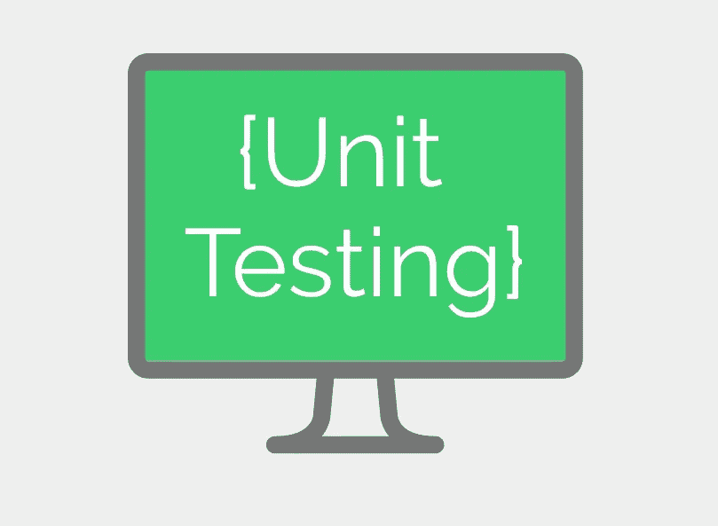

# 理解 Python 中的单元测试第一部分

> 原文：<https://medium.com/analytics-vidhya/unit-testing-in-python-for-beginners-8de286eb5c31?source=collection_archive---------25----------------------->



正在学习干净漂亮地编写代码的业余程序员，需要理解在部署功能之前对其进行单元测试的重要性。

如果你是编程新手，刚刚开始，那么很明显你会问，单元测试到底是什么？总的来说，测试很简单，就是一些确保你的程序按预期方式运行的代码。测试在开发的不同阶段进行。通常第一阶段是单元测试，我们会在这篇文章中用一些例子来研究它。

顾名思义，单元测试是我们测试程序中基本组件工作情况的地方。假设我们有一个文件 myProgramfile.py，它有一个如下定义的函数

```
def addNumbers(A,B):
    return A+B
```

你可以用任意几个数字来测试它，确保它对任意一组数字都有效。但是考虑一个函数，它可以基于这样的参数做不同的事情

```
def operateNumbers(A,B,Select):
    if (Select == "Add"):
        return A+B
    elif (Select == "Subtract"):
        return A-B
    elif (Select == "Multiply"):
        return A*B
    elif (Select == "Divide"):
        return A/B
```

因此，在这种情况下，基于 Select 参数，输出是不同的，您将不得不多次运行程序，以手动检查输出是否正确，老实说，这是一个真正的麻烦。

让我们先试试“屁股痛”的版本。为了测试操作功能，我必须这样做

```
result = operateNumbers(10,-2000,"Add")
print("Result: "result)
```

运行脚本。转到输出，验证它是否显示

```
Result: -1990
```

然后再做一遍减法、乘法和除法。想象一下，用 1000 行程序和复杂得多的函数来做这件事。伙计，太累了。但是不用担心，python 的单元测试模块让它变得轻而易举。

让我们试试用单元测试的方法。operateNumbers 的单元测试看起来就像这样简单

```
import unittest
from myProgramFile import operateNumbersclass testMyProgram(unittest.TestCase):
   def test_operateNumbers(self):
        self.assertEqual(operateNumbers(10,20,"Add"),30)
        self.assertEqual(operateNumbers(10,20,"Subtract"),-10)
        self.assertEqual(operateNumbers(10,20,"Multiply"),200)
        self.assertEqual(operateNumbers(10,20,"Divide"),0.5)
if __name__ == '__main__':
    unittest.main()
```

您所要做的就是为单元测试创建一个类，用正确的语法定义一个测试函数，并使用 assertEqual 方法检查您是否得到了想要的值。Python 的单元测试有更多的 assert 方法，如 assertTrue、assertFalse、assertIsNone 等，但它们都很简单，所以你真的应该查看一下[文档](https://docs.python.org/3/library/unittest.html#unittest.TestCase)。

运行脚本，您会看到类似这样的内容

```
.
--------------------------------------------------------------------
Ran 1 test in 0.017sOK
```

这意味着您的单元(这里是 out operateNumbers()函数)测试成功。假设我继续编写程序，在 myProgramFile.py 中添加了 2 个函数，在 unitTest.py 中添加了 2 个测试函数，由于一些错误，我将第一个函数的条件逻辑改为

```
def operateNumbers(A,B,Select):
    if (Select == "Subtract"): #notice i have changed add to sub
        return A+B
    elif (Select == "Add"): #and sub to add
        return A-B
    elif (Select == "Multiply"):
        return A*B
    elif (Select == "Divide"):
        return A/B#the 2 other functions I wrote
```

现在，我没有意识到我做了这个改变，所以没有预先写好的测试，我不会再次检查操作员的工作。但是，我们已经编写了测试代码！所以现在当我运行 unitTest.py 时。

```
.F.====================================================================FAIL: test_operateNumbers (__main__.testMyProgram)--------------------------------------------------------------------Traceback (most recent call last):File "myProgramUnitTest.py", line 5, in test_operateNumbersself.assertEqual(operateNumbers(10,20,"Add"),30)AssertionError: -10 != 30-------------------------------------------------------------------Ran 3 tests in 0.001sFAILED (failures=1)
```

还有维奥拉。我们就这样发现了我们意想不到的错误及其位置。

当你开始学习编程时，你最好学习测试你的代码。它不仅能节省你大量的时间，还能让你的程序更简洁，更容易调试，更容易协作。