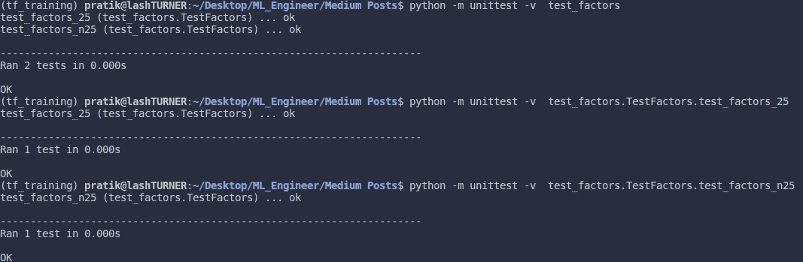

# 面向初学者的 Python 单元测试

> 原文：<https://medium.com/analytics-vidhya/unit-testing-with-python-101-e3eb0e7c1170?source=collection_archive---------28----------------------->

戴维·特拉维斯在 [Unsplash](https://unsplash.com/@dtravisphd?utm_source=unsplash&utm_medium=referral&utm_content=creditCopyText) 上拍摄的照片

在大多数组织中，数据科学团队和软件工程团队之间争论的一个经常性来源是围绕在将代码投入生产之前对其进行适当的测试，因为出于某种原因，大多数数据科学家在从数据中获得洞察力时往往会忽略测试。

毫无疑问，问题是真实的。未经测试的代码可能会加载错误、错误的编码、偏见等。这反过来会导致一系列后果，如结果的高度可变性、生产环境中的崩溃等等。因此，建议每个人都进行适当的测试来简化工作流程。

照片由[马库斯·斯皮斯克](https://unsplash.com/@markusspiske?utm_source=medium&utm_medium=referral)在 [Unsplash](https://unsplash.com?utm_source=medium&utm_medium=referral) 拍摄

在软件开发生命周期中，有一个很长的测试技术类型列表，每种技术都用于一个特定的阶段。然而，我将从最基本的类型开始，即单元测试。

单元测试是为代码中提供某些功能(称为单元)的独立部分设计的测试，例如，代码中的一个功能。

# Python 中的测试工具

Pytest: 一个功能全面、易于使用的测试工具，具有不需要样板代码的策略、出色的可读性，等等。很明显，开始的最佳选择。

> **安装:** pip 安装-U pytest

***用法举例:***

考虑一个函数，它在名为 factors.py 的文件中返回给定数字的因子列表:

因子. py

现在，我们将在名为 **test_factors.py** 的文件中编写一些测试，该文件与名为 **factors.py** 的单元代码文件位于同一目录下，以找到一个缺陷:

test _ factors.py

**断言**语句只是检查条件&如果为假则抛出**断言错误**。我使用了 **set ()** 函数，因为 set 是一个无序的数据结构，所以 factors 列表中元素的顺序不会使测试失败。

> **注意:** pytest 的默认配置是以“test_”开始命名测试文件，并且，该文件中的所有测试函数都应该以“test_”开始命名，如上图所示。

我们完事了。

要运行测试，在包含单元代码文件和测试脚本的目录中，在命令行中键入 **pytest o** 。

结果

> 这里你会注意到一行:**。F**
> 
> test_factors.py 后面的每个**点**表示测试成功&**F**表示测试失败，详细信息如下。在我们的例子中，第二个测试失败了，因为代码被设计成只输出正整数的因子，而我们的第二个测试输入是一个负整数(参见 test_factors.py)。

更新代码(factors.py)以处理负数后:

更新因子. py

在使用 **pytest** 命令运行测试时:宾果！

测试通过

**Unittest:**python 中现成的测试库，与 JUnit 等其他语言中的测试框架有相似之处。一些可用的关键特性，比如测试自动化，可以执行独立的测试，等等。

> **安装:**因为是 python 中的标准库，所以不需要显式安装。

***用法举例:***

用单元测试更新了测试因子

对于使用 unittest 库的测试，应该使用这个标准样板代码。这里，测试被定义为测试模块的方法，assertEqual()类似于之前 pytest 中使用的 assert()函数。

单元测试结果

> 要一次运行所有测试，请使用以下命令格式:
> 
> **python-m unittest-v test _ script**

这里的 **-v** 标签用于详细说明，即提供测试运行的细节。

> 若要运行单独的测试，请使用以下命令:
> 
> **python-m unittest-v test _ script . test _ class . test _ method**

所以，这个帖子到此为止。在我即将发布的帖子中，我会涉及一些其他的测试主题。敬请关注。