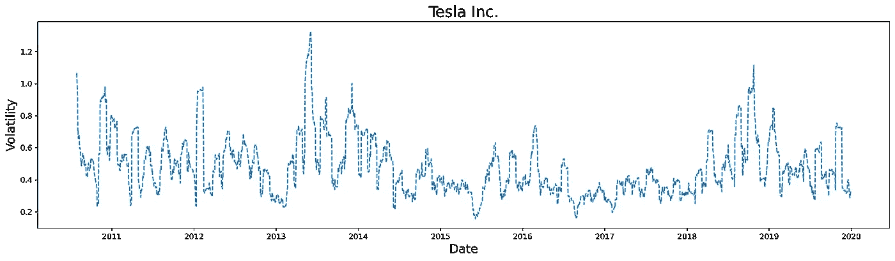
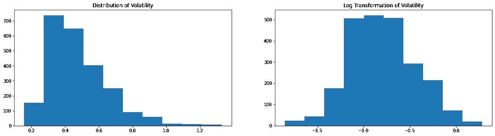
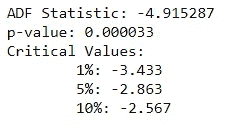
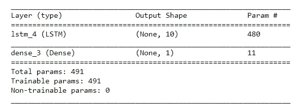
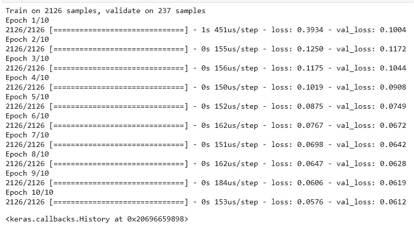
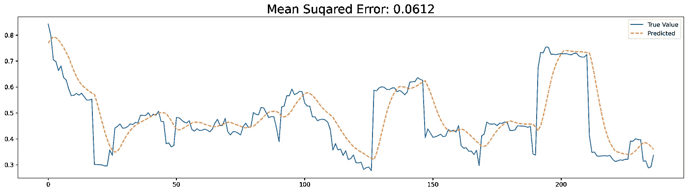

# 基于深度学习的股票数据波动性的单变量预测

> 原文：<https://medium.com/analytics-vidhya/univariate-forecasting-for-the-volatility-of-the-stock-data-using-deep-learning-6c8a4df7edf9?source=collection_archive---------7----------------------->

昨天，我们看到了如何使用基本的回归方法预测特斯拉公司股票的波动性。([链接](https://ramji-b.medium.com/predicting-the-volatility-of-stock-data-56f8938ab99d))。在本文中，将进一步了解如何使用深度学习模型(LSTM)方法作为时间序列方法来预测一段时间内的波动率。



一段时间内的波动性

# 时间数列预测法

时间序列预测是一种使用以前的值来预测未来的方法，而在昨天回归方法中，模型不会使用任何以前的波动值来预测目标变量。是不是很混乱？将基于一个简单的例子来尝试理解。假设你有一段时间内特斯拉股票波动的数据，并且只使用特定一天的起始和终止价格来预测波动，那么这被称为回归方法。其中在时间序列分析中，使用前 n 天的波动值来预测特定一天的波动。

# 数据准备

时间序列预测的首要步骤是准备数据。开始之前，我们必须问几个关于数据的问题。

*   深度学习模型需要一个标准的输入大小，所以你要预测未来多少天的波动？它可以持续 5 天，10 天或任何时间。这将决定您的输入要素大小。
*   你的数据稳定吗？—使用[增强的迪基-富勒测试](https://machinelearningmastery.com/time-series-data-stationary-python/)
*   数据是否有偏差？-如果它是倾斜的，您可以对您的数据应用对数变换

```
import pandas as pd
import numpy as np
import matplotlib.pyplot as plt
import seaborn as sns
window_size=20
#first download data from yahoo
import yfinance as yf
from yahoofinancials import YahooFinancials
df = yf.download(‘TSLA’, start=’2000–01–01', end=’2019–12–31', progress=False)
#compute daily returns and 20 day moving historical volatility
df[‘returns’]=df[‘Close’].pct_change()
df[‘volatility’]=df[‘returns’].rolling(window_size).std()*(252**0.5)
X = df['volatility'].values
plt.figure(figsize=(20,5))
plt.subplot(121)
plt.hist(X)
plt.title('Distribution of Volatility')
plt.subplot(122)
plt.hist(np.log(X))
plt.title('Log Transformation of Volatility')
plt.show()
```



波动性

> 稳定性检查

```
from statsmodels.tsa.stattools import adfuller
result = adfuller(X)
print(‘ADF Statistic: %f’ % result[0])
print(‘p-value: %f’ % result[1])
print(‘Critical Values:’)
for key, value in result[4].items():
 print(‘\t%s: %.3f’ % (key, value))ADF Statistic: -4.915287
p-value: 0.000033
Critical Values:
	1%: -3.433
	5%: -2.863
	10%: -2.567
```



稳定性结果

由于 p 值小于 5%，数据是稳定的，意味着波动性不依赖于趋势/时间。

> 输入特征

在这里，我们将使用过去 10 天的数据来预测波动率。所以我们的输入特征将是(N，10)。

```
def convert2matrix(data_arr, look_back):
 X, Y =[], []
 for i in range(len(data_arr)-look_back):
  d=i+look_back 
  X.append(data_arr[i:d])
  Y.append(data_arr[d])
 return np.array(X), np.array(Y)x, y = convert2matrix(X,10)
print(x.shape,y.shape)
```

# 培训阶段

我使用 LSTM 模型来训练模型，因为 [LSTM](https://www.analyticsvidhya.com/blog/2017/12/fundamentals-of-deep-learning-introduction-to-lstm/) 有能力在更长的时间内记住输入特征之间的相互关系。

```
from sklearn.model_selection import train_test_split
X,x_valid,y,y_valid = train_test_split(x,y,test_size=0.1,shuffle=False)X = np.expand_dims(X,2)
x_valid = np.expand_dims(x_valid,2)
print(X.shape,y.shape,x_valid.shape,y_valid.shape)
```

> (2126,10,1),(2126),(237,10,1),(237)

```
from keras.models import Sequential
from keras.layers import Dense, LSTM
from keras.optimizers import Adammodel = Sequential()
model.add(LSTM(10, input_shape=(X.shape[1],1)))
model.add(Dense(1))
model.summary()
```



```
model.compile(loss=’mae’, optimizer=Adam(0.001))
model.fit(X, y, epochs=10, batch_size=32, validation_data=(x_valid, y_valid), verbose=1, shuffle=False)
```



```
from sklearn.metrics import mean_absolute_error
pred = model.predict(x_valid)plt.figure(figsize=(20,5),dpi=300)
plt.plot(y_valid,label=’True Value’)
plt.plot(pred,linestyle=’ — ‘, label = ‘Predicted’)
plt.legend()
plt.show()
```



哦耶！！LSTM 比回归模型更适合这个数据。这个模型能够捕捉趋势。微调模型会得到更好的结果。

可能增加更多的特征也会提高预测的准确性。明天将尝试将相同的数据转换为多元数据，看看会发生什么。迫不及待地想看到不同之处。

觉得这个有用就鼓掌分享:-)