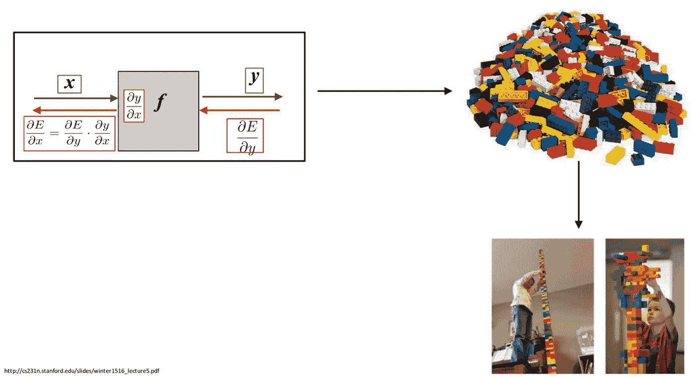

# 通用逼近定理、神经网络和乐高积木

> 原文：<https://medium.com/analytics-vidhya/universal-approximation-theorem-neural-nets-lego-blocks-1f5a7d93542a?source=collection_archive---------16----------------------->

来源:斯坦福大学 Andrej Karpathy 的 CS231N 卷积神经网络

今天，基于多层神经网络的深度学习已经在大多数领域取得了最先进的成果。在这篇文章中，我们将看看通用逼近定理——深度学习的整个概念所基于的基本定理之一。我们将利用乐高积木类比和插图来理解同样的道理。

# 通用近似定理(Cybenko 1989)指出:

> “神经网络具有很好的函数表示能力，具有一个隐含层和有限个神经元的前馈神经网络可以表示任何连续函数”

为了让它有意义，让我们把这个定理分成几个部分——

👉函数的表示能力

👉前馈神经网络

👉具有有限数量神经元的隐藏层

👉代表任何连续函数

# 为什么机器学习中我们更喜欢连续函数？

*   函数定义了一组输入和相应输出之间的关系。函数在本质上可以是连续的，也可以是离散的。
*   函数广泛应用于机器学习概念中，如损失函数。事实上，整个机器学习模型可以被认为是一个接受输入并提供输出的函数。
*   我们在 ML 中的目标是最小化损失函数，我们通过采用梯度来实现，即损失函数相对于输入参数(如权重和偏差)的一阶导数。
*   因此，可微性在机器学习中是一个重要的考虑因素，我们总是更喜欢连续函数，主要是因为它们在所有点上可微的属性。
*   因为我们计算梯度，这是一个一阶导数，以尽量减少损失函数，我们总是喜欢连续函数。

现在让我们向前迈进一步，理解为什么我们真的需要复杂的函数，为什么我们需要类似神经网络的东西来近似相同的函数。

# 为什么我们需要复杂的函数？

*   我们在现实生活中有几种类型的关系，即线性函数、二次函数、非线性函数等。
*   ***线性函数:*** 模拟线性关系的函数，例如，所用的燃料量与行驶的距离成线性关系。
*   ***二次函数:*** 模拟二次关系的函数，例如，高尔夫球在击球过程中的轨迹呈现二次关系。
*   ***非线性函数:*** 让我们看几个非线性关系的例子。例如，提供给患者的药物可能直到阈值水平才显示出期望的结果；来自 GPS 卫星的信号的三角测量本质上是非线性的。
*   因此，为了模拟这种复杂的关系，简单的线性或二次函数可能不是最合适的。
*   因此，我们必须要求复杂的函数来模拟复杂的非线性关系。

这就是需要近似任何复杂函数和模型非线性的地方。现在，让我们看看神经网络是如何帮助解决这个问题的。

# 神经网络是如何学习的？

在传统的编程场景中，输入和指导规则被编程，产生输出。

在机器学习中，我们将输入和期望的输出输入到机器学习模型中，然后机器学习模型“学习”函数并提供规则集(也称为函数或模型)。

上述流程图中的计算部分由机器学习模型或深度神经网络实现。顾名思义，神经网络是一个神经元网络，堆叠在多个层中，即接受输入的输入层、进行特征工程的隐藏层和提供目标值的输出层。

来源:ResearchGate

每一个神经元单位都有以下属性—

⚡️一阵起哄

⚡️有一个与之相关的重量

⚡️有一个与之相关联的偏置单位

⚡️和一个决定神经元是否会放电的激活函数

⚡ ️output

在神经网络训练阶段，权重和偏差值将应用于输入，然后基于所使用的激活函数，最终输出将由神经元提供。

例如，让我们考虑下面的表示——这里 *x1，x2…xn* 是输入，其中 *w1，w2…wn* 是它们相应的权重； *b* 是偏置单位,‘f’是激活函数。这个神经单元的最终输出将由函数***f(σXi Wi+b)***给出。

如果‘f’是一个 sigmoid 函数，那么输出的范围将从 0 到 1；类似地，对于一个双曲正切函数，输出范围从-1 到 1。现在，我们已经了解了神经网络的基本结构，让我们继续前进，并了解这种结构如何使用一个称为“函数的*表示能力*的概念来帮助建模复杂的关系。

# 神经网络如何模拟复杂关系—函数的表示能力:

*   根据通用逼近定理，神经元网络可以逼近和模拟任何复杂的连续函数。
*   这是通过调整与每个神经元单元及其线性/非线性激活函数相关的权重和偏置参数的值来实现的。

让我们用我三岁的孩子用过的积木来打个比方，以便更好地理解它。孩子们是最好的建筑师，他们可以用同一套积木搭建出不同外观的建筑。

使用同一套积木，数字和车辆和动物可以形成(建筑)。这类似于神经网络完成的函数逼近。

输入、隐藏和输出层中的权重和偏差以及激活函数充当神经网络的基本构件。通过调整和使用这些积木的不同组合，我们能够逼近任何复杂的函数。

让我们以下面输出层中所示的曲线函数为例——这个函数可以用两个线性神经元(wx+b)和一个线性激活函数来近似。

来源:Udacity 上的深度学习课程介绍

在神经网络层中，

> 正权重→以正关系表达输入
> 
> 负权重→以负关系表达输入
> 
> 零权重→抑制输入
> 
> 激活功能→在输出中引入非线性

因此，权重在执行“特征工程”中起着重要作用，从原始输入中创建数百万个参数，然后通过最小化总网络损耗对参数进行加权和去加权。

> 神经网络的层次性最适合学习知识的层次来解决现实世界的问题。

让我们再看几幅插图，以便更清楚地理解这一点。

来源:CS7015 深度学习 NPTEL 课程

为了实现看起来像一座塔的最终输出函数，我们可以将两个图(来自 sigmoid 激活函数的输出)组合起来，然后在隐藏层调整权重。让我们取隐藏层中的权重+1 和-1，我们可以看到神经网络正确地预测了输出函数。

来源:CS7015 深度学习 NPTEL 课程

在这个学习过程中最有趣的事情是，我们不需要手动改变权重来获得所需的输出，而是在[反向传播](https://en.wikipedia.org/wiki/Backpropagation)期间，根据一种称为“梯度下降”的损失优化算法自动计算和更新权重和偏差值。

# 关键要点:

👉通用逼近定理:神经网络具有很好的函数表示能力，具有一个隐层和有限个神经元的前馈神经网络可以表示任何连续函数。

👉神经网络的层次性最适合学习知识的层次来解决现实世界的问题。

👉正权重→以正关系表达输入；负权重→以负关系表示输入；零权重→抑制输入；激活功能→在输出中引入非线性

👉神经网络中的神经元类似于乐高积木——同一组乐高积木每次都可以通过略微调整设计来构建不同的结构。

# 参考资料:

1.  [*http://neuralnetworksanddeeplearning.com/*](http://neuralnetworksanddeeplearning.com/)
2.  *[https://www.youtube.com/watch?v=aPfkYu_qiF4&list = plyqspqzte 6m 9 gcgajvqbc 68 hk _ JKGBAYT&ab _ channel = NPTEL-NOCIITM](https://www.youtube.com/watch?v=aPfkYu_qiF4&list=PLyqSpQzTE6M9gCgajvQbc68Hk_JKGBAYT&ab_channel=NPTEL-NOCIITM)*
3.  *[*https://www.youtube.com/watch?v=BR9h47Jtqyw&ab _ channel = LuisSerrano*](https://www.youtube.com/watch?v=BR9h47Jtqyw&ab_channel=LuisSerrano)*
4.  *斯坦福大学 Andrej Karpathy 的 CS231N 卷积神经网络*
5.  *Udacity 上的深度学习课程介绍*