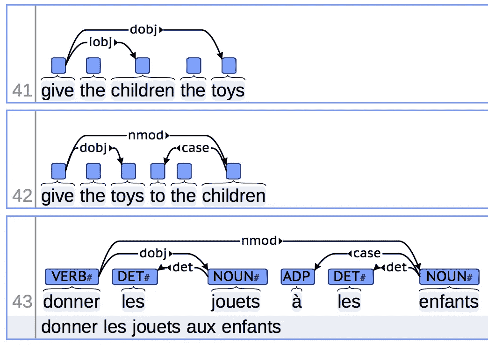
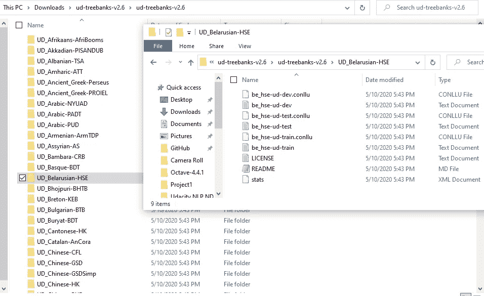
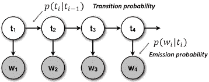
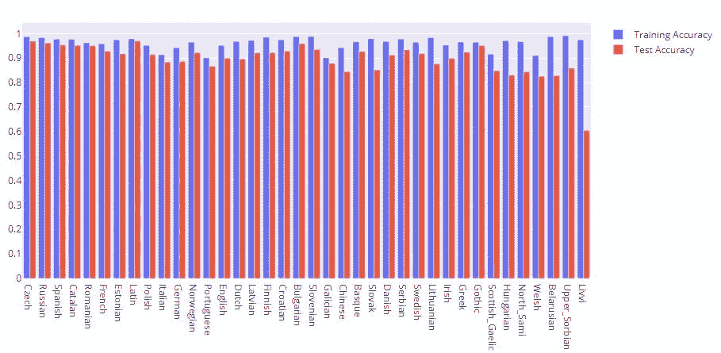
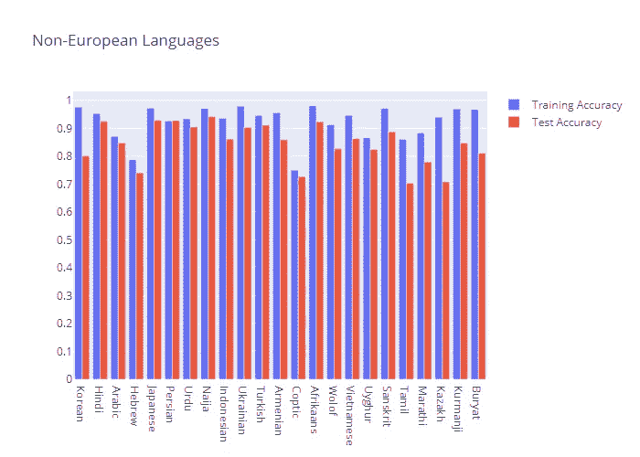

# 普遍依赖:一个隐藏的(马尔可夫)探索！

> 原文：<https://medium.com/analytics-vidhya/universal-dependencies-a-hidden-markov-quest-drem-yol-lok-2ca930ffc94f?source=collection_archive---------17----------------------->

对瘾君子来说:这个标题是让你读这篇文章的诱饵。但是在你说 *Gjok Hi* 走之前，请给我一个掌声！:(

甚至一个蹒跚学步的孩子也会高兴地说 NLP(自然语言处理)今天是个大日子。拥有大量数据的语言正在取得惊人的进步。但与此同时，有许多低资源语言尽管拥有大量的使用者，却没有得到足够的重视。

迁移学习和其他结合 SMT(统计机器翻译)和 NMT(神经机器翻译)的酷想法试图弥合数据鸿沟。例如，看看 [XMLR](https://github.com/facebookresearch/XLM) 。仍然没有一个蹒跚学步的孩子可以否认我们需要所有语言的更多数据，就像我们的大脑学习语言时一样。UD ( [通用依赖](https://universaldependencies.org/))是朝着这个方向迈出的一步:他们的目标是在所有语言中拥有一致的语法注释。UD 真正酷的地方在于他们关注各种语言:你可能会在他们的列表中找到一种你从未听说过的语言。简而言之，对于对跨语言 NLP 感兴趣的人来说，UD 是一个很好的起点。(就我个人而言，我抵挡不住玩弄白俄罗斯数据的令人垂涎的诱惑。)

通用依赖项(来自 universaldependencies.org)

这篇文章的目的有两个:

1.  熟悉 UD 数据(此处使用 2.6 版)及其多样性
2.  快速介绍 HMM 及其在词性标注任务中的效率

这是 UD 数据的样子。您可以看到，某些语言有多个数据集，而某些语言有不完整/最少的数据。在本文中，我没有考虑这种语言。

UD 子目录

在这篇文章中，我将重点讨论通过 HMM(隐马尔可夫模型)的词性标注。为简单起见，所有单词在进一步处理之前都进行了词汇化。使用 [*pyconll*](https://pyconll.readthedocs.io/en/stable/) 包解析*train.conllu、*dev.conllu 和*test.conllu 文件。每个。conllu 文件由每个标记旁边的词汇化形式组成，因此您不必绞尽脑汁去解释如何将“ترفض".此外，每个令牌附近还有一个相应的 POS 标签。所有这些属性都很容易读入 pyconll 对象。在开发数据可用的情况下，它被合并到训练数据中，因为我们没有迭代地训练我们的 hmm。

**为什么使用 HMM 进行词性标注？**

为什么要研究隐马尔可夫模型？

隐马尔可夫模型在语音处理、手势识别等领域普遍存在。所有隐马尔可夫模型的一个共同特征是，它们都试图捕捉作为时间函数的模式。

例如，你下一个发音的音节是你刚才发音的函数。如果我给你每个音节的原始音频，你会想出最适合那个元音的音素。我们都知道未来和过去的单词往往会改变我们对当前音素的发音。隐马尔可夫模型是这类任务的捷径。

然而，隐马尔可夫模型的一个相对不那么“花哨”的应用是词性标注。可以说，严格理解世界上任何一种语言的句子结构的第一步是了解句子中每个单词/标记的作用。

我们举个例子。如果“玛丽去了公园”，那么计算机会想了解“玛丽”的角色是什么，“去了”的角色是什么，等等。小时候，我们都知道“玛丽”是名词，“去”是动词，以此类推，直到“公园”是名词。愚蠢的中学语法，你抱怨。

那么，如果我现在说“让玛丽停车”呢？“公园”在这里还是名词吗？不，它是一个“动词”。也许你的学校老师努力让你记住这一点，但是电脑呢？我们如何教计算机学习*上下文*？也就是说，第二句中“park”后面的短语是“她的车”，所以“park”在这里很可能是一个“动词”，而在第一句中，动词“got”已经出现在“park”之前，所以“park”应该是一个名词，表示玛丽去了哪里。

这就是隐马尔可夫模型的用武之地。要决定给定单词的功能，你需要看看前一个单词有什么功能，下一个单词有什么功能。但是同时，在当前单词和 10 个地点之前出现的单词之间没有直接的相关性。这是所有马尔可夫模型的一个至关重要的特征:过去的历史并不太重要。具体到我们在这里考虑的词性(POS)标记任务，我们假设 POS 标记直接依赖于当前单词(如“park”)和前一个 POS 标记。这并不排除可能存在*间接*依赖的事实，也就是说，两个字之前的词性标签会影响你现在的词性标签。

HMM 示意图

对于 HMM 的数学描述，我建议您使用 Ch。8 在茹拉夫斯基-马丁，免费提供[在线](https://web.stanford.edu/~jurafsky/slp3/8.pdf)。

另一个 HMM 示意图，这次是条件概率

图中的箭头非常重要:这些箭头表示 HMM 中推理如何发生的图形表示。这种词性标注器的训练过程包括计算对应于图中每个箭头的条件概率。从“NNP”到“Janet”的箭头链接到单词是“Janet”的概率，假定该位置的 POS 标签是“NNP”。从“NNP”到“MD”的箭头链接到当前标签是“MD”的概率，假定先前标签是“NNP”。

实际上还有两个箭头:你需要知道你在哪里开始和结束句子，也就是说，假设第一个 POS 标签是“NNP”的概率是从*开始的*单词，假设当前标签是一个标点符号，例如一个句点符号，那么这个句子以*结束的概率是多少。请注意，我认为标点符号是句子的一部分，符合词性标签集的精神。*

使用[石榴](http://pomegranate.readthedocs.io/en/latest/index.html)库可以顺利完成 HMM 模型的训练和测试。我在这篇文章中使用了石榴。

**训练 HMM 模型并预测标注准确率:**

回到 UD 的数据。这里的目标是广度而不是深度:我想覆盖尽可能多的语言，并测试标记的准确性，因此我没有实现额外的功能，如:

*   [后退平滑](https://web.stanford.edu/~jurafsky/slp3/)
*   [拉普拉斯平滑](https://en.wikipedia.org/wiki/Additive_smoothing)
*   [延伸到三元模型](http://www.coli.uni-saarland.de/~thorsten/publications/Brants-ANLP00.pdf)

测试期间的未知令牌被替换为' nan '，石榴在评估 POS 标签时忽略它们。

通过简单地将正确预测的标签数除以标签总数来计算标签准确度。

UD 数据的另一个重要方面是它是不干净的。例如，某些语言如 *Bhojpuri* 缺少训练数据，某些数据集如*UD _ 印地语 _ 英语-HIENCS/* 在它们的。所有文件。

**结果:**

可视化这些数据是一项平凡而重要的任务。我在这里绘制了“plot_datasets”列表中各种语言的训练和测试准确度的条形图。如你所见，在这些数据中有许多欧洲语言。为了让柱状图不那么混乱，我把语言分成了两组:欧洲语言和非欧洲语言。

欧洲语言测试+训练准确性

非欧洲语言培训+测试准确性

**结论:**

最重要的一点是，即使我们没有海量数据，hmm 也能很好地完成词性标注任务。几千个训练句子已经产生了超过 85%的准确率。尽管如此，当您更改数据源、以不同方式管理数据等时，这种情况可能会发生变化。此外，我们看到各种语言都有良好的性能(> 85%)。这显示了 HMM 在捕获词性依赖方面的通用性。

该项目的代码可在[https://github.com/prannerta100/ud-pos-tagger/](https://github.com/prannerta100/ud-pos-tagger/)获得。Fus Ro Dah！

欢迎随时留下评论和建议！

用力，平衡，用力！