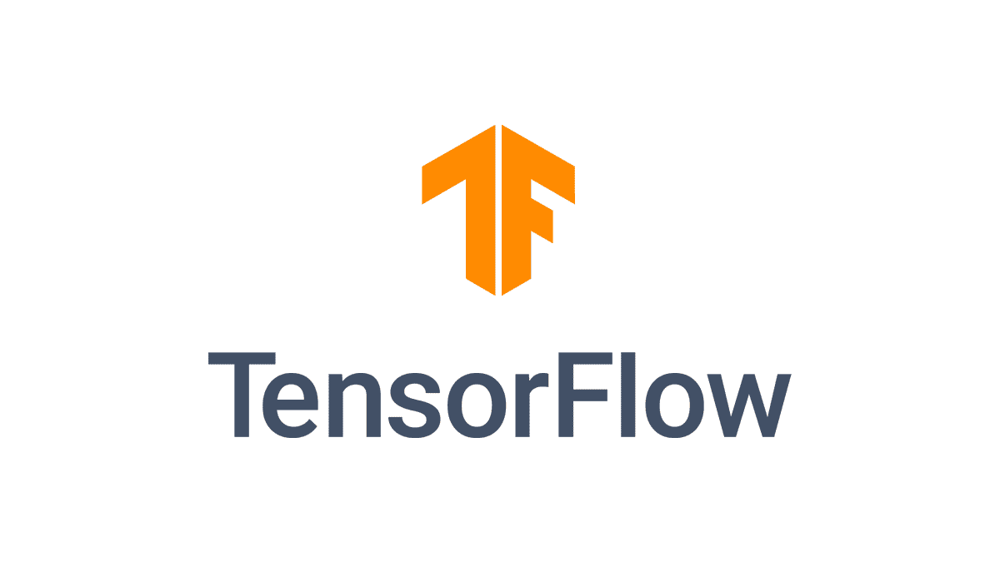
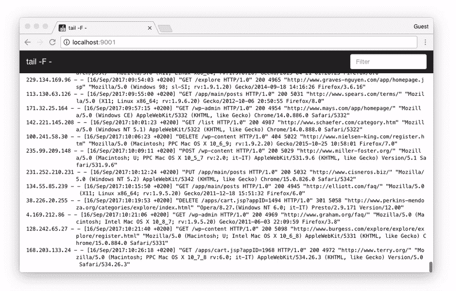
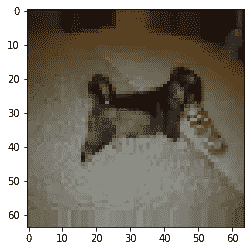
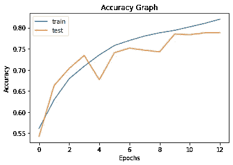
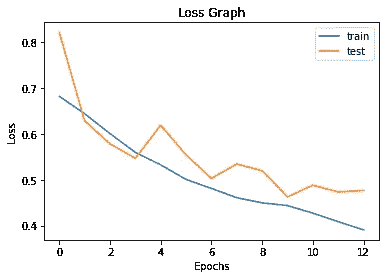

# 释放回调的力量[深度学习]

> 原文：<https://medium.com/analytics-vidhya/unleash-the-power-of-callbacks-deeplearning-67c35ac66027?source=collection_archive---------19----------------------->

如果你对深度学习感兴趣，并使用框架 T2 张量流，这篇文章会很有见地



你可以使用 **TensorFlow** 建立伟大的模型，使用**深度学习**可以**对地球上任何该死的东西进行分类**，但是有时候你可能会在训练时遇到很多问题

1.  **减少调整和使用不同超参数的**计算能力****
2.  **在线 Jupyter 笔记本电脑断电或**失去连接****
3.  **也许你**不知道**该用哪个**学习率****
4.  **什么时候**停止训练**【用哪个历元数】。**
5.  **和**更多问题****

****

**你的救星来了，回调函数。这些都是著名的深度学习框架 Tensorflow 提供的。这些是帮助 u 到**在训练时与**网络**交互**甚至在训练时改变**超参数**的功能。**

**这篇文章是关于充分利用回调函数来使你的**训练更有效率。****

> **奖金:**
> 
> **1.了解如何将任意数据集从 [**Kaggle**](https://kaggle.com/) 导入到**[**Google Colab**](https://colab.research.google.com/)****
> 
> ****2.直接从文件夹中没有标签的图像上训练狗和猫的分类器****

****数据集可以从这里下载:[点击这里](https://www.kaggle.com/tongpython/cat-and-dog)****

# ****该员额分为两个部分:****

1.  ****五大回调函数[我使用的]****
2.  ****使用这些回调构建分类器****

# ****我使用的前 5 个回调函数:****

****在这里，我将谈论我在训练中经常使用的回调****

****a. [**【模型检查点()】**](https://www.tensorflow.org/api_docs/python/tf/keras/callbacks/ModelCheckpoint)****

********

****你一定玩过很多有关卡的游戏，所以当你死在那里的时候你会复活，而不是从头开始。这里有一个类似的概念，ur 模型每隔一段时间保存一次，最后只保存最佳模型，这意味着具有最佳训练参数的模型考虑了一个度量。****

****示例:****

```
**tf.keras.callbacks.ModelCheckpoint(filepath='best_weights.hdf5',monitor='val_acc',save_best_only=True)**
```

****这里. hdf5 模型文件根据验证准确性以最佳权重保存，我认为这对更好的泛化很重要。要进一步检查出[检查出**这个**检查出](https://www.tensorflow.org/api_docs/python/tf/keras/callbacks/ModelCheckpoint)****

****b.[](https://www.tensorflow.org/api_docs/python/tf/keras/callbacks/EarlyStopping)****

************

******有时候你需要停止训练你的模型，否则你可能会毫无理由地浪费你的计算能力，因为精确度在很多时代都是恒定的，这可能会导致你毫无理由地为云服务付费。这个函数帮助你在类似的事情发生之前停止，基于一些标准，比如验证损失或准确性或其他任何东西。******

******示例:******

```
****tf.keras.callbacks.EarlyStopping(monitor='val_loss',patience=3)****
```

******该功能将监控验证损失，如果验证损失在 3 个时期内没有变化，则停止，这就是耐心所指的。查看 [**本**](https://www.tensorflow.org/api_docs/python/tf/keras/callbacks/EarlyStopping) 了解更多详情******

****c.自定义函数使用 [**回调**](https://www.tensorflow.org/api_docs/python/tf/keras/callbacks/Callback) 类****

****你可能有一些不同类型的标准和条件，你想在训练时应用于网络，所以你需要建立一个回调函数的自定义条件，不用担心 TensorFlow 为你覆盖。你只需要提到你想什么时候应用条件或函数，比如在一个时期结束后，或者在一批图像处理结束时，等等。****

****示例:****

```
**class c(Callback):def on_epoch_end(self,epoch,logs={}):if(logs.get('val_acc')>0.95):print('Too much accuracy so exiting')self.model.stop_training=Trueif(logs.get('loss')<0.1):print('Too much loss lost so exiting')self.model.stop_training=Truecustom_callback = c()**
```

****你必须创建一个从 TensorFlow 继承回调的类，就像我之前说的，你需要指定你想什么时候应用条件，就像此后纪元结束一样。日志是指关于当前训练步骤的信息。这里，当损失低于 0.1 并且在一个时期结束时验证准确度高于 95%时，我需要停止训练。更多关于回调函数的信息，点击 [**这里**](https://www.tensorflow.org/api_docs/python/tf/keras/callbacks/Callback)****

****d. [**CSVLogger()**](https://www.tensorflow.org/api_docs/python/tf/keras/callbacks/CSVLogger)****

********

****所以，你需要构建 web 应用程序来展示你的培训和测试图，或者只是简单地保存关于培训的信息，甚至有一个内置的功能。这就像为您的模型构建一个日志文件，这样您甚至可以在以后使用 [**Matplotlib**](https://matplotlib.org/) 或 [**seaborn**](https://seaborn.pydata.org/) 库进行绘图。****

****示例:****

```
**tf.keras.callbacks.CSVLogger('logfile.csv')**
```

****这里太简单了，只需给它日志文件的名字，简单吧？要了解更多 [**点击**](https://www.tensorflow.org/api_docs/python/tf/keras/callbacks/CSVLogger)****

****e.[**learning rate scheduler()**](https://www.tensorflow.org/api_docs/python/tf/keras/callbacks/LearningRateScheduler)****

********

****如果你是机器学习的新手，并且有**零** **线索**你的**学习** **速率**应该是多少，这将非常方便..有人**帮忙**！！！。别担心 TensorFlow 会来救你。****

****这个功能是我最喜欢的，因为它让你**决定**学习 **速率**每**时期**如果你想或超过任何其他**条件**。掌握决定学习速度的技巧并不容易，为什么不用这个呢****

****示例:****

```
**def scheduler(epoch):
    if epoch < 10:
        return 0.001
    else:
        return 0.001 * tf.math.exp(0.1 * (10 - epoch))tf.keras.callbacks.LearningRateScheduler(scheduler)**
```

****定义一个函数，该函数接受一个输入参数，该参数在这里对应于纪元编号，利用该参数，并定义当您想要改变学习率并返回它时的条件。就像这里一样，我在前 10 个时期使用恒定的学习率 0.001，然后逐渐降低学习率。更多信息请点击 [**此处**](https://www.tensorflow.org/api_docs/python/tf/keras/callbacks/LearningRateScheduler)****

# ****使用这些回调构建分类器****

****和我一直做的一样，这里是实现整个网络和玩不同回调函数的代码。****

****这里我使用了猫和狗的数据集，我知道这是陈词滥调，但更重要的是向你展示如何使用不同的回调函数。这段代码是在 [**Google Colab**](https://colab.research.google.com/) 上执行的，****

********

****这是一个非常棒的免费工具，可以为不同的培训模型制作原型，并将代码扩展到任何其他高端付费云服务。因为如果你直接从那里开始，你可能最初只是为原型制作付费，这不是你想在原型制作时浪费的那种钱。****

******第一步【可选】:******

******验证你的 Kaggle 账户，直接下载数据到 Google Colab******

******一个**。上传 kaggle.json 文件，您可以在 kaggle 个人资料的帐户部分找到该文件****

```
**from google.colab import files
files.upload()**
```

****Kaggle 要求将你的文件放在一个特定的文件夹中，然后授予它使用权限****

```
**!mkdir -p  ~/.kaggle
!cp kaggle.json ~/.kaggle/
!chmod 600 ~/.kaggle/kaggle.json**
```

****下载并解压你的数据****

```
**!kaggle datasets download -d tongpython/cat-and-dog
!unzip cat-and-dog.zip**
```

******第二步:******

******导入所有库******

```
**import tensorflow as tffrom tensorflow.keras.models import Sequentialfrom tensorflow.keras.layers import         Dense,Flatten,Conv2D,MaxPooling2Dfrom tensorflow.keras.optimizers import RMSprop,Adamfrom tensorflow.keras.losses import binary_crossentropy,categorical_crossentropyfrom tensorflow.keras.preprocessing.image import ImageDataGenerator,img_to_arrayfrom tensorflow.keras.callbacks import Callback
import matplotlib.pyplot as plt
import random**
```

****Tensorflow 用于构建模型，Matplotlib 用于绘图，random 用于生成一些随机数****

******第三步:******

******设置图像增强的图像生成器，并直接从代表标签的文件夹中加载这些图像。******

> ****记住给出对应于不同类的不同文件夹所在的文件夹的路径****

```
**train_data_gen = ImageDataGenerator(rescale = 1./255,shear_range = 0.2,zoom_range = 0.2,horizontal_flip = True)train_gen=train_data_gen.flow_from_directory('training_set/training_set',target_size=(64,64),batch_size=32,class_mode='binary')valid_data_gen =  ImageDataGenerator(rescale=1./255)valid_gen=valid_data_gen.flow_from_directory('test_set/test_set',target_size=(64,64),batch_size=32,class_mode='binary')'''
Found 8005 images belonging to 2 classes. 
Found 2023 images belonging to 2 classes.
'''**
```

****我们希望我们的图像大小调整为 64x64，并应用一些数据增强，如翻转和缩放。****

******第四步:******

******查看您的增强图像******

```
**def disp():
    x,y = train_gen.next()
    id = random.randint(0,x.shape[0])
    print("This belongs to class a "+str(y[1]))
    plt.imshow(x[1])
    plt.show()
disp()**
```

********

****这属于 1.0 类****

******第五步:******

******建立你的模型******

```
**model = Sequential()
model.add(Conv2D(input_shape=(64,64,3),filters=32,kernel_size=(3,3),activation='relu'))
model.add(MaxPooling2D(2,2))
model.add(Conv2D(filters=32,kernel_size=(3,3),activation='relu'))
model.add(MaxPooling2D(2,2))
model.add(Flatten())
model.add(Dense(128,activation='relu'))
model.add(Dense(1,activation='sigmoid'))
model.compile(loss='binary_crossentropy',optimizer='adam',metrics=['acc'])model.summary()**
```

******架构******

> ****型号:"顺序式" _ _ _ _ _ _ _ _ _ _ _ _ _ _ _ _ _ _ _ _ _ _ _ _ _ _ _ _ _ _ _ _ _ _ _ _ _ _ _ _ _ _ _ _ _ _ _ _ _ _ _ _ _ _ _ _ _ _ _ _ _ _ _ _ _ _ _ _ _ _ _ _ _ _ _ _ _ _ _ _ _ _ _ _ _ _ _ 图层(类型)输出形状 Param # = = = = = = = = = = = = = = = = = = = = = = = = = = =****
> 
> ****conv2d (Conv2D) (None，62，62，32)896 _ _ _ _ _ _ _ _ _ _ _ _ _ _ _ _ _ _ _ _ _ _ _ _ _ _ _ _ _ _ _ _ _ _ _ _ _ _ _ _ _ _ _ _ _ _ _ _ _ _ _ _ _ _ _ _ _ _ _ max _ pool 2d(maxpool2d)(None，31，31，32)0 _ _ _ _ _ _ _ _ _ _ _ _ _ _ _ _ _ _ _ _ _ _ _ _ _ _ _ _ _ _ _ _ _ _ _ _ _ _ _ _ _ _ _ _ _ _ _ _ _ _ _ _ _ _ _ _ _ _ _ 1(conv 2d)(None，29，29，32) 9248 ____________________****
> 
> ****总参数:813，217 可训练参数:813，217 不可训练参数:0****

******第六步【重要】:******

******宣布你的复试******

```
**class c(Callback):
    def on_epoch_end(self,epoch,logs={}):if(logs.get('val_acc')>0.95): 
           print('Too much accuracy so exiting')
           self.model.stop_training=Trueif(logs.get('loss')<0.1):
           print('Too much loss lost so exiting')
           self.model.stop_training=Truecustom_callback = c()early_stopping = tf.keras.callbacks.EarlyStopping(monitor='val_loss',patience=3)checkpointer = tf.keras.callbacks.ModelCheckpoint(filepath='best_weights.hdf5',monitor='val_acc',save_best_only=True)csv= tf.keras.callbacks.CSVLogger('logfile.csv')term_nan=tf.keras.callbacks.TerminateOnNaN()def scheduler(epoch):
    if epoch < 10:
        return 0.001
    else:
        return 0.001 * tf.math.exp(0.1 * (10 - epoch))lr = tf.keras.callbacks.LearningRateScheduler(scheduler)**
```

****所有这些回调之前都讨论过****

******第七步:******

******训练开始******

```
**history = model.fit_generator(train_gen,steps_per_epoch=8005//32,epochs=50,validation_data=valid_gen,validation_steps=2023//32,callbacks=[custom_callback,early_stopping,checkpointer,csv,term_nan,lr])**
```

****这里的步骤指的是我们在生成图像时声明的批量覆盖所有图像的步骤数****

> ****请使用 Model.fit，它支持生成器。****
> 
> ****纪元 1/50 250/250[= = = = = = = = = = = = = = = = = = = = = = = = = = = = = = =]—33s 131 ms/step—loss:0.6877—ACC:0.5511—val _ loss:0.6743—val _ ACC:0.5724—lr:0.0010****
> 
> ****纪元 2/50 250/250[= = = = = = = = = = = = = = = = = = = = = = = = = = = = = = =]—33s 131 ms/step—loss:0.6511—ACC:0.6166—val _ loss:0.6297—val _ ACC:0.6731—lr:0.0010****
> 
> ****纪元 3/50 250/250[= = = = = = = = = = = = = = = = = = = = = = = = = = = = = =]—33s 132 ms/步—损耗:0.6015—ACC:0.6733—val _ loss:0.5697—val _ ACC:0.6969—lr:0.0010****
> 
> ****纪元 4/50 250/250[= = = = = = = = = = = = = = = = = = = = = = = = = = = = = =]—33s 133 ms/step—loss:0.5625—ACC:0.7105—val _ loss:0.5571—val _ ACC:0.7197—lr:0.0010****
> 
> ****纪元 5/50 250/250[= = = = = = = = = = = = = = = = = = = = = = = = = = = = = = =]—34s 134 ms/步—损耗:0.5343—ACC:0.7293—val _ loss:0.5374—val _ ACC:0.7376—lr:0.0010****
> 
> ****纪元 6/50 250/250[= = = = = = = = = = = = = = = = = = = = = = = = = = = = = =]—33s 133 ms/步—损耗:0.5142—ACC:0.7425—val _ loss:0.5054—val _ ACC:0.7584—lr:0.0010****
> 
> ****纪元 7/50 250/250[= = = = = = = = = = = = = = = = = = = = = = = = = = = = = =]—33s 133 ms/步—损耗:0.4785—ACC:0.7711—val _ loss:0.4850—val _ ACC:0.7748—lr:0.0010****
> 
> ****纪元 8/50 250/250[= = = = = = = = = = = = = = = = = = = = = = = = = = = = = = =]—34s 134 ms/步—损耗:0.4599—ACC:0.7781—val _ loss:0.5026—val _ ACC:0.7738—lr:0.0010****
> 
> ****纪元 9/50 250/250[= = = = = = = = = = = = = = = = = = = = = = = = = = = = = = = = = = = = 33s 134 ms/step—loss:0.4413—ACC:0.7941—val _ loss:0.4764—val _ ACC:0.7808—lr:0.0010 纪元 10/50 250/250[= = = = = = = = = = = = = = = = = = = = = = = = = = = = = 33s 133 ms/step****
> 
> ****纪元 11/50 250/250[= = = = = = = = = = = = = = = = = = = = = = = = = = = = = =]—33s 133 ms/步—损耗:0.4138—ACC:0.8060—val _ loss:0.4670—val _ ACC:0.7812—lr:0.0010****
> 
> ****纪元 12/50 250/250[= = = = = = = = = = = = = = = = = = = = = = = = = = = = = =]—33s 134 ms/step—loss:0.3900—ACC:0.8224—val _ loss:0.4950—val _ ACC:0.7827—lr:9.0484 e-04****
> 
> ****纪元 13/50 250/250[= = = = = = = = = = = = = = = = = = = = = = = = = = = = = = =]—34s 134 ms/步—损耗:0.3767—ACC:0.8299—val _ loss:0.4581—val _ ACC:0.7877—lr:8.1873 e-04****

****观察恒定的学习速率和 10 个周期后的变化，它实际上在**第 16 个**周期的 **50 个周期**之前就结束了训练。最后用的学习率是 **LR: 8.1873e-04******

******最后一步:******

****评估模型****

****训练准确率为 82%，验证准确率为 78.7%****

********

****训练损失为 0.3767，验证损失为 0.4581****

********

****谢谢你，为了想象你的回旋，请访问我以前的帖子****

****[](/@krishshah99615/visualizing-convolution-neural-network-the-hidden-truth-c825d69f1832) [## 可视化卷积神经网络[隐藏的真相]

### 对计算机视觉、深度学习感兴趣的人，这可能很有见地

medium.com](/@krishshah99615/visualizing-convolution-neural-network-the-hidden-truth-c825d69f1832) 

希望这篇帖子对你有所帮助，快乐深度学习****