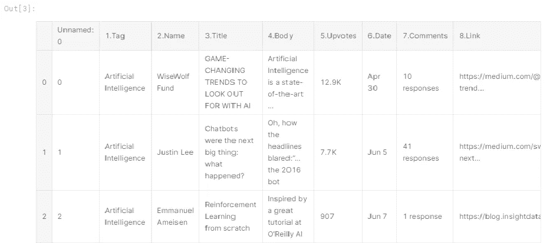
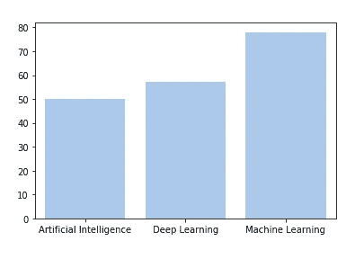
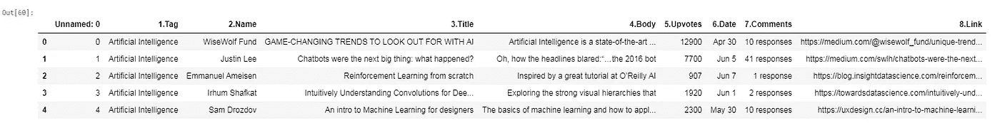
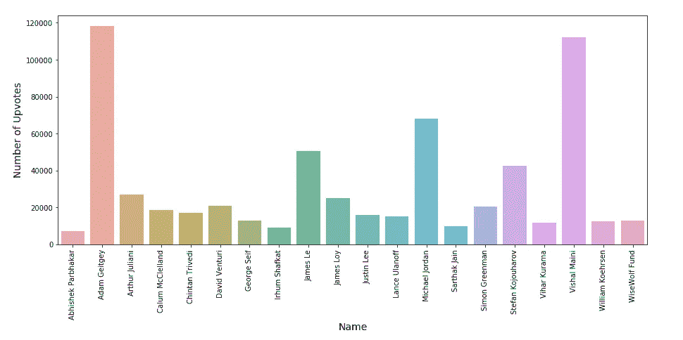
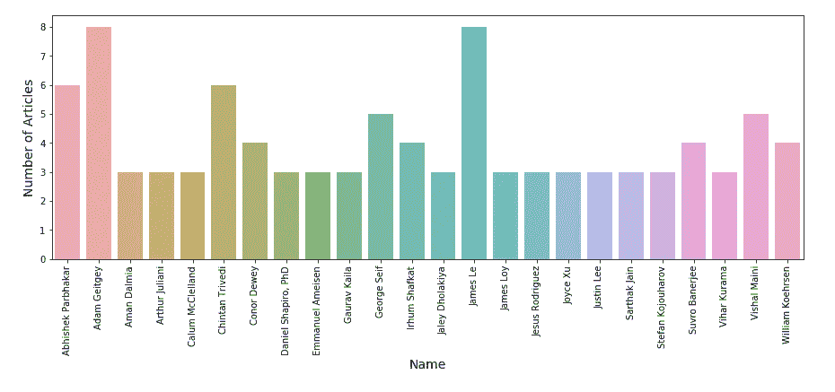
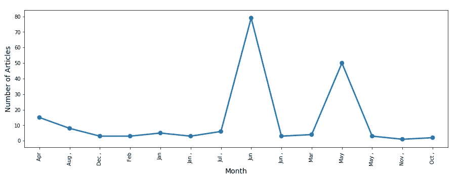
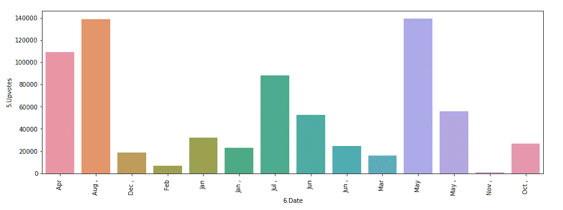
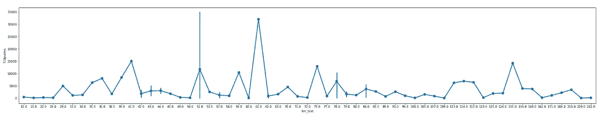
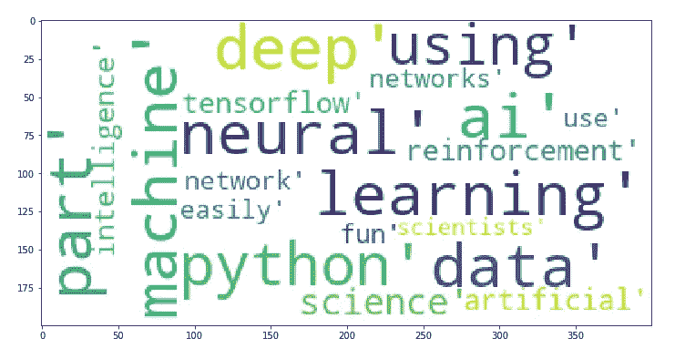
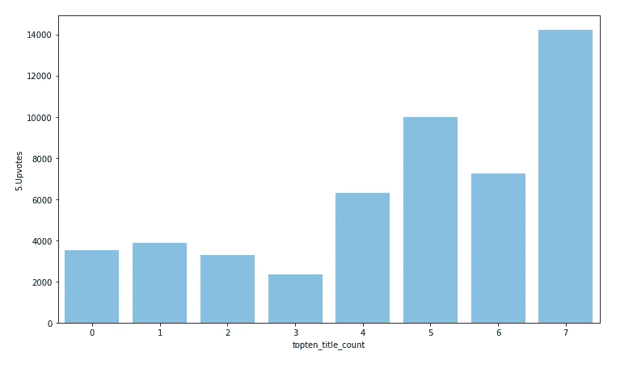

# 释放“数据的力量”

> 原文：<https://medium.com/analytics-vidhya/unleash-the-power-of-data-4a4b9efff4c6?source=collection_archive---------22----------------------->

*纠结于数据？？不知道从哪里开始？？*


由[艾米丽·莫特](https://unsplash.com/@emilymorter?utm_source=medium&utm_medium=referral)在 [Unsplash](https://unsplash.com?utm_source=medium&utm_medium=referral) 上拍摄的照片

> 作为一名初学者，我开始阅读各种文章、博客和帖子，开始研究数据科学。在处理数据集时，我明白首先了解数据非常重要。

无论数据是何种格式，通常都需要花费一些时间和精力来读取数据、清理和转换数据，并检查所有内容是否完好无损地通过了翻译过程。

那么，我们应该从哪里开始呢？？

1.  我通常从一次检查一个变量开始，找出变量的含义，查看值的分布，并选择适当的汇总统计数据。
2.  我试图找出变量之间可能的关系，查看表格和散点图，并计算相关性和拟合度。
3.  如果变量之间有明显的关系，我会尝试调查更复杂的关系。
4.  在报告统计结果时，重要的是回答三个问题:影响有多大？如果我们再次进行同样的测量，我们会有多大的可变性？有没有可能这种明显的效果是由于偶然？
5.  然后我试着将数据可视化，试着发现数据讲述了什么故事。然后，您可以深入研究，从您的数据中获得洞察力。

> 开始的时候，你需要的只是问正确问题的好奇心和像 R 或 Python 这样的软件包。过一段时间后，你会意识到当你在努力提高模型的准确性或停滞不前时。在这种情况下，数据探索技术将帮助您。

让我们开始吧…


我们将尝试执行上述步骤来分析网站[medium.com](http://www.medium.com)。

*媒体是传播几乎任何领域知识的最著名工具之一。它广泛用于发表关于 ML、AI 和数据科学的文章。数据集包含文章、标题、获得的点击数、链接和阅读时间。*

# 问“正确”的问题

你到底想知道什么？你的数据从哪里来？

对于我们的分析，我们需要以下问题的答案

***如何写好一篇文章？如何用有趣的方式告知读者？什么样的标题吸引更多的人群？一篇文章应该有多长？***

# 数据“看起来”如何？

我们将使用 pandas dataframe 对象来查看数据。

```
df = pd.read_csv('medium.csv')
df.head()
```



*变量是可以测量或计算的任何特征、数字或数量*。在这里，我们可以看到*变量*由:

*   *标签:在 AI/ML 或 DL 下贴标签*
*   *姓名:作者姓名*
*   *标题:文章标题*
*   *正文:文章的正文(主题)*
*   *支持票数:收到的支持票数*
*   *日期:出版日期*
*   *评论:评论数量*
*   链接:文章的链接

# 探索“一个接一个”

*开始逐个探索变量。我们需要了解数据是如何分布的。*

1.  **标签变量**



*在这里，我们可以看到标签被分类在人工智能、深度学习和机器学习之下。最多的文章被标记在机器学习下面，然后是深度学习，然后是人工智能。*

**2。姓名**

```
len(data['2.Name'].unique())
```

*使用上面的函数我们发现 AI、ML、DL 领域有* ***96 个唯一作者*** *写作。*

**3。**有时我们会把变量**标题和正文放在一边**，因为它们是文本格式。

**4。赞成票**

正如我们所知，upvotes 决定了对某一特定文章的赞同，这意味着它是一个数值。但是，当我们检查数据时，我们发现它们是字符串形式的。

## ‘12.9k’不等于 12900！！我们现在要干嘛？？

我们*需要预处理*文本以获得数值。

```
for i in range(0,len(data)):
    if 'K' in data["5.Upvotes"][i]:
        data["5.Upvotes"][i]= int(float(data["5.Upvotes"][i].replace("K",""))*1000)
    else:
        data["5.Upvotes"][i] = int(data["5.Upvotes"][i])
```

*处理后的数据将看起来像:*



请注意 Upvote 列从 12.9k 更改为 12900

现在我们**‘准备好’**探索可变上行投票

```
data['5.Upvotes'].mean()
```

***我们发现，贴有 AI/DL/ML 标签的文章获得了大约 4000 次投票。***

# 厌倦了知道一个变量…

让我们开始**寻找不同变量之间的关系**。我们将努力找出 1。获得最高票数的作者。



***亚当·盖特基*** 的上票数最多。

**2。查找作者撰写的文章数量**



***亚当·盖特基和*** 李中清都发表了数量最多的文章

> 从上面的探索中我们发现，尽管李中清和亚当·盖特吉 写了同样多的文章，亚当·盖特吉 还是获得了最多的票数。
> 
> ***Vishal Maini*** 以相对较少的帖子数获得了较多的上票数，向我们展示了他是一个 ***优质作者。***

# 让我们“深入研究”并找到“结果”


## 大部分文章是什么时候写的？



月份与文章数量

*最多的文章写于* ***六月和五月。***



月与票数对比

在五月和八月，观察到了最高票数。

## 长文' == '更多上票'？？？



文本长度与特定文章的投票数

*文字长度与 upvotes 的关系表明* ***读者除了关心文字的质量外，也关心文字的长度。***

## 标题中哪些词最吸引人？



*类似* ***的词，机器、数据、神经、学习、python、机器、AI、*** *在片头出现次数最多。*



它清楚地表明，随着前十个词出现的增加，收到的支持票也增加。

# 嗯，标题写作是一门艺术，有了足够的数据，你就能理解它。

从以上分析中我们发现-

大多数文章是在五月和六月写的，而大多数文章是在五月和八月读的。随着文章长度的增加，读者往往会失去兴趣。*篇大部分是 AI/DL/ML 下 agged 的* ***t*** *。作者应该关注文章的质量，而不是写多篇文章，因为我们观察到相同帖子数量的作者有不同的投票数。标题中包含前 10 个单词可以吸引读者。*

# “后续问题”供进一步探讨

为什么作者在五月和六月写得更多？

*   是因为暑假吗？如果我们假设是因为暑假，这意味着大多数作者可能是大学生。但是我们需要提前调查并收集正确的数据。

**为什么五月和八月的投票数较高？**

*   就像之前假设的五月和六月的暑假一样，我们可以说读者在假期开始阅读比他们日常阅读时间更多的东西，因为他们试图学习新的东西。但是八月怎么了？？-需要提前调查

我们能发现阅读趋势吗？

*   ML/DL/AI 是读者中最常见的阅读类别。这可能是由于不断变化的技术和对这些技能的需求，人们希望学习它们。

希望你们都已经对如何开始以及如何进一步探索数据以回答问题和从获得的见解中发现新问题有了一些基本的想法。

***更多信息和 python 代码查看下面提到的 git 库。***

[](https://github.com/samisha98/MediumSite-Analysis) [## Sami sha 98/medium site-分析

### 在 GitHub 上创建一个帐户，为 samisha98/MediumSite-Analysis 开发做出贡献。

github.com](https://github.com/samisha98/MediumSite-Analysis)