# 释放熊猫“分类”的力量 Dtype:使分类特征很好地服务于机器学习

> 原文：<https://medium.com/analytics-vidhya/unleash-the-power-of-pandas-category-dtype-encode-categorical-data-in-smarter-ways-eb787cd274df?source=collection_archive---------5----------------------->

## 更轻|更快|更安全|灵活|防呆

## 关于在 Python 中使用 Pandas 'category '数据类型的教程


资源:《功夫熊猫:命运之爪》

最近，我在研究一个前 Kaggle 竞赛数据集- [TalkingData 移动用户统计数据](https://www.kaggle.com/c/talkingdata-mobile-user-demographics)。相关数据帧的总大小为 2GB。但是在我尝试将这些数据框合并成一个表格数据框之后。嘣！2GB 爆炸到 18GB！！😟

幸运的是，经过一些简单的技巧，我能够将数据集从 18GB 增加到 5GB，而不会丢失任何信息或改变数据结构。我实现它的关键方法是在 Pandas 中使用“类别”日期类型。

更好的是，我意识到“category”数据类型不仅使数据集变得轻量级，而且有助于提高数据操作性能和机器学习性能。

今天我将谈论如何使用熊猫的“类别”类型，以及为什么你应该考虑使用它。

> 注意:在 Python 的行话中，Pandas 数据类型通常被称为‘dtype’。如果以后看到更多的' dtype '，应该知道' dtype'=Pandas 数据类型。

# 要涵盖的内容

*   展示:为什么“类别”数据类型是好的
*   教程:“类别”数据类型如何工作
*   洞察:为什么“类别”数据类型对 ML 很重要
*   要点:何时应该使用“类别”数据类型

# 这篇文章是给你的吗？

本教程的目标不是试图掩盖非常丰富的分类编码或如何在任何语言中为每个数据科学分区处理大数据。相反，重点是 Python 和它的 Pandas 库。如果你不是 Python 用户或者和熊猫有密切的工作关系，不要担心。相信这个帖子还是能有所启发的。

事不宜迟，让我们把手弄脏，跳入数据集。

附:和往常一样，我会用动手的方式解释。你可以在这个 [Github 链接](https://raw.githubusercontent.com/kefeimo/DataScienceBlog/master/3.category_dtype/pandas_data_type_0628.ipynb)上找到笔记本。

# 表演开始:更轻更快

## 加载数据

这里是[链接](https://raw.githubusercontent.com/kefeimo/DataScienceBlog/master/3.category_dtype/df_example.csv)你可以在演示中下载数据集。(我们不会处理原始 Kaggle 数据集，而是它的一部分。)

`import pandas as pd`

```
url = '[https://raw.githubusercontent.com/kefeimo/DataScienceBlog/master/3.category_dtype/df_example.csv'](https://raw.githubusercontent.com/kefeimo/DataScienceBlog/master/3.category_dtype/df_example.csv')df_original = pd.read_csv(url) 
df_original.head() 
df_original.info()
```

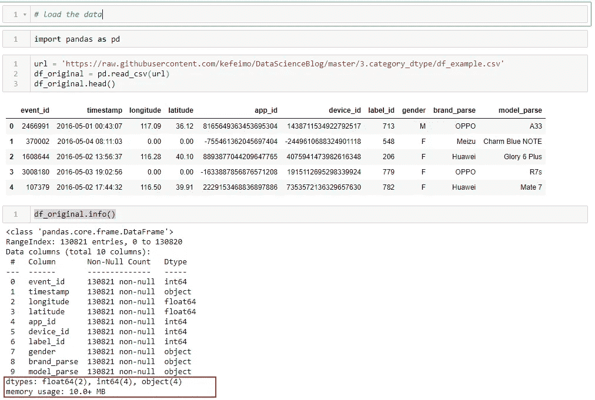

根据“info”函数，数据集有 130，821 行和 10 列，“float64”、“int64”、“object”特征的数量分别为 2、4、4。内存使用量约为 10.0 MB。

## 做品类:怎么做？

首先，让我们将“性别”特征数据类型改为“类别”。我们是这样做的。

```
df_tmp = df_original.copy()
df_tmp.gender = df_tmp.gender.astype('category')
```

## 展示 1:节省内存使用

更改“性别”特征数据类型后，再次检查。现在，我们已经节省了大约 10%的内存使用。耶。🙌

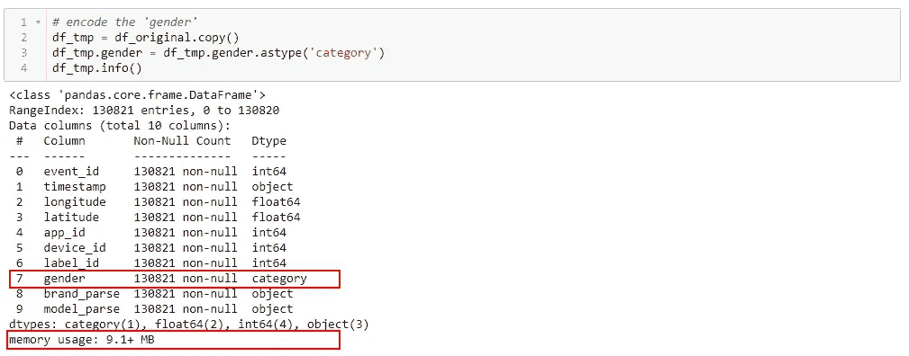

## 展示 2:加速数据操作

对于分类数据分析,“groupby”是一种方便的操作(如果不是最有用的操作)。这里，我们通过使用类别数据类型来演示操作性能(即时间效率)。如下所示，通过使用“类别”数据类型，执行要快得多(例如，与使用“对象”数据类型相比，所用时间少于 1/3)。)

```
%timeit df_original.groupby('gender').latitude.mean()df_tmp = df_original.copy()
df_tmp.gender = df_tmp.gender.astype('category')%timeit df_tmp.groupby('gender').latitude.mean()
```

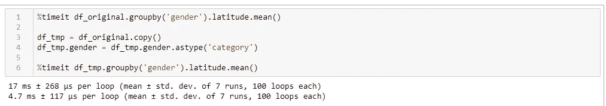

## 让我们看看更多的例子

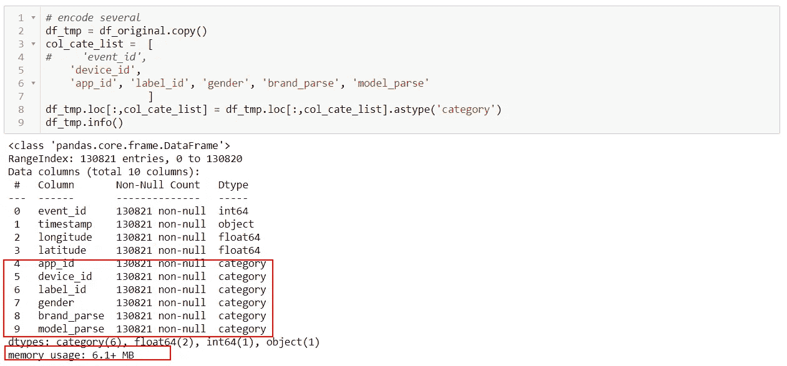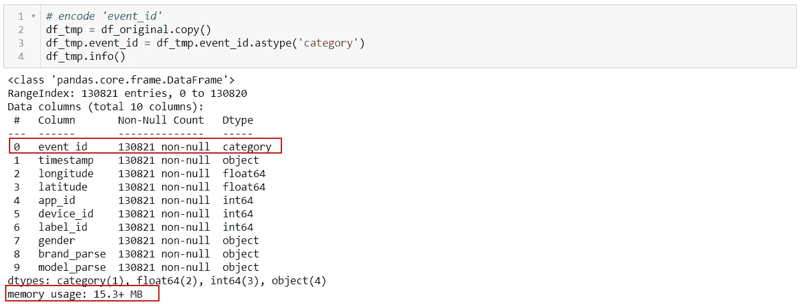

> 在第一个例子中，我们节省了更多的内存使用。但是在第二个例子中，它占用了更多的内存。

## 抓住你的时刻

在[熊猫文档](https://pandas.pydata.org/pandas-docs/stable/user_guide/categorical.html)中，我们可以找到以下信息。

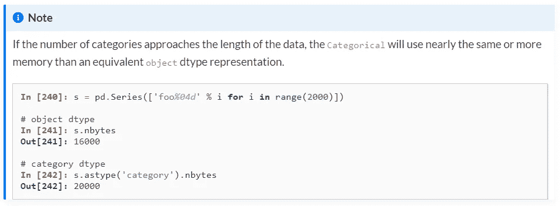

显然，使用类别 dtype 并不总是保证节省内存使用。

但是为什么会这样呢？更重要的是，我们如何更好地利用“类别”日期类型，是时候了解“类别”日期类型是如何工作的了。

# 解释“类别”数据类型如何工作

引用熊猫关于[的文档分类数据](https://pandas.pydata.org/pandas-docs/stable/user_guide/categorical.html) (1.0.5):

> 分类数据的所有值都在 categories 或 np.nan 中。顺序是由类别的顺序定义的，而不是值的词汇顺序。在内部，数据结构由一个 categories 数组和一个指向 categories 数组中实际值的整数代码数组组成。

现在更困惑了？别急，让我试着解释一下。

## 哈希表

背后的机制是“哈希表”的思想。下面是哈希表工作原理的一个示例。(我们以‘性别’特征为例。)

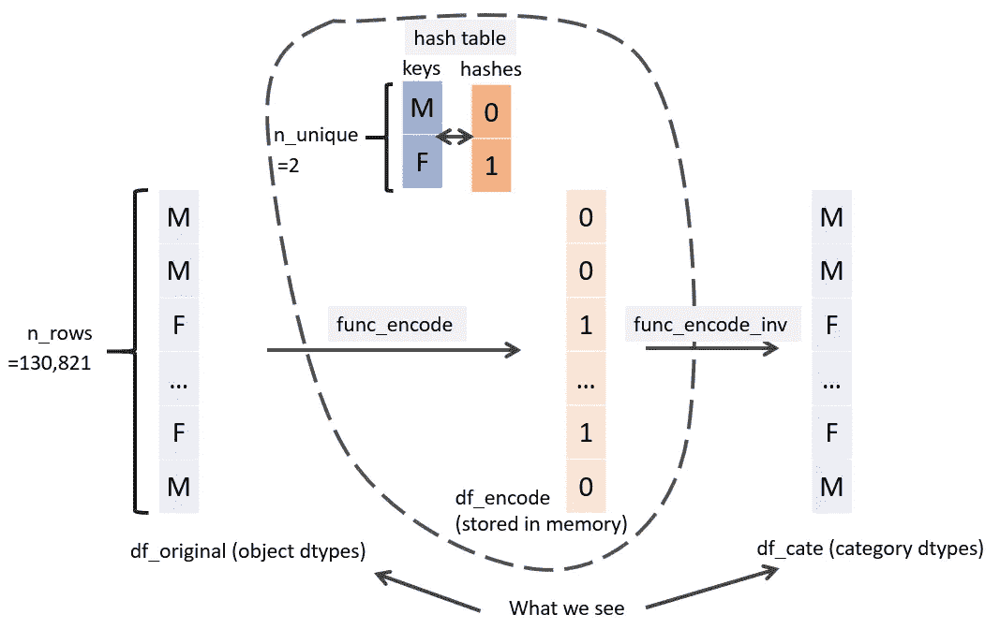

“类别”数据类型背后的机制图解(图片由作者提供)

1.  首先，我们创建一个**散列表**，将唯一值‘M’和‘F’(也称为关键字)映射到‘0’和‘1’(也称为散列)。
2.  然后我们**编码**原始数据集:分别用‘0’和‘1’代替‘M’和‘F’。编码的数据集将存储在内存中。这个过程通常可以(但不总是)节省内存使用(我将在后面解释)。
3.  请注意，值“0”和“1”不太容易解释。当显示时，Pandas 不显示编码的数据集，而是将编码的数据集映射回原始的‘M’和‘F’值( **INV_ENCODE)** 。换句话说，具有“category”数据类型的新数据集看起来与原始数据集相同(但它们并不相同)。)

## 数据类型及其内存使用情况

需要记住的一点是:不同的数据类型可能会消耗不同的内存。下面是常见数据类型及其内存使用情况的列表。

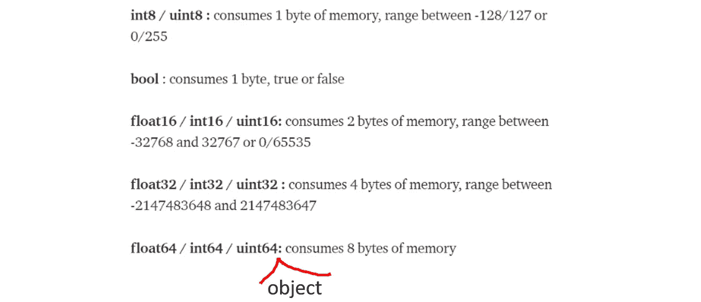

资源:[优化熊猫数据帧的大小](/@vincentteyssier/optimizing-the-size-of-a-pandas-dataframe-for-low-memory-environment-5f07db3d72e)

## 计算内存使用量

我们已经讨论了类别数据类型如何使用哈希表。我们已经回顾了常见的数据类型及其内存使用情况。现在我们该谈谈内存使用了。

您可以使用以下公式来近似计算内存使用量。

对于固有的 Python 数据类型(例如 int64、float64、object)，

> **memory _ usage = bytes * n _ rows**

例如“性别”特征(在“对象”数据类型中)

*   bytes = 8(对象数据类型为 8 字节)；
*   n_rows = 130，821；
*   memory _ usage = 8 * 130,821 = 1,046,568。
*   我们可以用“nbytes”函数来检查这个结果:

```
print(df_original.gender.nbytes)
```

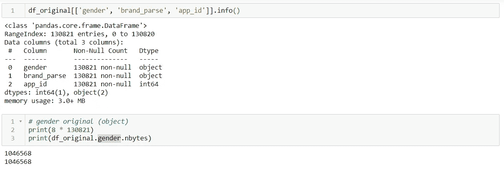

对于类别数据类型，公式如下:

> **字节哈希*行数+ (0 +字节对象)* n 唯一，**
> 
> **其中，**
> 
> **字节哈希=哈希函数(n 唯一)**

这个公式由两部分组成:一部分来自编码数据集(即 df_encode)，一部分来自哈希表。

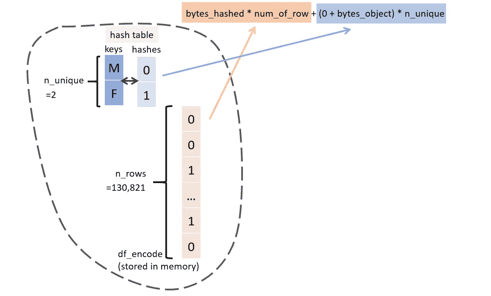

内存使用量计算图解(图片由作者提供)

例如“性别”特征(在“类别”数据类型中)

*   n_unique = 2，
*   bytes_hashed = 1。(我们可以用 int8 对所有唯一值进行编码；int8 数据类型占用 1 个字节。)
*   字节对象=8。(哈希表中的键占用的内存空间；pandas 总是使用“对象”类型来保存哈希表键。)
*   所以，memory _ usage = 1 * 130821+(0+8)* 2 = 130837
*   同样，我们可以使用“nbytes”函数进行检查

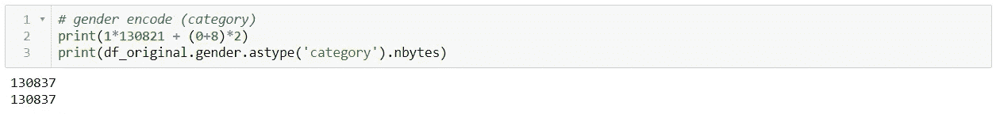

## 为什么“类别”数据类型不总是节省空间？

这个公式解释了为什么有时通过“分类”数据可以节省内存，但有时却不行。它与有多少不同的类(即 n_unique)有关。当 n_unique 较小时，pandas 可以使用小型数据类型对原始数据集进行编码。例如，如果 n_unique 小于 255，熊猫可以使用 int8 进行编码，只需要 1 个字节。

然而，当 n_unique 很大时，例如，对于 event_id，n_unique=107，900，它需要 int32 来编码原始数据集，并且每个 int32 项占用 4 个字节。与在原始数据集中使用 int64 相比，这还不算太差，它需要 8 个字节。但是不要忘记哈希表也需要内存存储，Pandas 总是使用' object '数据类型来存储哈希表中的键。由于 n_unique 非常大，接近 n_rows (82%)，因此 event_id 类别数据集将占用更多的内存存储。

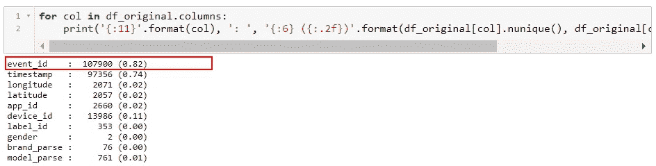

与总行数相比，每个特征和部分中的子类数

更多例子。

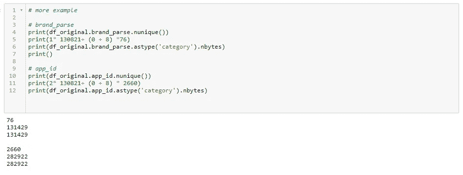

> 注意:上述公式和“nbytes”函数只是计算内存使用量的粗略近似值。例如，不包括数据帧索引的内存使用。该公式是理解类别 dtype mechanicsm 的良好开端，但是，如果您想要更精确地分析内存使用情况，您可能想要检查 [memory_usage()](https://pandas.pydata.org/pandas-docs/stable/reference/api/pandas.DataFrame.memory_usage.html) 函数。

## 一些评论

你看，使用类别数据类型并不总是有助于节省内存使用。此外，如果节省内存是您的首要任务，这不是唯一的方法或最佳选择。例如，我们可以将“性别”特征改为“布尔”类型以节省更多空间。

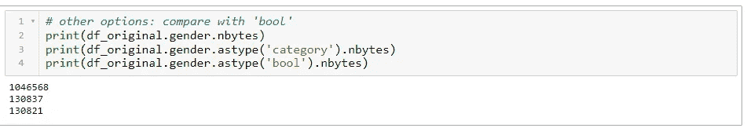

然而，我仍然支持使用类别数据类型。一个原因是使用类别 dtype 是**更安全**和**防呆**。例如，下面的命令不是明智的选择，但在这样做时它不会发出任何警告。在“打字”你的数据之前，你必须仔细检查。


使用“category”dtype 不会导致这样的问题。熊猫总是做出正确的选择来为你编码数据。

另外，使用 category dtype 不会失去任何互操作性。我们仍然在读取具有原始子类名称而不是一些编码数字的数据集。

关于节省内存已经说得够多了。让我们继续下一节课，看看其他好处以及它对机器学习的重要性。(如果节省内存是 category dtype 唯一能做的事情，我不会卖它。😉)

# 为什么分类数据类型对机器学习很重要？

如果机器学习包不能直接处理分类变量，传统上，有两种编码分类数据的惯例:标签编码和一次性编码。

(注意:理论上，机器学习模型使用分类数据可能没有任何问题，但是应用这种机器学习模型的包可能无法直接处理分类变量。例如，Sklearn 中的随机森林模型不能处理分类数据，而随机森林算法本身对分类特征没有问题。)

## 标签编码

以“brand_parse”为例。使用标签编码器时，我们将'华为'，'小米'…编码为' 0 '，' 1 '，…(int 类型)。这是它的样子。

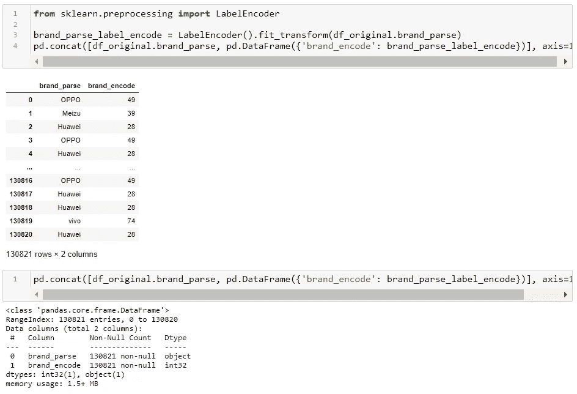

这种编码方式的问题是，机器学习模型可能会错误解释编码标签的含义。换句话说，将原始的分类特征解释为序数(意思是:有顺序)，而它应该是名词性的(意思是:没有顺序)。


资源:模因

以品牌特色为例。如果华为编码为‘0’，小米编码为‘1’，那么说华为比小米‘品牌少’就没多大意义了。同样，如果小米的编码值比魅族小，我们也不应该认为小米比魅族“品牌差”。

当不小心将分类特征编码为数字特征时，基于树的算法可能会错误地分割数据，认为编码数据中存在某些顺序。

## 一次热编码

通过使用 one-hot-encoding，我们将得到如下结果:

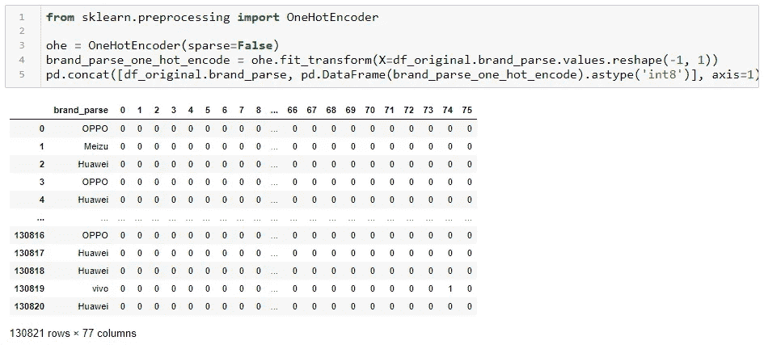

这里我们也有一些问题。第一个问题是内存使用。如果使用密集矩阵对大型数据集进行一次热编码，很可能会占用大量内存。例如，在 one-hot-encode 之后，brand_parse 将变成 76 列(有 76 个子类，假设您没有删除它们中的任何一个)。即使使用最轻的数据类型(int8 或 boolean ),它仍然会占用大量内存；想象一下，如果有超过 76 个子类。

有一些潜在的解决方案可以解决内存使用问题。

**解决方案 1** :使用稀疏矩阵

*   优点:节省空间
*   缺点:人类很难理解

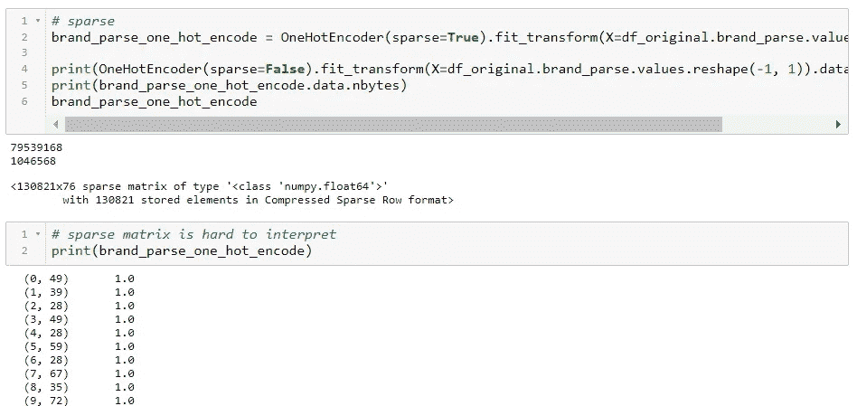

**解决方案 2** :分组和/或处理几个子类

*   优点:节省空间，易于解读(看起来更干净)
*   缺点:难以决定分组或处理哪个子类，有丢失有价值信息的风险

此外，树算法不支持一次性热编码数据，因为它可能会生成稀疏的树。(有关更多信息，请查看此[链接](https://towardsdatascience.com/one-hot-encoding-is-making-your-tree-based-ensembles-worse-heres-why-d64b282b5769)。)

## 基于树的机器学习模型的分类数据类型

因为标签编码和一键编码都不是很好。我们做什么呢答案听起来非常简单:保持分类数据的原样。换句话说，直接处理它。(但是不好申请。)

lightgbm 是能够直接处理分类数据的 Python 库之一(并不多见)。这里我引用了 lightgbm 文档中关于“分类特性支持”的内容:

> LightGBM 通过整数编码的分类特征提供了良好的准确性。LightGBM 应用 [Fisher (1958)](https://www.tandfonline.com/doi/abs/10.1080/01621459.1958.10501479) 找到类别的最优分割，如这里所述的。这通常比一键编码执行得更好。

(如果没听说过 lightgbm，简短介绍一下。它是由微软开发的。在 Kaggle 的完成中很受欢迎。与 xgboost、Catboost 一起，lightgbm 被认为是对表格数据进行机器学习的首选模型之一。(而神经网络对于非结构化数据更强大。)

顺便说一下，lightgbm Python 库集成了四种不同的基于树的 boosting 模型，gbdt(传统梯度 Boosting 决策树)、rf(随机森林)、dart(droppets meet Multiple Additive Regression Trees)和 goss(基于梯度的单侧采样)。它们都支持分类数据。你要做的是`astype('category')`。这比一次热编码简单得多。

## 最终音高

将类别数据类型用于机器学习是有益，因为

*   它有助于节省空间，这意味着我们可以用手头有限的内存可用性和计算能力集成更多的信息。
*   它使操作更有效，这意味着我们可以执行更多的迭代，从而更好地微调模型。
*   它使机器学习包能够直接处理分类变量，这有利于 ML 模型(特别是基于树的 boosting 模型)提取有用的特征，并防止过度拟合。

# 讨论:总是使用“类别”？

对于 id 类型、标签类型的数据，最好将其编码为“类别”。但是对于浮点数值类型，使用“category”数据类型可能不是一个好主意。而对于周期性数据，如一周中的某一天，我们不太清楚是否应该将它们编码为“0”、“1”、“2”、“6”(作为 int)，或者“1”、“2”、“3”、“7”(作为 int)，或者“sun”、“mon”、“tue”、“sat”(作为类别数据类型)。我们可能需要一些反复试验来确定哪种方法适合这种情况。

# 警告:你仍然要做你的工作

分类数据类型是好的，它可以帮你省去很多麻烦，加快机器学习过程，但是它做不了你的工作。例如，您仍然需要调整超参数。你仍然需要在合适的时候重组或者丢弃子类。

# 小贴士:泡菜

当您试图保存数据集以备后用时，请保存它。它比另存为 csv 更快，更重要的是保持了熊猫的类型。否则，如果您将数据帧保存为 csv，下次加载它时，您会发现数据类型又回到了 int64、float64 和 object。换句话说，我们将失去迄今为止我们讨论过的所有好处。

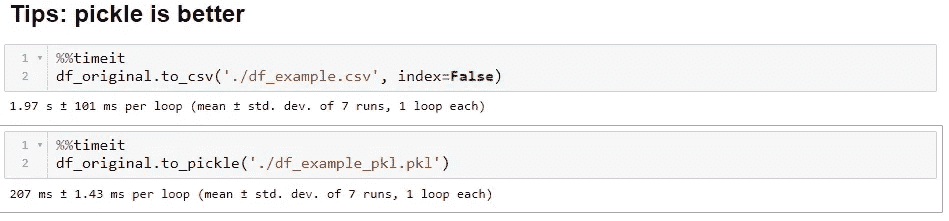

# 这篇文章的要点

在这篇文章中，我们讨论了很多关于 Python 中的“类别”数据类型。以下是一些要点。

*   如何使用“类别”数据类型？就`astype('category')`
*   为什么要使用“类别”？节省内存(除了 Gotchas 情况)，加快操作性能(最有可能)，提高机器学习性能(没有科学证据，但有很好的理由这样做)。
*   什么时候用？几乎总是，至少试一试。尽管有时它可能会占用更多空间，但从长远来看，它可以加快操作性能，并可以无缝集成到具有分类特征支持的机器学习模型中。
*   但是，“类别”并不是灵丹妙药。试错和迭代是你的朋友。
*   开始腌制。

我希望你喜欢这篇文章。欢迎发表评论。下次见。

你可以通过下面的链接查看笔记本。

[](https://github.com/kefeimo/DataScienceBlog/blob/master/3.category_dtype/pandas_data_type_0628.ipynb) [## kefeimo/数据科学博客

### permalink dissolve GitHub 是超过 5000 万开发人员的家园，他们一起工作来托管和审查代码，管理…

github.com](https://github.com/kefeimo/DataScienceBlog/blob/master/3.category_dtype/pandas_data_type_0628.ipynb)