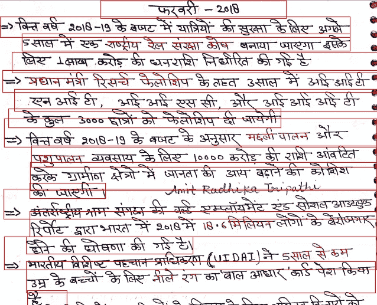

# 释放 OCR 的北海巨妖

> 原文：<https://medium.com/analytics-vidhya/unleashing-the-kraken-for-ocr-fba6bff73c8c?source=collection_archive---------13----------------------->

大多数语言的 OCR 引擎

如今，机器被训练来理解图像、视频、语音等，这反过来加快了解决物体检测、面部识别、自动驾驶、监控、活动识别等问题的速度。

手写文本文档(HTD)已经存在很久了，机器如何理解它们，因为我们有太多的来自古代经文、银行、医疗文件的文档…所以长话短说…如何将它们数字化...所以向“北海巨妖”问好


[来源:https://ya-webdesign.com/imgdownload.html](https://ya-webdesign.com/imgdownload.html)(官方标识:[http://kraken.re/_static/kraken.png](http://kraken.re/_static/kraken.png))

K ***raken*** :是从 [ocropus](https://github.com/tmbdev/ocropy) 分叉出来的交钥匙 OCR 系统。它旨在纠正一些问题，同时保持(大部分)功能等效。在 Apache2.0 许可下可用。

> ***其特点:***

*   脚本检测和多脚本识别支持(*字面上我将展示一些例子*和**共享代码**)
*   [从右向左](https://en.wikipedia.org/wiki/Right-to-left)、[双向](https://en.wikipedia.org/wiki/Bi-directional_text)和自上而下脚本支持
*   [中音](https://www.loc.gov/standards/alto/)、abbyXML 和 hOCR 输出
*   单词边界框和字符剪切
*   [模型文件的公共存储库](https://github.com/mittagessen/kraken-models)
*   [轻量模型文件](http://kraken.re/models.html#models)
*   [可变识别网络架构](http://kraken.re/vgsl.html#vgsl)

> **安装:**

kraken 需要一些外部库来运行。在 Debian/Ubuntu 上，它们可以通过以下方式安装:

```
# apt install libpangocairo-1.0 libxml2 libblas3 liblapack3 python3-dev python3-pip
```

简单方法:(皮普也行)

```
pip3 install kraken
```

**安装后看起来是这样的:**


火炬视觉是主干框架

*现在导入，看看有什么*


所以现在你已经准备好在手写文本文档上运行北海巨妖了。

> ***快速入门:***


[http://kraken.re/](http://kraken.re/)

***输出:***


来源:互联网

> 在印度，我们有如此多的(22 种以上)方言，所以我想为什么不测试其中的一些呢。

# **开始了:**

印地语:



泰卢固语:


## ***样本代码:***

[SSusantAchary/kraken _ ocr _ engine](https://github.com/SSusantAchary/kraken_ocr_engine)


> ”Fork github repo”；以便有新的更新时通知您！！！
> 
> 所以看到上面的东西，我们可以肯定地说，提供了大量的文件保存在图书馆等。，绝对可以数字化。

# ***不断学习和探索***

***来源:***

[](http://kraken.re/) [## 克拉肯-克拉肯 2.0.5-4-gbb42ba5 文件

### kraken 是从 ocropus 派生出来的交钥匙 OCR 系统。它旨在纠正一些问题，同时保留…

kraken.re](http://kraken.re/) 

图片来自互联网