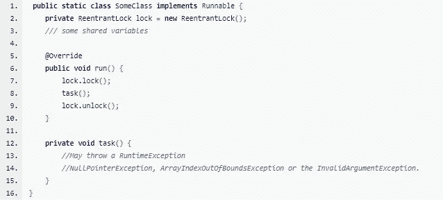
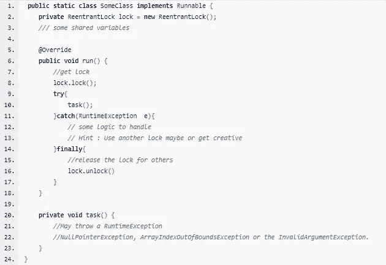
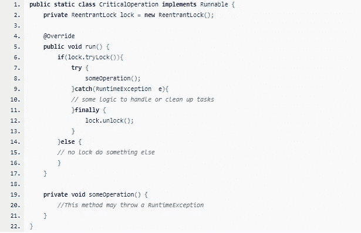
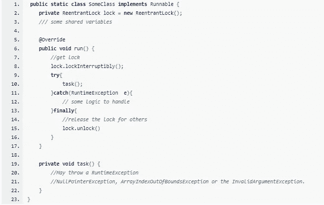

# 释放 Java 中可重入锁的威力

> 原文：<https://medium.com/analytics-vidhya/unlock-the-power-of-reentrant-lock-in-java-d55ae9135443?source=collection_archive---------8----------------------->

## 历史

可重入锁是在 Java 5.0 中添加的，以提升固有锁定游戏的级别。早期的“synchronized”和“volatile”是 Java 中实现并发性的主要手段。

## 那么什么是可重入锁呢？

ReentrantLock 类实现了锁接口。与其他锁一样，它在访问共享资源时为方法提供同步。

## 但是为什么叫可重入呢？

顾名思义，ReentrantLock 允许线程在一个资源上不止一次地进入锁(或重新进入)。
当线程第一次进入资源锁时，保持计数被设置为 1。线程可以再次将线程重新输入锁中，直到资源被解锁，并且每个“锁”操作将使保持计数增加 1。每一次“解锁”操作将使保持计数减一。
*只有当 hold count 设置为 0 时，资源才真正解锁。*

## 好吧，那它是怎么工作的？

根据 Oracle，ReentrantLock 由最后成功锁定但尚未解锁的线程拥有。当锁不属于另一个线程时，调用锁的线程将返回，成功获取锁。如果当前线程已经拥有锁，该方法将立即返回。*这可以使用方法 isHeldByCurrentThread()和 getHoldCount()来检查。*

## 好看，怎么用？

使用共享资源的代码被对锁定和解锁方法的调用所包围。

样本示例:-

ReentrantLock 示例

## 提醒一句:

问题:
*如果 task 抛出一个 RuntimeException，锁可能会永远保持不变，导致所有试图获取锁的其他线程阻塞。*

解决方案:
*我们需要用 try 包围 task，用 finally 块包围 lock.unlock()。
首先应该这样使用它。*

重入锁定警告

我在这里只是为了吸引你的注意力

## lock.tryLock()方法的威力:

Java 说:如果锁没有被另一个线程持有，则获取锁，并立即返回值 true，将锁持有计数设置为 1，否则返回 false。

lock.tryLock 方法

## lock.lockInterruptibly()方法的功能:

Java 说:线程试图获得锁，除非当前线程被中断，允许它立即对中断信号作出反应。

lock.lockInterruptibly 方法

锁的钥匙

## 公平呢？

*这个类的构造函数接受一个可选的公平性参数。
根据 Oracle，当设置为 true 时，锁倾向于授予等待时间最长的线程访问权限。否则，它不保证任何特定的顺序。
public ReentrantLock(布尔公平)*

## 那么我为什么要用 ReentrantLock 呢？

内在锁是块结构的，而外在锁允许有更明确的控制空间。比如使用 tryLock 进行流量控制，或者使用 lockInterruptibly 对中断信号做出反应。

除了实现锁接口之外，这个类还定义了 isLocked 和 getLockQueueLength 方法，以及一些相关的受保护的访问方法，这些方法可能对检测和监控有用。

**在这里阅读更多关于并发编程的内容**

**Java 中的锁:**[https://medium . com/analytics-vid hya/understanding-Java-thread-synchron ization-with-methods-vs-objects-vs-Locks-5428 e 3342 fee](/analytics-vidhya/understanding-java-thread-synchronization-with-methods-vs-objects-vs-locks-5428e3342fee)

**重入锁:**[https://medium . com/analytics-vid hya/unlock-the-power-of-Reentrant-lock-in-Java-d55ae 9135443](/analytics-vidhya/unlock-the-power-of-reentrant-lock-in-java-d55ae9135443)