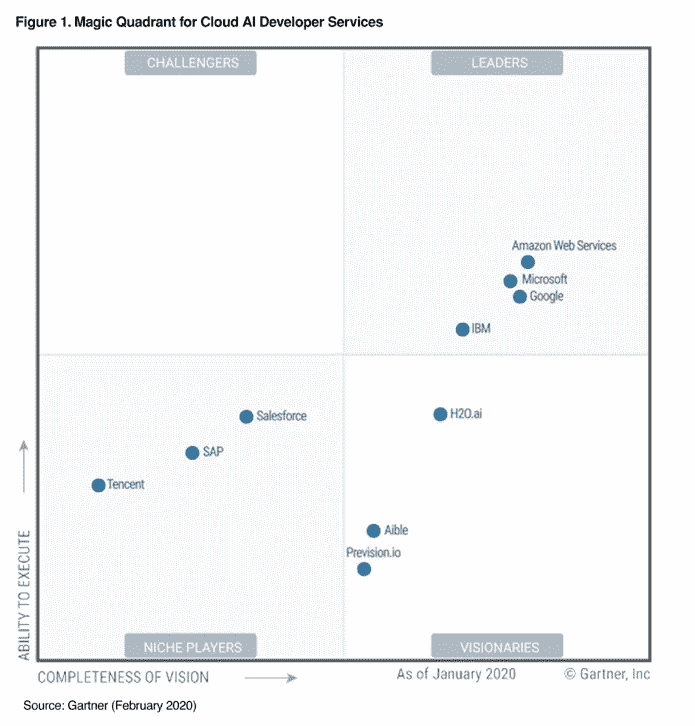

# 走向数字化转型

> 原文：<https://medium.com/analytics-vidhya/unlock-your-competitive-edge-using-unstructured-data-706f8cd255de?source=collection_archive---------36----------------------->

## 大数据、成熟度模型和云服务

大数据的 5 个 V:数量、速度、多样性、准确性和价值

> 你是一名专业人士，每天都会收到不同种类的信息，如电子邮件、新闻、报告、演示文稿、调查、博客、社交媒体内容等。
> 
> 但是，您如何处理所有这些信息并获得有价值的洞察力来做出更好的决策呢？

他的帖子将介绍非结构化数据的概念，讨论数据成熟度评估，并展示支持非结构化数据处理和分析发现的工具和技术。

> [“每天有 2.5 万亿字节的数据产生。[……]仅在过去两年中，世界上 90%的数据都是由。](https://www.forbes.com/sites/bernardmarr/2018/05/21/how-much-data-do-we-create-every-day-the-mind-blowing-stats-everyone-should-read/#464d434160ba)*【福布斯 2018 . 5 . 21】*
> 
> [“五年后，您 80%的数据将是非结构化的](https://solutionsreview.com/data-management/80-percent-of-your-data-will-be-unstructured-in-five-years/)【解决方案评论，2019 年 3 月 28 日】

结构化数据通常经过良好的组织，以获得快速、可靠和情境化的指标，从而做出明智的决策。例如，财务报告、市场数据或财务会计数据以促进报告构建和财务分析的方式被结构化和标准化。

但是今天，我们被替代信息所包围— *博客、社交媒体内容、评论、图片、视频、新闻提要、专业报告等。* —这可以隐藏资本信息，从而带来超越我们基准的竞争优势。然而，我们需要小心谨慎，在使用数据源进行业务决策之前，要考虑数据源的准确性和数据内容的真正价值。

像*大数据*、*数据湖*、*云服务或人工智能这样的概念——尽管这些时髦词汇在使用时会让你的公司看起来更聪明——指的是释放你存储、处理和从非结构化数据中提取有价值见解的能力的工具和技术。*

> 为了利用非结构化数据并获得竞争优势，我们需要确保我们拥有适当的基础架构和技能来揭示可操作的见解。

# 数据成熟度

> 一家公司可能犯的一个错误是试图比他们自己的速度更快地将新数据纳入他们的业务流程。

当我们观察**数据成熟度**时，并非所有公司都处于同一阶段:

*   **策略**:就商业价值而言，我们对非结构化数据能带来什么有清晰的愿景吗？我们是否有清晰的路线图、里程碑和可实现的目标来衡量和监控？
*   **人力资源**:我们内部是否有合适的技能来支持我们的战略，或者我们是否期望外部合作伙伴来支持我们的转型？
*   **数据治理**:我们是信任我们的数据并依赖它们，还是需要在做出决策前仔细检查数据？
*   **技术**:我们是否拥有或计划拥有一个混合(内部部署—云)和可扩展的基础设施来存储和处理非结构化数据？

今天，为了保持竞争力，公司应该进行不可避免的转型，以使其流程适应新的现实:**数据驱动业务。**我们被种类和速度都在增加的大量数据所包围，这应该是了解市场趋势和客户需求的机会，而不是负担。

根据 Domo 的[数据不眠 7.0 报告](https://www.domo.com/learn/data-never-sleeps-7)，在 **2019，**我们生成了一天中每一分钟的**:**

*   511，200 条推文(自 2017 年以来增长了 12%)
*   Instagram 上的 277，777 个故事和 55，140 张照片(自 2017 年以来增长了 18%)
*   1.88 亿封电子邮件
*   4，497，420 次谷歌搜索(自 2017 年以来增长了 25%)
*   YouTube 上的 450 万次观看(自 2017 年以来增加了 9%)
*   美国人使用的 4，416，720 GB 互联网数据(自 2017 年以来增长了 66%)

 [## Domo 资源-数据永不休眠 7.0

### 2019 年，我们的生活被各种数据充斥和包围。而且这个数据从不睡觉。数据生成于…

www.domo.com](https://www.domo.com/learn/data-never-sleeps-7) 

> 公司必须成为数据驱动型企业，以保持竞争力。为此，他们需要改变其组织文化，以便能够信任其传统数据并利用非结构化数据，从而基于有价值的见解创造业务机会。

# 找到自己的路

有几个成熟度评估模型可以作为我们的起点。但它们都有相同的目标:它们引导我们找到自己的道路来实现我们的目标。在这一阶段，我们应该通过回答以下问题进行思考:

1.  **成熟的初始状态是怎样的？**作为起点，评估当前的组织准备情况——IT 架构、数据管理和治理、组织流程和人员技能。
2.  **目标状态是什么？**定义一个长期目标，该目标得到高级管理团队的支持和理解，并传达给所有组织层。
3.  谁是主要利益相关者？确定应该成为转型一部分的关键角色。内部参与者和外部合作者的混合可能是开始转型的正确方式。
4.  **里程碑是如何安排的？**用可衡量的目标定义现实的里程碑。
5.  **如何监控和评估进展？**制定度量标准来衡量每个里程碑的进展并调整后续步骤以朝着目标状态的正确方向前进至关重要。

> 在整个过程中，团队可能会遇到陷阱。因此，高层领导的持续参与和支持是实现目标的关键成功因素。

# 人工智能和云服务的兴起

我们在工作中遇到的最常见的非结构化数据是文本数据、图像、音频和视频文件。为了处理它们，我们需要先进的工具和技术，这些工具和技术在今天已经足够成熟，可以获得有价值的投资回报。

随着底层技术的成熟，人工智能模型的兴起成为可能。例如，为了训练深度学习模型，我们需要大量的数据存储和计算资源。

今天，云平台提供了训练这种算法和将结果模型作为云服务公开所需的可扩展性。主要云提供商(亚马逊、微软、谷歌、IBM 等。)已经开发了云服务来处理文本数据，将音频转换为文本，或者从图像或视频中揭示信息。

Gartner —魔力象限 CAID(2020 年 2 月)

此外，任何人现在都可以访问可扩展的基础设施来训练自己的模型，并将结果模型作为可互操作的服务来共享。事实上，云服务是在现收现付的基础上提供的，与在内部构建和维护基础架构相比，这大大降低了总体成本。

如今，公司正在转向基于混合(内部部署—云)架构的现代化 IT 基础架构。他们通过降低成本从云计算中受益，并通过将敏感数据保留在现场来降低暴露这些数据的风险。

> 通常，非结构化数据不太敏感，需要可扩展的存储和计算资源，这使它们非常适合云的使用。

# 工具和技术

主要云提供商

处理非结构化数据需要工具和技术。但是如果没有适当的技能和知识，他们会变得像你在宇宙飞船里一样没用。

在本节中，我们将介绍应用于非结构化数据的云服务。处理自然语言、图像、音频或视频文件需要高级模型，其中大多数模型都基于机器学习架构。为了变得高效，这些模型使用非常大的数据集进行训练，并且需要并行和分布式处理，以在合理的时间内获得足够好的精度。

云平台基于存储和处理的分离，这使得它们具有成本效益。这样，如果需要，存储可以被复制，并由许多处理单元同时访问。这些单元可以根据需要进行扩展，以处理可变的工作负载。

主要的云提供商支持适用于不同业务环境的各种存储服务。例如，冷存储成本低，适合备份或归档等不常访问的数据。另一方面，热存储服务可以支持高容量和任何数据类型，一些专门的服务专门用于管理高吞吐量、分布式或事务性数据。类似地，不同种类的计算服务可用于支持任何种类的业务需求。许多无服务器服务可以完全由云提供商管理，并且可以在工作负载增加或减少时自动扩展。

> 在非结构化数据的环境中，我们需要**可扩展的存储**来处理大容量、高速度和多样化的数据，以及**可扩展的计算**架构来处理零星的峰值需求..

接下来的数字将呈现作为随用随付服务提供的云服务，因此我们只为它们的使用付费。此外，Python 环境中可用的一些开源包作为付费服务的替代方案或作为探索定制模型培训的起点。

然而，我们应该始终记住，即使使用最先进的工具**，如果没有干净可信的数据来支持流程，结果也会变得毫无意义**(垃圾输入，垃圾输出)**并且不适合决策**。

自然语言处理

图像处理

音频处理

视频处理

## 参考

**AWS 参考 *:***

*   领悟:[https://aws.amazon.com/comprehend/](https://aws.amazon.com/comprehend/)
*   https://aws.amazon.com/translate/
*   https://aws.amazon.com/textract/
*   https://aws.amazon.com/rekognition/
*   转录:[https://aws.amazon.com/transcribe/](https://aws.amazon.com/transcribe/)
*   波莉:https://aws.amazon.com/polly/
*   https://aws.amazon.com/rekognition/

**微软 Azure 参考资料**:

*   文本分析:[https://azure . Microsoft . com/en-us/services/cognitive-services/text-Analytics/](https://azure.microsoft.com/en-us/services/cognitive-services/text-analytics/)
*   译者正文:[https://azure . Microsoft . com/en-us/services/cognitive-services/translator-Text-API/](https://azure.microsoft.com/en-us/services/cognitive-services/translator-text-api/)
*   表单识别器:[https://azure . Microsoft . com/en-us/services/cognitive-services/form-Recognizer/](https://azure.microsoft.com/en-us/services/cognitive-services/form-recognizer/)
*   计算机视觉:[https://azure . Microsoft . com/en-us/services/cognitive-services/computer-Vision/](https://azure.microsoft.com/en-us/services/cognitive-services/computer-vision/)
*   语音服务:[https://azure . Microsoft . com/en-us/Services/cognitive-Services/speech-Services/](https://azure.microsoft.com/en-us/services/cognitive-services/speech-services/)
*   视频索引器:[https://azure . Microsoft . com/en-us/services/media-services/video-Indexer/](https://azure.microsoft.com/en-us/services/media-services/video-indexer/)

**GCP 参考资料:**

*   自然语言:[https://cloud.google.com/natural-language](https://cloud.google.com/natural-language)
*   https://cloud.google.com/natural-language
*   演讲转文字:[https://cloud.google.com/speech-to-text](https://cloud.google.com/speech-to-text)
*   文字转语音:[https://cloud.google.com/natural-language](https://cloud.google.com/natural-language)
*   语音转文字:[https://cloud.google.com/speech-to-text](https://cloud.google.com/speech-to-text)
*   文字转语音:[https://cloud.google.com/natural-language](https://cloud.google.com/natural-language)
*   视频 AI:[https://cloud.google.com/video-intelligence](https://cloud.google.com/video-intelligence)
*   视觉 AI:[https://cloud.google.com/vision/](https://cloud.google.com/vision/)

**Python 库参考资料:**

*   空间:https://spacy.io/usage
*   天赋:【https://github.com/flairNLP/flair 
*   NLTK:【https://www.nltk.org/ 
*   多语言:[https://polyglot.readthedocs.io/en/latest/index.html](https://polyglot.readthedocs.io/en/latest/index.html)
*   https://textblob.readthedocs.io/en/dev/
*   宇宙立方:[https://github.com/madmaze/pytesseract](https://github.com/madmaze/pytesseract)
*   OpenCV:[https://OpenCV-python-tutro als . readthedocs . io/en/latest/py _ tutorials/py _ tutorials . html](https://opencv-python-tutroals.readthedocs.io/en/latest/py_tutorials/py_tutorials.html)
*   ImageAI:[https://github.com/OlafenwaMoses/ImageAI](https://github.com/OlafenwaMoses/ImageAI)
*   深度搜索:**[https://research.mozilla.org/machine-learning/](https://research.mozilla.org/machine-learning/)**

****

**我希望你喜欢这篇文章。请分享您的评论…**