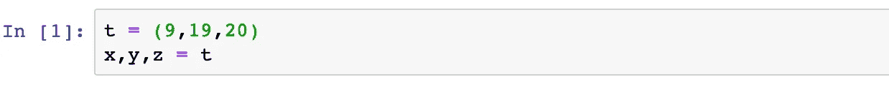
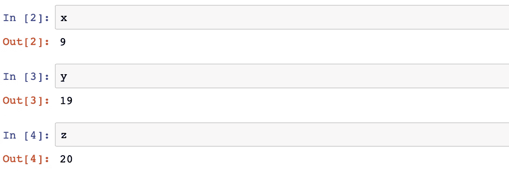
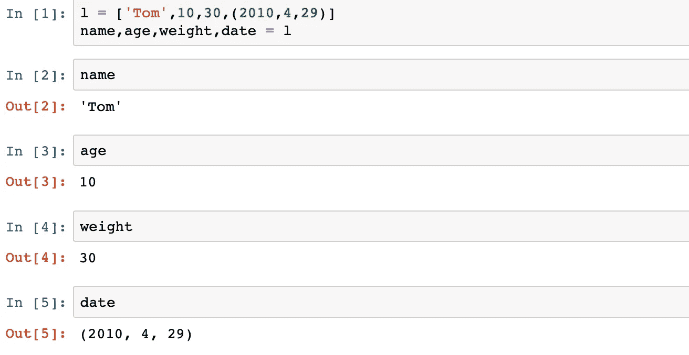
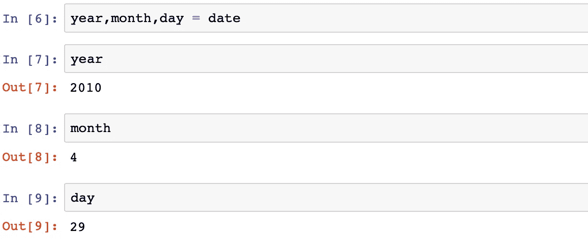
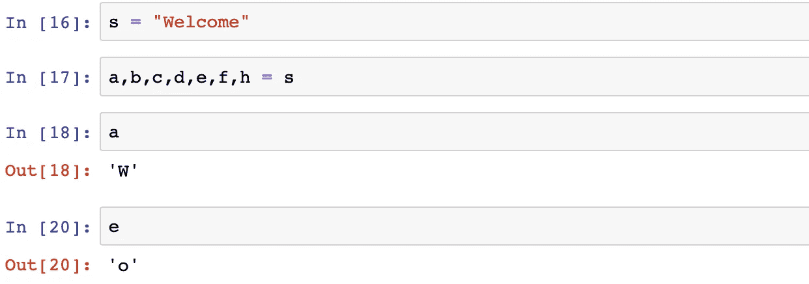
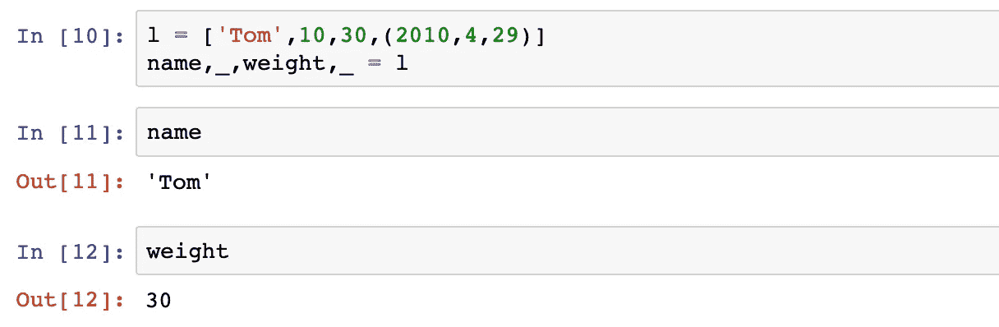
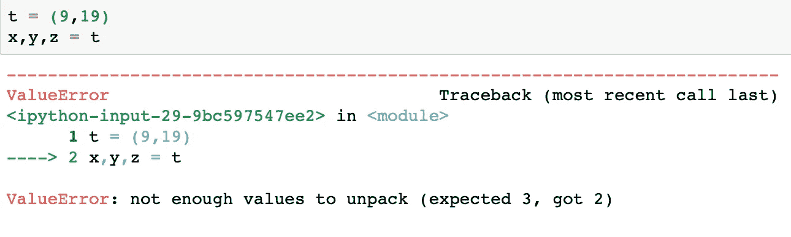
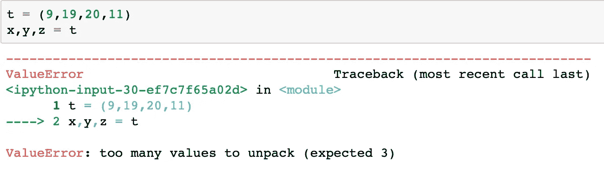

# 在 Python 中解包序列

> 原文：<https://medium.com/analytics-vidhya/unpacking-a-sequence-into-separate-variables-af26ed60d4c3?source=collection_archive---------5----------------------->

## 序列解包介绍

## 什么是序列解包？

首先，我将解释术语“序列解包”的含义。通俗地说，序列解包意味着将一个 iterable 的元素分配到多个变量中。

现在我们有一个问题，什么是可迭代的？

## python 中的可迭代对象有哪些？

在解释迭代器之前，我将首先解释迭代器。

迭代器是 python 对象，可以被迭代。(即:一次返回一个元素的能力)。

如果一个 python 对象可以被迭代，那么这个对象就叫做 iterable。例子:元组，列表，字符串，文件，迭代器，生成器。

## 现在让我们来理解如何解包一些可重复项。

***解包元组*** :

作者图片

元组 t 被分别解包到 x，y，z 中。

作者图片

***拆包列表:***

清单 l 被分别分解成姓名、年龄、体重和日期。

作者图片

日期变量是元组。因此，我们可以进一步将这个元组分解为年、月、日，如下所示。

作者图片

***解包字符串:***

字符串“Welcome”可以按如下方式解包。

作者图片

*当你只想要某些值的时候该怎么做？*

当您想要丢弃某些值时，没有特殊的 python 命令。最常见的方法是使用丢弃变量。最常见的一次性变量是“_”。(请注意，为此您可以使用任何变量名)

作者图片

注意:如果您试图解包的元素多于 iterable 中的元素，您将会得到一个错误。

作者图片

在这篇文章中，我只讨论了当你想解包 iterable 中的所有元素时，如何解包 iterable。

如果我们想从一个 N 元素的 iterable 中解包 N 个元素，其中 n < N，应该怎么做？

作者图片

我将在下一篇博文中讨论如何解决“太多值无法解包”的异常。

参考资料:

 [## Python 迭代器

### Python 中迭代器无处不在。它们在 for 循环、理解、生成器等等中被优雅地实现了

www.programiz.com](https://www.programiz.com/python-programming/iterator)  [## python | iterable 和 iterator 的区别- GeeksforGeeks

### Iterable 是一个可以迭代的对象。当传递给 iter()方法时，它生成一个迭代器。迭代器是…

www.geeksforgeeks.org](https://www.geeksforgeeks.org/python-difference-iterable-iterator/)