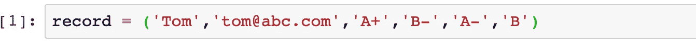
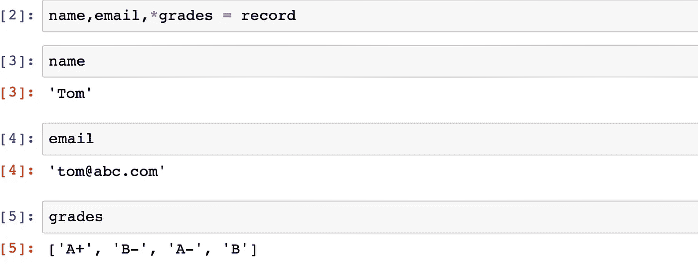
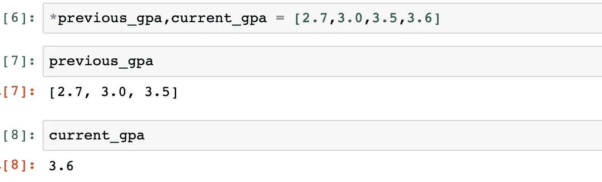
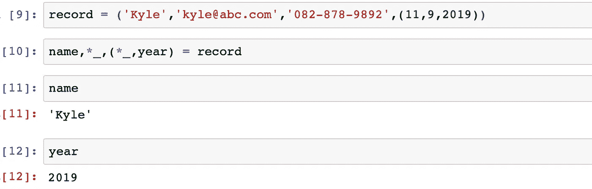
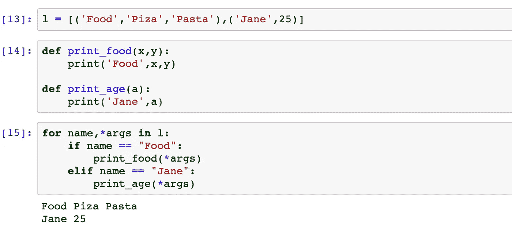
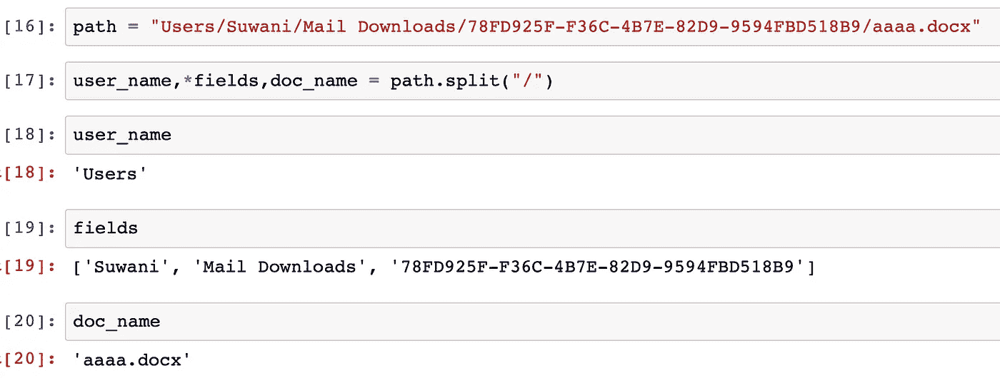

# 从任意长度的可重复项中解包元素

> 原文：<https://medium.com/analytics-vidhya/unpacking-elements-from-iterables-of-arbitrary-length-6d3eb56aaa17?source=collection_archive---------22----------------------->

扩展的可迭代解包

在我的[上一篇文章](/analytics-vidhya/unpacking-a-sequence-into-separate-variables-af26ed60d4c3)中，我解释了如何使用 python[解包](/analytics-vidhya/unpacking-a-sequence-into-separate-variables-af26ed60d4c3#3e62)一个 N 元素序列来分离 N 个变量。(也就是说，为了解包，您需要准确知道序列中有多少个元素)

今天，我将解释当你不知道有多少变量要解包或者你只想解包一个序列中的一些元素时该怎么做。

这是通过在所需的变量名前放置*运算符来实现的。这里发生的事情是，在其他变量被赋予各自的元素之后，带有*运算符的变量获取所有剩余的元素。

闲聊够了。让我们深入一些例子。

假设有一个包含汤姆的学生记录的元组。上面有汤姆的名字、电子邮件和他的成绩。

这个元组可以如下解包。

如你所见，所有的分数都被打包到变量“grades”中，因为我们使用了“*”。

这是另一个例子:

包含当前和以前的 GPA 的列表被分解成两个变量。

有时候你会觉得你不想要所有这些元素，只需要其中的一些。在这些时候，最简单也是最常见的做法是使用带*操作符的丢弃变量。最常见的丢弃变量是“_”。(请注意，为此您可以使用任何变量名)

只有必要的元素才会被解包

如果您有各种长度的元组列表，并且想要解包它，那么使用*语法特别有用。

这里，列表 l 具有长度分别为 3 和 2 的两个元组。通过使用*，两个元组都被解包。

# 奖金！！！

此方法可以与字符串运算符(如 split)结合使用，以便同时拆分和解包字符串。

同时拆分和解包字符串。