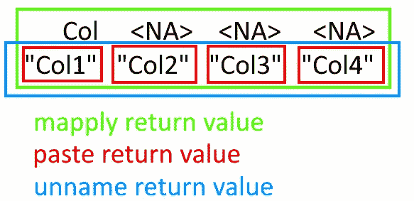

# 用 R 取消一列分隔数据的透视

> 原文：<https://medium.com/analytics-vidhya/unpivot-a-column-of-delimited-data-with-r-65139942289b?source=collection_archive---------8----------------------->

之前，我已经解释了如何在 [Power Query (Excel 和 Power BI)](/analytics-vidhya/unpivot-data-with-delimeters-in-power-query-57f57a3ddb4f?source=friends_link&sk=a9ae05c7f52c1a90d05a468ce034fbe2) 和 [Python (pandas)](/swlh/unpivot-a-column-of-data-with-delimeters-in-pandas-dataframes-d1afa034705b?source=friends_link&sk=8655dcc819ebfb65a9018adf815d95b7) 中获取一列分隔的数据并将单个值提取到它们自己的行中。

今天，我将通过解释这些数据转换如何在 r。

我将再次利用这个社交网络使用示例数据来演示这些转换。


抽样资料

目标是获取上述初始数据(从 CSV 文件加载)并将其转换为以下形式:


结果数据

另外，我还将向你展示如何用 Plotly 在一个柱状图中可视化社交网络的频率。

如果你想跳过解释直接跳到代码，请随意访问我的 GitHub 库，那里有所有的代码和样本数据。

# 拆分和取消透视数据

本演示的主要重点是拆分和取消拆分分隔的数据。


抽样资料

我们可以看到“使用的社交网络”列在每行中可以有多个社交网络(可能是调查中的多项选择问题)，用分号(；).这不是一个适合数据分析的格式，因为我们无法统计每个社交网络的频率。

因此，提取单个社交网络并将其放在自己的行上(unpivot)的逻辑如下:

*   将每行的值拆分到各自的列中(例如，脸书；Instagram 分为两栏，一栏为脸书，另一栏为 Instagram)
*   将这些带有单独选项的列放在一列中(取消这些列的透视)


拆分和取消透视数据转换

(请注意“回答者 ID”和“性别”列中的数据是如何重复的，以确保社交网络仍然与他们的回答者相关)

现在是 R 代码:

拆分和取消透视数据

我们首先加载 CSV 文件并创建两个辅助变量，`max_split_cols`和`sep_into_cols`。

`max_spit_cols`是单个受访者选择的社交网络的最大数量，即我们需要确保该受访者的所有个人选项都在自己的列中的列数。该值的计算方法是计算一行中分号的最大数量，加上一(如果一行有两个分号，则意味着受访者选择了二加一，三，社交网络)。哦，还有`na.rm = TRUE`忽略 NA/null 值。

`sep_into_cols`是为包含单个选项的列生成名称。这些名称是字符串“Col”和一个数字的串联。`mapply`类似于 for 循环，它将函数(`paste`)应用于序列的所有值(1 和`sep_into_cols`之间的数字)。`sep = ""`是传递给`paste`的额外参数。换句话说，`mapply`将通过连接“Col”和一个数字来创建一个字符串列表，在两者之间不留下任何间隔(一个空字符串，`""`)。`unname`从`mapply`返回的列表中提取实际的字符串(`mapply`实际上是返回一个命名字符串的列表，类似于 Python 中的字典)。



sep_into_cols 解释

如果文字解释不够清楚，上面的图片应该更清楚。

现在，我们可以将分隔值拆分到单独的列中(代码要点的第 13 行和第 14 行)。`%>%`操作符将前面的值作为第一个参数传递(通过管道)给后面的函数调用。举个例子，

```
some_value %>% f(y)
```

`some_value`将被解释为`f`的函数调用的第一个参数，`y`将被解释为第二个参数(请注意该运算符是由`dplyr`库提供的，它不是内置的 R 运算符)。在我们的例子中，它传递从 CSV 加载的`data`作为`separate`函数的第一个参数。这个函数负责将分隔的数据分成多个列。

除了 DataFrame 之外，我们还指定了带有分隔数据的列的名称、“使用的社交网络”、为提取的值创建的列的名称(`sep_into_cols`)、用于分割值的分隔符(分号)，以及当分割的值不够时如何填充列。最后一个参数需要注意，因为它指定了如何处理拆分值的数量少于可用列的数量的行(即大多数行)。

如果创建四列来包含拆分值(四是单个回答者选择的社交网络的最高数量)，那么当某人只选择一个、两个或三个时会发生什么？剩余的列用 NA 填充，但是最后一个参数`separate`指定了我们是先用提取的值(`right`)还是用 NAs ( `left`)来`fill`这些列。由于我们选择了`right`，结果是这样的:


用右填充分隔

但是如果我们选择了`left`,结果会是这样:


左侧填充分隔

好了，现在我们已经拆分了值，我们只需要取消这些列，我们已经完成了转换。这就是第 19 行的用途，使用`pivot_longer`函数。除了作为第一个参数传递的分割数据之外，我们还需要指定要取消透视的列的名称(将这些名称存储在`sep_into_cols`变量中会很方便)。取消多列透视时，这些列的名称放在一列中，它们的值放在另一列中。这就是分别使用`names_to`和`values_to`参数的目的。最后，我们不想保留那些在分割期间创建的额外 NA，因此我们指定了`values_drop_na = TRUE`。

因为我们不需要包含那些具有拆分值的中间列的名称的列，所以我们在第 28 行通过“取消选择”来删除它(更确切地说，通过用减号`select`来删除它)。因此，得到的数据帧就是我们所寻找的:


拆分和取消拆分数据

# 额外:统计社交网络的频率，并绘制图表

既然数据有了合适的格式，就很容易画出每个社交网络的频率。

计算频率并绘图

要计算社交网络的频率，我们只需将数据框按“使用过的社交网络”这一栏分组，并计算每个独特选项的频率。在`summarize(Frequency = n())`中，Frequency 是包含频率的列的名称，`n()`是用于计数的集合函数。不幸的是，返回的 DataFrame 只有两列，一列用于社交网络(“使用的社交网络”)，另一列用于频率(“频率”)，但这对于该图来说已经足够了。

在第二个代码要点的第 6 行，我们按频率降序排列数据帧。

在第 11 行，我们终于开始用 Plotly 创建条形图。`plot_ly`接收频率的数据帧，然后我们将该函数传送给`add_bar`函数，后者创建一个柱状图。列名前的波浪符号(~)用于将列标识为指定数据帧的列。之后，我们用管道传递另一个函数，来更新绘图的格式。我们给它一个标题，更改轴的标题，并按照“频率”列中的数据顺序排列 X 轴的数据。换句话说，X 轴的社交网络是按照频率降序排列的！


社交网络频率条形图

Plotly 图表是交互式的，即你可以放大/缩小图表，通过悬停查看额外信息等。，但在本文中只能添加一个截图。

# 结论

这是文章的结尾。我们已经完成了以下内容:

*   如何用列中的分隔符拆分数据
*   如何取消透视列
*   如何计算列中值的出现频率
*   如何创建 Plotly 条形图

像往常一样，本文的所有代码都可以在 [GitHub](https://github.com/Ze1598/medium-articles/tree/master/Unpivot%20a%20column%20of%20delimited%20data%20with%20R) 上获得。

最后，这是完整的脚本:)

完整脚本