# 在超级查询中使用分隔符取消数据透视

> 原文：<https://medium.com/analytics-vidhya/unpivot-data-with-delimeters-in-power-query-57f57a3ddb4f?source=collection_archive---------11----------------------->

有时，我们会收到这样的数据集，其中一个数据值/单元格包含由分隔符(如逗号或分号)分隔的多个单独的值。例如，谷歌表单中下载的答案会出现这种情况。当回答者回答多项选择题时，所有勾选的选项都保存在同一单元格中，用分号分隔。

但是，如果您想对这些问题的单个选项进行一些分析，该怎么办呢？每个选项被选择了多少次？如果你的数据看起来像这样

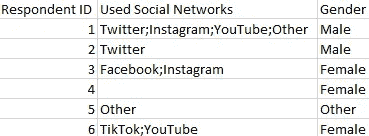

带分隔符的数据示例

那你怎么能提取任何关于个人社交网络的知识呢？这可以通过从每个回复中提取个人社交网络并将其保存在自己的行中来实现，也称为 unpivoting。

换句话说，以第一个回答者的回答为例，他们的回答会在末尾占据四行，像这样。

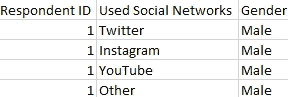

非透视数据的示例

这样，第一个回答者使用的每个社交网络都可以清楚地识别，即使他们被放在自己的行中，我们仍然知道他们属于谁，因为 ID 是同样重复的。然而，作为副作用，剩余的列也被重复(在本例中是“性别”列)。

# 输入电源查询

从文章的标题可以看出，这种取消投票是在 Power Query 中实现的，这本身意味着该解决方案可以在 Microsoft Excel 和 Microsoft Power BI 中工作。过程基本相同，但是每个软件的不同之处将在整个解释中注明。

在本次演示中，我们将使用开头所示的小型数据集，包括六名受访者的社交网络和性别:

演示数据集

# 将数据加载到超级查询中

在 Excel 中，我们需要做的第一件事是将数据范围转换成适当的表格。这很容易通过两个键盘快捷键来完成。选择范围内的任意单元格，然后按`Ctrl`和`A`选择整个范围。然后按下`Ctrl`和`T`将量程变成表格。

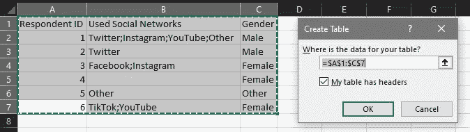

为数据集创建一个表

因为列在范围的第一行已经有了标题，所以在创建表格时要确保勾选了“我的表格有标题”选项。

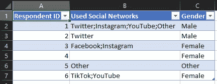

数据集表

既然数据存储在一个表中，我们可以将它装载到 Power Query 中。选中表格中的任何单元格后，导航到功能区菜单中的数据窗格，然后选择从表格/范围选项。这将把表加载到超级查询中。

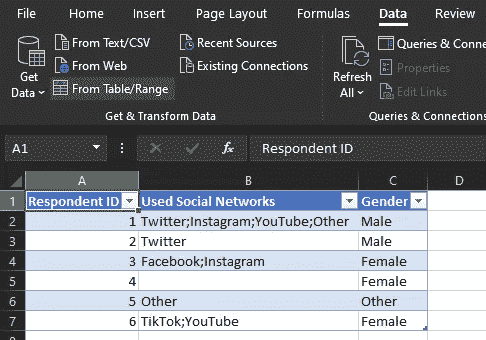

从表格/范围选项位置

在 Power BI 中，假设我们在加载数据集后尝试进行这些转换，在 Power Query 中打开数据集唯一需要做的事情就是在字段窗格中右键单击数据集后选择编辑查询选项。Power BI 和 Excel 的唯一区别是在这个过程的最后一步。电力查询中的以下操作在两个软件中完全相同。

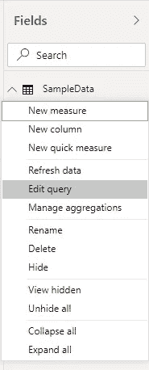

将数据集加载到超级查询中

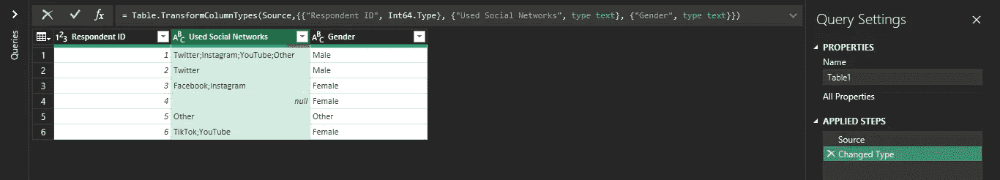

电源查询中加载的表(Excel/Power BI)

# 取消数据透视

既然数据已经加载到 Power Query 中，那么取消投票就非常容易执行了。选择目标列(“已用社交网络”)，并在功能区菜单的主页窗格下的拆分列选项中选择按分隔符。

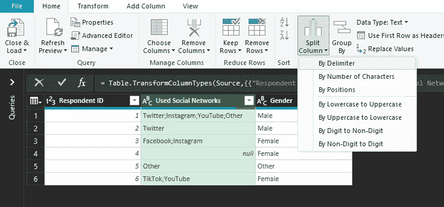

按分隔符选项位置拆分列

顾名思义，这将按照指定的 delimeter 拆分“已用社交网络”中的数据。

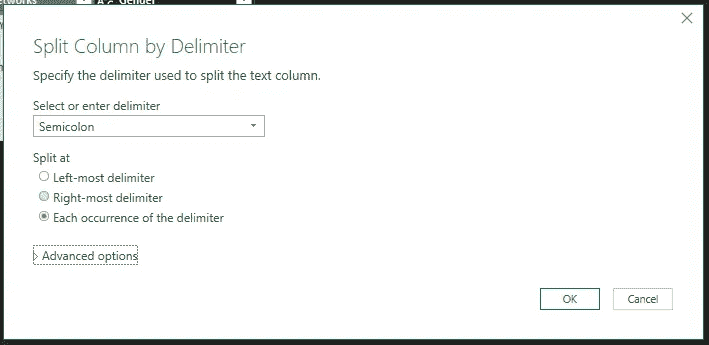

“按分隔符拆分列”对话框

我们正在寻找的分隔符是分号，我们希望 Power Query 拆分它的所有出现。但是在单击 OK 之前，高级选项中有我们执行反透视所需的最后一样东西:将拆分的数据存储在行中。

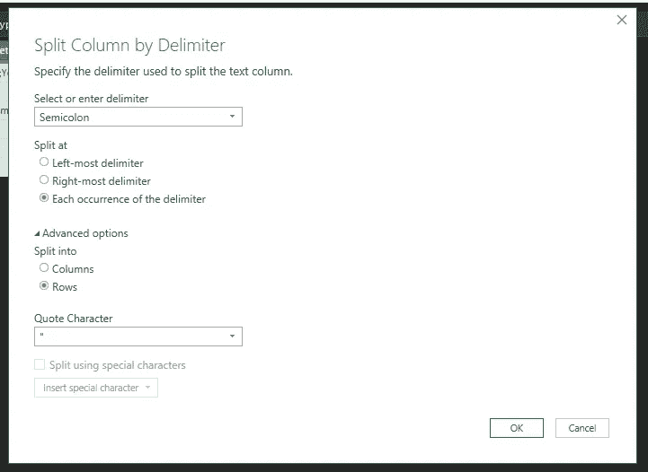

按分隔符拆分列并拆分成行

默认情况下，Power Query 会将拆分的数据存储到列中，我们需要指定要创建多少列。在这种情况下，很容易看出，对“使用过的社交网络”问题的回答最多包括四个选项，但当数据集有数百或数千行时呢？

通过将数据分成行，这将在自己的行上存储每个单独的社交网络，重复各自的“回答者 ID”和“性别”。

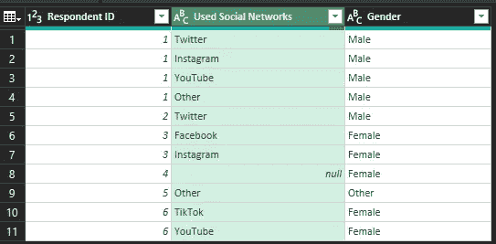

超级查询中的取消透视数据

# 应用/保存转换

我们唯一缺少的是保存结果查询/数据集。

在 Excel 中，我建议选择关闭并加载到…以便您可以选择保存结果的位置和方式。

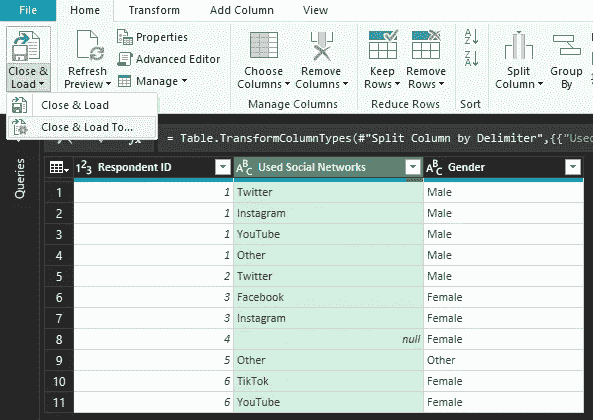

关闭并加载结果查询

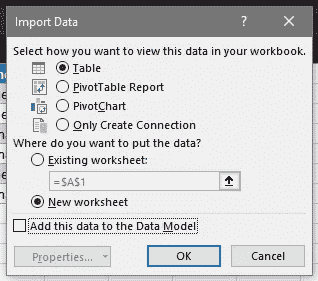

选择将结果查询导入到的位置

为了简单起见，我们可以将它作为一个表格加载到一个新的工作表中。

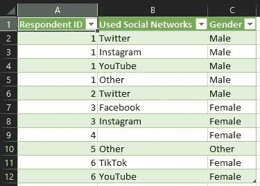

非透视数据集

在 Power BI 的情况下，我们应用更改(Close & Apply 关闭 Power 查询并立即应用转换)，而不是 Close & Load To…。

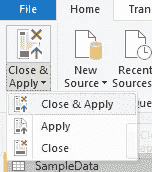

关闭并应用 Power BI 中的转换

# 结束语

至此，我们已经到了文章的结尾。既然我们可以访问每个受访者使用的个人社交网络，我们可以将它们用作过滤器，创建可视化等等。

正如我们所看到的，除了将数据加载到 Power Query 和应用/保存转换的不同选项之外，在 Excel 和 Power BI 中，通过 Power Query 使用 delimeters 取消数据透视的过程本质上是相同的。

最后，如果你想下载这个演示的样本文件，我在 GitHub 上有 Excel 和 Power BI 各一个[。](https://github.com/Ze1598/medium-articles/tree/master/Unpivot%20data%20with%20delimeters%20in%20Power%C2%A0Query)