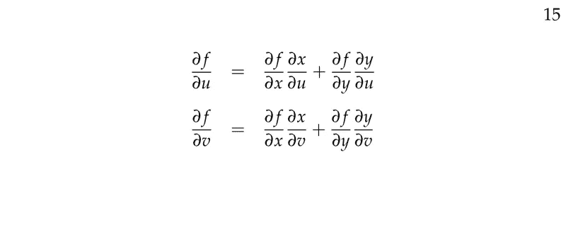
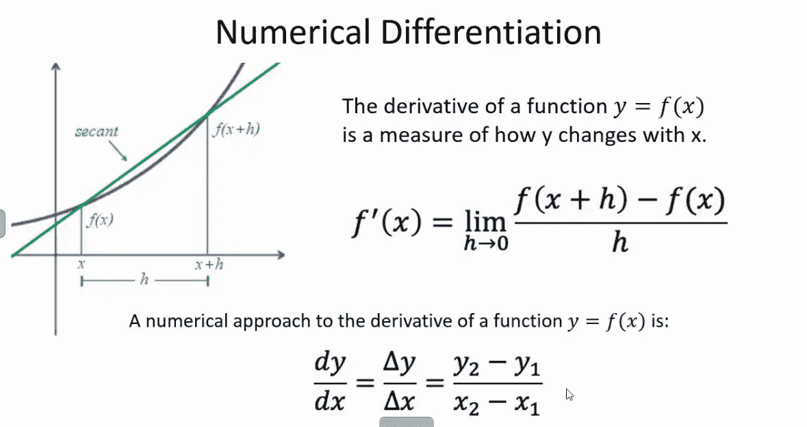
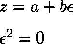
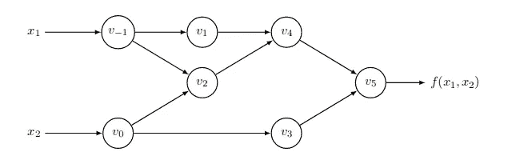
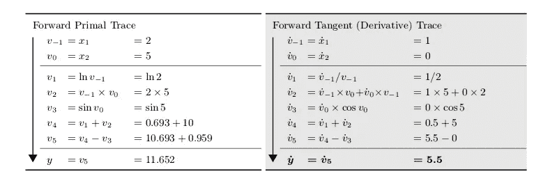
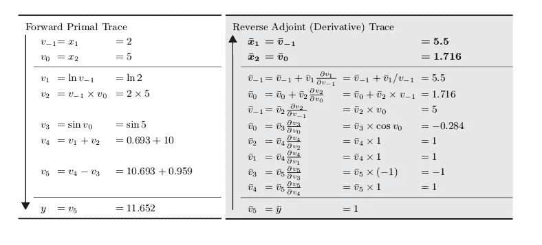

# 解开自动微分

> 原文：<https://medium.com/analytics-vidhya/unraveling-automatic-differentiation-6d5f0196f219?source=collection_archive---------1----------------------->

梯度和导数是所有机器学习算法的核心。ML 之所以只是“管用”，是因为渐变。基本思想是最小化目标损失函数，该目标损失函数取决于模型的输入和参数。这是用多元微积分和梯度的概念漂亮而优雅地完成的。

任何学完微积分基础课程的人都会发现，由于链式法则，计算可微函数的导数和梯度的过程是一个非常机械和简单的过程。但是计算机如何计算任何一般可微函数的导数呢？

手动计算导数的直接方法是行不通的，因为这一过程严重依赖于被微分的函数，并且不是通用的。让我们回到导数的第一个基本定义。

但是这种方法的准确性高度依赖于选择的 *h* ，因为 *h* 趋向于 0，这是一种非常简单的计算函数在某一点的导数的方法。

20 世纪数学研究最重要的成果之一是自动微分(AD)，也称为算法微分。大多数 ML/DL 库使用 AD 来计算梯度和导数。它有两种模式:正向模式和反向模式。让我们首先理解正向模式，因为它非常直观，并且利用了偏导数的链式法则。

## **前进模式广告**

实现前向模式广告的一个非常聪明的方法是通过双数。双数与复数非常相似，有两个组成部分。

在复数中，我们有 i = -1，同样在双数中，我们有ϵ = 0，但是反直觉地，ϵ不等于 0。ϵ可以理解为浮点数精度内的一个非常小的数，但是当它被平方后，就变成了零，无法在浮点数精度内表示。双数的算术与复数算术完全相同。

现在在对 AD 使用对偶数时，我们将实部设置为函数在某一点的值，虚部设置为函数在该点的导数。

让 *f* ( *x) = x* 写成*f(x*+*εx*'*)*=*x*+*εx*'。这是身份函数。

(*x*+*εx*’)+(*y*+*εy*’)=(*x*+*y*)+*ε*(*x*’+*y【T37’)*

(*x*+*εx*′)(*y*+*εy*′)=(*xy*)+*ε*(*xy*′+*x*′*y*)

*f*(*g*(*x*+*εx*’)=*f*(*g*(*x*)+*εg*’(*x*)*x【T19’)=*f*(*g*(*

*从上面的例子可以清楚地看出，对偶数算术按照对偶数的实部是函数值，虚部是函数的导数的约定，服从链式法则。*

*现在让我们考虑一个可微函数，并通过正向模式 AD 获得它的梯度。让*

**y=f(x1，x2)= ln(x1)+x1 * x2 sin(x2)**

*任何函数都可以写成加、减、乘、除等基本数学运算和平方根、三角函数、对数、指数函数等函数的组合。我们将这些基本函数的导数定义为规则，并利用这些规则来获得它们的复合函数的导数。*

*因此，如果我们将这个给定的函数分解为基本函数的组合，我们将获得一个计算图，其中每个基本函数/操作的输出作为节点。*

**

*这里 *v-1 和 v0* 是输入节点，其余的是中间函数，它们产生所需的输出函数。*

**

*表格的左栏显示了在 *x1 = 2 和 x2 = 5 时函数值的计算。*从图中可以清楚地看出中间节点之间的关系。右栏显示每个中间函数相对于 *x1 的偏导数。*由于 *v-1 = x1* ，所以 *v-1* 相对于 *x1* 的偏导数为 1，由于 *v0 = x2* ，并且 *x1* 和 *x2* 相互独立，所以 *v0* 相对于 *x1* 的偏导数为零。*

*由此，利用链式法则可以得到其余函数及其相对于 *x1* 的偏导数，最终我们将得到 *f* 相对于 *x1* 的偏导数。导数的值是精确的。*

*因此，如果我们有一个输入变量为 *n* 的函数，我们将不得不执行 *n* 次向前传递来获得所有的偏导数。由于输入获得输出的流动，以及偏导数的流动都是从输入到输出，这种模式称为正向模式。*

*Julia 有一个名为 ForwardDiff.jl 的转发模式 AD 包，它定义了一个名为 Dual 的结构，具有与上述相同的属性。它使用一套基本函数的微分规则，利用链式法则获得任何可微函数的偏导数。*

## ***反向模式广告***

*在反向模式中，使用广义反向传播算法从输出反向传播梯度。这是通过用定义为 *v=∂y/∂v.* 的伴随变量来补充每个输入变量 v 来实现的*

*在反向模式 AD 下，导数在两阶段过程的第二阶段计算:*

1.  *在第一阶段，原始功能代码向前运行，填充中间变量 *vi* ，并在计算图中记录依赖关系。*
2.  *在第二阶段，通过从输出到输入反向传播邻接来计算导数。*

*让我们用和之前一样的函数来理解反向模式 AD。计算图也和以前一样。我们将计算函数在 *x1 = 2 和 x2 =5* 的梯度。*

**y=f(x1，x2)= ln(x1)+x1 * x2 sin(x2)**

*该函数被分解成基本函数以形成计算图。*

****

*在第一阶段，我们将完成一次向前传递，以计算所有中间变量 v，并因此计算函数 *f 在 x1 = 2 和 x2 = 5 时的输出。*在第二阶段，我们从输出变量开始。*

*̄v5= ̄y=∂y/∂y= 1 号。这是因为 *v5 = y.* 因此偏导数为 1。现在我们反向传播到 *v4，v3，*，直到我们到达上表右栏所示的输入变量。基本功能和操作的区分规则也已定义。我们通过反向模式 AD 和正向模式 AD 得出了相同的 *∂y/∂x1* 值。*

*这种方法的美妙之处在于，我们只需向前和向后一次，就可以获得函数对所有输入变量的偏导数。所以如果我们有一个 *n* 维的输入向量和一个标量输出函数，只需要反向模式 AD 的一次前后传递就足以获得函数的所有偏导数。而正向模式 AD 将要求每个输入变量有 *n 个*正向传递。*

*如果输出函数具有 *m* 个维度，那么我们将需要 *m* 个反向模式 AD 的向前和向后传递，以获得每个输出维度相对于输入维度的梯度。反向模式 AD 的名称是合理的，因为函数计算是从输入到输出进行的，但是梯度是以相反的方向计算的，即从输出到输入。*

*Julia 在包 ReverseDiff.jl 中实现了反向模式 AD，如上所述反向传播邻接以计算梯度。*

*自动微分是机器学习中广泛使用的一个非常有力的武器。如果我们不能有效地计算梯度，我们肯定不会有这么多 ML/DL 库。Pytorch 和 Tensorflow 也是基于自动微分的原理。*

***参考文献:***

1.  *https://arxiv.org/pdf/1502.05767.pdf*
2.  *[https://Alexey . radul . name/ideas/2013/自动差异化简介/](https://alexey.radul.name/ideas/2013/introduction-to-automatic-differentiation/)*