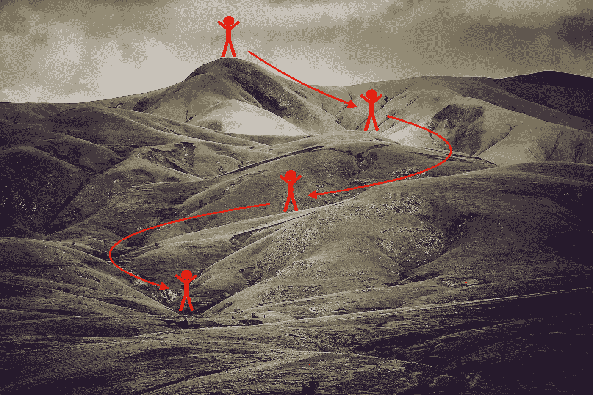
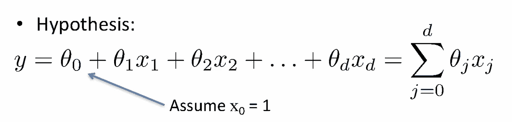
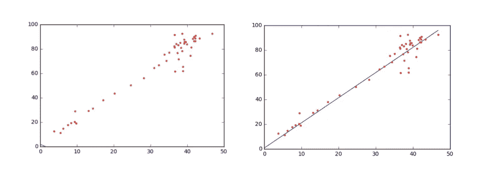
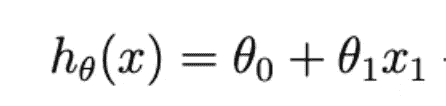
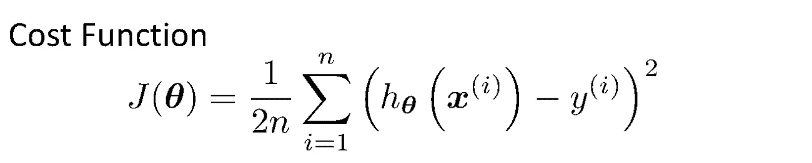
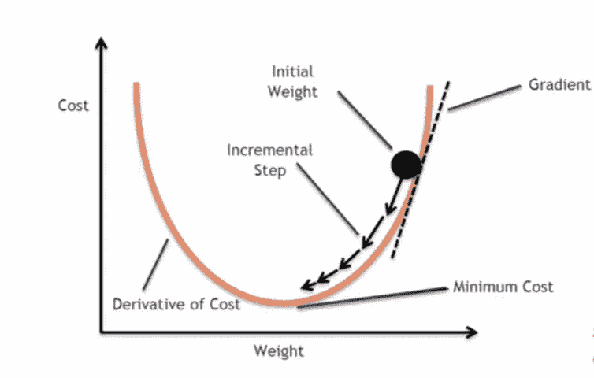
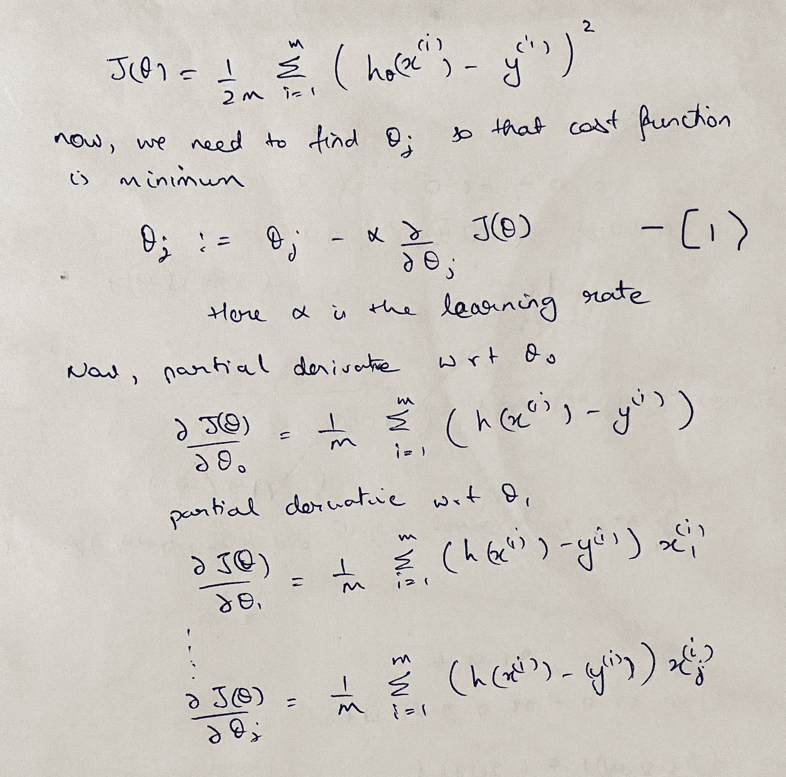
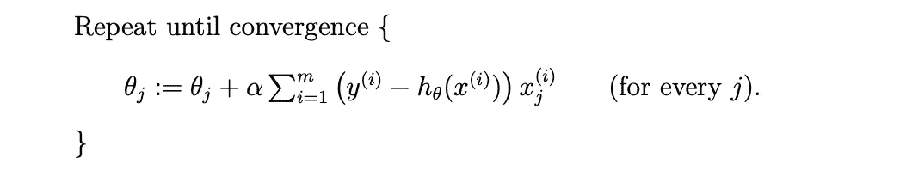
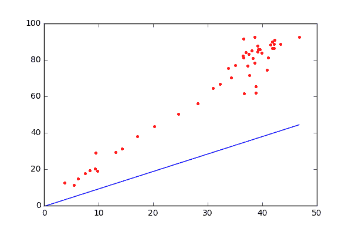
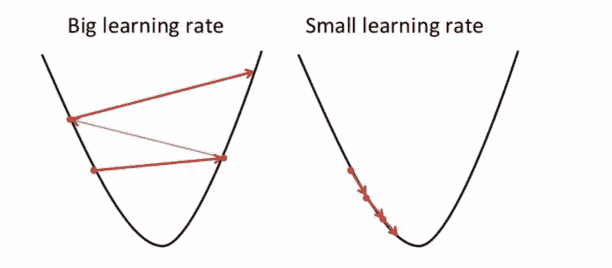

# 解开线性回归-ML 第 1 部分

> 原文：<https://medium.com/analytics-vidhya/unravelling-linear-regression-ml-part-1-99f7910a5867?source=collection_archive---------15----------------------->

[图像来源](https://datascience-enthusiast.com/DL/Optimization_methods.html)

# 概观

读者您好，希望大家身体健康。我写这篇博客是因为我看到机器学习文章的增加，这些文章解释了如何用 10 行代码实现一个模型，但很少有博客谈论它背后的数学。我决定重新开始我的博客，写一些关于机器学习背后的数学方法的文章，让你理解事情是如何工作的，而不是仅仅引入 sckit-learn 并加入激烈的竞争。我的第一篇博客涵盖了最流行和最简单的回归算法，即线性回归。

# 观众

有人对进入*机器学习/数据科学*感兴趣吗

# 回归还是分类问题？

数据科学领域的许多新手会混淆这两者。
一个标准的定义是‘当我们试图预测的目标变量是连续的，我们称之为**回归**问题。当目标变量只能取少量离散值时，我们称之为**分类**问题。这里的连续和离散是什么？基于一些特征预测房子的价格将是连续的，因为输出可以取 0…无穷大的值，而给定房子的特征，我们需要确定房子是否处于可销售状态是一个分类问题。

# 线性回归

假设输入变量(*特征*)和单输出(*目标*)变量之间存在**线性**关系的线性模型。以下等式将θj 描述为参数(也称为权重)，h(x)或 y 描述为假设值或预测值。

让我们举一个例子，在水平轴上使用单个特征数据，在垂直轴上使用目标，在绘图时，每个人在看到下图左边的图像时的基本直觉是一条斜线，它穿过图像右边所描绘的点。

这正是我们想要的，一个预测函数，我们传递新的特征，它为我们提供非常接近实际值的预测值。那么，**什么是最佳拟合线，如何预测该函数？**
单个特征的假设方程看起来像-

其中 h(x)是训练数据的预测值。现在，为了检查模型的最佳表现，我们需要首先设置θj 的值，并计算误差函数。这里，我们通过**最小化误差平方和(MSE)来拟合模型。**

> **为什么我们对 MSE 感兴趣，而不是计算绝对
> (实际—预测)误差。** 关于θ的 MSE 将是一个**凸函数**并且这里局部最小值和全局最小值将是相同的。因此，该算法将总是收敛到一个全局最小值。另一个原因是，我们想惩罚离预测线较远的点，而不是离预测线较近的点。

这里 h(x)是预测值，y 是训练集中的实际目标，上标“I”表示数据行。我们取常数 1/2 只是为了简化计算，因为最小化常数不会有任何影响，因此 1/2 不会影响方程。
为了最小化成本函数，我们将使用**梯度下降**。

# **梯度下降**

梯度下降是一种寻找函数最小值的迭代优化算法。这个函数就是我们的成本函数。想象你正从山顶滑雪，目标是到达山脚。当坡度较陡(误差较大)时，您可以通过进行较大的跳跃来覆盖较大的距离，但是当坡度较缓(误差)时，向底部迈出较小的步伐，并在到达底部时停止(成本函数最小，理想情况下为 0)

图片来自:[https://blog . clairvoyantsoft . com/the-ascent-of-gradient-descent-23356390836 f](https://blog.clairvoyantsoft.com/the-ascent-of-gradient-descent-23356390836f)

**梯度下降步骤:** 初始猜测θ，然后反复改变θ使 J(θ)变小，直到我们有希望收敛到使 J(θ)最小的θ值

谢谢你容忍我的笔迹

将偏导数项放入(I)部分，我们得到 **LMS 更新规则** (LMS 代表“**最小均方**”)，也称为 **Widrow-Hoff** 学习规则。下面给出的等式:

更新幅度与误差项(y(I)hθ(x(I))成比例；因此，例如，如果我们遇到一个训练示例，在该示例中，我们的预测几乎与 y(i)的实际值相匹配，那么我们发现几乎不需要改变参数；相反，如果我们的预测 hθ(x(i))具有大的误差(即，如果它离实际数据非常远，即 y(i))，则将对参数进行较大的改变

# 算法结束

下面是一个动画，展示了如何在最小化误差/成本函数的同时得出最佳拟合线。这种方法在每一步都查看整个训练集中的每个示例，称为批量梯度下降

# 学习率

如果我们选择一个非常小的学习率值，算法会非常慢，需要多次迭代才能收敛(右图)。如果我们采用非常大的学习率值，它可能不会达到局部最小值，因为它可能会来回跳动(左图)。作为起点，简单地尝试保持学习率为 0.001，你可以改变它，看看它是否表现得更好。

图片来自:[https://builtin.com/data-science/gradient-descent](https://builtin.com/data-science/gradient-descent)

# 结论

我们了解了线性回归的工作原理以及梯度下降的一些细节。
在本系列的下一篇博客中，我们将在给定的数据集上建立一个线性回归模型，并围绕它进行优化。

# 参考

[https://see . Stanford . edu/materials/aimlcs 229/cs 229-notes 1 . pdf](https://see.stanford.edu/materials/aimlcs229/cs229-notes1.pdf)
[https://builtin.com/data-science/gradient-descent](https://builtin.com/data-science/gradient-descent)
[https://blog . clairvoyantsoft . com/the-ascent-of-gradient-descent-23356390836 f](https://blog.clairvoyantsoft.com/the-ascent-of-gradient-descent-23356390836f)