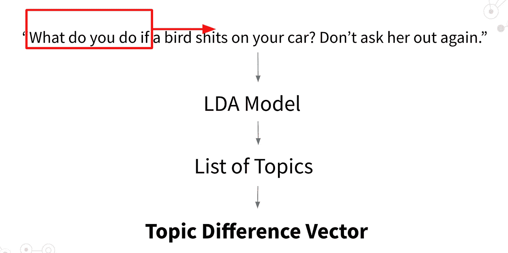
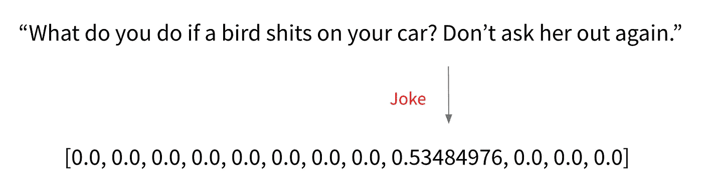
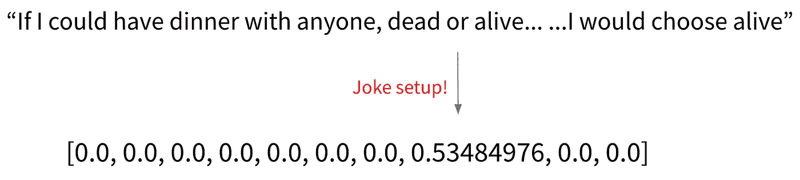
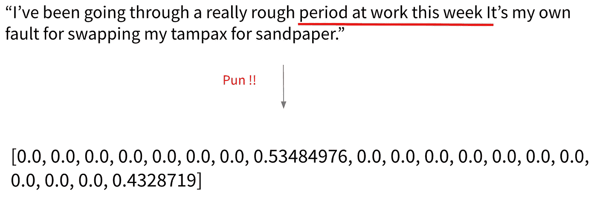

# 计算幽默识别

> 原文：<https://medium.com/analytics-vidhya/unsupervised-computational-humor-classification-8615ad0f0134?source=collection_archive---------15----------------------->

# 介绍

这个项目是由佐治亚理工学院的 Lew Lefton 博士和 Pete Ludovice 博士提出的幽默理论激发的，该理论认为幽默是同一句话中高度熟悉和高度不一致的结果。这里熟悉的含义是双重的。首先，读者熟悉句子的主题和词汇。第二，可以合理使用彼此“熟悉”的单词和短语，组成一个可理解的句子。简而言之，熟悉意味着这个句子对读者有意义。另一方面，不一致意味着句子由一些不相容的词汇和话题混合在一起组成。这一理论与阿尔伯特·李的幽默理论[1]相联系，高度不一致对应于惊讶阶段，高度熟悉对应于解散阶段。

在这个项目中，我专注于检测与句子连贯这一假设的不一致，从而包含高度熟悉性。我模拟了句子中的主题流动和变化，以便测量不一致。

# 方法

首先，使用笑话数据集和新闻数据集建立潜在狄利克雷分配(LDA)模型，并产生 100 个不同的主题。对于每个句子，长度为 4 的滑动窗口在每次迭代时通过 LDA 模型输出一个主题。如果句子是 W 个单词长，那么将产生 W-4 个主题。每个话题都是一个字典映射<word: probability="">，表示如果基于这个话题生成，有<probability>的机会生成<word>。对于每个主题，使用手套单词嵌入模型将映射中的每个词汇转换成向量。一个主题中的所有词汇通过一个加权求和操作来组合，其中嵌入的向量作为加数，概率作为权重。在这个操作之后，每个主题可以被直接嵌入到一个向量中，这个向量具有关于这个主题的语义的信息。因此，W-4 主题被转换成 W-4 向量。对于 W-4 个向量，计算每个相邻向量之间的欧几里德距离。最后，距离列表被归一化以输出表示主题变化的最终向量。在这个最终向量中，值越高，主题在该确切位置的变化越突然，因此暗示不一致。通过设置向量值的阈值，我能够以 0.85 的准确度对幽默句子进行分类。最佳阈值 0.3123 是通过随机重启的爬山随机优化找到的。</word></probability></word:>

高级管道图

*   代号:[https://github.com/JingboWang1997/HumorAnalysis](https://github.com/JingboWang1997/HumorAnalysis)

# 结果

这个管道在 500 个笑话和 500 个新闻(非笑话)数据上进行了测试。

准确率:85%

一些有趣的检测:

1.  **笑话检测**(执行点) **:**

2.**笑话设置检测**(引入新话题的点) **:**

3.**双关检测**(一个词包含在不同话题中的点):

正如所展示的，这个管道可以检测幽默的各个方面，因为这个管道对新话题的引入很敏感。

# 未来的工作

*   通用 LDA
*   更高的精度

# 引用作品:

[【1】李，伯阳人。《幽默:一个包含计算因素的动态双过程理论》*认知系统进展*4(2016):57–74。](http://www.cogsys.org/papers/ACSvol4/paper6.pdf)