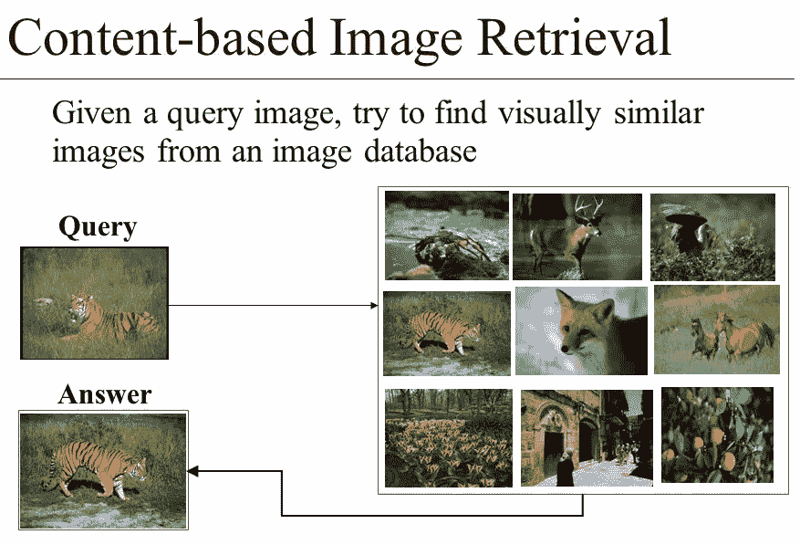
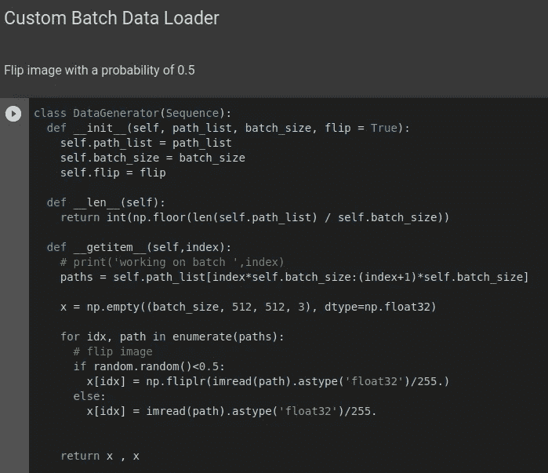
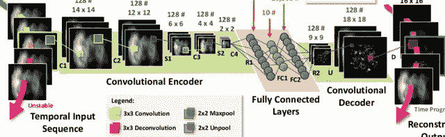
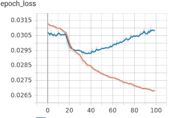
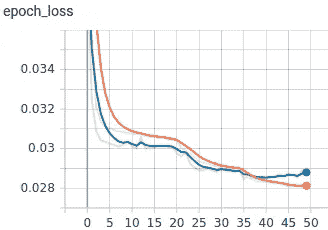
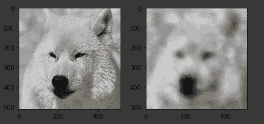
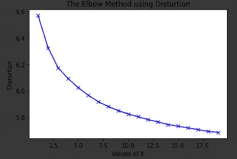

# 使用卷积自动编码器的无监督图像检索

> 原文：<https://medium.com/analytics-vidhya/unsupervised-image-retrieval-using-convolutional-auto-encoder-9d9d6db880e5?source=collection_archive---------15----------------------->

[http://slide player . com/slide/3415344/12/images/6/Content-based+Image+retrieval . jpg](http://slideplayer.com/slide/3415344/12/images/6/Content-based+Image+Retrieval.jpg)

[链接到我的包含代码](https://github.com/ManojKesani/image_retrieval)的 Github repo

## 图像检索

1.  *加载数据*
2.  *创建卷积自动编码器*
3.  *训练模型*
4.  *保存模型*
5.  *可视化自动编码器的输出*
6.  *K 的聚类和优化*
7.  *用 6 个簇训练 k means*
8.  *预测*

## *装载数据*

让我们创建一个定制的数据加载器。这个类是一个 Keras.utils.sequence 类型。它接受数据集和批处理大小的路径列表。以 0.5 的随机概率输出带有成批和翻转图像的 numpy 数组。这种类型的数据扩充有助于训练。

## *创建卷积自动编码器*

我们从编码器模块开始，它获取输入图像，并将其卷积成尺寸更小的图像。然后使用具有 512 个节点的密集连接的神经网络。此时的输出表示 512 暗潜像空间中的原始图像。

现在，我们建立解码器，采用这个 512 暗矢量，并试图重建原始图像。这可以通过上采样或 Conv2D 转置来实现。

[来源](https://www.researchgate.net/publication/305722375_Prognostics_of_Combustion_Instabilities_from_Hi-speed_Flame_Video_using_A_Deep_Convolutional_Selective_Autoencoder)

## 训练模型

现在我们有了数据加载器和模型，我们将看到培训是如何工作的。在下图中，橙色线是培训损失，蓝色线是验证损失。

随着我们训练，训练损失不断减少，而验证损失跟随训练损失一段时间，但随后又回升。验证损失的最低点是我们可以通过这种架构实现的最大压缩率。

以下是 50 epoch 的数据增强训练。

## 保存模型

model.save('Conv_AE.h5 ')保存模型到当前工作目录。

## 可视化自动编码器的输出

我们可以想象解码器的最终输出。

## K 的聚类和优化

在[聚类分析](https://en.wikipedia.org/wiki/Cluster_analysis)中，**肘方法**是一种[启发式](https://en.wikipedia.org/wiki/Heuristic)，用于[确定数据集](https://en.wikipedia.org/wiki/Determining_the_number_of_clusters_in_a_data_set)中的聚类数。该方法包括将[解释的变化](https://en.wikipedia.org/wiki/Explained_variation)绘制为聚类数的函数，并选取曲线的[弯头作为要使用的聚类数。同样的方法也可以用来选择其他数据驱动模型中的参数个数，比如描述一个数据集的](https://en.wikipedia.org/wiki/Elbow_of_the_curve)[主成分](https://en.wikipedia.org/wiki/Principal_component)的个数。-维基百科

## 预言

用 K 作为 6，我们训练一个 K 均值模型来聚类图像。我们获取查询图像并通过编码器。然后，512 Dim 向量的输出通过 Kmeans 模型，并预测其所属的聚类数。然后，我们可以查询该图像与其所属的聚类中的所有图像的相似性。

## 丰富

我们可以使用像 Efficientnet 模型这样的预训练模型作为特征提取器，一些监督标记可以帮助建立三重丢失模型。

**资源**

监督结构的良好资源

[https://Neptune . ai/blog/content-based-image-retrieval-with-siamese-networks](https://neptune.ai/blog/content-based-image-retrieval-with-siamese-networks)