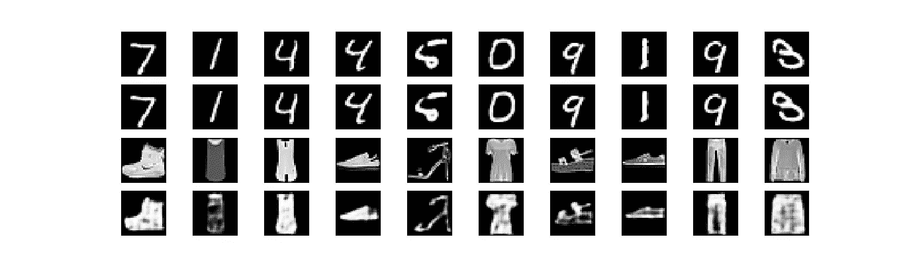

# 用于图像异常检测的无监督学习和卷积自动编码器

> 原文：<https://medium.com/analytics-vidhya/unsupervised-learning-and-convolutional-autoencoder-for-image-anomaly-detection-b783706eb59e?source=collection_archive---------4----------------------->

**图一。来自 MNIST 的 18 幅图像作为正常数据，来自时尚-MNIST 的 2 幅图像作为异常数据。**

**图像异常检测**出现在现实生活应用的许多场景中，例如，检查医学图像中的异常情况或识别装配线上的产品缺陷。在这篇文章中，我们设置了自己的案例来探索**在无监督学习范式下使用卷积自动编码器进行图像异常检测的过程。**下面简单介绍一下数据、任务、解决方案和评估标准。

*   来自[MNIST 手写数字数据集](https://keras.io/datasets/#mnist-database-of-handwritten-digits)的图像被认为是正常数据，来自[时尚-MNIST 时尚产品数据集](https://keras.io/datasets/#fashion-mnist-database-of-fashion-articles)的图像被认为是异常数据。(图 1)
*   任务是开发一个异常检测系统，该系统仅由正常数据训练，但将用于在测试期间识别正常数据和异常数据。
*   我们解决方案的核心是一个[自动编码器](https://blog.keras.io/building-autoencoders-in-keras.html)，它基本上是一个编码器-解码器系统，将输入重构为输出。我们的目标是训练一个卷积自动编码器，使其能够以较小的重建误差从正常数据重建图像，但以较大的重建误差从异常数据重建图像(图 2)。我们的解决方案基于重建误差的阈值来决定图像是来自正常数据还是来自异常数据。
*   该任务的评估标准是在测试数据集中分别识别正常数据和异常数据的准确性。

**图二。自动编码器重建误差较小的正常数据(** [**左**](https://blog.keras.io/building-autoencoders-in-keras.html) **)和误差较大的异常数据(右)。**

这篇文章的其余部分组织如下。首先，我们将解释整个数据集和训练/验证/测试数据集的组织。接下来，我们将简要介绍自动编码器的概念以及将其应用于异常检测的想法。最后，我们将介绍我们解决方案的完整流程，然后评估结果。

# 1.MNIST 和时尚-MNIST

我们认为来自 MNIST 手写数字数据集(图 3 中的左边部分)的图像将是正常数据，来自时尚-MNIST 时尚产品数据集(图 3 中的右边部分)的图像将是异常数据。这两个数据集都被包含在深度学习库 [Keras](https://keras.io/datasets/) 中。

**图三。MNIST 和时尚-MNIST。**

表 1 显示了用于培训、验证和测试的数据。

**表 1。训练/验证/测试数据集。**

*   **训练数据集** : 54000 幅 28x28 的 MNIST 图像用于训练卷积自动编码器；
*   **验证数据集** : 6000 幅 28×28 的 MNIST 图像用于两个目的:1 .验证验证数据集的平均损失*是否在训练数据集*的平均损失*的邻域内，以查看卷积自动编码器是否过拟合；2.开发用于分离正常数据和异常数据的重建误差阈值；*
*   **测试数据集** : 500 张 28x28 的 MNIST 图像和 500 张 28x28 的时尚 MNIST 图像用于最终检查。

# 2.什么是自动编码器，如何训练自动编码器学习 MNIST

一个**自动编码器**基本上是一个编码器-解码器系统，它将输入重构为输出。这通过两个子系统实现:**编码器**接收输入(例如，图像、一段音频/声音、文本等。)并将其映射到内部表示(例如，代码、嵌入或特征向量)，而解码器**获取内部表示并将其映射回原始输入。图 4 显示了自动编码器的架构。典型地，编码器和解码器被实现为深度神经网络。**

**图 4。一个自动编码器的架构[**[**ref**](https://en.wikipedia.org/wiki/Autoencoder#Basic_Architecture)**]。**

有趣的是，从一开始，自动编码器的目标就是在无监督学习下学习给定数据集的表示。然而，它可以用于许多不同的场景，例如，特征提取、降维、噪声消除或数据生成。

在我们的情况下，我们采用卷积自动编码器来学习 MINST 的表示，并希望它在测试期间可以从 MNIST 重建图像比从时尚 MNIST 重建图像更好，因为前一种情况是从已知表示，而后一种情况是从未知表示。遵循 Keras 的博客[中的想法，我们的自动编码器学习 MNIST 的代码如图 5 所示。](https://blog.keras.io/building-autoencoders-in-keras.html)

**图五。Keras 实现的自动编码器。**

训练数据集和验证数据集的二进制交叉熵的损失历史如图 6 所示。

**图六。培训损失和验证损失。**

# 3.如何定义重建误差的度量和阈值

在自动编码器完成学习过程之后，建立异常检测机制有两个主要步骤:(1)定义原始图像和重建图像之间的重建误差的度量，以及(2)确定重建误差的阈值，以便分离正常数据和异常数据。

**图 7。重建误差的概念。**

这里，我们将交叉熵视为原始图像和重建图像之间的重建误差，并将重建误差平均值的 3 个标准差视为阈值。注意交叉熵的实现似乎很棘手。详情请参考[此处](https://stackoverflow.com/questions/49473587/why-is-my-implementations-of-the-log-loss-or-cross-entropy-not-producing-the-s)和[此处](https://stackoverflow.com/questions/47377222/what-is-the-problem-with-my-implementation-of-the-cross-entropy-function)。将正态分布和异常检测联系起来的思想可以在[这里](https://anomaly.io/anomaly-detection-normal-distribution/index.html)中找到。

> 注:**均方误差**或**结构相似性指数(SSIM)** 也可用作重建误差。查看[ [此处](https://www.pyimagesearch.com/2014/09/15/python-compare-two-images/)和[ [此处](https://towardsdatascience.com/image-classification-using-ssim-34e549ec6e12)了解更多详情。但是，如果自动编码器针对交叉熵进行了优化，则最好使用交叉熵作为重构误差。

# 4.评估测试数据集

500 幅 MNIST 图像和 500 幅时尚 MNIST 图像被用于评估我们的异常检测过程。

**步骤 1** :将所有图像传入自动编码器，得到其对应的重建图像；(图 8 显示了一些图像对作为示例。)

**第二步**:计算每对图像的交叉熵重建误差；(图 9 以绿色示出了 MNIST 图像的重建误差，以蓝色示出了时尚 MNIST 图像的重建误差。)

**第三步:**以重建误差均值的 3 个标准差为阈值，识别正常数据和异常数据；(图 9 用红色显示了阈值线。)

**图 8。来自测试数据集的一些原始图像(第 1/3 行)和重建图像(第 2/4 行)。**

**图九。MNIST 图像和时尚 MNIST 图像的交叉熵。**

图 9 显示识别正常数据和异常数据的准确率为 99.80%。

# 5.结论

这篇文章描述了在无监督学习的范例下使用卷积自动编码器进行图像异常检测的过程。然而，根据我的经验，许多现实生活中的图像应用，例如检查医学图像或产品缺陷，都是通过监督学习来实现的，例如图像分类、对象检测或图像分割，因为它可以提供更多关于异常状况的信息，例如异常状况的类型和位置(潜在的大小和数量)。另一方面，监督学习需要在所有图像上进行标记，这不仅是劳动密集型的，而且可能有噪声。因此，在一些异常检测问题中，无监督学习可能是一种合理的方法或伴侣。

感谢阅读。如果您有任何问题或意见，请随时留言。