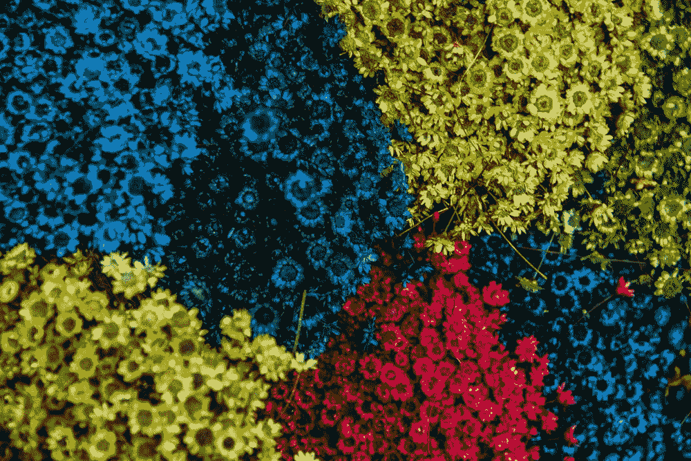
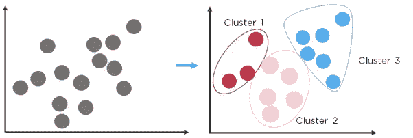
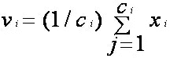
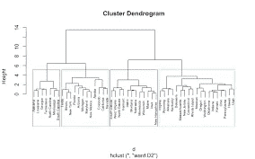
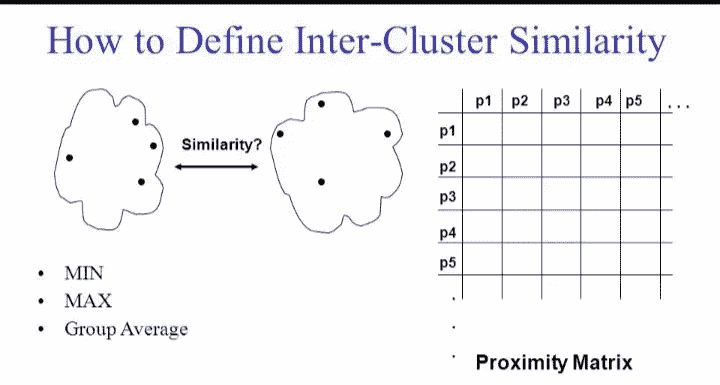
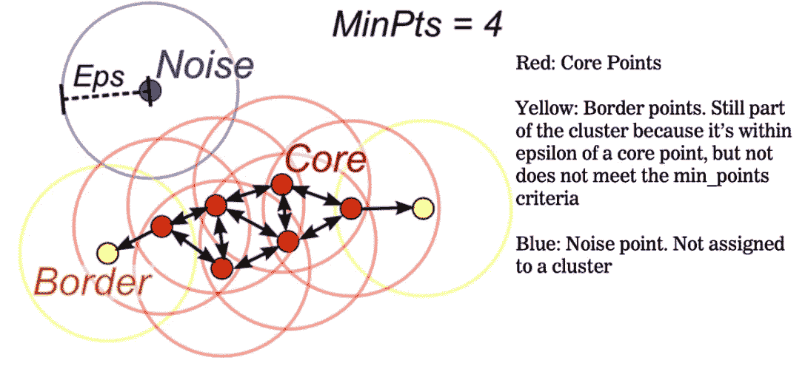
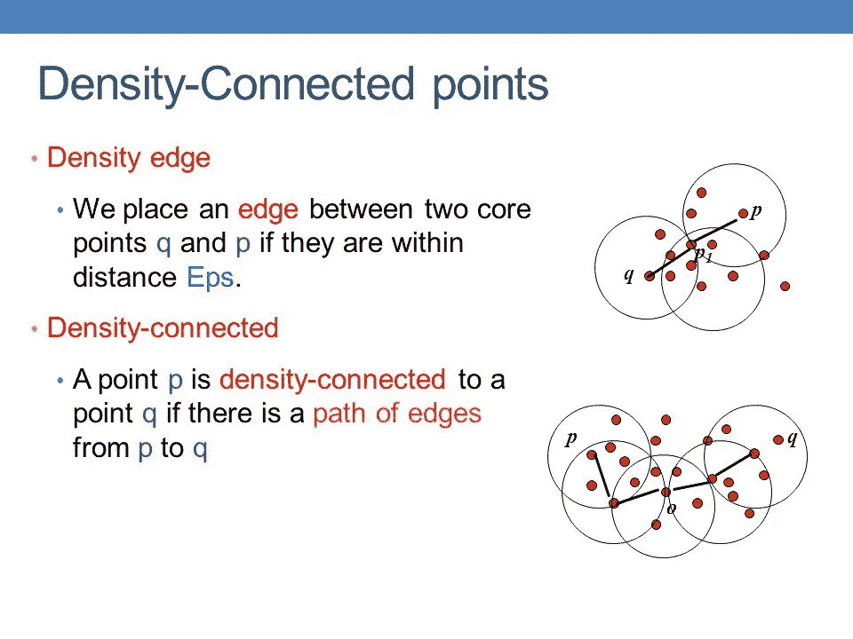
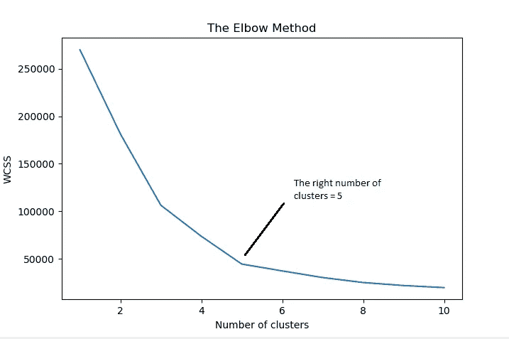

# 无监督学习:聚类算法

> 原文：<https://medium.com/analytics-vidhya/unsupervised-learning-clustering-algorithms-k-means-hierarchical-and-dbscan-clustering-3981c23efb93?source=collection_archive---------7----------------------->

## k 均值、分层和 DBSCAN 聚类

# 聚类:

聚类是对相似数据点进行分组的过程，它是一种无监督的机器学习技术，无监督 ML 技术的主要目标是找到数据点之间的相似性并将它们分组在一起，无监督意味着我们有没有类别标签的数据。

聚类相似的数据点

有 3 种基本的聚类算法:

1.  k 均值
2.  等级体系的
3.  DBSCAN(含噪声应用的基于密度的空间聚类)聚类技术。

# **1。K-Means 聚类:**

它是最流行和最简单的聚类算法，该算法的主要目的是为给定的数据找到聚类，我们可以说 K-Means 聚类技术是一种基于质心的聚类技术，这里“K”意味着我们需要多少个聚类，为了确定正确的“K”，我们应该有领域知识，否则我们可以使用“肘”膝方法找到正确的 K。

**K 均值的数学目标函数:**

*目标函数的主要目标是最小化聚类内距离(对于每个点集中的每个聚类，最小化点与质心之间的距离)。

## 劳埃德算法:

1.  初始化:从数据集中随机选取“k”个点，假设它们是 C1、C2、C3……Ck(质心)。
2.  任务:

*   对于数据中的每个数据点 *(xi)，选择最近的 Ci(质心)并将它们添加到 set(sj)中。*

3.重新计算/更新质心:

*   如下重新计算质心(平均值计算方法):

每组的平均值计算

4.重复步骤 2 和步骤 3，直到质心变化不大(旧质心和新质心之间的微小差异)。

## 注意:

在劳埃德算法中有一个小问题，最终的聚类依赖于初始随机选择的点，为了克服这个问题，我们有另一个算法 K-Means++。

*   K-Means++算法是一种初始化质心的概率方法。

## K 均值的限制:

*   集群将形成不同的大小和不同的形状。

# 2.分层聚类:

有两种类型的分层聚类

1.  凝聚集群。
2.  可分聚类。

## 1.凝聚聚类:

*   凝聚聚类技术是最流行的技术和迭代算法，在初始阶段，每个数据点是一个簇(簇的数量=数据点的数量)。
*   在每次迭代中，相似的聚类彼此合并，直到形成单个聚类。
*   它可以借助于基于树的(分层)树状图来可视化。

树状图:(记录合并的顺序)。

## 基本算法工作如下:

*   计算每个数据点的邻近矩阵(从我们的数据集中)。
*   在计算邻近度矩阵之后，合并两个最近的聚类，然后更新邻近度。
*   重复步骤 2，直到形成单个簇。

## 计算邻近方法:

在算法的第一阶段，我们计算邻近度矩阵，邻近度就是类间的相似度。根据 4 种方法计算簇间相似性。

1.  最小值:

*   两个聚类中两个较近点之间的最小距离，相似性(c1，c2) =最小相似性(pi，pj)其中 pi ∈ c1 和 pj∈ c2 聚类。

2.最大值:

*   相似性(c1，c2) =最大相似性(pi，pj)其中 pi ∈ c1 和 pj∈ c2 聚类。

3.组平均值:

*   相似度(c1，C2)=σsim(pi，pj)/|c1|x|c2|
*   其中 pi ∈ c1 和 pj∈ c2 群集。

邻近矩阵

## 分层聚类的局限性:

*   在层次聚类中没有我们直接求解的数学目标函数。
*   空间和时间复杂度更多。

# **3。DBSCAN(带噪声的应用程序的基于密度的空间聚类)**

这是另一种流行的无监督学习技术。这里我们要知道如何测量密度。

对于这个问题，答案是首先我们应该知道一些术语:

*   最小点数
*   埃普西隆
*   核心要点
*   边境点
*   和噪声点

**一个点上的密度(p)** :超球面内的点数，以 p(点)为中心半径ε。

**稠密区:**半径为ε的超球面，至少包含 Min 个点，这里 MIN 个点和ε值都是超参数。

核心、边界和噪声点

**核心点:**如果 p 在其周围的ε半径上有>个最小点，则 p 是核心点。

**边界点:**一个点是边界点如果 p 不是核心点，那就意味着(p 在ε半径上有<个最小点)并且 p 属于邻域(q) q 是核心点。

**噪声点:**如果一个点既不是核心点也不是边界点，则称该点为噪声点。

**密度边(连接):**如果 p 和 q 是核心点，那么它们之间的距离 dist(p，q) < ε

## 基本算法工作如下:

## 第一步:

*   我们必须记住，这里我们有两个超参数，我们必须使用肘(膝)方法来调整(最小点和ε)。
*   让我们假设我们的数据集 D 包含 n 个数据点，D = (x1，x2，x3…xn)，对于我们的数据集中的每个点，将其标记为核心点、边界点和噪声点。

## 第二步:

*   如果发现任何点是任何聚类的一部分，则该点必须在ε范围内，并返回ε距离内的所有主题。
*   对所有数据点进行聚类后，从数据集中移除噪声点(属于稀疏区域的噪声点)。

## 第三步:

不与群集关联的每个核心点(p)。

*   用“p”创建一个新的集群。
*   将密度连接到“p”的所有点添加到一个新群集中。

密度连接点

## 第四步:

*   对于每个边界，点被分配给聚类中最近的核心点。

## 超参数调谐:

我们有两个超参数，即最小点和ε，总是保持最小点大于我们数据集的维数，并且最小点应该更大，在某些情况下，我们必须请领域专家选择正确的ε值。

*   我们必须使用肘(膝)法找到正确的参数。

选择正确的ε值

x 轴代表ε值，y 轴代表误差度量。

## 使用 DBSCAN 的优势:

*   它主要用于抵抗噪声。
*   它甚至可以处理不同形状的簇。

## 缺点:

*   在某些情况下，我们可以观察到密度的细微变化。
*   如果ε值发生小的变化，那么它对群集密度的影响将会改变。
*   它对超参数非常敏感。

## 聚类的应用

1.电子商务:在像(Amazon.com，e-bay，Flipkart…如果我们的任务是根据相似客户的购买行为对他们进行分组，在这种情况下，聚类技术对于解决问题非常有用。

2.图像分割:聚类技术对于给定图片中相似像素的分组/聚类是有用的，它在计算机视觉和对象检测算法中被大量使用。

3.如果我们有文本数据，我们可以使用聚类技术轻松地对相似的文本内容进行分组。

## 结论:

我们已经看到了聚类(无监督学习)的基本介绍和不同类型的聚类技术。

参考:我要非常感谢[https://www.appliedaicourse.com/](https://www.appliedaicourse.com/)这门课程清晰地展示了机器学习算法。