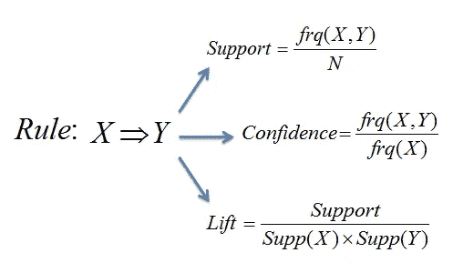
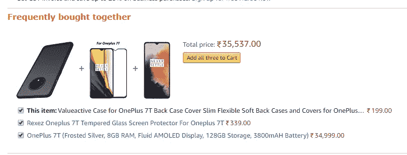

# 无监督学习

> 原文：<https://medium.com/analytics-vidhya/unsupervised-learning-de1a106c2524?source=collection_archive---------21----------------------->

使聚集

*   是将数据集分成由相似数据点组成的组的过程。同一组中的数据尽可能相似，而不同于其他组
*   用于推荐引擎。

类型:

1.  排他聚类-每个数据点只能位于一个聚类中。例如:K 均值聚类
2.  重叠聚类——允许将数据对象分组到两个或更多的聚类中。例如:模糊/C 均值聚类


A-独占，B-重叠

3.分层聚类-


根据层次聚类进行分组

## k 均值聚类

*   将相似的元素组合成一个簇
*   应用—行为分割、检测机器人。

步骤 1:选择要识别的聚类数。假设 K=3

步骤 2:随机选择 3 个不同数据点

步骤 3:测量第一个点和所选的 3 个簇之间的距离

步骤 4:将第一个点分配给最近的簇

步骤 5:计算平均值，包括第一组的新点

步骤 6:对剩余的集群重复步骤 3–5

对于步骤 2 的变化，这些迭代由模型进行多次，直到我们得到总变化最小


步骤 3，随机选择聚类的点，执行步骤 4 和 5，计算方差并继续迭代


因为我们在所选聚类点的迭代中具有更好的方差。迭代可以停止

在我之前的帖子中给出的使用 scipy 模块的 Kmeans 集群:

[](/@azamsayeed123/module-3-numpy-8d5840c2773e) [## 模块 3 — Numpy

### Numpy 数组简介

medium.com](/@azamsayeed123/module-3-numpy-8d5840c2773e) 

为了找到最佳 K 值，我们使用肘图变异对 K 数

## 关联规则挖掘

*   是一种基于规则的机器学习方法，用于发现实体之间的有趣关系

前提(如果)，结果(然后)—模式，如如果购买了牛奶，那么购买者可能会购买面包

应用市场篮子分析

*   用于标识客户购买的商品之间的关联

衡量关联性的方法



x:前提，y:结果，x=>y，x =[项目列表]

1.  Support —包含 x，y 的事务数，基于事务总数
2.  置信度——具有 x，y 的事务数除以 x 的事务数
3.  提升—检查公式

lift (x=>y) >1，如果 x 被买入，y 可能被买入

lift(x=>y) <1，y 如果买了 x 不太可能买

## Kmeans 和关联规则演示:

[](https://nbviewer.jupyter.org/gist/MohdAzamSayeed/593dc86760083d3a926378c615c4dccc) [## nbviewer 笔记本

### 看看这个 Jupyter 笔记本！

nbviewer.jupyter.org](https://nbviewer.jupyter.org/gist/MohdAzamSayeed/593dc86760083d3a926378c615c4dccc) 

## 推荐引擎

*   预测和显示用户感兴趣的项目的过滤系统。用在数字领域像亚马逊，Flipkart。可以显著提高收入、点击率、用户体验、转化率和其他 imp 指标
*   类似于销售人员，接受过向上销售和交叉销售培训。根据兴趣显示各种产品(基于浏览历史数据)
*   冷统计问题



推荐引擎示例

类型:

1.  协同过滤:收集和分析大量用户数据，如行为、喜欢、活动等，并根据其他类似用户的兴趣预测用户会喜欢什么产品。[相似的客户被归入同一群]

1a。基于用户的协同过滤

*   如果两个用户在过去有相似的口味，那么他们在将来很可能有相似的喜好。

例如，如果用户 A 已经像用户 B 一样购买了 polo 衫，并且用户 A 还额外购买了 polo 夹克，则可以基于过去的行为向用户 B 推荐 polo 夹克。

相似性度量

*   余弦相似性


1b。基于项目的协同过滤——根据项目偏好计算项目相似度，并为用户找到最相似的项目。

2.基于内容的过滤:基于产品特征，关键词指产品

3.混合推荐系统:1+2 类型组合例如:网飞[基于项目的聚类]

## 降维

*   减少大量维数的过程。

降维的类型

1.  特征消除:当某些维度对其他变量来说是多余的或者对信息没有贡献时，将其完全删除

adv:将庞大的数据集缩减为较小的块

缺点:我们可能会丢失一些有价值的数据

2.特征提取:从旧变量中提取新变量

主成分分析致力于特征提取

应用:图像处理

## 主成分分析

*   通过识别低维轴集，减少给定数据集的随机变量数量

例如:将车辆分类为轿车和公共汽车；公共汽车和小汽车的标准车轮数为 6，绝对为 4，因此差异较小，而车辆的高度可以独立变化。


与线 B 相比，a 具有较低的变量，这是因为来自线 B 的数据传播较低。所以 B 可以是主分量的方向。特征向量和特征值如上所述

具有最高特征值的特征向量是主成分线(数据从特征向量最分散)

注意:特征向量是相互正交的

示例:

假设我们有 3 个变量:手机使用时间、互联网使用时间和年龄

我们在 xy 平面上的基准点上画出 3 个相互正交的特征向量。由于数据点不在 z 平面上，我们可以认为 ev3 为零，将其移除(主成分分析的概念)


使用主成分分析将 3D 简化为 2D

SVM 演示，运行 jupyter 笔记本中的以下代码

```
from sklearn import datasets
cancer =datasets.load_breast_cancer()
print("Features: ",cancer.feature_names)
print("Labels:",cancer.target_names)
print(cancer.data[0:5])
print(cancer.target)from sklearn.model_selection import train_test_splitX_train,X_test,Y_train,Y_test =train_test_split(cancer.data,cancer.target,test_size=0.3,random_state=109)
from sklearn import svmclf=svm.SVC(kernel='linear')
clf.fit(X_train,Y_train)y_pred =clf.predict(X_test)from sklearn import metricsmetrics.confusion_matrix(Y_test,y_pred)
metrics.accuracy_score(Y_test,y_pred)
```