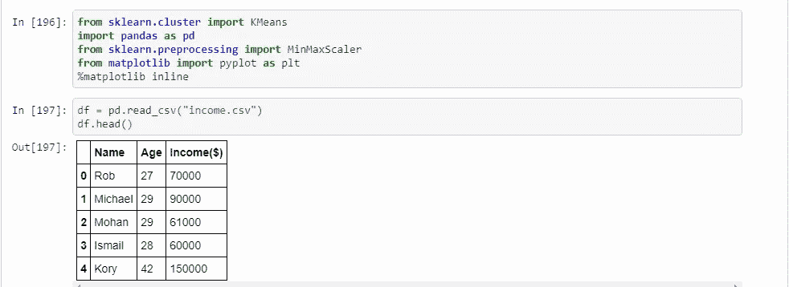
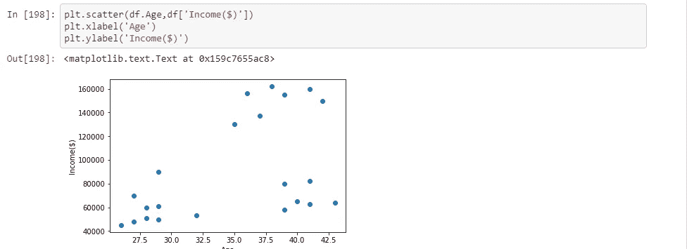
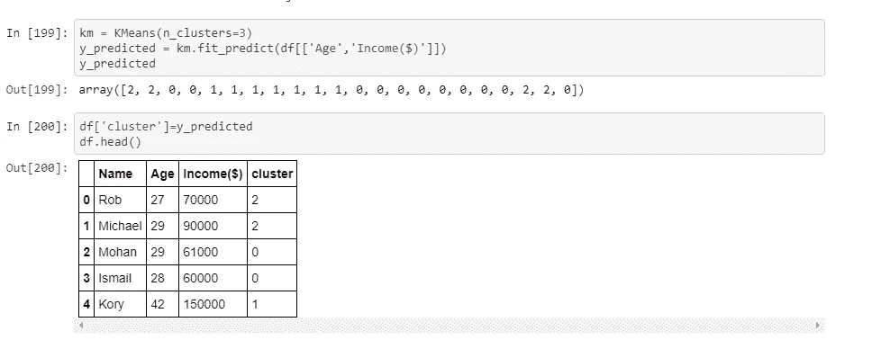
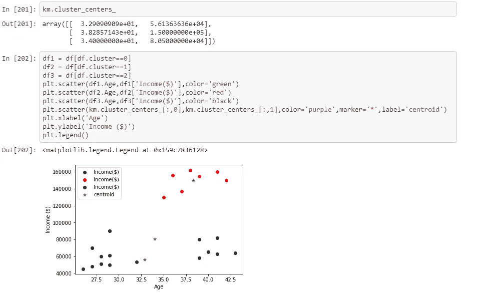
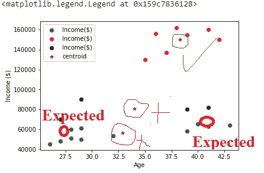
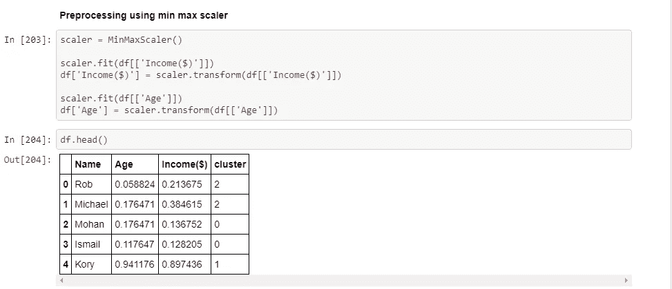
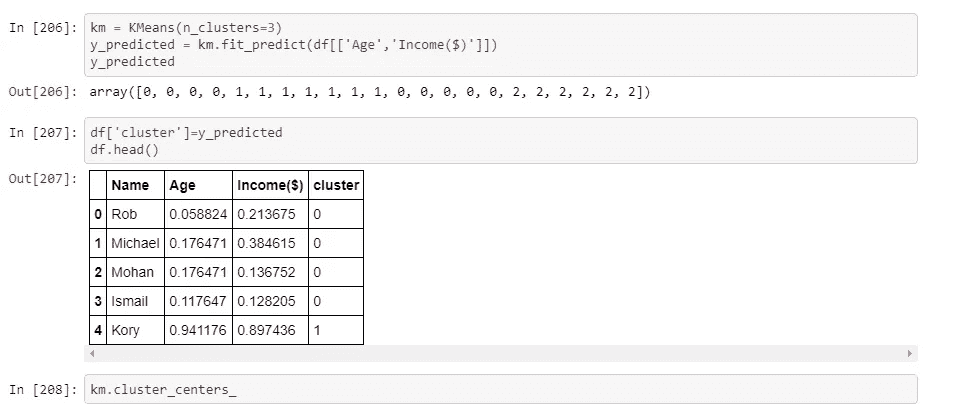
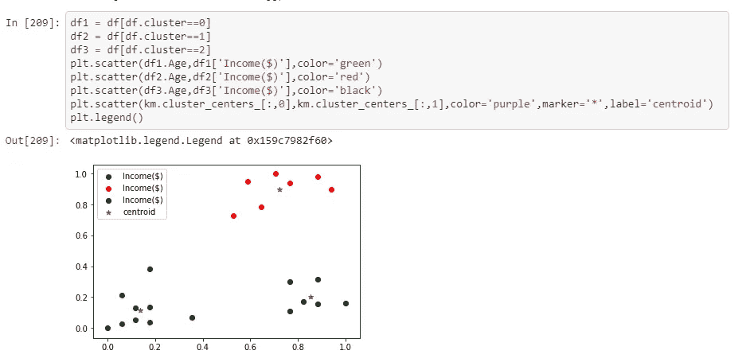
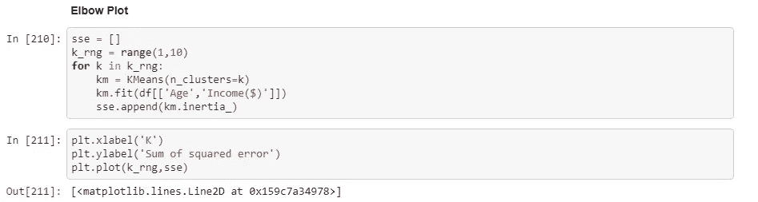
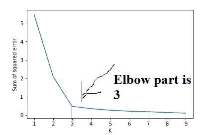

# 无监督学习:KMEANS 聚类

> 原文：<https://medium.com/analytics-vidhya/unsupervised-learning-kmeans-clustering-115b7670cebc?source=collection_archive---------19----------------------->

无监督学习是对人工智能( [AI](https://searchenterpriseai.techtarget.com/definition/AI-Artificial-Intelligence) ) [算法](https://whatis.techtarget.com/definition/algorithm)的训练，使用既未分类也未标记的信息，并允许算法在没有指导的情况下对该信息进行操作。

在无监督学习中，即使没有提供类别，人工智能系统也可以根据相似性和差异对未排序的信息进行分组。能够进行无监督学习的 AI 系统通常与生成学习模型相关联，尽管它们也可能使用基于检索的方法(这通常与[监督学习](https://searchenterpriseai.techtarget.com/definition/supervised-learning)相关联)。[聊天机器人](https://searchcrm.techtarget.com/definition/chatbot)、[自动驾驶汽车](https://searchenterpriseai.techtarget.com/definition/driverless-car)、[面部识别](https://searchenterpriseai.techtarget.com/definition/facial-recognition)程序、[专家系统](https://searchenterpriseai.techtarget.com/definition/expert-system)和[机器人](https://searchenterpriseai.techtarget.com/definition/robot)属于可以使用监督或无监督学习方法的系统。

在这篇博客中，我们将学习无监督学习技术，这种技术可以用来理解未标记的数据，并可以用来改善任何类型的业务。让我们开始吧:

K means 是一种根据相似性在数据中寻找聚类的技术。在这种情况下，我们可以使用欧几里德距离的公式来找出聚类之间的差异。让我们实际地做它:

导入所有需要的库，并使用 read_csv 函数创建一个数据帧，该数据帧位于 income.csv 文件中。该 income.csv 文件包含三列:姓名、年龄和收入。

让我们将所有这些数据绘制成图表，这样我们就可以使用 matplotlib 查看数据的行为。

正如我们可以很容易地看到，根据数据一般有 3 种类型的集群。但是仍然不容易找到星团。因为多于 3 个或少于 3 个簇是可能的。让我们看看如何？对于第一次创建 k 均值分类器。

我们制作了 n_clusters=3 的 Kmeans 分类器，由于可视化的原因，这只是随机的猜测。如果我们使用。fir_predict()它会帮助我们根据 n_clusters=3 来预测哪个数据点属于哪个类别。正如我们看到的，它给出了输出 2，0，1，这些是 KMeans 算法预测的类别。我只是将预测与数据框合并。

使用 cluser_centers_ 查看分类器预测的聚类中心，使用 matplotlib 查看数据点、聚类及其中心。

它已经错误地预测了一些星团的中心。那是因为收入和年龄所用的单位完全不同。所以我们的欧几里德距离是根据距离原理工作的。所以会出现这种错误。摆脱它。我们必须将所有的数据点转换成相同的标准分布。在这种情况下，我们将使用最小最大缩放器来实现这一点。

所以现在你可以看到所有的数据都被转换成相同的标准。现在再做一个分类器。

创建一个分类器，并获得预测和他们的聚类中心。

现在它已经正确地分类了适当的集群。现在故事 abhi baki 我只是做做样子。

你如何确定集群的数量？我们将从 1 到 n 迭代一个循环，找到距离平方的 SSE 和，并绘制一个图形。

我们必须选择图表的肘部。

恭喜您，我们已经使用 SSE 和 elbow 方法从数据集中找到了聚类数。

希望你喜欢。祝您愉快！