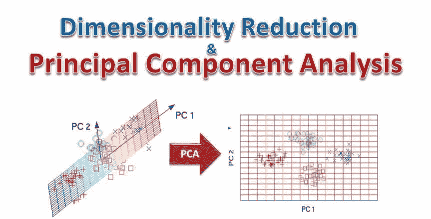
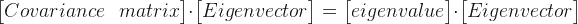

# 无监督学习—主成分分析(PCA)

> 原文：<https://medium.com/analytics-vidhya/unsupervised-learning-principal-component-analysis-pca-dc94fecef09b?source=collection_archive---------5----------------------->

来自印度的 Namaste！(电晕效应)。借我你的耳朵/眼睛来深入研究 PCA。

随机图片(为了引起注意:)

让我们以新冠肺炎数据集为例，与特征或变量的数量相比，数据点的数量非常少，这导致了**维数灾难**错误，PCA 成了救星。主成分分析是一种降维技术，它通过识别数据集中的相关性和模式，从而可以将其转换为维度显著降低的数据集，而不会丢失任何重要信息。
因此，这是一种以特定方式组合 i/p 变量/特征的特征提取技术，以便**丢弃“最不重要”的变量**，同时仍然保留所有变量中最有价值的部分。PCA 后的每个“新”变量都是相互独立的。这是一个好处，因为线性模型的假设要求我们的自变量相互独立。如果我们决定用这些“新”变量来拟合一个线性回归模型，这个假设必然会得到满足。

事实上，每一个主分量总是与其他主分量正交。因为我们的主成分彼此正交，所以它们在统计上彼此线性独立。**一般情况下，一个数据集的第 n 个主成分垂直于同一数据集的第(n — 1)个主成分。**

主成分分析

主成分分析是一种旋转数据集的方法，旋转后的要素在统计上不相关。这种旋转通常会根据新要素对解释数据的重要性，仅选择新要素的子集。
PCA 是一种减少数据集中独立变量数量的方法，尤其适用于数据点与独立变量的比率较低的情况。PCA 变换变量的线性组合，使得结果变量表示变量组合内的最大方差。

主成分分析(PCA)是一种统计过程，它使用正交变换将一组可能相关的变量的观察值转换为一组线性不相关的变量值，称为主成分。
这种变换定义为第一主成分具有最大可能的方差(即尽可能多地解释数据中的可变性)，PCA 主要用作探索性数据分析和建立预测模型的工具。它通常用于可视化种群间的遗传距离和亲缘关系。PCA 可以通过数据协方差(或相关性)矩阵的特征值分解或数据矩阵的奇异值分解来完成，通常在初始数据的归一化步骤之后。每个属性的归一化包括均值中心-从变量的测量均值中减去每个数据值，使其经验均值(平均值)为零-以及，
可能的话，归一化每个变量的方差，使其等于 1；请参见 Z 分数。并且每个随后的分量又在与前面的分量正交的约束下具有可能的最高方差。

= >高度相关的特征——意味着高偏差——去掉 1 个变量。

=>PCA 去除不一致、冗余数据和高度相关的特征。

= >非参数并解决过度拟合-由高维度引起。过滤噪声数据集，如图像压缩。

PCA 步骤: **1。数据标准化:-**
缩放数据 PCA 中主要的预处理步骤是使用 z-score 或 standardscalar 缩放变量，以缩放每个变量，使两者具有相似的范围，从而使方差具有可比性。
**z =变量值—均值/标准差**
**2。计算协方差矩阵:-** 衡量每个变量如何相互关联。

**3。计算特征向量和特征值:-**
我们的数据分散的方向。(特征向量。)-线性变换后方向不变的向量。
这些不同方向的相对重要性。(特征值。)—去除相关特征向量的标量
PCA 结合了我们的预测器，并允许我们去除相对不重要的特征向量。
**4。计算主成分:-**
主成分基本上是线性不相关且在数据中有方差的向量。从主成分中挑选出方差最大的前 p 个。
PCA 变换变量的线性组合，使得结果变量表达变量组合内的最大方差。
通过以降序对特征向量进行排序来获得来自实际的新变量集，其中具有最高特征值的特征向量是最重要的，因此形成第一主分量。
**5。在不损失信息的情况下，通过选择最佳成分来降低数据的维数。**

**Python 代码示例:-**

# scaling
从 scipy.stats 导入 zscore
XScaled = x . apply(zscore)
XScaled . head()
#协方差
covMatrix = np.cov(XScaled，row var = False)
print(cov matrix)
# PCA
PCA = PCA(n _ components = 6)
PCA . fit(XScaled)
#特征值
print(pca.explained

#根据这些值选择 3 个最佳组件，然后使用这些组件特征进行回归
PC a3 = PCA(n _ components = 3)
PC a3 . fit(x scaled)
print(PC a3 . components _)
print(PC a3 . explained _ variance _ ratio _)
xpca 3 = PC a3 . transform(x scaled)

regression _ model _ PCA = linear regression()
regression _ model _ PCA . fit(xpca 3，y)
regression _ model _ PCA . score(xpca 3，y)

reference:-
[https://scikit-learn . org/stable/modules/generated/sk learn . decomposition . PCA . html](https://scikit-learn.org/stable/modules/generated/sklearn.decomposition.PCA.html)
[https://medium . com/@ raghavan 99 o/principal-component-analysis-PCA-explained-and-implemented-eeab 7 CB 73 b 72](/@raghavan99o/principal-component-analysis-pca-explained-and-implemented-eeab7cb73b72)
[https://medium . com/@ aptrishu/understanding-principle-component-analysis-e32be 0253 ef 0【参考](/@aptrishu/understanding-principle-component-analysis-e32be0253ef0)

关注我的其他博客:-

[数据科学爱好者的数据集来源](/@nishu61988/dataset-sources-for-datascience-lovers-7484b3f78a8f?source=your_stories_page---------------------------)

[脸书](https://www.facebook.com/NishuArt-109507937410651/?modal=admin_todo_tour) | [Instagram](https://www.instagram.com/datasciencewithmemes/)