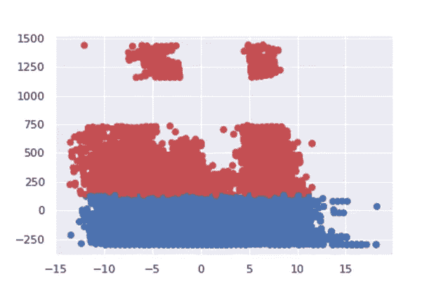

# k 均值无监督学习第一部分

> 原文：<https://medium.com/analytics-vidhya/unsupervised-learning-with-k-means-part-1-32f19670e8cc?source=collection_archive---------15----------------------->

在机器学习中，学习的类型可以大致分为 3 种类型:1 .监督学习，2。无监督学习和 3。半监督学习。属于无监督学习家族的算法没有依赖于数据的预测变量。数据没有输出，只有输入，输入是描述数据的多个变量。这就是集群的由来。

聚类的任务是将一组对象组合在一起，使同一聚类中的对象彼此之间比其他聚类中的对象更相似。相似性是反映两个数据对象之间关系强度的度量。距离是用于测量相似性的最常见的度量。

在这篇文章中，我将介绍 k-means。

本文中使用的数据集可从[https://archive.ics.uci.edu](https://archive.ics.uci.edu/)获得

[https://archive . ics . UCI . edu/ml/datasets/Activity+recognition+with+healthy+older+people+using+a+无电池+可穿戴+传感器#](https://archive.ics.uci.edu/ml/datasets/Activity+recognition+with+healthy+older+people+using+a+batteryless+wearable+sensor)

摘自 Shinmoto Torres，R. L .，Ranasinghe，D. C .，Shi，q .，Sample，A. P. (2013 年 4 月)。传感器支持的可穿戴 RFID 技术，用于降低在病床附近跌倒的风险。2013 年 IEEE RFID 国际会议(第 191-198 页)。IEEE。

我的 github repo 中有这个笔记本

[https://github . com/bentechno/datasciencecourses/blob/dev/1 blogpostmonthkmeans . ipynb](https://github.com/bentechno/datasciencecourses/blob/dev/1BlogPostMonthKmeans.ipynb)

k-means 是商业世界中最常用的数据聚类(无监督学习)算法，这得益于它的主要优势:

*   良好的(或可接受的)准确性和性能。
*   其可解释性，集群可以很容易地向商业人士解释。

K-means 算法并不复杂。维基百科的定义是: *k* -means clustering 旨在[将](https://en.wikipedia.org/wiki/Partition_of_a_set) *n* 个观测值划分成 *k* 个簇，其中每个观测值都属于与[means](https://en.wikipedia.org/wiki/Mean)最近的[个簇](https://en.wikipedia.org/wiki/Cluster_(statistics))，作为簇的原型。 *k* -Means 最小化类内方差(平方欧几里德距离)，但不是常规欧几里德距离，这将是更困难的:平均值优化平方误差，而只有几何中值最小化欧几里德距离。


其中 *ml* 是类 Ci 中元素的平均值。在这种情况下，聚类的数量是预先固定的，并且它代表算法的唯一参数，均值被递归地估计。

然而，这种算法也有一些缺点:聚类数 K 必须预先固定，它收敛于局部极小值，不适合非凸结构和不同大小的类。但是一些预处理步骤(即特征工程)可以帮助解决这个问题。

笔记本的第一段，在下面几行显示了如何加载数据。您的数据位于 data/Datasets _ Healthy _ Older _ People/dataset 文件夹

```
import pandas as pd
import glob, ospathFiles = r’data/Datasets_Healthy_Older_People/dataset’
all_files = glob.glob(os.path.join(pathFiles, “*”))
li = []
for filename in all_files:
    df = pd.read_csv(filename, index_col=None, header= None, names=[‘timeSec’, ‘accFrontal’, ‘accVertical’, ‘accLateral’, ‘antennaID’, ‘rssi’, ‘phase’, ‘frequency’, ‘activity’])
    li.append(df)
dataAll = pd.concat(li, axis=0, ignore_index=True)
```

我将使用 scikit learn 来执行 kmeans，更多信息请访问[https://scikit-learn . org/stable/modules/generated/sk learn . cluster . k means . html](https://scikit-learn.org/stable/modules/generated/sklearn.cluster.KMeans.html)

如果你对从头实现 kmeans 感兴趣，你可以在这里找到一个帖子[https://medium . com/machine-learning-algorithms-from-scratch/k-means-clustering-from-scratch-in-python-1675d 38 eee 42](/machine-learning-algorithms-from-scratch/k-means-clustering-from-scratch-in-python-1675d38eee42)

让我们将数据集分为一个训练集和一个测试集，并删除一些不相关的列，如 antennaID、activity 和 frequency

```
import sklearn
dataAll1, dataAll2= sklearn.model_selection.train_test_split(dataAll, test_size=0.4, random_state=0)
dataAllPart = dataAll2.drop(['antennaID','activity', 'frequency'], axis=1)
```

**聚类评估:剪影评分**[https://blog . floydhub . com/introduction-to-k-means-clustering-in-python-with-scikit-learn/](https://blog.floydhub.com/introduction-to-k-means-clustering-in-python-with-scikit-learn/)

在确定聚类的数量之前，我们可以尝试一系列的数字，以确保我们选择的是最佳的数字。这里有两件事需要考虑:

1.  如果我们有可用的数据点的基本事实标签(类别信息)(这里不是这种情况),那么我们可以利用外部方法，如[同质性得分](https://scikit-learn.org/stable/modules/generated/sklearn.metrics.homogeneity_score.html)、[完整性得分](https://scikit-learn.org/stable/modules/generated/sklearn.metrics.completeness_score.html#sklearn.metrics.completeness_score)等等。
2.  但是，如果我们没有数据点的地面真实标签，我们将不得不使用固有方法，如基于剪影系数的[剪影得分](https://scikit-learn.org/stable/modules/generated/sklearn.metrics.silhouette_score.html)。我们现在更详细地研究这个评估指标。

让我们从计算特定数据点的轮廓系数的等式开始:


在哪里，

-*s(****o****)*为数据点 **o** 的轮廓系数

-*a(****o****)*是 **o** 与 **o** 所属聚类中所有其他数据点之间的**平均距离**

-*b(****o****)*是从 **o** 到 **o** 不属于的所有聚类的**最小平均距离**

轮廓系数的值在[-1，1]之间。分数 1 表示最好的含义，即数据点 **o** 在其所属的聚类内非常紧凑，并且远离其他聚类。最差的值是-1。接近 0 的值表示重叠的簇。

使用 scikit-learn，您可以使用一系列的聚类数(这里是 2 到 7)非常容易地计算所有数据点的轮廓系数:

```
from yellowbrick.cluster import KElbowVisualizer
kmeans = KMeans(random_state=120)
# Instantiate the KElbowVisualizer with the number of clusters and the metricvisualizer = KElbowVisualizer(kmeans, k=(2,7), metric='silhouette')
visualizer.fit(dataAllPart)
visualizer.poof()
```


silouhette 对于 2 个类更高，这意味着 2 个类是选择的最佳类数。现在，让我们用两个集群来构建我们的模型。

```
# exploring the two classes
kmeans = KMeans(n_clusters=2)
dataAll21Class = kmeans.fit(dataAllPart)
```

让我们做一个散点图来检查是否有区别特征。

```
import seaborn as sns
import pandas as pd
import matplotlib.pyplot as plt
from pylab import savefigsns.set()
dataAllPart['label'] = dataAll21Class.labels_.astype(str)
g = sns.PairGrid(dataAllPart, hue="label", hue_order=["0", "1"],
palette=["b", "r"],
hue_kws={"s": [20, 20], "marker": ["o", "o"]})
g.map(plt.scatter, linewidth=1, edgecolor="w")
g.add_legend()
plt.savefig('scatterMatrix.PNG', dpi=700)
```


我们可以看到，时间秒是最有区别的特征，因为无论散点图中的时间秒轴使用什么轴，都可以很好地区分这两个类。

另一种可用于评估聚类的方法是 PCA。主成分分析(PCA)是一种统计过程，它使用正交变换将一组可能相关的变量(每个变量取不同数值的实体)的观察值转换为一组称为主成分的线性不相关变量的值。更多信息请访问[https://en.wikipedia.org/wiki/Principal_component_analysis](https://en.wikipedia.org/wiki/Principal_component_analysis)和[https://scikit-learn . org/stable/modules/generated/sk learn . decomposition . PCA . html](https://scikit-learn.org/stable/modules/generated/sklearn.decomposition.PCA.html)

在 2 个第一主成分的绘图之后:

```
from sklearn.decomposition import PCA
import matplotlib.pyplot as pltpcaGen = PCA(n_components=2).fit(dataAllPart)
pcaGen2Cmp = pcaGen.transform(dataAllPart)
plt.scatter(pcaGen2Cmp[:,0], pcaGen2Cmp[:,1], c=col, marker = ‘o’)
plt.savefig(“pca2.png”)
```



该图显示了根据类别很好地区分了这些点。这证明聚类工作良好。

这些群集可进一步用于其他目的，例如:

在监督学习中:我们可以使用我们的聚类结果将时间划分为两类(标签是聚类)，在带标签的数据上训练监督模型。

这篇文章是对 k-means 的介绍，我介绍了在没有先验信息和标签的情况下，使用 k-means 构建聚类所需的关键概念和材料。我没有讨论特征工程，包括处理分类特征、缩放等。这不是我目前职位的目的。

在以后的文章中，我们将讨论这些项目。