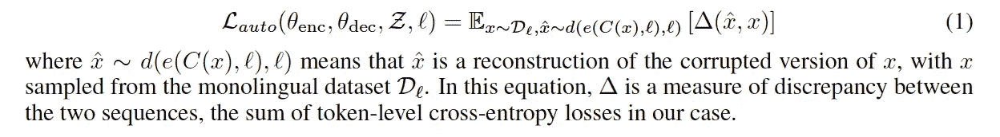

# 使用单语语料库的无监督机器翻译(论文摘要)

> 原文：<https://medium.com/analytics-vidhya/unsupervised-machine-translation-using-monolingual-corpora-paper-summary-c387de4ed6e3?source=collection_archive---------10----------------------->

*   声明:这篇文章是我的学习日志。

原文链接:[https://arxiv.org/pdf/1711.00043.pdf](https://arxiv.org/pdf/1711.00043.pdf)

图片来源: [ehlion](https://ehlion.com/ehlion-magazine/translation-software/2019/)

神经机器翻译(NMT)在当今世界非常重要。它允许说不同语言的人有效地相互交流。一个好的 NMT 模型能够高效准确地将一个句子从一种语言翻译成另一种语言。然而，NMT 模型很难训练。这篇文章介绍了脸书开发的无监督机器翻译模型。

# 为什么要无监督的机器翻译？

*   平行语料库数据集的构建成本很高。这需要大量的人力和专业知识。
*   并行语料库数据集不可用于低资源语言。

# 本文的目标

仅使用每种语言的单语语料库来训练没有监督的通用机器翻译系统。

# **关键想法**

*   在两种语言/领域(例如英语和法语)之间建立一个**共同的潜在空间**，通过在两个领域中的重构来学习翻译。
*   该模型能够处理嘈杂的翻译(从源语言到目标语言，反之亦然)。
*   源和目标句子潜在表示被**约束**为具有**相同的分布**使用对抗性正则化项(模型试图欺骗鉴别器，鉴别器同时被训练以识别给定潜在表示的语言。这非常类似于 GAN 的工作机制)。

# 体系结构

由编码器和解码器组成。

编码器->将源语句和目标语句编码到潜在空间。(两种语言只有一个编码器)

解码器->从潜在空间解码出源语句和目标语句。(两种语言只有一个解码器)。解码器与语言无关。

让我们声明:

编码器接收 W 并生成 Z。解码器接收 Z 和语言 *l* 以生成语言 *l.* 中的单词

**模型设计:**

无输入反馈的注意序列对序列模型。

输入馈送是一种将注意力向量"*作为输入馈送到下一个时间步骤的方法，以告知模型过去的对齐决策* " ( [来源](https://opennmt.net/OpenNMT/training/models/))

编码器是一个双向 LSTM，它返回一系列隐藏状态。作为 LSTM 的解码器接收先前的隐藏状态、当前单词和由编码器状态的加权和给出的上下文向量。编码器和解码器都有三层。如前所述，源语言和目标语言共享同一个编码器，解码器也是如此。注意力权重也在编码器和解码器之间共享。嵌入和 LSTM 隐藏状态维度被设置为 300。使用贪婪解码生成句子。

## **方法概述:**

培训包括几个部分:

1.  **去噪部分:**

通过在特定领域中重构句子来训练编码器和解码器。**输入的句子可以来自相同或不同的领域**。输入的句子有噪音/损坏。随机丢弃或交换单词会破坏输入的句子。

编码器和解码器通过最小化目标函数来训练，该目标函数测量它们从噪声输入中重建句子的能力。基本上，它的训练方式与典型的去噪自动编码器相同。

该零件的损失函数:

截图摘自原[论文](https://arxiv.org/pdf/1711.00043.pdf)。

2.**跨领域培训部分:**

截图摘自原[论文](https://arxiv.org/pdf/1711.00043.pdf)。

*   m 是由编码器和解码器组成的完整翻译模型。从等式 2 中，我们可以看到，loss 函数计算 x 和 x_hat 之间的令牌级交叉熵损失之和。x 从原始数据集中采样。x_hat 是将讹误的 y 馈入 M (x_hat ~ d(e(C(M(x))，l2)，l1))而产生的。注意等式 2 中 l1 和 l2 的差异。)

解释等式 2 的简单例子:

采样一个适当的英语句子(X)，对其进行编码(l1 编码)并馈入模型 M 以生成西班牙语。取生成的西班牙语，将其破坏然后编码(l2 编码)并再次馈入 M 以生成 X_hat。损失函数将试图减少 X 和 X_hat 之间的差异。

3.**对抗性训练**

神经机器翻译系统的**解码器**只有当它的输入是用训练的编码器产生的**时，或者至少，当输入**来自非常接近于由它的编码器产生的分布**时，才能很好地工作。**

为了确保输入 is 来自非常接近其编码器诱导的分布，我们需要一个鉴别器(如 GAN 中的一个)进行训练，并确保编码器可以产生能够欺骗鉴别器的输出嵌入。鉴别器将被训练来区分由编码器产生的编码是源还是目标的编码。最终，目标是训练编码器，使其能够成功欺骗鉴别器，使鉴别器无法区分源和目标的编码。当这种情况发生时，我们将非常确信解码器的输入来自一个非常接近于它所训练的编码器所诱导的分布。如果没有这种对抗性训练，我们就无法对输入来自的分布有信心，因为在训练的前两个部分期间，编码器的输入可以是任何语言(源语言或目标语言)，但现在我们希望确保神经机器翻译模型能够很好地用于源->目标翻译，所以我们添加了这种对抗性训练，以确保它能够相应地工作。

该零件的损失函数:

截图摘自原[论文](https://arxiv.org/pdf/1711.00043.pdf)。

**最终损失函数:**

截图摘自原[论文](https://arxiv.org/pdf/1711.00043.pdf)。

**整体型号:**

截图摘自原[论文](https://arxiv.org/pdf/1711.00043.pdf)。

# 结果:

论文发表的结果很有希望。只需 3 次迭代，该模型就能生成非常好的翻译。

截图摘自原[论文](https://arxiv.org/pdf/1711.00043.pdf)。

# 个人观点:

这篇论文非常容易阅读，即使对像我这样的 NMT 新手来说也是如此。它不需要任何 NMT 的背景知识。我强烈建议任何对这个主题感兴趣的人阅读论文[以获得更详细的解释和实现。这种无监督的 NMT 训练非常重要，我相信在未来会更加重要，因为标记数据总是很难找到，而未标记数据更容易获得。](https://arxiv.org/pdf/1711.00043.pdf)

如果你喜欢我的论文总结，请跟我来，给我鼓掌。谢谢你。这是我第一次写论文总结，不吝赐教，如有错误信息请告知。谢谢你。