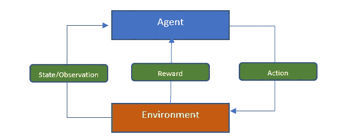

# 强化学习的未开发的力量

> 原文：<https://medium.com/analytics-vidhya/untapped-power-of-reinforcement-learning-1f02e798a9e6?source=collection_archive---------1----------------------->

强化学习是机器学习的一个分支，由于缺乏对它所能提供的好处的认识，它经常被 neo 数据科学的有志者忽视或低估。我们倾向于认为机器学习局限在无监督和有监督的学习之间，并将我们的时间和精力集中在掌握它们上。

但是，只有在我们的学习曲线中，我们才可能意识到强化学习是人工智能中的一个强大分支，当我们相应地使用它们时，它可以提供巨大的好处。虽然深度学习在 Alexnet 在图像分类方面取得巨大成功后吸引了所有的注意力，但 RL 正在慢慢发展，拥有自己的火焰大厅。

研究团体和学术界都意识到强化学习(RL)带来的好处。这一点在 Google DeepMind 团队演示 AlphaGo 之后就很明显了。在 RL 架构、策略网络、奖励系统等方面不断进行研究。

这个博客强调了 RL 的一些核心概念和最新的发展

**为什么强化学习很重要**

RL 的基本概念不同于通常的机器学习，例如 RL 不需要带有标记输出的训练数据集，而是以环境中的观察以及代理如何通过执行期望的动作获得最大回报的形式进行训练。

下面是强化学习设置中发生的事情的简化版本。在定义的环境中，基于各种观察和状态来训练代理。例如，如果环境是一个足球场，各种状态，例如传给同一个队、射门、漏截等等。每个状态都有积极或消极的内涵，适当的奖励与它们相关联。基于这些观察，RL 代理被训练，并且每个动作的奖励点数被记入代理账户。代理人的最终目标是获得最大的奖励点，而代理人的每一个负面行为都会受到惩罚。

强化学习

这似乎是训练完美人工智能机器人的理想场景，但它也不是没有挑战和缺点。

*   获得一组观察和相关的行动是困难和费时的
*   确定适当的策略系统非常重要，没有它，代理环境设置将完全失败。研究机构群体不断识别、更新和微调将在 RL 中使用的各种政策网络。
*   由于我们在深度学习中的梯度消失，类似地，缺乏适当的奖励系统将对代理行为提供微不足道的改善，或者更糟的是，它使代理在永无止境的循环中执行几组动作。
*   代理缺乏对环境设置的了解。这是设计 RL 时面临的一个常见问题，因为在许多真实世界的场景中，代理没有观察整个环境的范围。

RL 是一种基于迭代的学习，其中代理试图对一个状态应用不同的动作组合，以找到最高的累积奖励。在真实世界的场景中，这看起来几乎不可能，因为可能存在 RL 代理可能无法探索的环境中涉及的各种动态。

不考虑这些挑战，RL 提供了有希望的好处。

RL 提供了正常机器学习算法无法实现的好处。好处不仅限于游戏行业，还可以扩展到其他行业。

—强化学习算法平衡了探索和利用。探索就是尝试不同的事物，看看它们是否比以前尝试过的更好。剥削就是尝试过去最有效的方法。标准的监督学习算法不能实现这种平衡。他们通常是纯粹的剥削。

—设计完全自主的机器人，这些机器人知道它正在互动的环境。这有助于设计高效的自动驾驶汽车或基于人工智能的特定用途的机器人。RL 可以增强这些人工智能系统中采用的深度学习框架的能力。

—模拟受控环境中的用户行为，例如预测某个动作之后的下一步可能是什么。

让我们深入技术层面

**RL 带 TensorFlow 2.0**

我们知道 OpenAI Gym 是构建 RL 模型的好去处，而我们也可以利用 TensorFlow 来提供优化和性能的组合优势。

随着 TensorFlow 2.0 Alpha 的发布，Google 在 RL 中引入了许多功能。TF- Agents 是 TensorFlow 中用于构建 RL 模型的专用库。TensorFlow 2.0 承诺了一种可扩展、健壮的方法来构建 RL 模型。

它涵盖了 RL 算法的一些高级和核心元素，例如

*   深度 Q 网络
*   具有深度 RL 的双 Q 学习
*   各种奖励政策优化算法

还有更多。

除了这些，基础 TensorFlow 2.0 更新了 TF-Eager execution、TF 等。就简化模型构建和执行而言，keras 集成直接为 RL 模型构建提供了好处。

*   TF-Eager/ Eager execution 已经成为主流格式，我们不需要每次都发起会话。这是一个重大发展！
*   TensorFlow 2.0 引入 tf。函数，便于优化和运行并行执行。
*   TensorFlow 2.0 引入了更多预构建的培训环境

这些发展为 RL 的发展和演变提供了更好的路线图，是一种必须具备的机器学习技术。

**参考:**

[https://www.tensorflow.org/versions/r2.0/api_docs/python/tf](https://www.tensorflow.org/versions/r2.0/api_docs/python/tf)

【https://github.com/tensorflow/agents 号