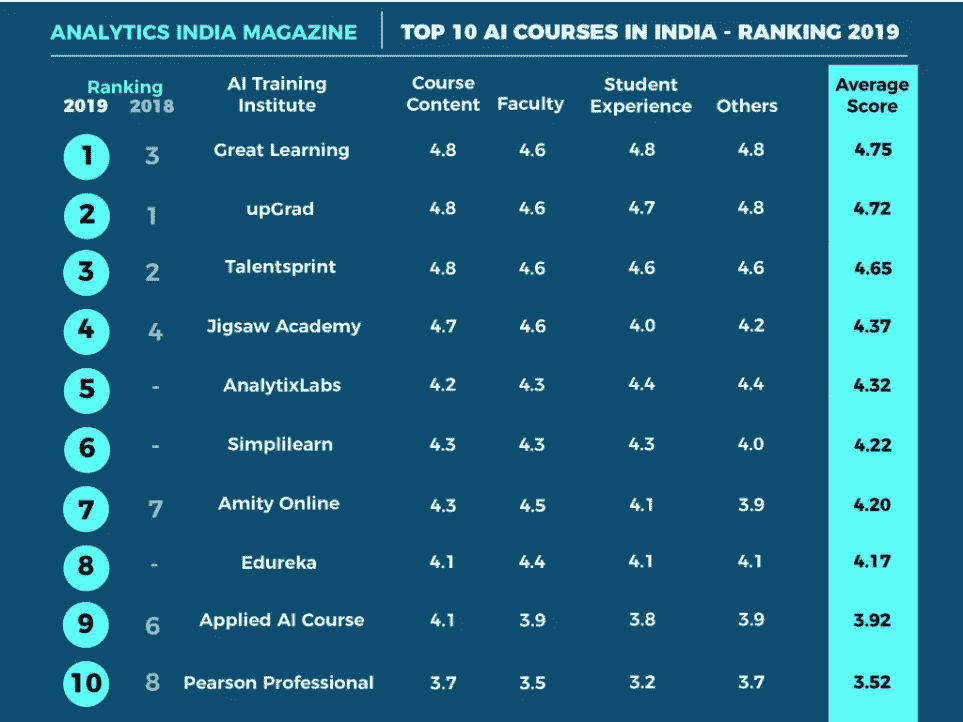

# 揭开数据科学/AIML 的神秘面纱

> 原文：<https://medium.com/analytics-vidhya/unveil-datascience-ai-ml-myths-ece412ce3752?source=collection_archive---------10----------------------->

大家好！仅仅因为丰厚的薪水而考虑继续从事数据科学职业？坚持住。浏览一下这篇文章，反省一下再决定。

**我是未来**

***关于数据科学的常见疑惑和神话:-***

1.  **数据科学家、数据分析师、数据工程师是否相同？不，他们不是。**

**数据工程师:-** 专注于数据收集和存储。建立数据管道和存储解决方案。信息架构师。维护数据访问。
*技能:-**SQL——存储和组织 data.java、Scala、Hadoop、Python——处理数据。自动化和运行任务的 Shell 命令。*

**数据分析师:-** 专注于报告/仪表板的数据准备、探索和可视化，以汇总数据。数据清理。
*技能:——SQL、Excel、Power BI、SSAS、Tableau、Python 进行数据可视化。*

**数据科学家:-** 数据准备——数据清洗、特征工程、特征缩放。
EDA——使用图表进行探索，使用 scikit 包图进行可视化
实验和预测——使用 ML 算法。
技能:-统计，Tableau，Python/R，AZURE-ML，AWS-ML。

**ML 工程师:-** 更具体地说是使用 algos 和深度学习进行预测。—图像处理，NLP。

**2。数据科学家是高薪工作吗？目前有一种传言和炒作，的确，对于合适的候选人来说，这是一份高薪工作，但随着市场的增长和更多人的涌入，情况可能会不同。**

**3。我们需要预先的编程知识吗？**
不完全是。虽然你需要分析技巧，功能方法。

**4。我们需要重数学吗？**
学校水平的概率、统计、线性代数、微积分就够了。

**5。Python 还是 R？每种语言都有自己的优缺点。然而 Python 有更高级的社区支持和 ML 库。r 主要用于形象化。**

**6。我该不该参加课程？如果你有自学能力，那么 youtube 上有足够的在线资料。否则，你可以加入在线/离线课程，如
**Great-learning、Edureka、Coursera、Upgrad、Datacamp、Simplilearn。****

资料来源:-https://analyticsindiamag.com/

**7。数据科学简介适合我吗？如果你喜欢玩数据，有分析方法，热爱数学，那么你就能出类拔萃。如果你想转换到其他职业选择，就像这样，只是因为你工资低，困在一些无聊的工作中，或者不喜欢像 Java 这样的核心编程。净然后*当心..你以后可能会后悔。***

**那么，什么是数据科学:-** 它是数学、数据分析和机器学习算法的结合，根据预测从结构化/非结构化数据中提取知识/信息。进一步的 ML 和 Deep ML 在 AI 中使用。未来几十年，随着科学数据和关于科学本身的数据变得无处不在，数据科学的范围和影响将继续大幅扩大。从以下书籍开始:-

1.  Python 机器学习入门— O'Reilly
2.  Python 机器学习— Packt- Sebastian Raschka
3.  Scikit-Learn 和 tensor flow-O ' Reilly 的 ML 实践
4.  应用人工智能手册。

万事如意！我们开始吧。

请查看我的其他博客:-

*✔* [*交叉验证机器学习:k 倍*](/ai-in-plain-english/cross-validation-k-fold-f7980608f302?source=your_stories_page---------------------------)

*✔* [*模型性能-超参数整定*](/ai-in-plain-english/model-performance-hyper-parameter-tuning-9a5d15c094bf?source=your_stories_page---------------------------)

[脸书](https://www.facebook.com/NishuArt-109507937410651/?modal=admin_todo_tour) | [Instagram](https://www.instagram.com/datasciencewithmemes/)