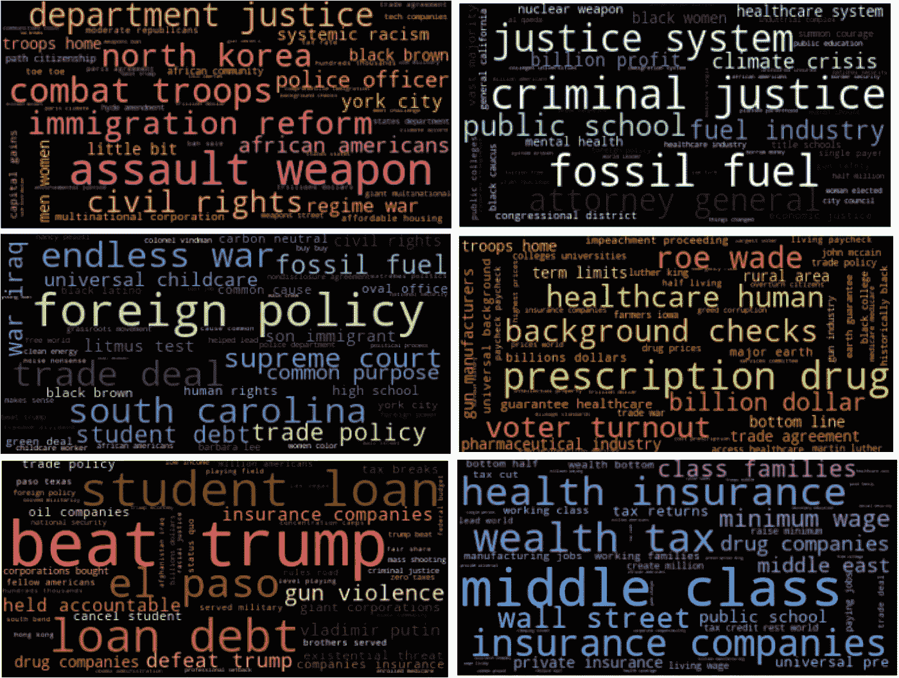

# 揭开辩论的面纱

> 原文：<https://medium.com/analytics-vidhya/unveil-the-debates-topic-modelling-and-sentiment-analysis-882483bc1b2?source=collection_archive---------25----------------------->

## 2020 年美国民主党总统候选人辩论的话题建模和情感分析

由郭培设计。候选人图片来源:[伯尼·桑德斯](https://en.wikipedia.org/wiki/Bernie_Sanders)、[伊丽莎白·沃伦](https://www.politico.com/2020-election/candidates-views-on-the-issues/elizabeth-warren/)、[乔·拜登](https://en.wikipedia.org/wiki/Joe_Biden)、[皮特·布蒂吉格](https://en.wikipedia.org/wiki/Pete_Buttigieg)、[艾米·克洛布查尔](https://www.biography.com/political-figure/amy-klobuchar)、[图尔西·加巴德](https://www.newsweek.com/where-tulsi-gabbard-didnt-qualify-3rd-dnc-primary-debate-1458818)、[汤姆·斯泰尔](https://www.wikidata.org/wiki/Q16189531)、[杨安泽](https://www.wctv.tv/content/news/Andrew-Yang-drops-out-of-presidential-race-567782591.html)、[朱利安·卡斯特罗](https://www.julianforthefuture.com/)、[贝托·奥洛克](https://www.upi.com/Top_News/US/2019/10/24/Beto-ORourke-unveils-100B-opioid-crisis-plan/4431571941556/)、[迈克尔·彭博](https://www.britannica.com/biography/Michael-Bloomberg)、

距离 2020 年美国总统大选还有几个月。然而，民主党最终候选人的竞争早在 2019 年夏天就已经开始了。从 2019 年 6 月到 2020 年 2 月，20 多名候选人之间进行了 12 场辩论。今天我们将探究辩论记录，回答一些有趣的问题。我们将要处理的数据来自于 [Kaggle](https://www.kaggle.com/brandenciranni/democratic-debate-transcripts-2020) 。你可以在这里找到关于这个项目的所有资料。

# 目标

在本文中，我们将尝试回答以下问题:

> **每个考生用的最多的词是什么？**
> 
> 随着时间的推移，每位候选人的情绪是如何变化的？
> 
> **候选人谈论了什么话题？**
> 
> **什么话题使候选人团结或分裂？**

开始吧！

# 数据清理

在开始提问之前，我们需要先准备好分析数据。这是一个原始数据预览。

数据预览

我们有 12 天的辩论记录:

独特的日期

许多人在辩论中发言:

独特的扬声器

我们只关注其中的一部分。过滤掉总发言时间超过 20 分钟的人后，我们还剩 13 名候选人。

过滤扬声器

为了进行情感分析，我们需要每行都有一个句子。所以我们需要把数据框改成新的结构。下面的函数将帮助我做这项工作。

最终的数据帧将有 3 列。“日期”列按日期分组。在每一个日期内，演讲者栏包含该日期所有出席的演讲者，按演讲者姓名分组。句子列每行有一个句子，与发言者姓名相匹配。

我们还需要降低字母，删除标点符号，过滤掉少于 25 个字符的句子。因为短句很难从中得到感悟和话题。

经过上述预处理后，我们就有了一个干净的数据框。

# **每个考生用的最多的词是什么？**

WordCloud 是一个有趣而强大的工具，可以呈现文档中最常见的单词。我们将使用下面的代码为每个候选人创建一个单词云。你认为下面的图片看起来像美国国旗吗？

民主党候选人使用最多的词是“美国国旗”。图片来源请参考本文封面图片。

这很酷，不是吗？图片中的单词越大，越经常被这个人使用。我们可以看到“唐纳德·特朗普”绝对是大多数候选人的热门话题。蓝色区域的人是最终候选人。有趣的是，川普并不是伯尼·桑德斯和乔·拜登的头号话题。伯尼更关心像气候变化这样的社会问题，而拜登认为他所说的是“事实”。我猜不要太关注特朗普，而是谈论其他问题，这可能是这两位候选人脱颖而出的原因之一。

# 随着时间的推移，每个候选人的情绪是如何变化的？

为了回答这个问题，我们将首先使用 VaderSentiment 来获得情感得分。[Vader perspection](https://github.com/cjhutto/vaderSentiment)是一款情感分析工具，专门针对社交媒体中表达的情感。它给出了负面、中性、正面和复合四种情绪得分。

[Vader 情操](https://github.com/cjhutto/vaderSentiment)

我们将向数据框添加两列。情感列包含该行中每个句子的分数，senti_comp 列包含该句子的复合分数。

情感数据框架

我们如何计算情绪变化？我们将绘制每个候选人在所有辩论时间内的综合情绪得分。下面的 13 幅图向我们展示了结果。

候选人的情绪会随着时间而变化

以下是我们在这些地块上的发现:

1.  三名候选人(汤姆·斯泰尔、科里·布克和塔尔西·加巴德)在早期辩论中表现出负面情绪，而其余的人在整个过程中保持中立或积极。
2.  以下候选人对每一场辩论都持积极态度:艾米·克洛布查尔、卡玛拉·哈里斯和朱利安·卡斯特罗
3.  乔·拜登、迈克尔·彭博和伯尼·桑德斯的情绪大部分时间保持中立。
4.  八名候选人更多地表现出积极情绪:皮特·布蒂吉格、伊丽莎白·沃伦、艾米·克洛布查尔、杨安泽、卡玛拉·哈里斯、图尔西·加巴德、贝托·奥罗克和朱利安·卡斯特罗
5.  这些候选人的情绪波动更大:伯尼·桑德斯、皮特·布蒂吉格、汤姆·斯泰尔、科里·布克、塔尔西·加巴德。

# 候选人谈论了什么话题？

潜在狄利克雷分配( **LDA** )是自然语言处理的主题建模工具。我将使用 Gensim LDA 将整个语料库转换为 6 个主题。

首先，我们需要将文本数据转换成向量，为建模做好准备。在这个过程中，首先需要确定停用词。我们应该挑选出所有常见的政治或辩论相关的词汇，以帮助真正的话题出现。我的停用词是 NLTK 和 SKlearn 停用词的组合，还有很多我定制的词。

让我们看看 LDA 找到的主题:

LDA 主题

请注意，LDA 仅帮助聚类相关单词。解释每个主题的含义是人类的工作。以下是我的解释:

人工解释的主题

我们能把话题形象化吗？再来用词云。

为主题#5 生成单词云图像

辩论话题的文字云

# 哪些话题团结或分裂了候选人？

现在我们知道辩论是关于这 6 个主题的。候选人对此有何反应？哪些话题获得了最多的认同，哪些话题引发了候选人之间的争斗？

让我们用统计学来模拟这些问题。对于每个候选人，我们可以得到该人就某个主题所说的所有句子的平均情感得分。对于每个主题，在我们获得所有候选人的平均情感分数后，我们可以计算该主题分数的标准差。标准偏差值越高，候选人对某个主题的异议就越多，反之亦然。在这里，我制作了一个新的数据框，包含每个候选人对每个主题的情感得分。

每个候选人对每个主题的情感得分

下面的代码描绘了主题的标准偏差。

分裂还是联合？

我们可以看到，候选人对“社会问题”有更多不同的看法。这是有意义的，因为像少数民族，犯罪，武器控制等话题。非常有争议。“击败川普”显然赢得了所有标准差分数最低的候选人的认同。

探索 2020 年民主党总统辩论数据集是一次富有成效的旅程。在未来，我想尝试其他 NLP 工具和模型来处理数据，看看结果是否有所不同。这种分析可以有利于任何新闻网站在未来吸引观众和选民。

感谢您花时间阅读本文。如果你喜欢这篇文章，请为我鼓掌，并随时在 Linkedin 上与我联系。