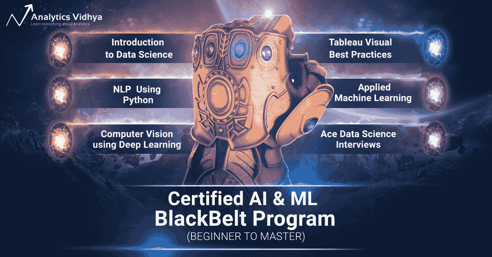
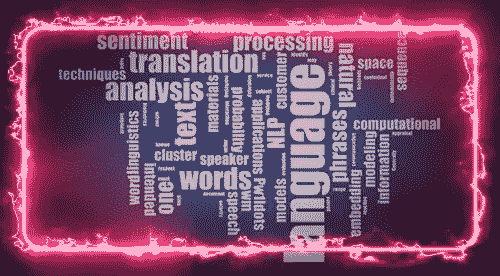
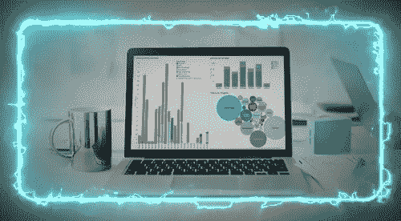

# 揭开人工智能和 ML Infinity 挑战赛-终极 10 门课程计划

> 原文：<https://medium.com/analytics-vidhya/unveiling-the-ai-and-ml-infinity-gauntlet-the-ultimate-10-course-program-c776844d31e6?source=collection_archive---------1----------------------->

> 到下一个十年，人工智能和机器学习(AI & ML)将成为每个分析专业人士最受追捧的超级能力。AI & ML 超级英雄拥有的力量是无限的，他们的机会也是无限的。人工智能现在每天都被用于日常任务。Siri、Alexa、Google Home、脸书 Feed、网飞都在用人工智能为每个人提供更好的体验。

# 认证 AI & ML 黑带计划:一个 Infinity 计划中 10+认证课程的力量

[**10+课程| 20+项目|面试指导| 1:1 导师**](https://courses.analyticsvidhya.com/bundles/ai-blackbelt-beginner-to-master/?utm_source=medium)

人工智能已经对各种行业、工作角色和商业职能产生了巨大影响。任何拥有人工智能和机器学习(AI & ML)技能的专业人士都可以在未来释放出无与伦比的力量。

如果你希望在 2019 年拥有人工智能和人工智能的超能力，并为未来做好准备——那么这是开始你旅程的正确时间。帮助你在 2019 年获得成为 AI & ML 专家的技能——check out Analytics vid hya 的旗舰产品 [**认证的 AI & ML 黑带程序(初学者到大师)**](https://courses.analyticsvidhya.com/bundles/ai-blackbelt-beginner-to-master/?utm_source=medium)**——一个与**无限挑战**一样强大的程序，它拥有来自“AI 无限石头”的莫名力量，可以控制未来和你的命运。**

**这个认证计划结合了来自数据科学、机器学习、深度学习、NLP 等 10 多个综合课程的无限学习和强大的项目，帮助您成为顶尖的 AI & ML 专业人士！**

> **[**在此报名:认证 AI & ML 黑带计划**](https://courses.analyticsvidhya.com/bundles/ai-blackbelt-beginner-to-master/?utm_source=medium)**
> 
> ****重要提示:注册只在有限时间内开放。最后日期:2019 年 5 月 2 日****

# ****认证 AI & ML 黑带项目**10+超级课程**

****1。灵魂之石——数据科学导论****

**这门课程是数据科学的灵魂。它涵盖了 Python、统计学和数据科学建模技术的基础，如线性和逻辑回归、决策树和随机森林！**

****

****灵魂石—数据科学简介****

****2。现实之石—使用 Python 的自然语言处理****

**决定什么是真什么是假的力量就像现实之石一样被 NLP 破解了。在本课程中，学习自然语言处理的基础知识，文本处理，从文本中提取命名实体，主题建模，掌握文本清理的艺术，文本的特征工程，自然语言处理的深度学习等等。**

****

****现实之石—使用 Python 的自然语言处理****

****3。心灵之石——使用 Python 的计算机视觉****

**就像思维石控制思想并实现星体投射一样，计算机视觉赋予了通过机器视图来可视化世界的能力。在本课程中，学习深度学习的基础知识，进行真实世界的案例研究，并熟悉改进模型的技巧和诀窍。**

****

****心灵之石——使用 Python 的计算机视觉****

****4。灵能石——应用 ML(初级到专业)****

**增强你的思维和分析能力，以应用于现实世界。它涵盖了机器学习的基础知识，如何建立机器学习模型，改进和部署您的机器学习模型。**

****

****灵能石——应用 ML(初级到专业)****

****5。太空石— Tableau(视觉最佳实践)****

**Tableau 是可视化世界中的一个重要工具——本课程将让您的仪表板从优秀走向卓越！了解数据可视化最佳实践的各个方面，例如正确使用颜色、选择正确的图表、减少混乱等等。**

****

****太空石— Tableau(视觉最佳实践)****

****6。时间之石— Ace 数据科学访谈****

**这门课程将帮助你随着时间的推移加速你的职业生涯，朝着正确的方向迈进。从你过去的面试错误中吸取教训，为未来做准备。了解数据科学生态系统中存在的不同角色以及每个角色所需的技能。**

****

****时间之石— Ace 数据科学访谈****

**此外，这个黑带项目包括任何人工智能专业人员都必须学习的工具技术课程。**

*   **结构化思维与沟通**
*   **用于数据科学的 SQL**
*   **Microsoft Excel(从初级到高级)**
*   **Tableau —可视化最佳实践**

**[**查看完整程序**](https://courses.analyticsvidhya.com/bundles/ai-blackbelt-beginner-to-master/?utm_source=medium)**

**所有这些超级课程结合起来，就构成了 AI & ML 的**无限挑战** **。你准备好了吗？现在开始整个节目。****