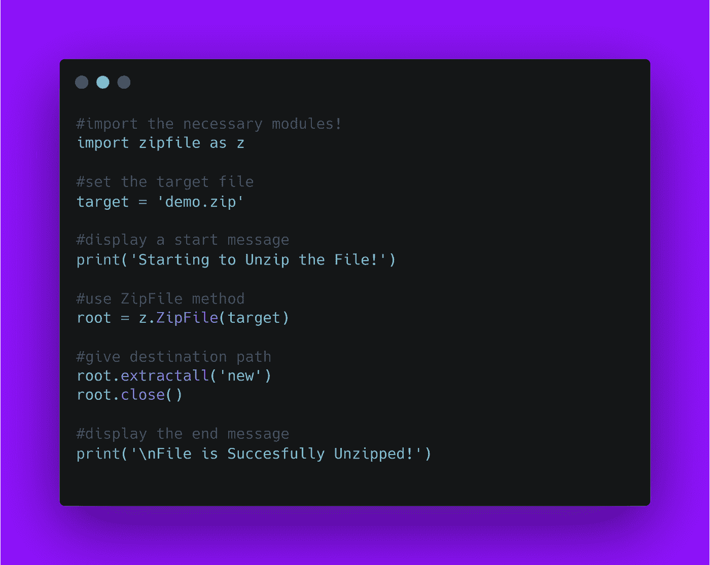

# 使用 Python 解压缩任何文件

> 原文：<https://medium.com/analytics-vidhya/unzip-any-file-using-python-9eeac7529c64?source=collection_archive---------8----------------------->

你好世界！


ZIP 文件格式是一种常见的归档和压缩标准。在这篇博客文章中，我们将学习如何解压文件。我们将看到 Python 中的实现。

[查看 python](https://github.com/ayushi7rawat/Ultimate-Python-Resource-Hub) 的终极资源库。发现有用就掉颗星！有什么要补充的吗？开个 PR 就一样了！

你可以参考我的 YouTube 视频教程，看一个工作教程来更好的理解和一步一步的指导。

# 这个博客将会涵盖什么

```
1\. What is Zip files?
2\. How to Unzip a File Using Python
```

*我们开始吧！*

# 什么是 Zip 文件？：

字典定义:

> ZIP 是一种支持无损数据压缩的归档文件格式。ZIP 文件可能包含一个或多个已被压缩的文件或目录。

Zip 文件对很多不同的事情都很有用，我们经常使用它。

# Zip 文件的用途:

*   Zip 文件帮助你把所有相关的文件放在一个地方。
*   Zip 文件有助于减少数据大小。
*   在许多连接中，Zip 文件的传输速度比单个文件快。

如果想了解更多，可以参考 [Zip 文件维基百科第](https://en.wikipedia.org/wiki/ZIP_(file_format)页)。

# 使用的模块:

# zip 文件模块:

模块提供了创建、读取、写入、添加和列出 ZIP 文件的工具。如 [PKZIP 应用笔记](https://pkware.cachefly.net/webdocs/casestudies/APPNOTE.TXT)所述，该模块的任何高级使用都需要理解格式。

如果你想了解更多，可以参考 [ZipFile 模块文档](https://docs.python.org/3/library/zipfile.html)。

现在，您已经熟悉了 *Zip 文件用例*并掌握了 *ZipFile 模块的基本知识，*我们可以前进到*编码部分。*

# 该编码了！

你可以在我的 [GitHub 库](https://github.com/ayushi7rawat/Youtube-Projects/tree/master/Unzip%20a%20File)找到所有代码。发现有用就掉颗星。



为了访问 Python 库，我们需要在 Python 脚本中导入包。

```
import zipfile as z
```

我们将利用`zipfile`模块来解压文件。现在我们已经在 python 脚本中导入了包，让我们从定义目标压缩文件开始。

```
target = 'demo.zip'
```

`demo.zip`是我们要解压缩的 zip 文件。让我们显示一条开始消息。

```
print('Starting to Unzip the File!')
```

让我们利用来自`zipfile`的`ZipFile`方法，并传入我们的目标文件。我把它存放在`root`

```
root = z.ZipFile(target)
```

完成后，让我们定义我们的目的地细节。同样，我们将使用`extractall`方法。

如果名为`new`的文件夹已经存在，它会在里面创建一个解压文件。否则，将用给定的名称创建一个新文件夹。

如果没有传递参数呢？

那么，在这种情况下，将创建一个新文件夹，其名称与压缩后的文件名相同，即`demo`。

```
#CASE 1:
# Destination folder exist with name 'dest'root.extractall('C:\\Users\imar\Desktop\python\dest')#CASE 2:
# Create a new Destination folder at the time of Script executionroot.extractall('new')#CASE 3:
# No parameter is Passed!root.extractall()
```

完成后，让我们使用`close`方法结束这个过程。

```
root.close()
```

一旦你结束终止进程，文件将被解压。让我们为用户显示一条消息，表明流程成功终止。

```
print('\nFile is Succesfully Unzipped!')
```

通过这些步骤，我们已经成功地使用 python 解压了文件。就是这样！

很简单，不是吗？希望这篇教程有所帮助。我强烈推荐你去看看 YouTube 上的视频，别忘了订阅我的频道。

您可以使用 zipfile 库，甚至探索更多功能。您甚至可以使用 Tkinter 来利用 Python GUI。

你可以在我的 [GitHub 库](https://github.com/ayushi7rawat/Youtube-Projects/tree/master/Unzip%20a%20File)找到所有代码。发现有用就掉颗星。

感谢您的阅读，我很乐意通过[Twitter](https://twitter.com/ayushi7rawat)|[LinkedIn](https://www.linkedin.com/in/ayushi7rawat/)与您联系。

请分享您的宝贵建议，感谢您的真诚反馈！

你绝对应该看看我的其他博客:

*   [Python 3.9:你需要知道的一切](https://ayushirawat.com/python-39-all-you-need-to-know)
*   [终极 Python 资源枢纽](https://ayushirawat.com/the-ultimate-python-resource-hub)
*   [GitHub CLI 1.0:你需要知道的一切](https://ayushirawat.com/github-cli-10-all-you-need-to-know)
*   [成为更好的程序员](https://ayushirawat.com/become-a-better-programmer)
*   [如何制作自己的谷歌 Chrome 扩展](https://ayushirawat.com/how-to-make-your-own-google-chrome-extension-1)
*   [使用 Python 从任何 pdf 创建您自己的有声读物](https://ayushirawat.com/create-your-own-audiobook-from-any-pdf-with-python)
*   [你很重要&你的心理健康也很重要！](https://ayushirawat.com/you-are-important-and-so-is-your-mental-health)

# 资源:

*   [en.wikipedia.org/wiki/ZIP_(文件格式)](https://en.wikipedia.org/wiki/ZIP_(file_format))
*   [docs.python.org/3/library/zipfile.html](https://docs.python.org/3/library/zipfile.html)

在我的下一篇博客文章中再见，保重！！