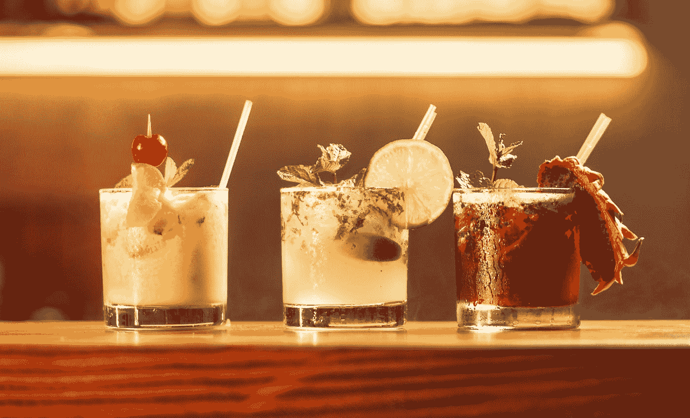
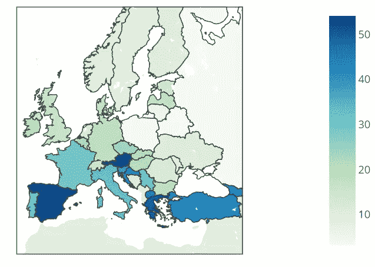

# 不同的饮酒方式:用按钮更新欧洲地图

> 原文：<https://medium.com/analytics-vidhya/updating-a-choropleth-map-of-europe-with-plotly-buttons-e48f2abbc0f6?source=collection_archive---------15----------------------->

科比·门德斯在 [Unsplash](https://unsplash.com?utm_source=medium&utm_medium=referral) 上的照片

有时，地理可视化可以传达其他类型的可视化无法传达的信息。当变量显示趋势倾向于聚集共享边界的国家时，彩色编码的地图总是便于讲述一个故事。

Chloropleth 根据定量测量绘制阴影区域，有助于检测每个区域数据集的可变性。这种地图，再加上互动按钮，**可以让讲故事的任务变得容易很多**。为了说明这个想法，我将展示一个例子，说明我们如何使用 Plotly 来了解一点欧洲的酒精饮料行业。

为了更好地理解酒精的分布方式。行业专家喜欢区分“现场”(在酒吧、餐馆、俱乐部等)消费的酒精饮料量和“场外”(在任何类型的商店购买的酒，在家中消费)消费的酒精饮料量。这些术语有时也被称为“交易中”和“非交易中”,需要事先理解，以便制定正确的分销和促销策略。随着我们增加更多的变量(酒精饮料的种类)，我们意识到并非所有种类的酒精饮料都以同样的方式消费。

在下面这张我用 Plotly 和 Python 制作的地图的帮助下，我将让数字来说话。我添加了一个按钮来切换子类别详细信息，并对规模进行了颜色编码，以突出显示“内部消费”非常重要的国家。

总体情况告诉我们，一般规则是，在大多数国家，店内与店外的划分将始终有利于在商店购买酒精饮料，并在家中饮用。我们感兴趣的是了解哪里的情况可能相反，在我们的地图中，它将是蓝色的部分。

如果我们点击**“葡萄酒”按钮，我们可以看到一个非常有趣的南北分界线，**大多数地中海国家似乎都有很大比例的“本地”消费。“烈酒”类别显示了类似的趋势，但法国似乎是一个例外。

**“啤酒”类别更像是东西方的划分**(法国再次除外)，其中英国、爱尔兰、西班牙和葡萄牙显示出在餐馆、酒吧和其他场所消费的啤酒比例很高。**北欧和波罗的海国家似乎有着非常相似的行为**，不管是哪一类饮料。

这些初步发现可能有助于希望在欧洲地区开展业务的公司，或者为具有相似特征的国家集团部署共同战略。

如果您想就此话题或任何其他话题进行交流，请随时在 LinkedIn 上找到我:

 [## Juan Felipe Alvarez -高级数据分析师-酩悦轩尼诗| LinkedIn

### 数据和分析专家，被好奇心和黑客心态所驱使。商业分析理学硕士…

www.linkedin.com](https://www.linkedin.com/in/juan-felipe-alvarez-analytics/) 

葡萄酒类别交易百分比屏幕截图