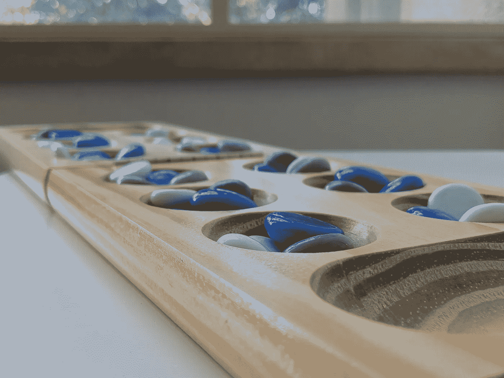

# 使用 SQLalchemy 更新非基本列类型

> 原文：<https://medium.com/analytics-vidhya/updating-non-primitive-columns-types-using-sqlalchemy-and-postgres-12f8206ba457?source=collection_archive---------19----------------------->



我当时正在做一个简单的 python 项目——一个两人游戏，名为 [Mancala](https://en.wikipedia.org/wiki/Mancala) ，我想把游戏保存在数据库中。在做了一点阅读之后， *postgres* 看起来像是与 *sqlalchemy* 的正确决定，因为我想要保存的只是两个简单的表，用于我创建的两个对象，*棋盘*和*游戏*。

```
/***
Mancala, shortly, has a board with 12 pits with 4 stones in each and 2 stores, one for each  player. the goal for player is to fill their store with as many stones as possible
***/**from** sqlalchemy **import** Column, ARRAY, Integer, String
**from** sqlalchemy.dialects.postgresql **import** UUID
**from** sqlalchemy.ext.declarative **import** declarative_baseBase = declarative_base()**class** Board(Base):
    __tablename__ = 'boards' id = Column(UUID(as_uuid=True), primary_key=True, default=uuid.uuid4, unique=True, nullable=False)
    pits = Column(ARRAY(Integer))
    stores = Column(ARRAY(Integer)) game_id = Column(UUID(as_uuid=True), ForeignKey('games.id'))
    game = relationship("Game", back_populates="board") **def** **__init__**(self):
        self.pits = [4] * 12 # amount on stones pits
        self.stores = [0] * 2 # amount of stones in stores **class** Game(Base):
    __tablename__ = 'games'
    id = Column(UUID(as_uuid=True), primary_key=True, default=uuid.uuid4, unique=True, nullable=False)
    player_1 = Column(String)
    player_2 = Column(String)
    turn = Column(String) board = relationship("Board", uselist=False, back_populates="game")

    **def** **__init__**(self):
        self.board = Board()
        self.player_1 = player_1
        self.player_2 = player_2
```

我选择 *postgres* 的两个主要原因是

1.  Postgres 支持数组对象作为列(以及其他对象，如 JSON 和字典，但在我的例子中，数组就足够了)。
2.  我的数据真的没那么复杂，这里的 [*吻*规则](https://en.wikipedia.org/wiki/KISS_principle)说得真响亮。

我开始保存游戏，使用 [sqlalchemy 的会话](https://docs.sqlalchemy.org/en/13/orm/session_basics.html):

```
**from** sqlalchemy **import** create_engine
**from** sqlalchemy.orm **import** sessionmaker# database initialization
engine = create_engine("postgresql://postgres:[pswd]@[host]/[DBname]")Base.metadata.create_all(engine)# tracking the games's objects
Session = sessionmaker(engine, expire_on_commit=False)
session = Session()
session.add(game)
session.commit()# from now on, the game is being played
```

首先，请注意。从 *sqlalchemy* 文档中我并不清楚，所以我想分享一下:当你开始一个会话，一个对象被它跟踪( *session.add(some_obj)* )，**对象本身和它的关系也被跟踪**(在我的例子中是 *board* )。也就是说，在对其中一个对象进行更改后，就不需要“添加”这些更改了。一个简单的 *session.commit()* 就足以提交这些更改。

我在玩的时候检查了一下牌桌(当时是和我自己对弈)，我注意到了一个主要的错误:尽管*游戏*的记录被更新了，但是*棋盘*的记录不会更新并停留在初始状态——随着游戏的进行，玩家之间的回合交替被改变了。我还注意到**在** [***会话*** 的 ***脏*** 列表](https://docs.sqlalchemy.org/en/13/orm/session_api.html#sqlalchemy.orm.session.Session.dirty) *，*中没有出现棋盘的变化，就好像会话没有跟踪*棋盘*中的任何变化，即使对象本身确实发生了变化。

起初，我认为这与 *boards* 表不是父表的事实有关，但这是一个错误的假设。我没有看到任何变化的原因与柱子的类型有关。看看*游戏*表中的列类型是如何被原语化的——它们只是*字符串* ( *player_1* 、 *player_2* 和*回合*)。在 *boards* 表中，列类型仅为数组，非原始对象类型，这就是导致“错误”的原因。

结果，一个 *sqlalchemy 会话*通过引用跟踪变更**。**在游戏过程中不会创建新的数组，随着游戏的进行，现有数组中的元素只会发生变化(石头从一个坑转移到另一个坑和商店)。*板*中修改数据的方法没有使用 [*__setattr__* 方法](https://github.com/sqlalchemy/sqlalchemy/blob/c61e0265a07e4310e7767fb6f9e0b84d8c89eb71/lib/sqlalchemy/ext/declarative/api.py#L77)，继承自 *Base* ，因此*会话*没有跟踪任何修改。

当发生变化时，我需要在实例本身的方法中标记属性为‘modified’。幸运的是，这正是[*flag _ modified*](https://docs.sqlalchemy.org/en/13/orm/session_api.html#sqlalchemy.orm.attributes.flag_modified)*所做的。用法非常简单，仅在更改数据的对象方法中需要:*

```
***from** sqlalchemy.orm.attributes **import** flag_modified**class** Board(Base):
    ...
    ...
    ... **def** remove_from_pit(self, pit_num):
        in_pit = self.pits[pit_num]
        self.pits[pit_num] = 0
        flag_modified(self, 'pits') **# here**
        return in_pit

    **def** add_to_pit(self, pit_num):
        self.pits[pit_num] += 1
        flag_modified(self, 'pits') **# here**

    **def** add_to_store(self, player_store):
        self.stores[player_store] += 1
        flag_modified(self, 'stores') **# and here***
```

*问题解决了！*

*再深入一点，继承了*游戏*和*棋盘*的 *declarative_base* 的设计模式，被称为**观察者**模式，在这里做了漂亮的解释[。我这里的发布者是*板*，订阅者是*会话*。通过将 *flag_modified()* 添加到更改数据的方法中，我将更改通知给了委员会的会议。](https://refactoring.guru/design-patterns/observer)*

*祝您编码愉快，并保持安全！*